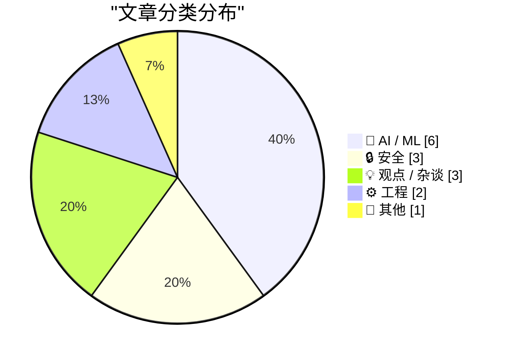
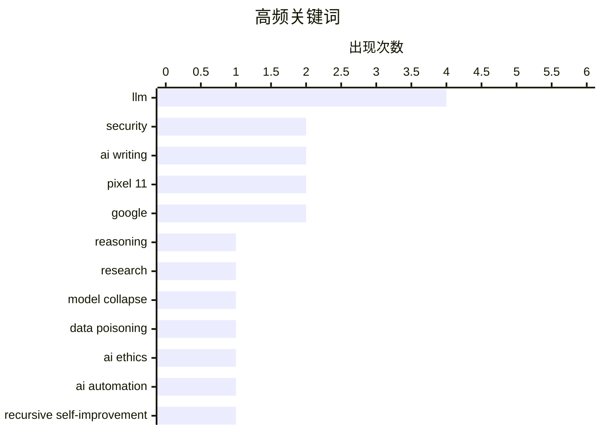

# 📰 Aug 13, 2026

> 来自 Karpathy 推荐的 92 个顶级技术博客，AI 精选 Top 15

## 📝 今日看点

今日技术圈聚焦于 AI 演进中的系统性风险，从模型训练数据枯竭导致的“模型崩溃”到 API 推理轨迹的安全漏洞，揭示了生成式技术在狂热扩张下的底层脆弱性。与此同时，关于 AI 财务泡沫的警示与自动化研究可能带来的指数级风险，正促使行业从单纯的技术追求转向对可持续增长的深度反思。在工程与安全领域，微软大规模补丁修复与 OpenTelemetry 的标准化困境，再次强调了在技术迭代浪潮中，系统稳健性与开发规范依然是不可忽视的基石。

---

## 🏆 今日必读

🥇 **从闭源 LLM API 中窃取推理轨迹**

[Stealing Reasoning Traces from Proprietary LLM APIs](https://simonwillison.net/2026/Aug/11/stealing-reasoning-traces/) — simonwillison.net · 1 天前 · 🔒 安全

> Anthropic、OpenAI 和 Google 的闭源模型 API 存在安全漏洞，其返回的加密思维链（CoT）数据块可以在不同会话、用户甚至模型间重放。研究人员发现，将最强模型（如 o1）生成的加密推理轨迹重放给同系列的弱版本模型，并通过越狱手段诱导弱模型，可以强迫其解密并输出原本隐藏的推理逻辑。这种方法成功绕过了闭源模型对推理过程的保护，证明了只要加密 Token 具有跨模型兼容性，推理隐私就无法得到保障。实验表明，这种攻击方式能以极低成本获取闭源模型的核心“思考”过程。

💡 **为什么值得读**: 揭示了闭源大模型推理保护机制的重大漏洞，是了解 AI 安全和模型逆向工程前沿动态的必读文章。

🏷️ LLM, reasoning, security, research

🥈 **多元化：模型崩溃（2026年8月12日）**

[Pluralistic: Model collapse (12 Aug 2026)](https://pluralistic.net/2026/08/12/insurance-value-of-biodiversity/) — pluralistic.net · 22 小时前 · 🤖 AI / ML

> 随着互联网充斥着大量 AI 生成的内容，大模型正陷入“模型崩溃”的恶性循环，即在自身生成的数据上进行训练导致输出质量退化。这种现象被称为“哈布斯堡 AI”，会导致模型逐渐失去人类表达的多样性，最终产生扭曲且无用的结果。文章将此与生物多样性的丧失类比，指出单一文化的数据环境会降低系统的韧性并引发不可逆的衰退。作者强调，过度依赖合成数据不仅是技术挑战，更是对人类知识生态和文化遗产的长期威胁。

💡 **为什么值得读**: 深入探讨了 AI 产业面临的“数据荒”和合成数据污染问题，对理解生成式 AI 的长期局限性具有重要启发。

🏷️ Model Collapse, LLM, Data Poisoning, AI Ethics

🥉 **Ryan Greenblatt：当 AI 能够自动化 AI 研究时会发生什么？**

[Ryan Greenblatt – What happens once AI can automate AI research?](https://www.dwarkesh.com/p/ryan-greenblatt) — dwarkesh.com · 1 天前 · 🤖 AI / ML

> 访谈深入探讨了 AI 自动化 AI 研究（递归自我改进）的可能性及其带来的指数级增长风险。Ryan Greenblatt 分析了当 AI 能够独立完成代码优化、架构设计和硬件迭代时，技术进步的速度将从人类尺度转向机器尺度。讨论涵盖了从当前的辅助编程到未来完全自主科研的演进路径，以及这种反馈闭环对通用人工智能（AGI）到来时间的影响。作者认为，一旦跨过自动化科研的门槛，技术进步的速度将远超人类目前的监管和理解能力。

💡 **为什么值得读**: 探讨了 AGI 演进中最关键的“递归自我改进”环节，适合对 AI 长期发展趋势和安全性感兴趣的读者。

🏷️ AI automation, recursive self-improvement, AI research

---

## 📊 数据概览

| 扫描源 | 抓取文章 | 时间范围 | 精选 |
|:---:|:---:|:---:|:---:|
| 83/92 | 2519 篇 → 52 篇 | 48h | **15 篇** |

### 分类分布



### 高频关键词



<details>
<summary>📈 纯文本关键词图（终端友好）</summary>

```
llm            │ ████████████████████ 4
security       │ ██████████░░░░░░░░░░ 2
ai writing     │ ██████████░░░░░░░░░░ 2
pixel 11       │ ██████████░░░░░░░░░░ 2
google         │ ██████████░░░░░░░░░░ 2
reasoning      │ █████░░░░░░░░░░░░░░░ 1
research       │ █████░░░░░░░░░░░░░░░ 1
model collapse │ █████░░░░░░░░░░░░░░░ 1
data poisoning │ █████░░░░░░░░░░░░░░░ 1
ai ethics      │ █████░░░░░░░░░░░░░░░ 1
```

</details>

### 🏷️ 话题标签

**llm**(4) · **security**(2) · **ai writing**(2) · pixel 11(2) · google(2) · reasoning(1) · research(1) · model collapse(1) · data poisoning(1) · ai ethics(1) · ai automation(1) · recursive self-improvement(1) · ai research(1) · microsoft(1) · vulnerability(1) · patch(1) · engineering culture(1) · nlp(1) · code review(1) · documentation(1)

---

## 🤖 AI / ML

### 1. 多元化：模型崩溃（2026年8月12日）

[Pluralistic: Model collapse (12 Aug 2026)](https://pluralistic.net/2026/08/12/insurance-value-of-biodiversity/) — **pluralistic.net** · 22 小时前 · ⭐ 26/30

> 随着互联网充斥着大量 AI 生成的内容，大模型正陷入“模型崩溃”的恶性循环，即在自身生成的数据上进行训练导致输出质量退化。这种现象被称为“哈布斯堡 AI”，会导致模型逐渐失去人类表达的多样性，最终产生扭曲且无用的结果。文章将此与生物多样性的丧失类比，指出单一文化的数据环境会降低系统的韧性并引发不可逆的衰退。作者强调，过度依赖合成数据不仅是技术挑战，更是对人类知识生态和文化遗产的长期威胁。

🏷️ Model Collapse, LLM, Data Poisoning, AI Ethics

---

### 2. Ryan Greenblatt：当 AI 能够自动化 AI 研究时会发生什么？

[Ryan Greenblatt – What happens once AI can automate AI research?](https://www.dwarkesh.com/p/ryan-greenblatt) — **dwarkesh.com** · 1 天前 · ⭐ 26/30

> 访谈深入探讨了 AI 自动化 AI 研究（递归自我改进）的可能性及其带来的指数级增长风险。Ryan Greenblatt 分析了当 AI 能够独立完成代码优化、架构设计和硬件迭代时，技术进步的速度将从人类尺度转向机器尺度。讨论涵盖了从当前的辅助编程到未来完全自主科研的演进路径，以及这种反馈闭环对通用人工智能（AGI）到来时间的影响。作者认为，一旦跨过自动化科研的门槛，技术进步的速度将远超人类目前的监管和理解能力。

🏷️ AI automation, recursive self-improvement, AI research

---

### 3. DeepSeek V4 Pro 0813 在 OpenRouter 上线

[DeepSeek V4 Pro 0813 (on OpenRouter)](https://simonwillison.net/2026/Aug/12/deepseek-v4-pro-0813/) — **simonwillison.net** · 7 小时前 · ⭐ 23/30

> DeepSeek 推出了最新的 V4 Pro 0813 模型，目前已通过 OpenRouter 等 API 平台率先上线。尽管官方尚未发布正式公告，但该版本在性能和响应速度上较前代有所优化，特别是在逻辑推理方面。目前该模型仅提供 API 访问，尚不确定是否会延续 DeepSeek 之前的传统发布开源权重。开发者可以通过 OpenRouter 抢先体验这一国产大模型在复杂任务处理和代码生成方面的最新进展。

🏷️ DeepSeek, LLM, API

---

### 4. 《经济学人》：如何识别 AI 写作

[The Economist: ‘How to Spot AI Writing’](https://www.economist.com/culture/2026/07/30/how-to-spot-ai-writing?giftId=NzBlNTc2OGItMDgxNS00N2EzLWE4NmUtZDgzZmE4Y2FkM2Mw) — **daringfireball.net** · 1 天前 · ⭐ 23/30

> 识别 AI 生成文本的关键在于建立一个独特且熟悉的基准，通过对比人类与机器的写作差异来发现其特征。《经济学人》利用其标志性的文风对 OpenAI ChatGPT、Anthropic Claude、Google Gemini 和 xAI Grok 等主流大模型进行了压力测试。研究发现，尽管 AI 能够模仿特定风格，但往往在逻辑连贯性、幽默感的细腻程度以及特定词汇的过度使用上露出马脚。通过分析这些 LLM 在模仿高质量新闻报道时的表现，读者可以掌握一套识别“机器感”的视觉与逻辑线索。

🏷️ AI Writing, LLM, Detection, Content

---

### 5. Anthropic 发布“Claude 如何标记 AI 生成内容”，但未解释具体技术细节

[Anthropic Posts ‘How Claude Marks AI-Generated Content’ Without Explaining How Claude Marks AI-Generated Content](https://support.claude.com/en/articles/16266773-how-claude-marks-ai-generated-content) — **daringfireball.net** · 1 天前 · ⭐ 23/30

> Anthropic 宣布签署欧盟《AI 法案》第 50(2) 条关于透明度的行为准则，承诺对其生成的 AI 内容进行明确标记。该支持文档概述了公司在生成式 AI 模型和系统层面的合规计划，旨在通过技术手段区分人工与机器创作。然而，目前的说明文件在具体的技术实现路径（如数字水印或元数据嵌入）上缺乏深度，仅表示未来将发布更详细的技术指南。这反映了 AI 巨头在应对监管压力与保护技术秘密之间的权衡，以及当前 AI 内容溯源技术的早期阶段特征。

🏷️ Anthropic, AI Transparency, Watermarking, EU AI Act

---

### 6. TechCrunch 评谷歌 Pixel 11 系列：硬件变动较小，Gemini 更加智能

[TechCrunch on Google’s Pixel 11 Lineup](https://techcrunch.com/2026/08/12/pixel-11-has-few-hardware-changes-and-more-gemini/) — **daringfireball.net** · 11 小时前 · ⭐ 22/30

> 谷歌 Pixel 11 系列的更新重点从硬件规格转向了更具“代理感”的 AI 体验，深度集成了 Gemini 智能助手。美国用户现在可以授权 Gemini 完成订购杂货、预约网约车或订购咖啡等复杂任务，甚至能让 AI 代拨电话进行餐厅预订。为了保障安全与透明度，系统允许用户随时接管或终止 AI 任务，并提供通话录音的文字转写供用户审查。此外，一系列通过 Gemini 连接的第三方应用生态也将陆续上线，标志着手机正从工具演变为能够自主执行任务的个人助理。

🏷️ Agentic AI, Gemini, Pixel 11, Google

---

## 🔒 安全

### 7. 从闭源 LLM API 中窃取推理轨迹

[Stealing Reasoning Traces from Proprietary LLM APIs](https://simonwillison.net/2026/Aug/11/stealing-reasoning-traces/) — **simonwillison.net** · 1 天前 · ⭐ 27/30

> Anthropic、OpenAI 和 Google 的闭源模型 API 存在安全漏洞，其返回的加密思维链（CoT）数据块可以在不同会话、用户甚至模型间重放。研究人员发现，将最强模型（如 o1）生成的加密推理轨迹重放给同系列的弱版本模型，并通过越狱手段诱导弱模型，可以强迫其解密并输出原本隐藏的推理逻辑。这种方法成功绕过了闭源模型对推理过程的保护，证明了只要加密 Token 具有跨模型兼容性，推理隐私就无法得到保障。实验表明，这种攻击方式能以极低成本获取闭源模型的核心“思考”过程。

🏷️ LLM, reasoning, security, research

---

### 8. 微软修复近 400 个安全漏洞

[Microsoft Plugs Nearly 400 Security Holes](https://krebsonsecurity.com/2026/08/microsoft-plugs-nearly-400-security-holes/) — **krebsonsecurity.com** · 1 天前 · ⭐ 25/30

> 微软发布了 2026 年 8 月的安全更新，修复了 Windows 操作系统及相关软件中的 398 个安全漏洞。此次补丁涵盖了 1 个已被积极利用的零日漏洞，以及 2 个在修复前已被公开披露的漏洞。受影响的范围广泛，包括系统内核、浏览器组件及办公软件等核心模块。安全专家敦促管理员尽快部署更新，以防范针对这些已知弱点的网络攻击。这是近年来微软单次修复漏洞数量较多的一次更新，显示出系统底层安全压力的增大。

🏷️ Microsoft, vulnerability, patch

---

### 9. 本周 App Store 诈骗：Safari 插件 TabControl

[App Store Scam of the Week: ‘TabControl Extension’ for Safari](https://lapcatsoftware.com/articles/2026/8/4.html) — **daringfireball.net** · 16 小时前 · ⭐ 23/30

> 安全研究员 Jeff Johnson 揭露了 App Store 中一款名为“TabControl Extension”的 Safari 插件涉嫌评论造假。该应用拥有大量 5 星好评，但这些英文评论并未出现在美国、澳大利亚或加拿大等主要英语国家的商店中，且评论者姓名均遵循“名+姓氏首字母”的异常统一格式。这种欺诈手段利用了苹果跨区评价显示的漏洞，通过虚假口碑诱导用户下载。文章提醒用户在下载浏览器扩展时需保持警惕，即使是评分极高的应用也可能存在安全风险。

🏷️ App Store, Scam, Safari Extension, Security

---

## 💡 观点 / 杂谈

### 10. 自然语言文本不存在无损转换

[There are no lossless transformations of natural-language text](https://simonwillison.net/2026/Aug/11/there-are-no-lossless-transformations-of-natural-language-text/) — **simonwillison.net** · 1 天前 · ⭐ 24/30

> 工程师 Sophie Alpert 提出了关于 AI 辅助写作的内部准则，强调自然语言的任何转换（如改写、润色、精简）都不是无损的。文章指出，LLM 在调整语气或压缩文字时，往往会丢失作者原本微妙的意图或关键的上下文细节。作者要求工程师必须对 AI 生成或修改的每一行文字负责，确保最终产出依然精准代表其个人观点。这一观点挑战了“AI 润色是免费午餐”的普遍认知，提醒读者文字背后的责任感在自动化时代不可转嫁。

🏷️ AI writing, engineering culture, NLP

---

### 11. 不要抬头：AI 行业的泡沫危机

[Don't Look Up](https://www.wheresyoured.at/dont-look-up/) — **wheresyoured.at** · 1 天前 · ⭐ 24/30

> 文章对当前 AI 行业的财务泡沫和过度炒作进行了严厉批评，将其类比为电影《不要抬头》。作者详细分析了 NVIDIA、Anthropic 等巨头之间复杂的资金往来和高昂的运营成本，质疑这种巨额投入是否能转化为实际的商业价值。文中指出，目前的 AI 热潮很大程度上依赖于对未来的过度承诺，而忽视了技术落地中的实际阻碍和边际效用递减。作者警告称，如果无法证明 AI 能带来持续的生产力革命，这场由资本堆砌的盛宴可能面临剧烈崩塌。

🏷️ NVIDIA, AI bubble, tech industry

---

### 12. 引用 Florian Herrengt：AI 正在消灭中产阶级软件工程师

[Quoting Florian Herrengt](https://simonwillison.net/2026/Aug/12/florian-herrengt/) — **simonwillison.net** · 16 小时前 · ⭐ 22/30

> 软件开发领域正在出现一种危险的趋势：过度依赖 AI 工具（如 Claude 或 Fable）导致工程师丧失了对系统底层逻辑的理解。当遇到 AI 无法解决的复杂 Bug 时，完全依赖生成式代码的开发者往往无法解释数据的来源或程序的运行机制。这种“黑盒式”开发模式正在削弱中产阶级工程师的专业壁垒，使他们从创造者沦为 AI 提示词的搬运工。作者警告称，如果开发者不再深入钻研技术原理，一旦 AI 触及能力天花板，整个团队将陷入无法维护系统的困境。

🏷️ AI, software engineering, career

---

## ⚙️ 工程

### 13. 代码注释与 Pull Request 描述的区别

[The comments that go into code versus those that go into the pull request description](https://devblogs.microsoft.com/oldnewthing/20260812-00/?p=112607) — **devblogs.microsoft.com/oldnewthing** · 17 小时前 · ⭐ 24/30

> 资深开发者 Raymond Chen 厘清了代码注释与 Pull Request (PR) 描述在时间维度上的职责差异。代码注释应聚焦于“代码现在为什么是这样”以及“如何使用”，是为未来的维护者准备的长效文档。而 PR 描述则应记录“为什么要进行这次修改”以及“修改过程中的决策历史”，属于特定时间点的背景信息。文章建议避免将 PR 里的讨论细节大量堆砌在代码中，以保持代码库的整洁与可读性。通过这种区分，开发者可以更有效地管理项目的知识资产。

🏷️ code review, documentation, pull request

---

### 14. OpenTelemetry 进展不顺（附带现状分析表）

[OTel Isn't Going Well (And I Made A Spreadsheet About It)](https://matduggan.com/otel-isnt-going-well-and-i-made-a-spreadsheet-about-it/) — **matduggan.com** · 20 小时前 · ⭐ 24/30

> OpenTelemetry (OTel) 在取代厂商私有 SDK 的过程中进展缓慢，其复杂性和不完整性正成为开发者的主要负担。作者通过一份详细的电子表格对比了不同编程语言 SDK 的功能完备度，发现许多核心特性在不同语言间表现参差不齐。文章批评 OTel 规范过于庞杂，导致落地成本极高，且在易用性上远逊于 Datadog 等厂商的专有方案。结论认为，如果 OTel 不能简化其架构并加快标准化进程，它将难以实现其统一观测性的愿景。

🏷️ OpenTelemetry, Observability, DevOps

---

## 📝 其他

### 15. 谷歌随 Pixel 11 系列推出“相机外观”功能

[Google Introduces ‘Camera Looks’ With Pixel 11 Phones](https://www.theverge.com/tech/978084/google-camera-looks-interview-computational-photography) — **daringfireball.net** · 10 小时前 · ⭐ 22/30

> 谷歌在 Pixel 11 系列中引入了名为“Camera Looks”的新功能，旨在解决计算摄影过度优化导致的“塑料感”问题。随着用户审美从追求完美画质转向追求真实感和传统胶片质感，谷歌相机团队开始提供更多样化的风格选项。该功能允许用户在完美优化的自动模式与更具胶片味、更具个性的传统影调之间进行切换。这标志着智能手机摄影从单纯的“画质竞赛”转向了对审美多样性和摄影艺术性的回归。

🏷️ Pixel 11, camera, Google

---

*生成于 2026-08-13 07:44 | 扫描 83 源 → 获取 2519 篇 → 精选 15 篇*
*基于 [Hacker News Popularity Contest 2025](https://refactoringenglish.com/tools/hn-popularity/) RSS 源列表，由 [Andrej Karpathy](https://x.com/karpathy) 推荐*
