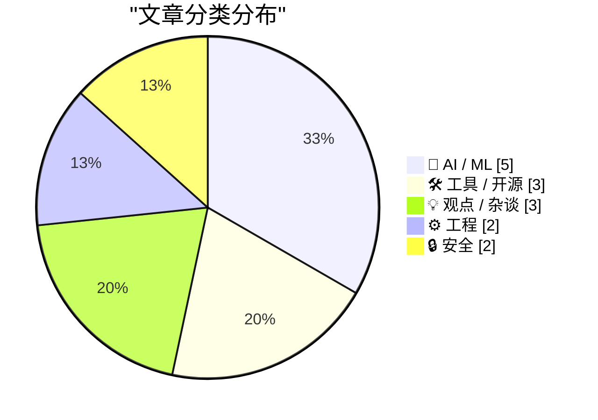
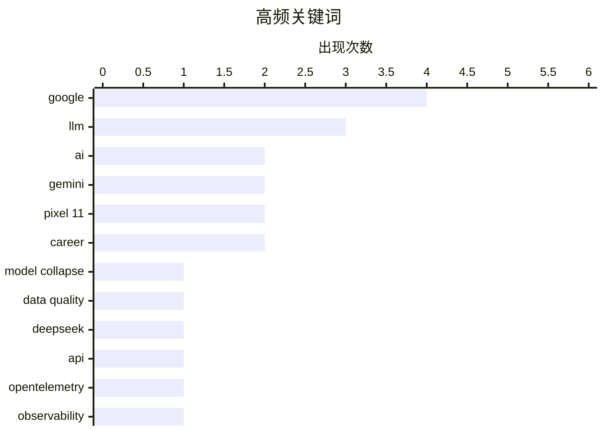

# 📰 Aug 14, 2026

> 来自 Karpathy 推荐的 92 个顶级技术博客，AI 精选 Top 15

## 📝 今日看点

今日技术圈呈现出 AI 极速演进与系统性风险并存的局面：DeepSeek 与 Gemini 竞相迭代推动硬件“智能体化”，但“模型崩溃”挑战与开发者技能退化的隐忧正引发行业深度反思。与此同时，OpenTelemetry 等工程标准的落地困境揭示了技术复杂性带来的治理难题。在生产力大幅提升的背后，关于职场红利分配与生态安全风险的讨论也愈发激烈。

---

## 🏆 今日必读

🥇 **模型崩溃：生活在一个以自身为训练数据的世界**

[Pluralistic: Model collapse (12 Aug 2026)](https://pluralistic.net/2026/08/12/insurance-value-of-biodiversity/) — pluralistic.net · 1 天前 · 🤖 AI / ML

> 生成式人工智能正面临“模型崩溃”的严峻挑战，即当模型使用自身生成的输出作为训练数据时，其输出质量会迅速退化。这种现象类似于生物学中的近亲繁殖，导致模型丢失长尾分布中的稀有信息，最终只剩下平庸且同质化的内容。互联网上充斥着低质量的 AI 垃圾信息，正在污染未来的训练集，使模型陷入自我强化的平庸循环。作者强调，人类创造的原始数据（生物多样性）是防止模型退化的唯一“保险”，但当前的版权和抓取限制正在切断这一来源。

💡 **为什么值得读**: 深入探讨了 AI 产业面临的结构性风险，以及为什么“数据荒”可能导致大模型能力的全面倒退。

🏷️ model collapse, LLM, data quality, AI

🥈 **DeepSeek V4 Pro 0813 已上线 OpenRouter**

[DeepSeek V4 Pro 0813 (on OpenRouter)](https://simonwillison.net/2026/Aug/12/deepseek-v4-pro-0813/) — simonwillison.net · 1 天前 · 🤖 AI / ML

> DeepSeek 最新的 V4 Pro 0813 版本模型已在 OpenRouter 平台上线，目前仅支持通过 API 调用。由于 DeepSeek 官方尚未发布正式的更新公告，该模型的具体参数改进和技术细节尚不明确。回顾历史版本，DeepSeek 通常会开源其模型权重（如 4 月份的 V4 Pro），但本次更新是否会延续开源传统仍待确认。开发者目前可以通过 OpenRouter 平台抢先测试该模型在逻辑推理和代码生成方面的实际表现。

💡 **为什么值得读**: 关注国产大模型出海动态及最新版本迭代的开发者可以第一时间获取调用信息。

🏷️ DeepSeek, LLM, API

🥉 **OpenTelemetry 进展并不顺利（我为此做了一个电子表格）**

[OTel Isn't Going Well (And I Made A Spreadsheet About It)](https://matduggan.com/otel-isnt-going-well-and-i-made-a-spreadsheet-about-it/) — matduggan.com · 1 天前 · ⚙️ 工程

> 尽管 OpenTelemetry (OTel) 被寄予厚望，但其在实际落地中面临着严重的复杂性和功能缺失问题。与成熟的厂商私有 SDK 相比，OTel 的多语言支持极不均衡，许多核心功能在不同语言的实现中仍处于实验阶段。作者通过一份详细的电子表格对比了各语言 SDK 的成熟度，发现开发者在迁移过程中常因文档缺失和配置繁琐而受挫。文章认为 OTel 过于追求抽象和通用性，反而牺牲了易用性和开发者的即时生产力。

💡 **为什么值得读**: 犀利地揭示了可观测性标准在理想与现实之间的巨大鸿沟，适合正在进行技术选型的架构师参考。

🏷️ OpenTelemetry, observability, monitoring, SDK

---

## 📊 数据概览

| 扫描源 | 抓取文章 | 时间范围 | 精选 |
|:---:|:---:|:---:|:---:|
| 82/92 | 2497 篇 → 43 篇 | 48h | **15 篇** |

### 分类分布



### 高频关键词



<details>
<summary>📈 纯文本关键词图（终端友好）</summary>

```
google         │ ████████████████████ 4
llm            │ ███████████████░░░░░ 3
ai             │ ██████████░░░░░░░░░░ 2
gemini         │ ██████████░░░░░░░░░░ 2
pixel 11       │ ██████████░░░░░░░░░░ 2
career         │ ██████████░░░░░░░░░░ 2
model collapse │ █████░░░░░░░░░░░░░░░ 1
data quality   │ █████░░░░░░░░░░░░░░░ 1
deepseek       │ █████░░░░░░░░░░░░░░░ 1
api            │ █████░░░░░░░░░░░░░░░ 1
```

</details>

### 🏷️ 话题标签

**google**(4) · **llm**(3) · **ai**(2) · gemini(2) · pixel 11(2) · career(2) · model collapse(1) · data quality(1) · deepseek(1) · api(1) · opentelemetry(1) · observability(1) · monitoring(1) · sdk(1) · ai agents(1) · code review(1) · documentation(1) · best practices(1) · git(1) · database(1)

---

## 🤖 AI / ML

### 1. 模型崩溃：生活在一个以自身为训练数据的世界

[Pluralistic: Model collapse (12 Aug 2026)](https://pluralistic.net/2026/08/12/insurance-value-of-biodiversity/) — **pluralistic.net** · 1 天前 · ⭐ 26/30

> 生成式人工智能正面临“模型崩溃”的严峻挑战，即当模型使用自身生成的输出作为训练数据时，其输出质量会迅速退化。这种现象类似于生物学中的近亲繁殖，导致模型丢失长尾分布中的稀有信息，最终只剩下平庸且同质化的内容。互联网上充斥着低质量的 AI 垃圾信息，正在污染未来的训练集，使模型陷入自我强化的平庸循环。作者强调，人类创造的原始数据（生物多样性）是防止模型退化的唯一“保险”，但当前的版权和抓取限制正在切断这一来源。

🏷️ model collapse, LLM, data quality, AI

---

### 2. DeepSeek V4 Pro 0813 已上线 OpenRouter

[DeepSeek V4 Pro 0813 (on OpenRouter)](https://simonwillison.net/2026/Aug/12/deepseek-v4-pro-0813/) — **simonwillison.net** · 1 天前 · ⭐ 25/30

> DeepSeek 最新的 V4 Pro 0813 版本模型已在 OpenRouter 平台上线，目前仅支持通过 API 调用。由于 DeepSeek 官方尚未发布正式的更新公告，该模型的具体参数改进和技术细节尚不明确。回顾历史版本，DeepSeek 通常会开源其模型权重（如 4 月份的 V4 Pro），但本次更新是否会延续开源传统仍待确认。开发者目前可以通过 OpenRouter 平台抢先测试该模型在逻辑推理和代码生成方面的实际表现。

🏷️ DeepSeek, LLM, API

---

### 3. TechCrunch 评谷歌 Pixel 11 系列：硬件微调，Gemini 智能体化

[TechCrunch on Google’s Pixel 11 Lineup](https://techcrunch.com/2026/08/12/pixel-11-has-few-hardware-changes-and-more-gemini/) — **daringfireball.net** · 1 天前 · ⭐ 23/30

> 谷歌发布的 Pixel 11 系列在硬件上仅有小幅升级，核心卖点转向了更具“智能体（Agentic）”属性的 Gemini AI。美国用户现在可以利用 Gemini 完成订购杂货、预约网约车或订购咖啡等复杂任务。Gemini 甚至能代表用户拨打电话进行餐厅预订或预约医生，并提供通话录音转文字供用户审核。通过与第三方应用的深度集成，谷歌试图将手机从简单的工具转变为能够自主执行任务的个人助理。

🏷️ Gemini, AI agents, Pixel 11, Google

---

### 4. llm-gemini 0.33 发布：支持 Gemini 3.7 Flash 等新模型

[llm-gemini 0.33](https://simonwillison.net/2026/Aug/13/llm-gemini/) — **simonwillison.net** · 12 小时前 · ⭐ 22/30

> Simon Willison 发布了其 LLM 命令行工具的插件 `llm-gemini` 0.33 版本。该版本紧跟谷歌的步伐，新增了对 Gemini 3.7 Flash、3.6 Flash 以及 3.5 Flash-lite 等最新模型的支持。此外，更新还集成了 `gemini-embedding-004` 和 `005` 两个嵌入模型，增强了处理向量搜索的能力。开发者现在可以通过简单的命令行指令，直接调用谷歌最新的高性能、低延迟模型进行开发测试。

🏷️ LLM, Gemini, Google

---

### 5. 阿达马矩阵码与球体填充问题

[Hadamard Codes and Sphere Packing](https://www.johndcook.com/blog/2026/08/13/hadamard-sphere-packing/) — **johndcook.com** · 6 小时前 · ⭐ 21/30

> 本文探讨了阿达马矩阵（Hadamard Matrix）在纠错码和球体填充问题中的深层数学应用。近期数学家 Levent Alpöge 利用 Claude AI 发现了一个新的阿达马矩阵，这一突破引发了对该经典数学工具的重新关注。文章详细介绍了 NASA 如何利用阿达马码在深空通信中实现高效的数据纠错，并解释了其与高维空间球体填充效率之间的数学关联。这一发现不仅展示了阿达马矩阵在组合数学中的核心地位，也证明了生成式 AI 在辅助纯数学研究和科学发现方面的巨大潜力。通过具体案例，文章揭示了抽象数学如何转化为航天通信中的关键技术。

🏷️ Hadamard Matrix, Claude AI, Mathematics, Coding Theory

---

## 🛠 工具 / 开源

### 6. alchemy-utils 0.1a0：跨数据库的 CLI 工具原型

[alchemy-utils 0.1a0](https://simonwillison.net/2026/Aug/12/alchemy-utils/) — **simonwillison.net** · 1 天前 · ⭐ 22/30

> 开发者 Simon Willison 推出了 `alchemy-utils` 的首个 Alpha 版本，旨在打造一个支持多种数据库的通用 CLI 工具。该项目是 `sqlite-utils` 的演进版，利用 SQLAlchemy 实现了对 PostgreSQL、MySQL 等主流数据库的兼容。该原型是作者通过与 Codex 和 GPT-5.6 Sol Ultra 协作，在短时间内完成的“实验性项目”。目前该工具已具备基础的表结构查看和数据查询功能，为数据库管理提供了一致的命令行体验。

🏷️ database, CLI, Python

---

### 7. 谷歌在 Pixel 11 手机中引入“Camera Looks”功能

[Google Introduces ‘Camera Looks’ With Pixel 11 Phones](https://www.theverge.com/tech/978084/google-camera-looks-interview-computational-photography) — **daringfireball.net** · 1 天前 · ⭐ 21/30

> 谷歌在 Pixel 11 系列中推出了“Camera Looks”功能，标志着计算摄影从追求“完美优化”向“真实质感”的战略转向。Pixel 相机团队负责人 Isaac Reynolds 指出，用户审美正出现两极分化：一部分人仍追求极致的算法增强，而越来越多的人渴望具有传统胶片感或自然瑕疵的真实照片。该功能允许用户在拍摄时选择不同的视觉风格，以满足日益增长的个性化审美需求。这反映了智能手机厂商在硬件性能触顶后，开始通过软件算法模拟传统摄影的艺术表达。此举旨在解决计算摄影过度处理导致的“塑料感”问题，重新定义手机摄影的真实性。

🏷️ Pixel 11, computational photography, smartphone, Google

---

### 8. alchemy-utils 0.1a1 版本发布

[alchemy-utils 0.1a1](https://simonwillison.net/2026/Aug/13/alchemy-utils/) — **simonwillison.net** · 1 天前 · ⭐ 20/30

> Simon Willison 发布了 alchemy-utils 0.1a1 预览版，这是一个专注于提升数据处理效率的工具集。该版本实现了对 DuckDB 导出和 CSV 导入性能的显著优化，旨在加速大规模数据集在不同存储格式间的转换过程。作为 Datasette 生态系统的补充工具，它简化了数据工程中常见的 ETL 任务，特别是在内存数据库与文件交换场景下。开发者可以通过该工具更高效地管理结构化数据，减少数据迁移时的等待时间。该工具的发布体现了作者在构建高性能数据工具链方面的持续努力。

🏷️ DuckDB, CSV, performance

---

## 💡 观点 / 杂谈

### 9. AI 正在消灭中产阶级软件工程师

[Quoting Florian Herrengt](https://simonwillison.net/2026/Aug/12/florian-herrengt/) — **simonwillison.net** · 1 天前 · ⭐ 22/30

> 文章探讨了 AI 工具在软件工程中引发的隐忧：开发者过度依赖 AI 修复 Bug，却对底层数据流向和系统逻辑一无所知。当 AI 无法解决复杂问题时，缺乏深度理解的工程师会陷入束手无策的境地。这种趋势可能导致“中产阶级工程师”的消失，即那些能够处理常规任务但缺乏深厚技术积淀的人群。作者通过一个生动的对话场景，揭示了在 AI 时代保持对代码掌控力和底层洞察力的重要性。

🏷️ AI, software engineering, career

---

### 10. 生产力提升的红利去哪儿了？

[Where Did the Productivity Gains Go?](https://idiallo.com/blog/where-did-the-productivity-gains-go) — **idiallo.com** · 1 天前 · ⭐ 22/30

> 作者分享了自己在非营利组织从事数据录入工作的经历，通过编写脚本将原本繁琐的手动录入流程自动化。然而，这种生产力的巨大提升并没有带来工作时间的缩短，反而导致了更多无意义任务的堆砌。文章指出，在现代职场中，技术进步带来的效率红利往往被管理层面的官僚主义和无效的“重置按钮”所抵消。作者反思了自动化工具在提升个人效率的同时，为何难以改变整体工作环境的本质。

🏷️ productivity, automation, career, software

---

### 11. 谷歌设计在 X 平台上的糟糕表现

[Google Design Pisses Its Pants on Twitter/X](https://x.com/googledesign/status/2087195277094695096) — **daringfireball.net** · 1 天前 · ⭐ 20/30

> 知名科技评论家 John Gruber 严厉批评了 Google Design 官方账号在 X 上发布的一款待办事项应用的设计方案。他认为该设计的比例失调、审美水平低下，甚至怀疑这是由 AI 生成的劣质内容（AI slop）而非人类设计师的作品。文章表达了对科技巨头设计标准下滑的深切担忧，认为这种缺乏专业审美的发布内容严重损害了谷歌作为设计领导者的声誉。通过对比过去的高标准，作者指出当前大公司在社交媒体运营中存在质量把控缺失的问题。这篇评论引发了关于 AI 生成内容是否正在稀释专业设计标准的广泛讨论。

🏷️ Google, design, UI

---

## ⚙️ 工程

### 12. OpenTelemetry 进展并不顺利（我为此做了一个电子表格）

[OTel Isn't Going Well (And I Made A Spreadsheet About It)](https://matduggan.com/otel-isnt-going-well-and-i-made-a-spreadsheet-about-it/) — **matduggan.com** · 1 天前 · ⭐ 24/30

> 尽管 OpenTelemetry (OTel) 被寄予厚望，但其在实际落地中面临着严重的复杂性和功能缺失问题。与成熟的厂商私有 SDK 相比，OTel 的多语言支持极不均衡，许多核心功能在不同语言的实现中仍处于实验阶段。作者通过一份详细的电子表格对比了各语言 SDK 的成熟度，发现开发者在迁移过程中常因文档缺失和配置繁琐而受挫。文章认为 OTel 过于追求抽象和通用性，反而牺牲了易用性和开发者的即时生产力。

🏷️ OpenTelemetry, observability, monitoring, SDK

---

### 13. 代码注释与 Pull Request 描述的职责区分

[The comments that go into code versus those that go into the pull request description](https://devblogs.microsoft.com/oldnewthing/20260812-00/?p=112607) — **devblogs.microsoft.com/oldnewthing** · 1 天前 · ⭐ 23/30

> 开发者常常混淆代码注释与 Pull Request (PR) 描述的用途，导致关键信息在错误的地方丢失。代码注释应关注“代码在做什么”以及“为什么这么写”，其受众是未来的代码维护者。而 PR 描述则应侧重于“为什么要进行这次更改”以及“如何测试”，其受众是当下的代码审查者。作者强调，具有时间局限性的背景信息（如修复某个特定的临时 Bug）应留在 PR 中，而长期的逻辑解释必须沉淀在代码里。

🏷️ Code Review, Documentation, Best Practices, Git

---

## 🔒 安全

### 14. 本周 App Store 诈骗案例：Safari 插件 TabControl Extension

[App Store Scam of the Week: ‘TabControl Extension’ for Safari](https://lapcatsoftware.com/articles/2026/8/4.html) — **daringfireball.net** · 1 天前 · ⭐ 22/30

> 一款名为“TabControl Extension”的 Safari 插件被曝光在 App Store 中利用虚假评价进行诈骗。调查发现，该应用虽然拥有大量 5 星好评，但这些评价在美、加、澳等主流应用商店均不可见，且评论者姓名呈现高度一致的伪造特征。这种诈骗手段利用了苹果应用商店的审核漏洞，通过跨区域刷单来诱导用户下载可能存在风险的插件。作者提醒用户在安装浏览器扩展时，需警惕那些评价模式异常且来源不明的应用。

🏷️ App Store, scam, Safari extension, reviews

---

### 15. Troy Hunt 每周更新 516：来自越南的现场报道

[Weekly Update 516: Live From Vietnam](https://www.troyhunt.com/weekly-update-516/) — **troyhunt.com** · 1 天前 · ⭐ 22/30

> 本期周更由网络安全专家 Troy Hunt 在越南录制，重点剖析了 Brinks Home 安全公司 FAQ 文档中的逻辑漏洞。作者指出，这家安全公司在自家的 FAQ 中暴露了自相矛盾的安全实践，甚至未能遵守其宣称的安全准则。视频还涵盖了近期的数据泄露动态，以及在旅行过程中应对网络波动和音画同步等技术挑战的经历。通过 Brinks Home 的案例，提醒开发者和安全从业者文档一致性与实际安全执行之间的关键联系。这一更新展示了安全专家如何从日常公开信息中敏锐地捕捉潜在风险。

🏷️ security, vulnerability, privacy

---

*生成于 2026-08-14 07:42 | 扫描 82 源 → 获取 2497 篇 → 精选 15 篇*
*基于 [Hacker News Popularity Contest 2025](https://refactoringenglish.com/tools/hn-popularity/) RSS 源列表，由 [Andrej Karpathy](https://x.com/karpathy) 推荐*
