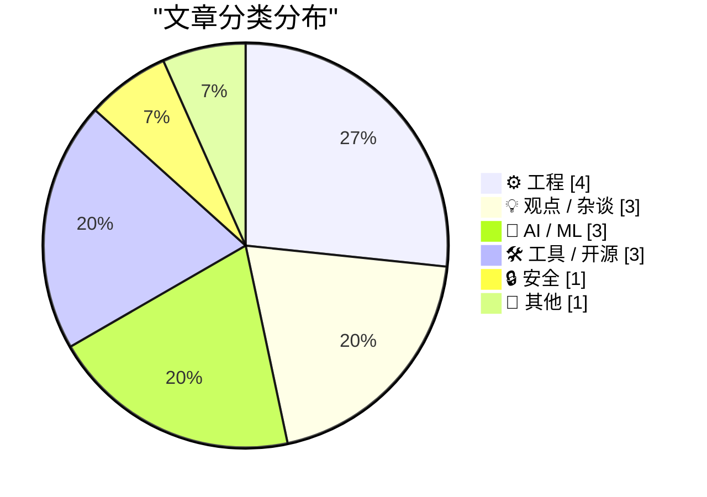
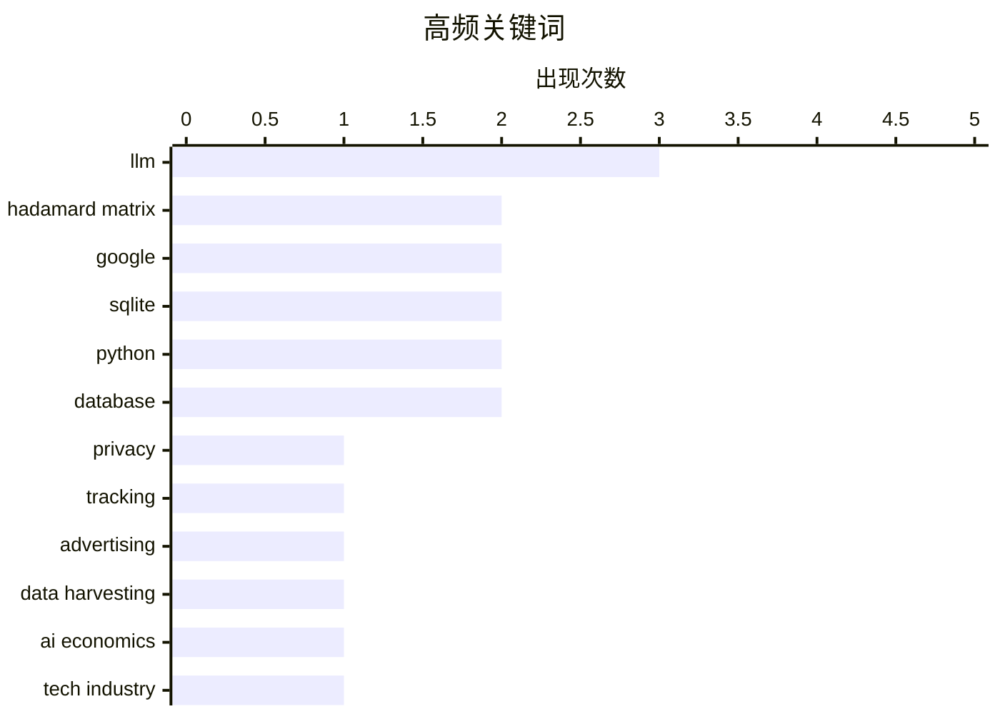

# 📰 Aug 15, 2026

> 来自 Karpathy 推荐的 92 个顶级技术博客，AI 精选 Top 15

## 📝 今日看点

今日技术圈聚焦 AI 的多维演进，从数学难题的突破到模型经济可持续性的深度反思，AI 正在科研与商业逻辑间寻找新平衡。与此同时，数据隐私与数字权利保护成为热点，开发者正通过开源工具打破广告追踪黑盒，并警惕资本扩张对技术创新的侵蚀。在工程底层，针对 ARM 架构优化与数据库工具的频繁迭代，反映了开发者对系统稳定性和跨平台性能的持续追求。

---

## 🏆 今日必读

🥇 **谁在跟踪你？使用这款新服务一探究竟**

[Who’s Tracking You? Use This New Service to Find Out](https://krebsonsecurity.com/2026/08/whos-tracking-you-use-this-new-service-to-find-out/) — krebsonsecurity.com · 19 小时前 · 🔒 安全

> 互联网广告和移动应用的数据采集行为通常被大型广告平台垄断，普通用户难以查明背后的实体。DecryptAds 是一款强大的免费新服务，通过抓取并关联半公开的广告技术（adtech）数据，打破了数据围墙。它能让用户快速识别出是哪些公司在特定网站投放广告，或从特定 App 中提取个人数据。该工具将复杂的广告追踪链路透明化，为个人隐私保护提供了有力的数据支持。通过这种方式，原本掌握在巨头手中的数据被重新交还给公众。

💡 **为什么值得读**: 揭开了广告技术底层数据的神秘面纱，是了解个人隐私泄露途径和广告追踪机制的实用工具。

🏷️ privacy, tracking, advertising, data harvesting

🥈 **深度解析：AI 到底需要多少资金？**

[Premium: How Much Money Does AI Need?](https://www.wheresyoured.at/premium-how-much-money-does-ai-need/) — wheresyoured.at · 15 小时前 · 💡 观点 / 杂谈

> 随着生成式 AI 的爆发，业界对其资金消耗速度和经济回报率的质疑日益增加。文章深入探讨了维持 AI 模型训练和运行所需的庞大资本投入，以及这种投入是否具备可持续的商业逻辑。作者通过长篇论证指出，当前的 AI 繁荣在很大程度上依赖于史无前例的资金注入，而这种规模的投入正面临严峻的财务考验。文章旨在揭示 AI 产业背后的经济泡沫风险与真实的资本需求。最终观点认为，AI 的未来取决于其能否在资金耗尽前证明其真正的商业价值。

💡 **为什么值得读**: 深入剖析了 AI 产业的财务底层逻辑，适合关注 AI 投资泡沫和商业可持续性的读者参考。

🏷️ AI economics, tech industry, venture capital, LLM

🥉 **阿达马码与球堆积问题**

[Hadamard Codes and Sphere Packing](https://www.johndcook.com/blog/2026/08/13/hadamard-sphere-packing/) — johndcook.com · 1 天前 · 🤖 AI / ML

> 数学家 Levent Alpöge 近期宣布利用 Claude AI 发现了一种新的阿达马矩阵（Hadamard matrix），引发了学术界关注。阿达马矩阵在数学和工程领域有重要应用，例如 NASA 曾利用其进行深空通信的纠错编码。文章探讨了这些矩阵与球堆积（Sphere Packing）问题之间的深刻联系，展示了离散数学如何解决高维空间布局问题。这一发现证明了大型语言模型在辅助前沿数学研究和发现新结构方面的巨大潜力。通过 AI 的介入，复杂的数学构造问题找到了新的突破口。

💡 **为什么值得读**: 展示了 AI 在纯数学领域取得突破的真实案例，并科普了阿达马矩阵在航天通信中的经典应用。

🏷️ Hadamard matrix, Claude AI, mathematics, coding theory

---

## 📊 数据概览

| 扫描源 | 抓取文章 | 时间范围 | 精选 |
|:---:|:---:|:---:|:---:|
| 83/92 | 2520 篇 → 34 篇 | 48h | **15 篇** |

### 分类分布



### 高频关键词



<details>
<summary>📈 纯文本关键词图（终端友好）</summary>

```
llm             │ ████████████████████ 3
hadamard matrix │ █████████████░░░░░░░ 2
google          │ █████████████░░░░░░░ 2
sqlite          │ █████████████░░░░░░░ 2
python          │ █████████████░░░░░░░ 2
database        │ █████████████░░░░░░░ 2
privacy         │ ███████░░░░░░░░░░░░░ 1
tracking        │ ███████░░░░░░░░░░░░░ 1
advertising     │ ███████░░░░░░░░░░░░░ 1
data harvesting │ ███████░░░░░░░░░░░░░ 1
```

</details>

### 🏷️ 话题标签

**llm**(3) · **hadamard matrix**(2) · **google**(2) · sqlite(2) · python(2) · database(2) · privacy(1) · tracking(1) · advertising(1) · data harvesting(1) · ai economics(1) · tech industry(1) · venture capital(1) · claude ai(1) · mathematics(1) · coding theory(1) · classification(1) · tagging(1) · metadata(1) · tech policy(1)

---

## ⚙️ 工程

### 1. 强制 ARM64X 可执行文件以特定架构运行

[Forcing an ARM64X executable to run as a specific architecture](https://devblogs.microsoft.com/oldnewthing/20260814-00/?p=112613) — **devblogs.microsoft.com/oldnewthing** · 16 小时前 · ⭐ 24/30

> 在 Windows 的 ARM 平台上，ARM64X 是一种包含多种架构代码的混合可执行文件格式。Raymond Chen 介绍了如何通过编程手段请求特定的目标机器架构，以强制程序以预期的模式运行。这对于调试兼容性问题或在混合环境中确保特定性能表现至关重要。文章深入探讨了 Windows 加载器处理此类二进制文件的底层机制。开发者可以通过特定的 API 调用来干预系统的默认加载行为。这为解决复杂的跨架构运行环境问题提供了技术路径。

🏷️ ARM64X, Windows, architecture, executable

---

### 2. 用于管理 LPPROC_THREAD_ATTRIBUTE_LIST 的辅助类

[A little helper class for managing LPPROC_THREAD_ATTRIBUTE_LISTs](https://devblogs.microsoft.com/oldnewthing/20260813-00/?p=112611) — **devblogs.microsoft.com/oldnewthing** · 1 天前 · ⭐ 20/30

> Win32 API 中的 LPPROC_THREAD_ATTRIBUTE_LIST 内存管理极其繁琐，涉及复杂的缓冲区大小计算、初始化及手动清理。Raymond Chen 提供了一个基于 RAII 模式的 C++ 辅助类，通过封装 InitializeProcThreadAttributeList 和 DeleteProcThreadAttributeList 来简化流程。该类利用 std::unique_ptr 确保在作用域结束时自动释放内存并调用清理函数，有效避免了内存泄漏。这种方案解决了 Windows 系统编程中处理进程线程属性列表时的异常安全性问题，让开发者能以更简洁的代码创建复杂进程。

🏷️ C++, Windows API, RAII, Win32

---

### 3. NASA 水手 9 号探测器如何对图像进行编码

[How NASA’s Mariner 9 probe encoded images](https://www.johndcook.com/blog/2026/08/13/mariner-hadamard/) — **johndcook.com** · 1 天前 · ⭐ 18/30

> 1971 年 NASA 的水手 9 号（Mariner 9）火星探测器面临着在极长距离下传输清晰图像的挑战。为了防止信号在传输过程中受损，任务采用了基于阿达马矩阵（Hadamard matrices）的纠错码技术。具体方案是使用 (32, 6, 16) 阿达马码，这意味着每 6 位原始数据被编码为 32 位传输序列，能够纠正多达 7 位的传输错误。这种编码方式在极低信噪比的环境下确保了火星首批高清图像的完整性，是早期深空通信技术的里程碑。

🏷️ NASA, error correction, Hadamard matrix, space exploration

---

### 4. 打印列表的技巧

[Printing Lists](https://matklad.github.io/2026/08/14/printing-lists.html) — **matklad.github.io** · 1 天前 · ⭐ 18/30

> 在编程中打印逗号分隔的列表时，处理最后一个元素后的多余逗号是一个经典的小难题。作者推荐了一种简洁的代码范式：不是在元素后加逗号，而是在除第一个元素外的每个元素前打印逗号。这种方法通常通过维护一个布尔变量或利用循环索引来实现，能够显著简化逻辑并减少条件判断的复杂度。文章通过 Rust 等语言示例展示了如何用最少的代码行数优雅地处理列表格式化输出。

🏷️ programming idiom, string formatting, clean code

---

## 💡 观点 / 杂谈

### 5. 深度解析：AI 到底需要多少资金？

[Premium: How Much Money Does AI Need?](https://www.wheresyoured.at/premium-how-much-money-does-ai-need/) — **wheresyoured.at** · 15 小时前 · ⭐ 26/30

> 随着生成式 AI 的爆发，业界对其资金消耗速度和经济回报率的质疑日益增加。文章深入探讨了维持 AI 模型训练和运行所需的庞大资本投入，以及这种投入是否具备可持续的商业逻辑。作者通过长篇论证指出，当前的 AI 繁荣在很大程度上依赖于史无前例的资金注入，而这种规模的投入正面临严峻的财务考验。文章旨在揭示 AI 产业背后的经济泡沫风险与真实的资本需求。最终观点认为，AI 的未来取决于其能否在资金耗尽前证明其真正的商业价值。

🏷️ AI economics, tech industry, venture capital, LLM

---

### 6. Pluralistic：资本形成与数字权利（2026年8月14日）

[Pluralistic: Capital formation (14 Aug 2026)](https://pluralistic.net/2026/08/14/one-chokable-throat/) — **pluralistic.net** · 19 小时前 · ⭐ 24/30

> Cory Doctorow 在本期专栏中探讨了“资本形成”与主流化之间的复杂关系，指出技术公司为了合规往往会牺牲最初的创新精神。文章汇集了多个数字权利热点，包括伦敦版权斗争、TSA 对摄影的限制以及中国的互联网审查政策。作者特别批判了所谓的“隐私保护年龄验证”技术，认为其本质上是监控的变种。通过对版权、监控和资本运作的综合分析，文章揭示了技术如何被用来巩固权力而非赋能个人。作者呼吁公众关注那些打着保护旗号实则削弱自由的技术政策。

🏷️ tech policy, copyright, censorship, internet culture

---

### 7. 谷歌 Material 3 设计文档：93.3% 的内容令人尴尬

[Google’s ‘Material 3’ Design Write-Up Is 93.3 Percent Embarrassing](https://design.google/library/expressive-material-design-google-research) — **daringfireball.net** · 14 小时前 · ⭐ 19/30

> 知名科技博主 John Gruber 对谷歌 Material 3 设计语言的官方文档进行了猛烈抨击。文章指出 Material 3 在桌面端浏览器中将标准的文本选择 I 型光标替换为圆圈，这种为了“趣味性”而牺牲可用性的做法极不专业。作者认为谷歌在追求所谓“表现力”的过程中，忽视了基础的用户体验逻辑，导致设计文档充斥着华而不实的辞藻。这种设计趋势反映了谷歌在 UI 逻辑上与用户习惯的脱节，甚至被评价为“令人尴尬”的过度设计。

🏷️ design, Material Design, Google, UI

---

## 🤖 AI / ML

### 8. 阿达马码与球堆积问题

[Hadamard Codes and Sphere Packing](https://www.johndcook.com/blog/2026/08/13/hadamard-sphere-packing/) — **johndcook.com** · 1 天前 · ⭐ 25/30

> 数学家 Levent Alpöge 近期宣布利用 Claude AI 发现了一种新的阿达马矩阵（Hadamard matrix），引发了学术界关注。阿达马矩阵在数学和工程领域有重要应用，例如 NASA 曾利用其进行深空通信的纠错编码。文章探讨了这些矩阵与球堆积（Sphere Packing）问题之间的深刻联系，展示了离散数学如何解决高维空间布局问题。这一发现证明了大型语言模型在辅助前沿数学研究和发现新结构方面的巨大潜力。通过 AI 的介入，复杂的数学构造问题找到了新的突破口。

🏷️ Hadamard matrix, Claude AI, mathematics, coding theory

---

### 9. 别分类了，让 AI 去“幻觉”吧！

[Don't classify. Hallucinate!](https://simonwillison.net/2026/Aug/14/dont-classify-hallucinate/) — **simonwillison.net** · 8 小时前 · ⭐ 24/30

> 面对拥有 1,856 个标签的庞大博客系统，传统的 LLM 分类方法因上下文窗口限制而难以一次性处理所有标签。Doug Turnbull 提出了一种反直觉的方案：不再要求模型从预设列表中选择，而是让其根据内容自由“幻觉”出最合适的标签。随后，通过向量相似度或模糊匹配将这些生成的标签映射回现有的标签库。这种方法避开了分类任务中的标签过载问题，显著提升了大规模标签处理的灵活性。实验证明，生成式方法在处理长尾标签时比严格分类更具效率。

🏷️ LLM, classification, tagging, metadata

---

### 10. 训练强化学习模型玩转 Bonk.io 网页游戏

[Training a Reinforcement Learning Model to Play Bonk.io](https://blog.pixelmelt.dev/training-a-reinforcement-learning-model-to-play-bonk-io/) — **blog.pixelmelt.dev** · 3 小时前 · ⭐ 23/30

> 本文详细记录了将强化学习（RL）应用于物理对抗网页游戏 Bonk.io 的全过程。作者首先对游戏进行了逆向工程，重新实现了其底层的物理引擎，以便在受控环境中进行大规模并行训练。通过构建神经网络并利用 RL 算法，模型学会了在复杂的物理碰撞中生存并击败对手。文章涵盖了从数据抓取、环境模拟到模型调优的完整技术栈。最终实现了一个能够实时响应物理变化并表现出竞争力的 AI 智能体。这展示了 RL 在处理非结构化游戏环境中的强大适应力。

🏷️ reinforcement-learning, physics-engine, neural-network, reverse-engineering

---

## 🛠 工具 / 开源

### 11. llm-gemini 0.33 版本发布

[llm-gemini 0.33](https://simonwillison.net/2026/Aug/13/llm-gemini/) — **simonwillison.net** · 1 天前 · ⭐ 22/30

> Simon Willison 发布了其 `llm-gemini` 插件的 0.33 版本，旨在同步支持 Google 最新的模型更新。该版本正式引入了对 Gemini 3.7 Flash、Gemini 3.6 Flash 以及 Gemini 3.5 Flash-lite 的支持。此外，更新还包含了两个新的嵌入模型 `gemini-embedding-004` 和 `005`。这使得开发者可以通过命令行工具更便捷地调用 Google 最前沿的轻量级大模型。此次更新进一步增强了该工具在多模型实验和集成方面的能力。

🏷️ LLM, Gemini, Google, plugin

---

### 12. sqlite-utils 4.2.1 版本发布：紧急修复崩溃问题

[sqlite-utils 4.2.1](https://simonwillison.net/2026/Aug/13/sqlite-utils-2/) — **simonwillison.net** · 1 天前 · ⭐ 21/30

> 开源工具 `sqlite-utils` 紧急发布了 4.2.1 版本，以修复前一版本中导致程序崩溃的关键错误。该问题源于代码中引入了 `typing_extensions.Self` 但未在依赖项中正确声明 `typing-extensions` 包。此修复确保了在不同 Python 环境下的安装稳定性，避免了因缺少类型定义包而导致的导入错误。建议所有已升级到 4.2 版本的用户立即更新以恢复正常功能。这是对软件发布过程中依赖管理重要性的又一次提醒。

🏷️ SQLite, Python, database, bugfix

---

### 13. sqlite-utils 4.2 版本发布：增强表结构转换功能

[sqlite-utils 4.2](https://simonwillison.net/2026/Aug/13/sqlite-utils/) — **simonwillison.net** · 1 天前 · ⭐ 20/30

> sqlite-utils 4.2 版本对 `table.transform()` 功能进行了重大改进，旨在简化 SQLite 中复杂的表结构变更操作。由于 SQLite 原生对 ALTER TABLE 的支持有限，该功能通过创建新表、迁移数据并替换旧表的方式来实现复杂的架构调整。新版本现在能更好地保留原有的索引、触发器和外键约束，确保数据完整性。这一更新显著提升了开发者在处理 SQLite 数据库模式演进时的效率和安全性。它为 SQLite 用户提供了一种接近于全功能数据库的架构管理体验。

🏷️ SQLite, database, transformation, Python

---

## 🔒 安全

### 14. 谁在跟踪你？使用这款新服务一探究竟

[Who’s Tracking You? Use This New Service to Find Out](https://krebsonsecurity.com/2026/08/whos-tracking-you-use-this-new-service-to-find-out/) — **krebsonsecurity.com** · 19 小时前 · ⭐ 26/30

> 互联网广告和移动应用的数据采集行为通常被大型广告平台垄断，普通用户难以查明背后的实体。DecryptAds 是一款强大的免费新服务，通过抓取并关联半公开的广告技术（adtech）数据，打破了数据围墙。它能让用户快速识别出是哪些公司在特定网站投放广告，或从特定 App 中提取个人数据。该工具将复杂的广告追踪链路透明化，为个人隐私保护提供了有力的数据支持。通过这种方式，原本掌握在巨头手中的数据被重新交还给公众。

🏷️ privacy, tracking, advertising, data harvesting

---

## 📝 其他

### 15. 超瓷晶面板 2 代名副其实

[Ceramic Shield 2 Is the Real Deal](https://www.tomsguide.com/phones/iphones/iphone-17-and-iphone-air-durability-testing-heres-how-the-new-iphones-stand-up-to-bending-scratching-and-dropping) — **daringfireball.net** · 1 天前 · ⭐ 18/30

> iPhone 17 系列搭载的第二代超瓷晶面板（Ceramic Shield 2）在耐用性测试中表现卓越。根据 JerryRigEverything 的测试数据，该屏幕在莫氏硬度 7 级时才出现轻微划痕，而普通玻璃通常在 5 或 6 级就会受损。这一结果验证了苹果关于新一代面板更坚韧的宣传，证明其在抗刮擦性能上达到了目前智能手机行业的顶尖水平。通过引入更先进的陶瓷晶体技术，苹果成功提升了屏幕的物理防御极限，显著降低了日常使用中的磨损风险。

🏷️ iPhone, hardware, durability, Ceramic Shield

---

*生成于 2026-08-15 06:50 | 扫描 83 源 → 获取 2520 篇 → 精选 15 篇*
*基于 [Hacker News Popularity Contest 2025](https://refactoringenglish.com/tools/hn-popularity/) RSS 源列表，由 [Andrej Karpathy](https://x.com/karpathy) 推荐*
