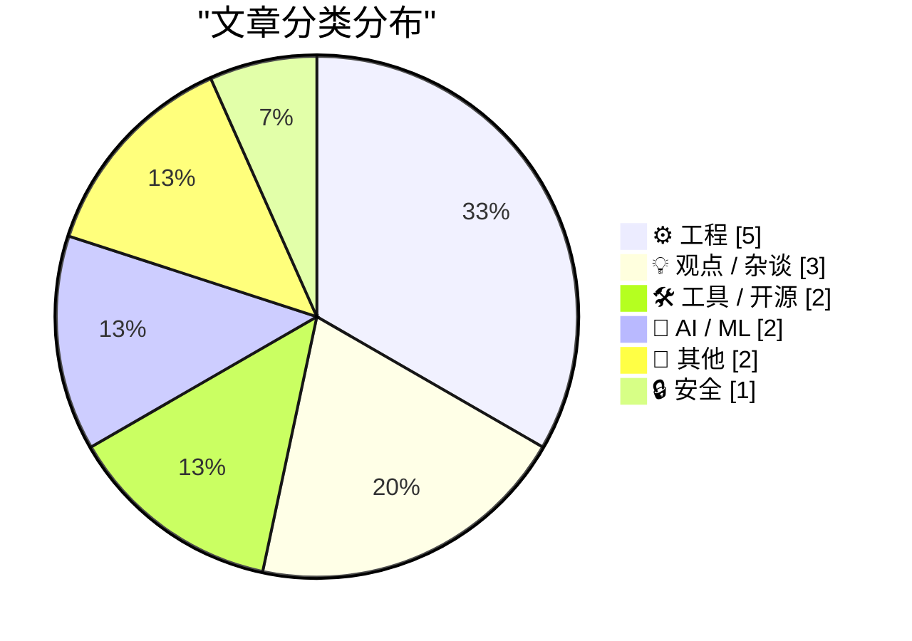
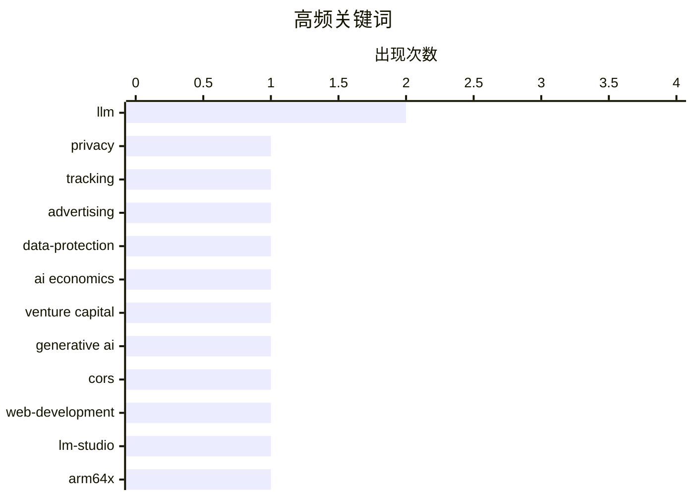

# 📰 Aug 16, 2026

> 来自 Karpathy 推荐的 92 个顶级技术博客，AI 精选 Top 15

## 📝 今日看点

今日技术圈聚焦于 AI 产业的经济可持续性与应用范式创新，在反思巨额算力投入与商业模式挑战的同时，开发者正通过逆向工程与反直觉的 LLM 策略探索落地新径。数字权利与隐私透明度依然是核心议题，从追踪广告数据采集者到探讨资本对监管的影响，技术界正试图在复杂的数据生态中重构个人主权。此外，高性能工程实践持续向底层深化，Rust 并发模型、ARM 架构优化以及经典数学理论的压缩应用，共同展现了现代系统开发的硬核驱动力。

---

## 🏆 今日必读

🥇 **谁在跟踪你？使用这款新服务一探究竟**

[Who’s Tracking You? Use This New Service to Find Out](https://krebsonsecurity.com/2026/08/whos-tracking-you-use-this-new-service-to-find-out/) — krebsonsecurity.com · 1 天前 · 🔒 安全

> 广告技术数据长期以来被大型平台垄断，普通用户难以查明网页广告或移动应用背后的数据采集者。DecryptAds 是一款强大的免费新工具，通过抓取并关联 ads.txt 和 app-ads.txt 等半公开的广告技术数据，打破了行业信息壁垒。该服务能让用户快速识别特定网站或 App 背后的广告实体及其关联关系，将原本难以解析的原始数据转化为直观的洞察。它为隐私研究者和普通用户提供了一个透明的窗口，用于揭示数字广告生态系统中的追踪链条。

💡 **为什么值得读**: 揭开了广告追踪技术的黑盒，是隐私保护研究和竞品数据分析的利器。

🏷️ privacy, tracking, advertising, data-protection

🥈 **深度解析：AI 到底需要多少资金投入？**

[Premium: How Much Money Does AI Need?](https://www.wheresyoured.at/premium-how-much-money-does-ai-need/) — wheresyoured.at · 1 天前 · 💡 观点 / 杂谈

> 生成式 AI 的发展正面临前所未有的资金压力，其高昂的算力和研发成本引发了对其商业模式可持续性的质疑。文章深入探讨了 AI 巨头们对资本的极度渴求，分析了维持当前模型迭代速度所需的数千亿美元投入与实际产出之间的鸿沟。作者指出，AI 行业目前高度依赖持续的融资而非自身盈利，这种“烧钱”模式在宏观经济波动面前显得尤为脆弱。如果无法在短期内证明其经济价值，AI 泡沫可能面临破裂的风险。

💡 **为什么值得读**: 深入剖析了 AI 繁荣背后的财务危机，适合关注行业趋势和投资逻辑的读者。

🏷️ AI economics, venture capital, generative AI

🥉 **CORS Chat：跨域测试本地大模型的 Web 工具**

[CORS Chat](https://simonwillison.net/2026/Aug/15/cors-chat/) — simonwillison.net · 16 小时前 · 🛠 工具 / 开源

> Simon Willison 利用 GPT-5.6-Sol xhigh 开发了一款名为 CORS Chat 的 Web UI 工具，专门用于测试兼容 OpenAI 响应格式的聊天接口。该工具解决了在浏览器中直接调用本地模型时的跨域限制问题，支持开启了 --cors 选项的 LM Studio 和 OpenRouter 等平台。作者在 M5 MacBook Pro 和 NVIDIA DGX Spark 上成功运行并测试了 Qwen 3.8 27B 模型。通过这个简洁的界面，开发者可以快速验证不同硬件环境下的模型响应效果。

💡 **为什么值得读**: 为本地运行大模型的开发者提供了一个即插即用的调试界面，极大简化了接口测试流程。

🏷️ CORS, LLM, web-development, LM-Studio

---

## 📊 数据概览

| 扫描源 | 抓取文章 | 时间范围 | 精选 |
|:---:|:---:|:---:|:---:|
| 80/92 | 2463 篇 → 23 篇 | 48h | **15 篇** |

### 分类分布



### 高频关键词



<details>
<summary>📈 纯文本关键词图（终端友好）</summary>

```
llm             │ ████████████████████ 2
privacy         │ ██████████░░░░░░░░░░ 1
tracking        │ ██████████░░░░░░░░░░ 1
advertising     │ ██████████░░░░░░░░░░ 1
data-protection │ ██████████░░░░░░░░░░ 1
ai economics    │ ██████████░░░░░░░░░░ 1
venture capital │ ██████████░░░░░░░░░░ 1
generative ai   │ ██████████░░░░░░░░░░ 1
cors            │ ██████████░░░░░░░░░░ 1
web-development │ ██████████░░░░░░░░░░ 1
```

</details>

### 🏷️ 话题标签

**llm**(2) · **privacy**(1) · **tracking**(1) · advertising(1) · data-protection(1) · ai economics(1) · venture capital(1) · generative ai(1) · cors(1) · web-development(1) · lm-studio(1) · arm64x(1) · windows(1) · architecture(1) · executable(1) · package management(1) · security advisories(1) · software supply chain(1) · classification(1) · metadata(1)

---

## ⚙️ 工程

### 1. 强制 ARM64X 可执行文件以特定架构运行

[Forcing an ARM64X executable to run as a specific architecture](https://devblogs.microsoft.com/oldnewthing/20260814-00/?p=112613) — **devblogs.microsoft.com/oldnewthing** · 1 天前 · ⭐ 24/30

> Windows 的 ARM64X 是一种特殊的混合二进制格式，允许同一个可执行文件在 ARM64 环境下以原生或仿真模式运行。Raymond Chen 详细介绍了如何通过编程手段请求特定的目标机器架构，从而强制程序以 x64 或 ARM64 模式启动。这对于解决兼容性问题或在混合架构环境中进行调试至关重要。文章揭示了系统加载器处理此类二进制文件的底层逻辑，并提供了控制执行行为的具体方法。

🏷️ ARM64X, Windows, architecture, executable

---

### 2. 并发服务器系列（七）：Rust 实现篇

[Concurrent Servers: Part 7 - Rust](https://eli.thegreenplace.net/2026/concurrent-servers-part-7-rust/) — **eli.thegreenplace.net** · 14 小时前 · ⭐ 23/30

> 这是并发网络服务器系列的第七部分，重点探讨如何利用 Rust 语言解决高性能服务器开发中的挑战。文章详细分析了 Rust 的所有权模型和类型系统如何在编译期消除数据竞争，从而实现安全的并发。作者对比了 Rust 与 C/Python 在处理多线程和异步 IO 时的不同策略，并提供了具体的代码示例。通过这一章节，读者可以理解 Rust 如何在保证内存安全的同时，提供接近底层的执行效率。

🏷️ Rust, concurrency, networking, server

---

### 3. 阿达马矩阵的压缩技术

[Compressing a Hadamard matrix](https://www.johndcook.com/blog/2026/08/15/compressing-a-hadamard-matrix/) — **johndcook.com** · 15 小时前 · ⭐ 21/30

> 阿达马矩阵（Hadamard matrix）作为一种特殊的正交矩阵，近期因新矩阵的发现再次成为数学界焦点。文章回顾了其在水手 9 号探测器纠错码及球体堆积问题中的经典应用，展示了其在信息论中的重要地位。核心内容聚焦于如何利用矩阵的结构特性进行高效压缩，以降低大规模计算中的存储开销。作者通过数学推导，解释了在保持矩阵正交性的前提下，实现数据精简的技术路径。

🏷️ Hadamard matrix, compression, mathematics

---

### 4. 本博客是如何构建的

[How This Blog Is Built](https://nesbitt.io/2026/08/14/how-this-blog-is-built.html) — **nesbitt.io** · 1 天前 · ⭐ 20/30

> 本文详细拆解了 nesbitt.io 博客背后的技术架构，涵盖了从内容创作到全球分发的全流程。作者弃用了通用的框架，转而构建了一套定制化的静态网站生成器（SSG）和内容流水线。技术栈重点在于边缘部署（Edge Deployment），旨在通过减少服务器响应延迟来优化访问速度。文中分享了在构建轻量级、高性能个人网站时的工程实践，包括如何处理静态资源和自动化部署流程。

🏷️ SSG, static site generator, deployment, web architecture

---

### 5. 纠错的概率

[Probability of correcting errors](https://www.johndcook.com/blog/2026/08/15/probability-of-correcting-errors/) — **johndcook.com** · 14 小时前 · ⭐ 19/30

> 纠错码通常以其能“确定”纠正的错误位数来定义，但本文探讨了其在超出保证范围后的纠错概率。以水手 9 号火星探测器使用的 Hadamard 码为例，它将 6 位像素编码为 32 位码字，能确保纠正 7 位错误。作者进一步分析了当错误位数超过阈值时，算法仍有一定概率恢复原始数据的数学原理。这种概率性的视角对于理解深空通信等极端环境下的数据可靠性至关重要，展示了编码理论在极限情况下的表现。

🏷️ error correction, Hadamard code, information theory

---

## 💡 观点 / 杂谈

### 6. 深度解析：AI 到底需要多少资金投入？

[Premium: How Much Money Does AI Need?](https://www.wheresyoured.at/premium-how-much-money-does-ai-need/) — **wheresyoured.at** · 1 天前 · ⭐ 26/30

> 生成式 AI 的发展正面临前所未有的资金压力，其高昂的算力和研发成本引发了对其商业模式可持续性的质疑。文章深入探讨了 AI 巨头们对资本的极度渴求，分析了维持当前模型迭代速度所需的数千亿美元投入与实际产出之间的鸿沟。作者指出，AI 行业目前高度依赖持续的融资而非自身盈利，这种“烧钱”模式在宏观经济波动面前显得尤为脆弱。如果无法在短期内证明其经济价值，AI 泡沫可能面临破裂的风险。

🏷️ AI economics, venture capital, generative AI

---

### 7. 复数形式：资本形成与数字权利

[Pluralistic: Capital formation (14 Aug 2026)](https://pluralistic.net/2026/08/14/one-chokable-throat/) — **pluralistic.net** · 1 天前 · ⭐ 23/30

> Cory Doctorow 在本期专栏中探讨了“资本形成”如何迫使边缘技术走向主流并接受监管，提出了“单一受控点”的风险概念。文章广泛涉及了数字版权与个人隐私的冲突，包括伦敦反版权运动、TSA 对化妆品的限制以及万智牌卡组的版权争议。作者严厉批评了所谓的“隐私保护身份验证”方案，认为其本质上是数字监控的延伸。通过一系列社会技术案例，文章揭示了在资本驱动下，互联网自由正面临被制度化蚕食的威胁。

🏷️ copyright, censorship, tech-policy, digital-rights

---

### 8. Google 的 Material 3 设计文档简直是 93.3% 的尴尬

[Google’s ‘Material 3’ Design Write-Up Is 93.3 Percent Embarrassing](https://design.google/library/expressive-material-design-google-research) — **daringfireball.net** · 1 天前 · ⭐ 20/30

> Google 的 Material 3 设计语言文档因其过度追求“表现力”而遭到 John Gruber 的尖锐批评。文中重点抨击了 Google 在桌面浏览器中将标准的文本选择 I 型光标替换为圆形的做法，认为这牺牲了功能性以换取无意义的视觉趣味。Gruber 指出，这种设计趋势反映了 Google 在 UI 逻辑上的混乱，甚至连官方展示的待办事项应用也显得笨拙不堪。该评论揭示了现代 UI 设计中品牌表达与用户体验基本准则之间的冲突，认为 Google 正在偏离实用的设计轨道。

🏷️ UI/UX, Material-Design, Google, design-system

---

## 🛠 工具 / 开源

### 9. CORS Chat：跨域测试本地大模型的 Web 工具

[CORS Chat](https://simonwillison.net/2026/Aug/15/cors-chat/) — **simonwillison.net** · 16 小时前 · ⭐ 24/30

> Simon Willison 利用 GPT-5.6-Sol xhigh 开发了一款名为 CORS Chat 的 Web UI 工具，专门用于测试兼容 OpenAI 响应格式的聊天接口。该工具解决了在浏览器中直接调用本地模型时的跨域限制问题，支持开启了 --cors 选项的 LM Studio 和 OpenRouter 等平台。作者在 M5 MacBook Pro 和 NVIDIA DGX Spark 上成功运行并测试了 Qwen 3.8 27B 模型。通过这个简洁的界面，开发者可以快速验证不同硬件环境下的模型响应效果。

🏷️ CORS, LLM, web-development, LM-Studio

---

### 10. 包管理周报：2026 年 8 月 15 日

[This Week in Package Management: 15 August 2026](https://nesbitt.io/2026/08/15/this-week-in-package-management.html) — **nesbitt.io** · 20 小时前 · ⭐ 24/30

> 本周包管理领域发布了多项重要更新，涵盖了主流包管理器的版本迭代与安全公告。报告汇总了 npm、PyPI 及 Cargo 等生态系统中的最新漏洞预警，提醒开发者及时修补潜在的安全风险。此外，文中还收录了关于依赖树优化和供应链安全治理的深度技术文章。通过这份周报，开发者可以快速掌握过去一周内影响软件分发与集成的关键动态。

🏷️ package management, security advisories, software supply chain

---

## 🤖 AI / ML

### 11. 别分类，去“幻觉”！利用 LLM 自动生成标签的新思路

[Don't classify. Hallucinate!](https://simonwillison.net/2026/Aug/14/dont-classify-hallucinate/) — **simonwillison.net** · 1 天前 · ⭐ 23/30

> 当博客拥有如 1,856 个之多的标签时，传统的 LLM 分类方法会因上下文窗口限制而失效。Doug Turnbull 提出了一种反直觉的方案：不再向模型提供标签列表，而是让其根据内容自由“幻觉”出合适的标签。随后，通过向量相似度或字符串匹配将生成的标签映射回已有的标签库中。这种方法不仅规避了 Token 限制，还能利用 LLM 的语义理解能力发现更精准的关联。Simon Willison 对此表示赞同，认为这是处理大规模分类任务的高效路径。

🏷️ LLM, classification, metadata, automation

---

### 12. 训练强化学习模型玩转 Bonk.io 网页游戏

[Training a Reinforcement Learning Model to Play Bonk.io](https://blog.pixelmelt.dev/training-a-reinforcement-learning-model-to-play-bonk-io/) — **blog.pixelmelt.dev** · 1 天前 · ⭐ 22/30

> 本文记录了通过逆向工程和强化学习让 AI 掌握网页游戏 Bonk.io 的全过程。作者首先对游戏的物理引擎进行了深度剖析并重新实现，以便为模型训练提供高效的模拟环境。随后，利用神经网络构建了智能体，并在自定义的物理环境中进行了大规模的强化学习训练。文章展示了如何将复杂的网页交互转化为可训练的数学模型，并最终实现了能够自主对战的 AI 玩家。

🏷️ reinforcement learning, neural network, reverse engineering

---

## 📝 其他

### 13. 阅读清单 —— 2026年8月15日

[Reading List — 08/15/2026](https://www.construction-physics.com/p/reading-list-08152026) — **construction-physics.com** · 18 小时前 · ⭐ 18/30

> 这是一份聚焦于基础设施、能源与宏观经济的深度阅读清单。内容涵盖了近期房价下跌的趋势分析、美国战略石油储备（SPR）的现状以及 The Boring Company 的最新融资动态。作者通过筛选高质量的行业报告和新闻，为读者提供了关于物理世界建设与维护的多维度视角。该清单特别关注政策变动与资本流动对建筑和能源行业的长远影响，是追踪基建领域动态的窗口。

🏷️ economics, infrastructure, reading list

---

### 14. 《21 世纪住房之路法案》将如何影响住房供应？（第二部分）

[How Will the 21st Century ROAD to Housing Act Affect Housing Supply? Part II](https://www.construction-physics.com/p/how-will-the-21st-century-road-to) — **construction-physics.com** · 1 天前 · ⭐ 18/30

> 本文是关于《21 世纪住房之路法案》（ROAD to Housing Act）深度系列分析的第二部分。作者逐条拆解了该法案的具体条款，旨在评估其对美国住房供应短缺问题的实际缓解作用。分析重点在于法案如何通过调整监管政策和资金分配来激励房屋建设，并试图识别其中可能存在的执行障碍。这为理解复杂立法如何转化为现实中的建筑动工量提供了专业的政策解读，探讨了政府干预对房地产市场的潜在影响。

🏷️ housing policy, legislation, urban planning

---

## 🔒 安全

### 15. 谁在跟踪你？使用这款新服务一探究竟

[Who’s Tracking You? Use This New Service to Find Out](https://krebsonsecurity.com/2026/08/whos-tracking-you-use-this-new-service-to-find-out/) — **krebsonsecurity.com** · 1 天前 · ⭐ 26/30

> 广告技术数据长期以来被大型平台垄断，普通用户难以查明网页广告或移动应用背后的数据采集者。DecryptAds 是一款强大的免费新工具，通过抓取并关联 ads.txt 和 app-ads.txt 等半公开的广告技术数据，打破了行业信息壁垒。该服务能让用户快速识别特定网站或 App 背后的广告实体及其关联关系，将原本难以解析的原始数据转化为直观的洞察。它为隐私研究者和普通用户提供了一个透明的窗口，用于揭示数字广告生态系统中的追踪链条。

🏷️ privacy, tracking, advertising, data-protection

---

*生成于 2026-08-16 06:51 | 扫描 80 源 → 获取 2463 篇 → 精选 15 篇*
*基于 [Hacker News Popularity Contest 2025](https://refactoringenglish.com/tools/hn-popularity/) RSS 源列表，由 [Andrej Karpathy](https://x.com/karpathy) 推荐*
