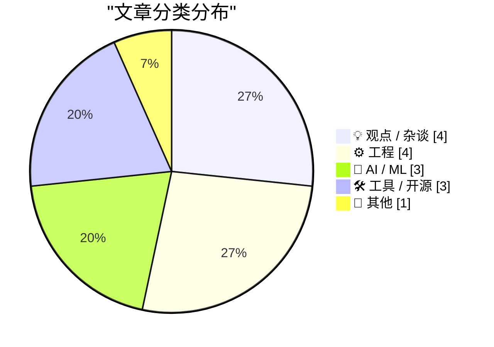
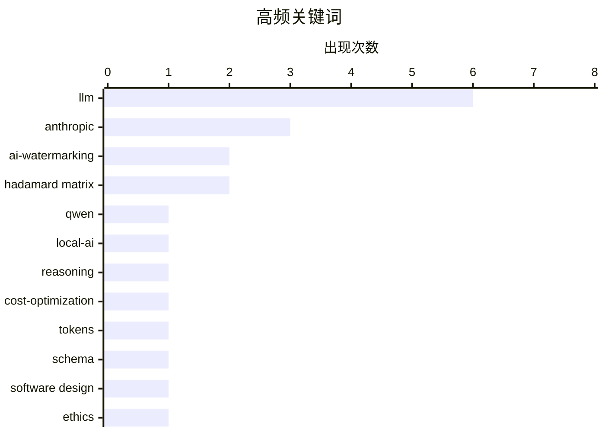

# 📰 Aug 17, 2026

> 来自 Karpathy 推荐的 92 个顶级技术博客，AI 精选 Top 15

## 📝 今日看点

今日技术圈的核心议题围绕 AI 监管与创作自由的博弈展开，Anthropic 引入文本水印的举措引发了关于写作本质与合规成本的激烈辩论。与此同时，AI 行业正加速向实用主义转型，从 Qwen 新模型的本地化部署到成本削减框架的提出，开发者正致力于在性能与开销间寻找新平衡。此外，Rust 高并发实践与供应链安全动态提醒着工程师，在 AI 浪潮下底层架构的稳健性依然是技术发展的基石。

---

## 🏆 今日必读

🥇 **Qwen 3.8 27B 表现卓越，但默认存在严重的“过度思考”倾向**

[Qwen 3.8 27B is excellent, but it defaults to wildly overthinking things](https://simonwillison.net/2026/Aug/16/qwen-38-27b/) — simonwillison.net · 9 小时前 · 🤖 AI / ML

> 阿里巴巴 Qwen 研究实验室发布了采用 Apache 2 许可证的 Qwen 3.8 27B 视觉语言模型。该模型 27B 的参数规模非常适合在 M5 MacBook Pro 等高性能笔记本电脑上本地运行，是其 3.6 版本的强力继任者。虽然基准测试表现优异，但在实际使用中模型往往会产生过于冗长或复杂的推理路径，即所谓的“过度思考”。作者认为 27B 是目前本地部署的黄金尺寸，但用户需要通过调整提示词或参数来抑制其发散性。该模型在 LM Studio 等工具上的兼容性良好，为本地 AI 应用提供了新的高性能选择。

💡 **为什么值得读**: 了解最新开源大模型 Qwen 3.8 27B 的实测表现及其在本地部署中的优缺点。

🏷️ Qwen, LLM, local-AI, reasoning

🥈 **我关于降低 AI 成本的思考框架**

[How I think about reducing AI costs](https://martinalderson.com/posts/how-i-think-about-reducing-ai-costs/?utm_source=rss&amp;utm_medium=rss&amp;utm_campaign=feed) — martinalderson.com · 1 天前 · 🤖 AI / ML

> 针对日益增长的 AI 运营成本，本文提出了一个包含四个维度的实用削减框架。核心策略包括审计 Token 消耗分布以识别浪费、果断淘汰昂贵的旧版模型，以及将非核心工作负载迁移至 Open Weights 开源权重服务商。此外，文章强调了修复 Agent 和工具调用中的低效环节，因为这些环节往往在不经意间通过重复调用烧掉大量 Token。通过优化提示词结构和减少不必要的往返调用，开发者可以在不牺牲效果的前提下显著降低推理成本。

💡 **为什么值得读**: 为开发者提供了一套系统化的 AI 成本优化清单，帮助在保证效果的前提下大幅降低 API 开销。

🏷️ LLM, cost-optimization, tokens

🥉 **哎呀，我早该想到这一点的**

[Oops, Should’ve Thought of That](https://blog.jim-nielsen.com/2026/oops-shouldve-thought-of-that/) — blog.jim-nielsen.com · 12 小时前 · 🤖 AI / ML

> 计算机交互范式正在从“精确指令”转向“意图外推”，LLM 的出现让计算机能够理解模糊的“氛围”（Vibes）。传统的软件开发要求极度精确的规范，而 LLM 可以根据寥寥数语推断用户意图，从而缓解了严苛的逻辑约束。这种转变意味着未来的 Agent 需要更具弹性的 Schema 来处理非结构化的交互，而不是死板的固定格式。作者反思了这种变化对软件架构设计的深远影响，即系统必须适应不再完全可预测的输入流。

💡 **为什么值得读**: 探讨了 LLM 如何从根本上改变人机交互逻辑，从精确编程转向模糊意图理解。

🏷️ LLM, schema, software design

---

## 📊 数据概览

| 扫描源 | 抓取文章 | 时间范围 | 精选 |
|:---:|:---:|:---:|:---:|
| 83/92 | 2521 篇 → 23 篇 | 48h | **15 篇** |

### 分类分布



### 高频关键词



<details>
<summary>📈 纯文本关键词图（终端友好）</summary>

```
llm               │ ████████████████████ 6
anthropic         │ ██████████░░░░░░░░░░ 3
ai-watermarking   │ ███████░░░░░░░░░░░░░ 2
hadamard matrix   │ ███████░░░░░░░░░░░░░ 2
qwen              │ ███░░░░░░░░░░░░░░░░░ 1
local-ai          │ ███░░░░░░░░░░░░░░░░░ 1
reasoning         │ ███░░░░░░░░░░░░░░░░░ 1
cost-optimization │ ███░░░░░░░░░░░░░░░░░ 1
tokens            │ ███░░░░░░░░░░░░░░░░░ 1
schema            │ ███░░░░░░░░░░░░░░░░░ 1
```

</details>

### 🏷️ 话题标签

**llm**(6) · **anthropic**(3) · **ai-watermarking**(2) · hadamard matrix(2) · qwen(1) · local-ai(1) · reasoning(1) · cost-optimization(1) · tokens(1) · schema(1) · software design(1) · ethics(1) · writing-quality(1) · compression(1) · data structures(1) · package management(1) · open source(1) · security advisories(1) · rust(1) · concurrency(1)

---

## 💡 观点 / 杂谈

### 1. AI 文本水印没什么大不了的

[AI text watermarking is not a big deal](https://seangoedecke.com/ai-text-watermarking-is-not-a-big-deal/) — **seangoedecke.com** · 1 天前 · ⭐ 24/30

> 针对 Anthropic 宣布在 Claude 输出中加入隐藏水印引发的争议，本文认为这并不会导致用户大规模流失。水印技术通过微调 Token 采样概率实现，通常对文本质量和连贯性的影响微乎其微，普通用户几乎不可察觉。对于大多数应用场景，这种隐藏的统计特征很容易通过简单的改写、翻译或提示词调整来规避。作者指出，水印更多是企业为了应对监管压力而采取的合规手段，而非对模型核心能力的削弱。因此，用户无需过度担心模型输出会因此变得“不自然”。

🏷️ AI-watermarking, Anthropic, LLM, ethics

---

### 2. Anthropic 在 Claude 中加入的“水印”是对写作的亵渎

[★ Anthropic’s ‘Watermark’ Text Adulteration in Claude Is a Perversion of Writing](https://daringfireball.net/2026/08/anthropics_watermark_text_adulteration_in_claude_is_a_perversion_of_writing) — **daringfireball.net** · 11 小时前 · ⭐ 24/30

> 作者对 Anthropic 在 Claude 中引入文本水印的行为表达了强烈抨击，称其为对写作本质的“篡改”。文章认为，任何为了嵌入隐藏溯源信息而牺牲文本清晰度、连贯性或质量的做法都是不可接受的，即便损失极其微小。工具的唯一目标应该是服务于使用者的需求，而不是为了满足监管或厂商的溯源目的而干扰生成内容。这种在用户不知情的情况下人为干预 Token 概率的行为，被视为对创作主权和工具中立性的严重侵犯。

🏷️ AI-watermarking, Anthropic, writing-quality, LLM

---

### 3. “Anthropic 软弱的水印是在迎合软弱的法律”

[‘Anthropic’s Weak Watermarks Appease a Weak Law’](https://blog.j11y.io/2026-08-12_Anthropics-weak-watermarks-appease-a-weak-law/) — **daringfireball.net** · 13 小时前 · ⭐ 22/30

> 本文引用 James Padolsey 的观点，批评 Anthropic 的文本水印举措是为了迎合欧盟等地区软弱且缺乏原则的监管法律。作者指出，如果同样的逻辑应用在计算器或拼写检查器诞生之初，它们的输出也会因为带有“辅助痕迹”而被视为可疑。文章认为，仅仅因为 AI 工具变得足够强大可以生成完整句子就对其输出进行标记，这在逻辑上是站不住脚的。这种做法被视为一种不必要的妥协，混淆了人类创作与工具辅助之间的界限，可能对未来的技术演进造成负面影响。

🏷️ AI-regulation, EU-law, watermarking, Anthropic

---

### 4. Pluralistic：Jennifer Jenkins 的《音乐版权、创造力与文化》

[Pluralistic: Jennifer Jenkins' 'Music Copyright, Creativity, and Culture' (17 Aug 2026)](https://pluralistic.net/2026/08/17/great-sousas-ghost/) — **pluralistic.net** · 8 分钟前 · ⭐ 21/30

> 著名作家 Cory Doctorow 推荐了 Jennifer Jenkins 的新书，该书以漫画形式深入探讨了音乐版权对创造力的复杂影响。文章指出版权法已从保护创作者的工具演变为阻碍采样、翻唱和文化流转的枷锁。内容还串联了 LLM 在编程中的随机性、Hypercard 的历史背景以及信息安全的长期演进等话题。作者呼吁重新审视数字时代的版权制度，以支持而非扼杀文化创造力。

🏷️ copyright, infosec, digital culture

---

## ⚙️ 工程

### 5. 压缩阿达马矩阵

[Compressing a Hadamard matrix](https://www.johndcook.com/blog/2026/08/15/compressing-a-hadamard-matrix/) — **johndcook.com** · 1 天前 · ⭐ 24/30

> 随着近期新型阿达马矩阵（Hadamard matrix）的发现，该数学领域再次成为关注焦点。阿达马矩阵是一种元素仅为 +1 或 -1 的正交矩阵，在 Mariner 9 探测器的纠错码和球体填充构造中有着重要应用。本文探讨了如何利用其结构特性进行高效压缩存储，以减少在大规模运算中的内存占用。通过分析矩阵的对称性和递归构造方法，可以实现更紧凑的数据表示。这对于需要处理高维正交变换的通信工程和几何计算具有重要的工程价值。

🏷️ Hadamard matrix, compression, data structures

---

### 6. 并发服务器：第七部分 - Rust 篇

[Concurrent Servers: Part 7 - Rust](https://eli.thegreenplace.net/2026/concurrent-servers-part-7-rust/) — **eli.thegreenplace.net** · 1 天前 · ⭐ 24/30

> 这是并发网络服务器系列的第七部分，专门探讨如何利用 Rust 语言解决高并发编程中的核心挑战。文章详细分析了 Rust 的所有权模型、借用检查器以及 `async/await` 异步机制在处理数万个并发连接时的优势。通过对比前几章提到的多线程和事件驱动模型，展示了 Rust 如何在不牺牲性能的前提下提供内存安全保障。文中提供了具体的代码示例，演示了如何使用 Tokio 等库构建一个健壮的并发服务器架构。这为从 C++ 或 Go 转向 Rust 的开发者提供了清晰的路径。

🏷️ Rust, concurrency, networking

---

### 7. 纠错码的纠错概率分析

[Probability of correcting errors](https://www.johndcook.com/blog/2026/08/15/probability-of-correcting-errors/) — **johndcook.com** · 1 天前 · ⭐ 22/30

> 纠错码在超出其理论保证的纠错限值后仍具有一定的错误恢复能力。以水手 9 号火星探测器使用的 Hadamard 码为例，该码能确保纠正 32 位码字中的 7 位错误，但当错误达到 8 位或更多时，纠错成功的概率并不会立即归零。文章通过数学模型展示了这种概率随错误位数增加而衰减的过程，强调了纠错码在极端噪声环境下的鲁棒性。这为理解通信系统在极端条件下的“软失效”特性提供了理论依据。

🏷️ error correction, Hadamard code, probability

---

### 8. Hadamard 矩阵中 1 的比例分布

[Proportion of 1s in a Hadamard matrix](https://www.johndcook.com/blog/2026/08/16/proportion-of-1s-in-a-hadamard-matrix/) — **johndcook.com** · 5 小时前 · ⭐ 21/30

> 本文探讨了通过克罗内克积（Kronecker product）构造的 Hadamard 矩阵序列中元素 1 的分布规律。数学证明显示，若初始矩阵 H0 和生成矩阵 G 中 1 的比例已知，迭代生成的 Hn+1 矩阵中 1 的比例遵循特定的递推公式。无论初始比例如何，随着迭代次数 n 的增加，矩阵中 1 的比例将快速收敛至 0.5。这一特性保证了大尺寸正交编码矩阵在统计上的平衡性，对信号处理具有重要意义。

🏷️ mathematics, Hadamard matrix, algorithms

---

## 🤖 AI / ML

### 9. Qwen 3.8 27B 表现卓越，但默认存在严重的“过度思考”倾向

[Qwen 3.8 27B is excellent, but it defaults to wildly overthinking things](https://simonwillison.net/2026/Aug/16/qwen-38-27b/) — **simonwillison.net** · 9 小时前 · ⭐ 27/30

> 阿里巴巴 Qwen 研究实验室发布了采用 Apache 2 许可证的 Qwen 3.8 27B 视觉语言模型。该模型 27B 的参数规模非常适合在 M5 MacBook Pro 等高性能笔记本电脑上本地运行，是其 3.6 版本的强力继任者。虽然基准测试表现优异，但在实际使用中模型往往会产生过于冗长或复杂的推理路径，即所谓的“过度思考”。作者认为 27B 是目前本地部署的黄金尺寸，但用户需要通过调整提示词或参数来抑制其发散性。该模型在 LM Studio 等工具上的兼容性良好，为本地 AI 应用提供了新的高性能选择。

🏷️ Qwen, LLM, local-AI, reasoning

---

### 10. 我关于降低 AI 成本的思考框架

[How I think about reducing AI costs](https://martinalderson.com/posts/how-i-think-about-reducing-ai-costs/?utm_source=rss&amp;utm_medium=rss&amp;utm_campaign=feed) — **martinalderson.com** · 1 天前 · ⭐ 27/30

> 针对日益增长的 AI 运营成本，本文提出了一个包含四个维度的实用削减框架。核心策略包括审计 Token 消耗分布以识别浪费、果断淘汰昂贵的旧版模型，以及将非核心工作负载迁移至 Open Weights 开源权重服务商。此外，文章强调了修复 Agent 和工具调用中的低效环节，因为这些环节往往在不经意间通过重复调用烧掉大量 Token。通过优化提示词结构和减少不必要的往返调用，开发者可以在不牺牲效果的前提下显著降低推理成本。

🏷️ LLM, cost-optimization, tokens

---

### 11. 哎呀，我早该想到这一点的

[Oops, Should’ve Thought of That](https://blog.jim-nielsen.com/2026/oops-shouldve-thought-of-that/) — **blog.jim-nielsen.com** · 12 小时前 · ⭐ 25/30

> 计算机交互范式正在从“精确指令”转向“意图外推”，LLM 的出现让计算机能够理解模糊的“氛围”（Vibes）。传统的软件开发要求极度精确的规范，而 LLM 可以根据寥寥数语推断用户意图，从而缓解了严苛的逻辑约束。这种转变意味着未来的 Agent 需要更具弹性的 Schema 来处理非结构化的交互，而不是死板的固定格式。作者反思了这种变化对软件架构设计的深远影响，即系统必须适应不再完全可预测的输入流。

🏷️ LLM, schema, software design

---

## 🛠 工具 / 开源

### 12. 包管理周报：2026 年 8 月 15 日

[This Week in Package Management: 15 August 2026](https://nesbitt.io/2026/08/15/this-week-in-package-management.html) — **nesbitt.io** · 1 天前 · ⭐ 24/30

> 本周包管理领域动态综述涵盖了 2026 年 8 月 15 日当周的关键发布和安全通告。内容涉及主流包管理器（如 npm, PyPI, Cargo 等）的最新版本更新以及新发现的供应链安全漏洞预警。文章汇总了多篇关于依赖管理最佳实践的技术文章，旨在帮助开发者维护健康的软件生命周期。对于关注包管理生态系统演进和自动化构建工具的工程师来说，这是一个高效的信息同步渠道。通过阅读本周报，开发者可以快速掌握影响其项目的潜在风险和新功能。

🏷️ package management, open source, security advisories

---

### 13. CORS Chat：一个便捷的 LLM 调试工具

[CORS Chat](https://simonwillison.net/2026/Aug/15/cors-chat/) — **simonwillison.net** · 1 天前 · ⭐ 22/30

> 作者开发了一款名为 CORS Chat 的 Web 工具，旨在便捷地测试兼容 OpenAI API 规范的聊天端点。该工具使用 GPT-5.6-Sol 辅助开发，特别针对 LM Studio 的 `--cors` 模式和 OpenRouter 进行了优化。它为运行在本地（如 M5 MacBook Pro）或远程服务器上的 Qwen 3.8 27B 模型提供了一个直观的交互界面。开发者可以通过该工具快速验证模型响应，无需编写复杂的测试脚本或使用命令行。该工具已在 GitHub Gist 上开源，方便社区进一步定制。

🏷️ CORS, LLM, LM-Studio, web-development

---

### 14. Markdown SVG 渲染器功能升级

[Markdown SVG upgrades](https://simonwillison.net/2026/Aug/16/markdown-svg-upgrades/) — **simonwillison.net** · 7 小时前 · ⭐ 19/30

> Simon Willison 对其开发的 markdown-svg-renderer 工具进行了多项功能升级，旨在优化包含 SVG 文档的 Markdown 分享体验。该工具支持在 Markdown 转录文本中直接嵌入并实时渲染 SVG 矢量图，解决了技术博客中图表展示的痛点。新版本增强了对 AI 生成绘图代码的处理能力，使其成为展示技术文档和矢量图形的理想选择。这为开发者提供了一个轻量级、基于 Web 的 Markdown 增强方案。

🏷️ markdown, SVG, visualization, web-tool

---

## 📝 其他

### 15. 特朗普政府“不支持”苹果使用中国产内存芯片

[Trump Administration ‘Not in Favor’ of Apple Using Chinese RAM](https://www.wsj.com/tech/apple-china-memory-chip-plan-57773a83?st=vfe1SA) — **daringfireball.net** · 14 小时前 · ⭐ 22/30

> 特朗普政府明确表示反对苹果公司在产品中使用中国制造的存储芯片。为了缓解供应链压力，苹果曾计划向中国厂商（如长江存储）采购内存，但候任商务部长 Howard Lutnick 在视察苹果工厂后对此表示明确反对。他强调美国顶尖企业不应依赖中国存储技术，并要求苹果寻找“其他解决方案”。这一立场预示着未来美国政府将进一步收紧对美资企业在华半导体供应链的限制。

🏷️ Apple, supply-chain, geopolitics, hardware

---

*生成于 2026-08-17 07:08 | 扫描 83 源 → 获取 2521 篇 → 精选 15 篇*
*基于 [Hacker News Popularity Contest 2025](https://refactoringenglish.com/tools/hn-popularity/) RSS 源列表，由 [Andrej Karpathy](https://x.com/karpathy) 推荐*
