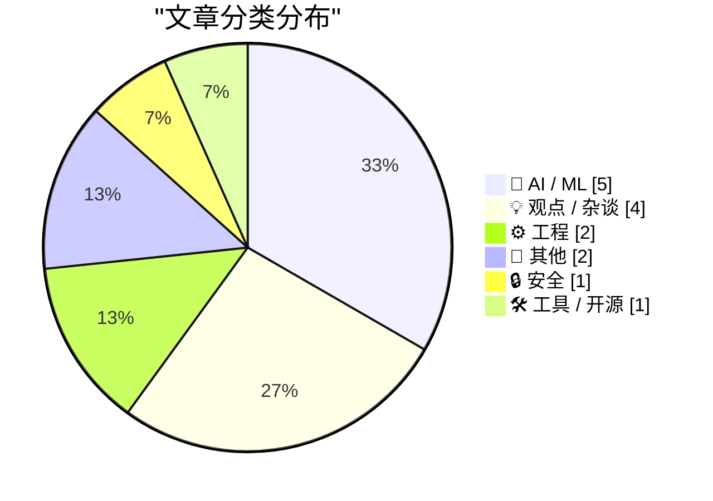
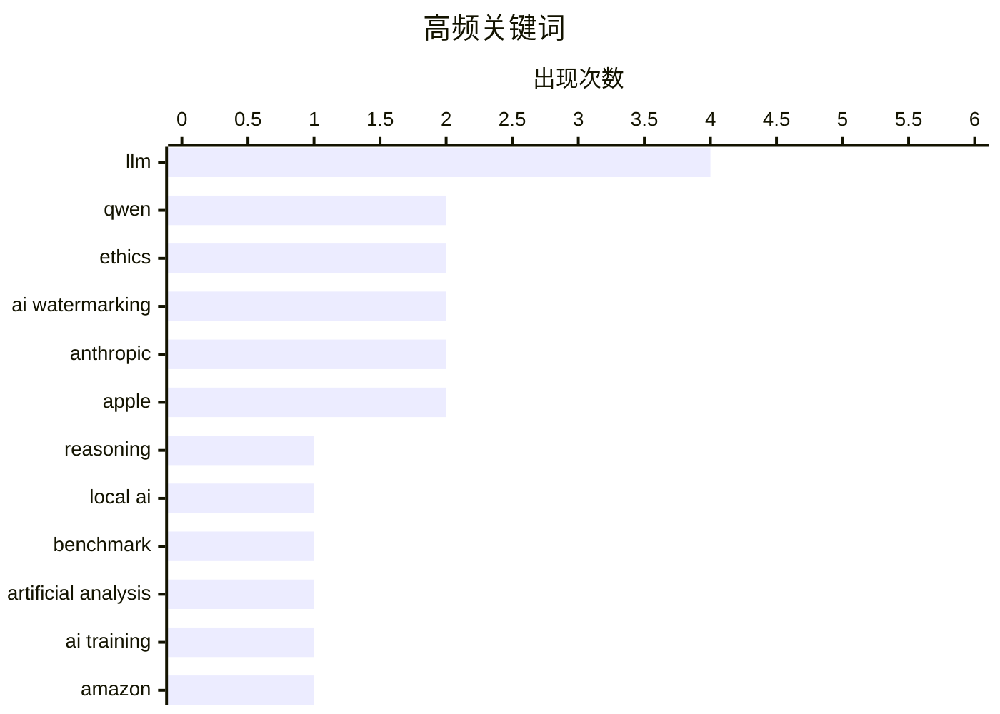

# 📰 Aug 18, 2026

> 来自 Karpathy 推荐的 92 个顶级技术博客，AI 精选 Top 15

## 📝 今日看点

今日技术圈见证了开源大模型性能的跨越式提升，阿里Qwen 3.8 27B以卓越表现挑战闭源巨头，但也暴露出模型逻辑优化的新课题。与此同时，AI治理与输出质量的博弈愈演愈烈，Anthropic的水印方案因“牺牲表达换取合规”引发广泛抨击，AI对齐等术语的有效性亦遭到质疑。此外，从稀有书籍被用于AI训练到勒索软件的低龄化演变，数据获取的边界与网络安全的新态势正重塑行业底线。

---

## 🏆 今日必读

🥇 **Qwen 3.8 27B 表现卓越，但默认设置下存在严重的“过度思考”问题**

[Qwen 3.8 27B is excellent, but it defaults to wildly overthinking things](https://simonwillison.net/2026/Aug/16/qwen-38-27b/) — simonwillison.net · 1 天前 · 🤖 AI / ML

> 阿里巴巴 Qwen 研究室发布了采用 Apache 2.0 协议开源的 Qwen 3.8 27B 视觉语言模型。该模型 27B 的参数规模非常适合在高性能笔记本电脑上本地运行，其前代 3.6 版本已表现出色。然而，新版本在默认设置下存在明显的“过度思考”倾向，即使是简单问题也会生成冗长的推理过程。用户在使用时可能需要调整 Prompt 或参数以抑制其冗余输出。这一现象反映了当前大模型在追求推理能力时，如何在简洁性与深度之间取得平衡的挑战。

💡 **为什么值得读**: 了解这款能在笔记本上流畅运行且性能强劲的最新开源大模型及其使用避坑指南。

🏷️ Qwen, LLM, reasoning, local AI

🥈 **Qwen 3.8 27B 在 Artificial Analysis 智能指数中获得 52 分**

[Qwen 3.8 27B scores 52 on the Artificial Analysis Intelligence Index](https://simonwillison.net/2026/Aug/17/qwen-38-27b-scores-52/) — simonwillison.net · 6 小时前 · 🤖 AI / ML

> Qwen 3.8 27B 在 Artificial Analysis 智能指数中取得了 52 分的高分，表现令人惊叹。这一成绩与 GPT-5.6 Luna 持平，仅比参数量高达 753B 的 GLM-5.2 和 1.6T 的 DeepSeek V4 Pro 低 1 分。作为一个仅有 27B 参数的模型，它在能效比和性能表现上实现了巨大的跨越。这标志着中等规模模型在推理能力上已开始挑战超大规模闭源模型。对于追求本地部署性能的开发者来说，这是一个极具竞争力的选择。

💡 **为什么值得读**: 通过具体量化指标展示了 27B 小尺寸模型如何通过架构优化在性能上比肩千亿级甚至万亿级参数的巨兽。

🏷️ LLM, benchmark, Qwen, Artificial Analysis

🥉 **追踪稀有书籍货运：终点竟是亚马逊 AI 训练设施**

[We Tracked a Shipment of Rare Books. It Ended at an Amazon AI Training Facility](https://simonwillison.net/2026/Aug/17/we-tracked-a-shipment-of-rare-books-it-ended-at-an-amazon-ai-tra/) — simonwillison.net · 15 小时前 · 🤖 AI / ML

> 404 Media 的深度调查揭示了 AI 巨头获取高质量训练数据的新手段：通过匿名渠道大量购买绝版或稀有书籍。调查人员追踪了一批流向不明的稀有书籍订单，最终发现其目的地是亚马逊的 AI 训练设施。这种做法证实了业界长期以来的猜测，即 AI 公司正试图通过扫描物理实体书籍来绕过数字版权限制或获取未数字化的语料。这引发了关于版权侵犯和 AI 训练道德边界的激烈讨论。目前尚不清楚这些书籍被扫描后是否会以某种形式重新进入二手市场。

💡 **为什么值得读**: 揭露了 AI 训练数据获取过程中鲜为人知的“物理扫描”内幕，是理解当前 AI 版权争议的重要案例。

🏷️ AI training, Amazon, data sourcing, ethics

---

## 📊 数据概览

| 扫描源 | 抓取文章 | 时间范围 | 精选 |
|:---:|:---:|:---:|:---:|
| 80/92 | 2463 篇 → 24 篇 | 48h | **15 篇** |

### 分类分布



### 高频关键词



<details>
<summary>📈 纯文本关键词图（终端友好）</summary>

```
llm                 │ ████████████████████ 4
qwen                │ ██████████░░░░░░░░░░ 2
ethics              │ ██████████░░░░░░░░░░ 2
ai watermarking     │ ██████████░░░░░░░░░░ 2
anthropic           │ ██████████░░░░░░░░░░ 2
apple               │ ██████████░░░░░░░░░░ 2
reasoning           │ █████░░░░░░░░░░░░░░░ 1
local ai            │ █████░░░░░░░░░░░░░░░ 1
benchmark           │ █████░░░░░░░░░░░░░░░ 1
artificial analysis │ █████░░░░░░░░░░░░░░░ 1
```

</details>

### 🏷️ 话题标签

**llm**(4) · **qwen**(2) · **ethics**(2) · ai watermarking(2) · anthropic(2) · apple(2) · reasoning(1) · local ai(1) · benchmark(1) · artificial analysis(1) · ai training(1) · amazon(1) · data sourcing(1) · claude(1) · alloca(1) · stack memory(1) · c++(1) · systems programming(1) · ai alignment(1) · rhetoric(1)

---

## 🤖 AI / ML

### 1. Qwen 3.8 27B 表现卓越，但默认设置下存在严重的“过度思考”问题

[Qwen 3.8 27B is excellent, but it defaults to wildly overthinking things](https://simonwillison.net/2026/Aug/16/qwen-38-27b/) — **simonwillison.net** · 1 天前 · ⭐ 26/30

> 阿里巴巴 Qwen 研究室发布了采用 Apache 2.0 协议开源的 Qwen 3.8 27B 视觉语言模型。该模型 27B 的参数规模非常适合在高性能笔记本电脑上本地运行，其前代 3.6 版本已表现出色。然而，新版本在默认设置下存在明显的“过度思考”倾向，即使是简单问题也会生成冗长的推理过程。用户在使用时可能需要调整 Prompt 或参数以抑制其冗余输出。这一现象反映了当前大模型在追求推理能力时，如何在简洁性与深度之间取得平衡的挑战。

🏷️ Qwen, LLM, reasoning, local AI

---

### 2. Qwen 3.8 27B 在 Artificial Analysis 智能指数中获得 52 分

[Qwen 3.8 27B scores 52 on the Artificial Analysis Intelligence Index](https://simonwillison.net/2026/Aug/17/qwen-38-27b-scores-52/) — **simonwillison.net** · 6 小时前 · ⭐ 25/30

> Qwen 3.8 27B 在 Artificial Analysis 智能指数中取得了 52 分的高分，表现令人惊叹。这一成绩与 GPT-5.6 Luna 持平，仅比参数量高达 753B 的 GLM-5.2 和 1.6T 的 DeepSeek V4 Pro 低 1 分。作为一个仅有 27B 参数的模型，它在能效比和性能表现上实现了巨大的跨越。这标志着中等规模模型在推理能力上已开始挑战超大规模闭源模型。对于追求本地部署性能的开发者来说，这是一个极具竞争力的选择。

🏷️ LLM, benchmark, Qwen, Artificial Analysis

---

### 3. 追踪稀有书籍货运：终点竟是亚马逊 AI 训练设施

[We Tracked a Shipment of Rare Books. It Ended at an Amazon AI Training Facility](https://simonwillison.net/2026/Aug/17/we-tracked-a-shipment-of-rare-books-it-ended-at-an-amazon-ai-tra/) — **simonwillison.net** · 15 小时前 · ⭐ 25/30

> 404 Media 的深度调查揭示了 AI 巨头获取高质量训练数据的新手段：通过匿名渠道大量购买绝版或稀有书籍。调查人员追踪了一批流向不明的稀有书籍订单，最终发现其目的地是亚马逊的 AI 训练设施。这种做法证实了业界长期以来的猜测，即 AI 公司正试图通过扫描物理实体书籍来绕过数字版权限制或获取未数字化的语料。这引发了关于版权侵犯和 AI 训练道德边界的激烈讨论。目前尚不清楚这些书籍被扫描后是否会以某种形式重新进入二手市场。

🏷️ AI training, Amazon, data sourcing, ethics

---

### 4. Anthropic 在 Claude 中使用的“水印”文本掺假是对写作的亵渎

[★ Anthropic’s ‘Watermark’ Text Adulteration in Claude Is a Perversion of Writing](https://daringfireball.net/2026/08/anthropics_watermark_text_adulteration_in_claude_is_a_perversion_of_writing) — **daringfireball.net** · 1 天前 · ⭐ 24/30

> Anthropic 在 Claude 生成的文本中嵌入隐藏水印以标识来源的做法遭到了强烈批评。批评者认为，为了合规或追踪而牺牲文本的简洁性、连贯性和表达质量是对写作本质的破坏。这种“文本掺假”行为将监管需求置于用户需求之上，导致生成的文字不再纯粹。作者主张 AI 工具应专注于提供最优质的输出，而非在字里行间埋入干扰性的统计特征。这种做法被视为一种对创作工具基本原则的背离。

🏷️ AI watermarking, LLM, Anthropic, Claude

---

### 5. Anthropic 软弱的水印是在迎合软弱的法律

[‘Anthropic’s Weak Watermarks Appease a Weak Law’](https://blog.j11y.io/2026-08-12_Anthropics-weak-watermarks-appease-a-weak-law/) — **daringfireball.net** · 1 天前 · ⭐ 22/30

> 针对 Anthropic 为遵守欧盟法规而在 Claude 中加入水印的行为，James Padolsey 指出这是一种为了迎合平庸法律而做出的妥协。他认为，如果计算器或拼写检查器的输出也因为“辅助性”而被要求加入人工痕迹，那将是荒谬的。法律仅因为 AI 具备生成完整句子的能力就对其区别对待，缺乏一致的原则性。这种做法不仅无法有效防止滥用，反而损害了工具的实用价值。文章呼吁立法者应更深入地理解技术本质，而非基于恐惧进行监管。

🏷️ AI regulation, EU AI Act, watermarking, Anthropic

---

## 💡 观点 / 杂谈

### 6. AI 对齐：一个终止思考的陈词滥调

[AI Alignment as a Thought-Terminating Cliche](https://borretti.me/article/ai-alignment-as-thought-terminating-cliche) — **borretti.me** · 6 小时前 · ⭐ 24/30

> 文章批判了“AI 对齐”（AI Alignment）这一术语在当前讨论中已沦为一种“终止思考的陈词滥调”。作者指出，该词常被用作修辞手段，掩盖了具体的技术挑战和利益分配问题，使复杂的伦理讨论变得模糊化。通过将所有安全问题简化为“对齐”，人们往往忽略了谁在定义目标以及对齐过程中的权力博弈。作者呼吁回归到更具体、更具批判性的技术与社会学讨论中。这种反思有助于打破目前 AI 安全领域日益同质化的语境。

🏷️ AI alignment, rhetoric, ethics

---

### 7. 关于 AI 生成文本水印方案的后续思考

[★ Follow-Up Thoughts on Watermarking Schemes for AI-Generated Text](https://daringfireball.net/2026/08/follow-up_thoughts_on_watermarking) — **daringfireball.net** · 6 小时前 · ⭐ 21/30

> 作者进一步探讨了 AI 文本水印方案对用户体验的影响，强调用户核心需求是获得准确、简洁且语气连贯的回答。水印技术通过微调词汇选择概率来嵌入信息，不可避免地会干扰 AI 的最佳表达，导致输出质量下降。在 AI 技术已经普及的现状下，试图通过牺牲内容质量来实现可追溯性是徒劳的。文章主张应接受 AI 生成内容的现状，而非试图通过破坏文本完整性来强行标记。这种技术手段在实际应用中往往弊大于利。

🏷️ AI watermarking, LLM, content detection

---

### 8. 关于 Siri AI 进入欧盟市场，自 7 月初以来仍无任何进展

[No Update Since Early July Regarding Siri AI Coming to the EU, Ever](https://www.ft.com/content/807d25c3-f4ac-4402-b815-3aa91018237d) — **daringfireball.net** · 9 小时前 · ⭐ 19/30

> 苹果首席执行官 Tim Cook 与欧盟技术主管 Henna Virkkunen 就“Siri AI”（Apple Intelligence）在欧洲落地的争议进行了会谈，但目前仍处于僵局。双方的核心矛盾在于欧盟《数字市场法案》（DMA）对互操作性和隐私的严格要求，苹果担心合规压力会损害用户体验和数据安全。尽管双方称对话具有“建设性”，但自 7 月以来并未达成任何实质性协议或发布时间表。这意味着欧盟境内的 iPhone 用户可能在很长一段时间内无法使用苹果最新的生成式 AI 功能。

🏷️ Apple Intelligence, EU regulation, Siri, DMA

---

### 9. Pluralistic：Jennifer Jenkins 的《音乐版权、创造力与文化》

[Pluralistic: Jennifer Jenkins' 'Music Copyright, Creativity, and Culture' (17 Aug 2026)](https://pluralistic.net/2026/08/17/great-sousas-ghost/) — **pluralistic.net** · 23 小时前 · ⭐ 19/30

> Cory Doctorow 重点推介了 Jennifer Jenkins 的新书，该书通过漫画形式深入浅出地解析了复杂的音乐版权法律体系。文章同步探讨了多个前沿科技议题，包括将大语言模型（LLM）比作程序员的“老虎机”，以及对 Hypercard 历史的回溯和 2061 年信息安全的预测。作者通过对版权制度的批判，揭示了当前法律框架如何限制了数字时代的创造力与文化传播。这是一份涵盖法律、编程、历史与未来预测的跨学科深度综述。

🏷️ copyright, digital rights, culture, intellectual property

---

## ⚙️ 工程

### 10. alloca 等函数是如何从栈中分配内存的？

[How do functions like alloca allocate memory from the stack?](https://devblogs.microsoft.com/oldnewthing/20260817-40/?p=112617) — **devblogs.microsoft.com/oldnewthing** · 15 小时前 · ⭐ 24/30

> 本文深入解析了 alloca 等函数在底层如何实现从栈中动态分配内存。在 Windows 系统中，这涉及到修改栈指针（ESP/RSP）以及必要的“栈探测”（Stack Probing）机制。如果分配空间超过一个页面（4KB），编译器必须生成探测代码来逐页触发保护页，防止跳过保护页导致崩溃。理解这一机制对于编写高性能底层代码和调试栈溢出问题至关重要。文章还对比了普通局部变量分配与动态栈分配在汇编层面的差异。

🏷️ alloca, stack memory, C++, systems programming

---

### 11. 《雷神之锤》共享版：一张容量超载的光盘

[Quake Shareware, a CD-ROM just a little too full](https://fabiensanglard.net/quake_shareware_cd/index.html) — **fabiensanglard.net** · 1 天前 · ⭐ 20/30

> 本文回顾了《雷神之锤》（Quake）共享软件 CD-ROM 的技术往事，揭秘了当年开发者如何在有限的容量中塞入海量内容。该光盘不仅包含游戏的第一章，还隐藏了完整版的加密数据以及大量的多媒体素材，导致光盘几乎达到了物理容量极限。作者详细分析了光盘的文件系统布局和数据压缩策略，展示了 90 年代软件分发中的奇技淫巧。这不仅是一次怀旧之旅，更是对早期存储优化技术的深度拆解。通过分析 ISO 镜像，读者可以窥见当时 id Software 的工程实力。

🏷️ Quake, game engine, reverse engineering

---

## 📝 其他

### 12. macOS 26.7 Tahoe 候选版泄露视频，展示配备摄像头的 AirPods 运行效果

[MacOS 26.7 Tahoe Release Candidate Contains a Video Demonstrating Camera-Equipped AirPods in Action](https://www.macrumors.com/2026/08/17/camera-equipped-airpods-macos-26-7/) — **daringfireball.net** · 3 小时前 · ⭐ 19/30

> macOS 26.7 Tahoe 的候选发布版（RC）固件中意外包含了一段演示视频，证实了苹果正在研发配备摄像头的 AirPods 硬件。该视频展示了耳机通过内置视觉传感器与系统交互的场景，可能用于增强空间音频的头部追踪精度或实现环境感知功能。这一泄露直接印证了此前关于苹果探索“视觉音频”可穿戴设备的传闻，暗示该产品已进入后期测试阶段。目前尚不清楚摄像头是用于增强现实（AR）协作还是辅助视障人士，但其系统级的集成说明硬件发布已提上日程。

🏷️ Apple, AirPods, macOS, hardware leak

---

### 13. 特朗普政府“不支持”苹果使用中国制造的内存芯片

[Trump Administration ‘Not in Favor’ of Apple Using Chinese RAM](https://www.wsj.com/tech/apple-china-memory-chip-plan-57773a83?st=vfe1SA) — **daringfireball.net** · 1 天前 · ⭐ 19/30

> 特朗普政府明确表示反对苹果公司在其供应链中使用中国制造的内存芯片（RAM），以降低对关键技术的外部依赖。商务部长人选 Howard Lutnick 在视察苹果休斯顿工厂后指出，尽管苹果试图通过中国供应商缓解供应链压力，但政府要求必须寻找“其他解决方案”。这一立场反映了美国政府对半导体组件来源的强硬管控，尤其是在高性能计算设备领域。苹果目前面临在优化供应链成本与符合地缘政治合规性之间进行艰难权衡的巨大压力。

🏷️ Apple, supply chain, geopolitics, semiconductor

---

## 🔒 安全

### 14. 每周更新 517：网络勒索现状

[Weekly Update 517: Cyber Ransoms](https://www.troyhunt.com/weekly-update-517/) — **troyhunt.com** · 3 小时前 · ⭐ 24/30

> 网络安全专家 Troy Hunt 在周更中分析了当前勒索软件生态的混乱现状。现在的勒索活动往往不涉及复杂的恶意软件，而纯粹是数据窃取后的敲诈勒索，且参与者呈现低龄化趋势。这些青少年黑客虽然能通过攻击赚取巨额加密货币，但由于缺乏洗钱渠道，往往面临“有钱难花”的尴尬境地。这种非专业化但高频率的攻击模式给企业安全防护带来了全新的挑战。文章还讨论了近期几起重大的数据泄露事件及其后续影响。

🏷️ ransomware, cybersecurity, extortion

---

## 🛠 工具 / 开源

### 15. XCancel：一个非官方的 Twitter/X 隐私镜像站

[XCancel — An Unofficial Twitter/X Mirror](https://xcancel.com/about) — **daringfireball.net** · 1 天前 · ⭐ 19/30

> XCancel 是基于开源项目 Nitter 构建的 Twitter/X 替代前端，主打隐私保护和极致性能。该工具完全去除了 JavaScript 和广告追踪器，页面体积平均比官方 X 客户端轻 15 倍，加载速度显著提升。用户无需登录账号即可浏览推文，有效规避了社交媒体平台的算法推荐和数据抓取行为。对于希望在低功耗设备上流畅访问内容或追求匿名浏览的用户，这是一个理想的轻量化访问方案。

🏷️ Nitter, privacy, Twitter, open source

---

*生成于 2026-08-18 06:55 | 扫描 80 源 → 获取 2463 篇 → 精选 15 篇*
*基于 [Hacker News Popularity Contest 2025](https://refactoringenglish.com/tools/hn-popularity/) RSS 源列表，由 [Andrej Karpathy](https://x.com/karpathy) 推荐*
