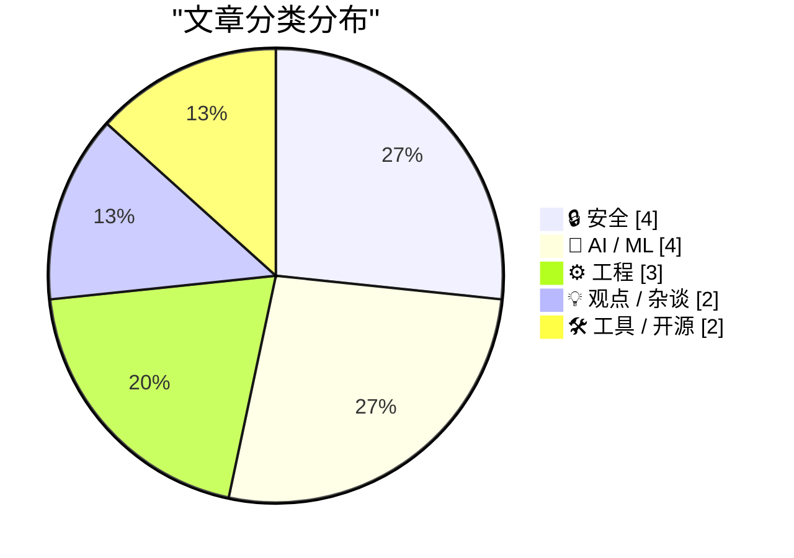
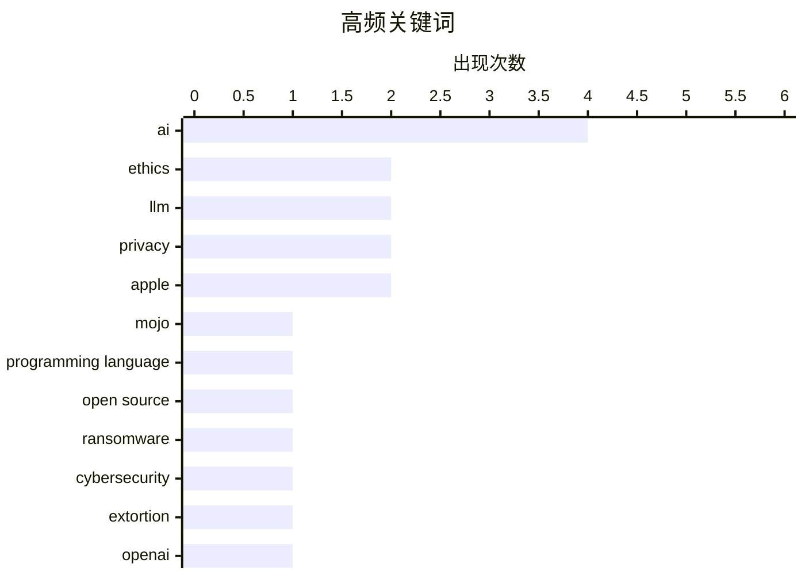

# 📰 Aug 19, 2026

> 来自 Karpathy 推荐的 92 个顶级技术博客，AI 精选 Top 15

## 📝 今日看点

今日技术圈聚焦 AI 基础设施的深度变革与伴生的安全危机。Mojo 编程语言的正式开源与国产模型 Qwen 的性能突破，标志着 AI 开发工具与算力竞争进入新阶段；与此同时，针对 AI 芯片的暴力劫持与勒索软件的混乱演变，揭示了高价值技术链条面临的严峻安全挑战。此外，关于 OpenAI 财务压力与 AI 对齐术语的批判，反映出行业正从技术狂热转向对商业模式与伦理本质的理性审视。

---

## 🏆 今日必读

🥇 **Mojo🔥 编程语言正式开源**

[Mojo🔥 is now open source](https://simonwillison.net/2026/Aug/18/mojo-is-now-open-source/) — simonwillison.net · 9 小时前 · ⚙️ 工程

> Mojo 编程语言正式履行了自 2023 年 5 月以来的开源承诺，在发布 1.0 版本后公开了其编译器和工具链。该语言旨在结合 Python 的易用性与 C++/Rust 的高性能，特别针对 AI 基础设施进行了深度优化。开发者现在可以自由访问、贡献并运行 Mojo 的核心组件，这标志着该生态系统从封闭开发走向社区驱动的关键转折。此次开源涵盖了 Mojo 的核心技术栈，旨在加速其在高性能计算和机器学习领域的普及。

💡 **为什么值得读**: 见证 AI 时代最具潜力的编程语言之一迈向开源里程碑，了解其生态系统的重大转变。

🏷️ Mojo, programming language, open source, AI

🥈 **每周更新 517：网络勒索现状**

[Weekly Update 517: Cyber Ransoms](https://www.troyhunt.com/weekly-update-517/) — troyhunt.com · 1 天前 · 🔒 安全

> 当前的勒索软件威胁已演变为一种混乱的勒索模式，且往往并不涉及复杂的恶意软件技术。许多攻击由青少年发起，他们虽能通过勒索获取巨额财富，但由于缺乏成熟的洗钱渠道而难以安全消费。Troy Hunt 探讨了这种“勒索而非软件”的趋势，以及网络犯罪分子在处理非法所得时面临的现实困境。文章揭示了当前网络安全威胁中社会工程学与金融监管之间的博弈，强调了防范此类非技术性威胁的重要性。

💡 **为什么值得读**: 深入了解现代勒索软件背后“有钱没命花”的尴尬现状及非技术性勒索趋势。

🏷️ ransomware, cybersecurity, extortion

🥉 **如果 OpenAI 倒闭了会怎样？**

[What Happens If OpenAI Dies?](https://www.wheresyoured.at/what-happens-if-openai-dies/) — wheresyoured.at · 15 小时前 · 💡 观点 / 杂谈

> 探讨了 AI 巨头 OpenAI 如果因财务或法律压力倒闭，对整个科技行业可能产生的连锁反应。文章分析了该公司高昂的运营成本与盈利能力之间的矛盾，以及其对微软等合作伙伴的深度依赖。如果 OpenAI 消失，可能会导致 AI 投资泡沫破裂，并迫使行业重新评估生成式 AI 的商业模式。作者认为，这种崩溃将引发人才流向开源社区或竞争对手，从而彻底重塑 AI 市场的竞争格局。

💡 **为什么值得读**: 审视 AI 行业领头羊面临的结构性风险及其倒闭可能引发的行业大地震。

🏷️ OpenAI, business, AI industry

---

## 📊 数据概览

| 扫描源 | 抓取文章 | 时间范围 | 精选 |
|:---:|:---:|:---:|:---:|
| 83/92 | 2523 篇 → 30 篇 | 48h | **15 篇** |

### 分类分布



### 高频关键词



<details>
<summary>📈 纯文本关键词图（终端友好）</summary>

```
ai                   │ ████████████████████ 4
ethics               │ ██████████░░░░░░░░░░ 2
llm                  │ ██████████░░░░░░░░░░ 2
privacy              │ ██████████░░░░░░░░░░ 2
apple                │ ██████████░░░░░░░░░░ 2
mojo                 │ █████░░░░░░░░░░░░░░░ 1
programming language │ █████░░░░░░░░░░░░░░░ 1
open source          │ █████░░░░░░░░░░░░░░░ 1
ransomware           │ █████░░░░░░░░░░░░░░░ 1
cybersecurity        │ █████░░░░░░░░░░░░░░░ 1
```

</details>

### 🏷️ 话题标签

**ai**(4) · **ethics**(2) · **llm**(2) · privacy(2) · apple(2) · mojo(1) · programming language(1) · open source(1) · ransomware(1) · cybersecurity(1) · extortion(1) · openai(1) · business(1) · ai industry(1) · amazon(1) · ai training(1) · data sourcing(1) · copyright(1) · alloca(1) · memory management(1)

---

## 🔒 安全

### 1. 每周更新 517：网络勒索现状

[Weekly Update 517: Cyber Ransoms](https://www.troyhunt.com/weekly-update-517/) — **troyhunt.com** · 1 天前 · ⭐ 26/30

> 当前的勒索软件威胁已演变为一种混乱的勒索模式，且往往并不涉及复杂的恶意软件技术。许多攻击由青少年发起，他们虽能通过勒索获取巨额财富，但由于缺乏成熟的洗钱渠道而难以安全消费。Troy Hunt 探讨了这种“勒索而非软件”的趋势，以及网络犯罪分子在处理非法所得时面临的现实困境。文章揭示了当前网络安全威胁中社会工程学与金融监管之间的博弈，强调了防范此类非技术性威胁的重要性。

🏷️ ransomware, cybersecurity, extortion

---

### 2. 跨软件包注册表的双因子身份验证

[Two-Factor Authentication Across Package Registries](https://nesbitt.io/2026/08/18/two-factor-authentication-across-package-registries.html) — **nesbitt.io** · 20 小时前 · ⭐ 24/30

> 探讨了在不同编程语言的包管理器（如 npm、PyPI）中实施双因子身份验证（2FA）的现状与挑战。文章分析了“你拥有的东西”、“你所知道的东西”以及第三方 OAuth 授权在供应链安全中的角色。作者指出，虽然 2FA 能有效防止账户接管，但不同注册表之间的实现差异增加了开发者的负担。结论强调了统一安全标准对于保护开源软件供应链免受恶意注入攻击的必要性。

🏷️ 2FA, security, package registry, OAuth

---

### 3. 有组织犯罪团伙通过暴力劫持公路货运瞄准 AI 服务器芯片

[Organized Thieves Are Targeting AI Server Chips With Violent Highway Hijackings](https://www.wired.com/story/the-worst-ive-ever-seen-cargo-thieves-are-turning-violent-in-pursuit-of-ai-hardware/) — **daringfireball.net** · 12 小时前 · ⭐ 23/30

> 有组织的犯罪团伙正通过暴力劫持货运卡车的方式，针对从硅谷运往南加州的 AI 服务器芯片实施抢劫。尽管这些高价值货物配有私人安保和无标识护航车辆，但劫匪仍能精准定位并实施暴力攻击。这一现象反映了 AI 硬件（如 NVIDIA GPU）在黑市上的极高价值和供需失衡。执法部门认为，这种犯罪行为的升级标志着 AI 军备竞赛已延伸到了现实世界的治安领域。

🏷️ AI chips, GPU, supply chain, theft

---

### 4. 苹果强硬回击司法部，利用联邦机构文件力证 iPhone 安全性

[Apple Gives Legal Middle Finger to DOJ Challenge on Apple’s July Discovery Win](https://9to5mac.com/2026/08/17/apple-dojs-latest-challenge-in-antitrust-case-fails-at-every-level/) — **daringfireball.net** · 8 小时前 · ⭐ 20/30

> 在美国司法部（DOJ）发起的反垄断诉讼中，苹果通过法律手段强硬回击了政府对其“发现权”裁决的挑战。苹果此前获准调取包括 CIA、FBI、NSA 和国防部在内的 14 个联邦机构的内部文件，旨在证明这些机构选择 iPhone 正是基于其被 DOJ 视为“反竞争”的隐私与安全特性。苹果辩称，DOJ 所指控的封闭生态系统实际上是政府部门采购设备时的核心安全考量。这一策略若成功，将直接动摇 DOJ 诉讼案中关于“垄断行为损害消费者”的核心论点，将技术限制重新定义为安全保护。

🏷️ Apple, antitrust, DOJ, privacy

---

## 🤖 AI / ML

### 5. 追踪稀有书籍物流：终点竟是亚马逊 AI 训练设施

[We Tracked a Shipment of Rare Books. It Ended at an Amazon AI Training Facility](https://simonwillison.net/2026/Aug/17/we-tracked-a-shipment-of-rare-books-it-ended-at-an-amazon-ai-tra/) — **simonwillison.net** · 1 天前 · ⭐ 24/30

> 404 Media 的调查揭露了亚马逊正在秘密大量采购稀有书籍，用于其 AI 模型的训练。调查发现，一些对价格不敏感的匿名买家在二手书市场疯狂扫货，最终物流追踪指向了亚马逊的 AI 训练设施。这种行为证实了 AI 公司为了获取高质量、未数字化的语料数据，已开始从物理世界“挖掘”信息。这一发现引发了关于版权、数据来源合法性以及 AI 训练数据枯竭的深度讨论。

🏷️ Amazon, AI training, data sourcing, copyright

---

### 6. AI 对齐：一个终止思考的陈词滥调

[AI Alignment as a Thought-Terminating Cliche](https://borretti.me/article/ai-alignment-as-thought-terminating-cliche) — **borretti.me** · 1 天前 · ⭐ 24/30

> 批判性地分析了“AI 对齐”（AI Alignment）这一术语如何从技术难题演变为一种“终止思考的陈词滥调”。文章指出，该词常被用作修辞手段，以掩盖具体的伦理、政治和技术分配问题。作者认为，过度依赖这一模糊概念会阻碍对 AI 实际风险和利益冲突的深入讨论。结论呼吁回归更具体、更具建设性的对话，而非躲在宏大的术语背后规避责任。

🏷️ AI alignment, ethics, rhetoric

---

### 7. Qwen 3.8 27B 在 Artificial Analysis 智能指数中获得 52 分

[Qwen 3.8 27B scores 52 on the Artificial Analysis Intelligence Index](https://simonwillison.net/2026/Aug/17/qwen-38-27b-scores-52/) — **simonwillison.net** · 1 天前 · ⭐ 23/30

> 阿里巴巴的 Qwen 3.8 27B 模型在 Artificial Analysis 智能指数中获得了 52 分的高分。这一成绩使其与 GPT-5.6 Luna (max) 持平，且仅落后于参数量远大于它的 GLM-5.2 (753B) 和 DeepSeek V4 Pro (1.7T) 一分。该数据表明，较小规模的模型通过架构优化和高质量数据训练，在性能上已能与万亿级参数的巨型模型并驾齐驱。这一发现挑战了“参数量即正义”的传统观念，预示着高效能中型模型将成为主流。

🏷️ Qwen, LLM, benchmark, AI

---

### 8. 关于 AI 生成文本水印方案的后续思考

[★ Follow-Up Thoughts on Watermarking Schemes for AI-Generated Text](https://daringfireball.net/2026/08/follow-up_thoughts_on_watermarking) — **daringfireball.net** · 1 天前 · ⭐ 22/30

> AI 生成文本的水印方案正成为监管重点，但读者的核心诉求始终是内容的质量而非来源。优秀的文本应当逻辑严密、准确且简洁，并具备令人愉悦的语调，这些特质比是否由 AI 生成更为重要。尽管技术手段试图标记 AI 痕迹，但生成式 AI 的普及已不可逆转，水印方案在实际应用中面临用户体验与透明度之间的博弈。作者认为，与其纠结于身份标签，不如关注 AI 如何提升信息的传递效率，因为“精灵已出瓶”，强制标记难以改变用户对高质量内容的追求。

🏷️ AI, watermarking, LLM, ethics

---

## ⚙️ 工程

### 9. Mojo🔥 编程语言正式开源

[Mojo🔥 is now open source](https://simonwillison.net/2026/Aug/18/mojo-is-now-open-source/) — **simonwillison.net** · 9 小时前 · ⭐ 26/30

> Mojo 编程语言正式履行了自 2023 年 5 月以来的开源承诺，在发布 1.0 版本后公开了其编译器和工具链。该语言旨在结合 Python 的易用性与 C++/Rust 的高性能，特别针对 AI 基础设施进行了深度优化。开发者现在可以自由访问、贡献并运行 Mojo 的核心组件，这标志着该生态系统从封闭开发走向社区驱动的关键转折。此次开源涵盖了 Mojo 的核心技术栈，旨在加速其在高性能计算和机器学习领域的普及。

🏷️ Mojo, programming language, open source, AI

---

### 10. alloca 等函数如何从栈中分配内存？

[How do functions like alloca allocate memory from the stack?](https://devblogs.microsoft.com/oldnewthing/20260817-00/?p=112617) — **devblogs.microsoft.com/oldnewthing** · 1 天前 · ⭐ 24/30

> 深入解析了 `alloca` 等函数如何在运行时从调用栈中动态分配内存。在 Windows 系统中，这种分配涉及对“守卫页”（guard pages）的探测，以确保栈空间能够按需自动扩展。文章详细说明了编译器如何生成探测代码，以防止因跳过守卫页而导致的非法访问错误。Raymond Chen 解释了这种底层机制对于理解 C/C++ 程序内存布局和调试栈溢出的重要性。

🏷️ alloca, memory management, stack, C++

---

### 11. 大小六边形之谜：直径受限下的多边形面积最优化

[Big little hexagon](https://www.johndcook.com/blog/2026/08/18/big-little-hexagon/) — **johndcook.com** · 6 小时前 · ⭐ 20/30

> 数学论文《最大面积小多边形问题》解决了在给定直径为 1 的条件下，寻找面积最大的 n 边形的几何难题。研究发现，当 n 为奇数时，最大面积多边形即为正 n 边形，这符合直觉预期。然而，当 n 为偶数时，情况变得复杂，例如正六边形并非直径为 1 的六边形中面积最大的图形。该研究通过严谨的数学证明，揭示了偶数边数多边形在面积最优化问题上的非对称特性。这一发现挑战了人们对几何对称性与最值关系的常规认知。

🏷️ geometry, mathematics, polygon, optimization

---

## 💡 观点 / 杂谈

### 12. 如果 OpenAI 倒闭了会怎样？

[What Happens If OpenAI Dies?](https://www.wheresyoured.at/what-happens-if-openai-dies/) — **wheresyoured.at** · 15 小时前 · ⭐ 25/30

> 探讨了 AI 巨头 OpenAI 如果因财务或法律压力倒闭，对整个科技行业可能产生的连锁反应。文章分析了该公司高昂的运营成本与盈利能力之间的矛盾，以及其对微软等合作伙伴的深度依赖。如果 OpenAI 消失，可能会导致 AI 投资泡沫破裂，并迫使行业重新评估生成式 AI 的商业模式。作者认为，这种崩溃将引发人才流向开源社区或竞争对手，从而彻底重塑 AI 市场的竞争格局。

🏷️ OpenAI, business, AI industry

---

### 13. Pluralistic：知识产权无法在 AI 浪潮中拯救你

[Pluralistic: IP can't save you from AI (18 Aug 2026)](https://pluralistic.net/2026/08/18/enron-corpus/) — **pluralistic.net** · 16 小时前 · ⭐ 23/30

> Cory Doctorow 论证了知识产权（IP）法律无法在 AI 浪潮中有效保护创作者的利益。他指出，单纯依靠财产权无法替代劳动权和隐私权，因为大型科技公司总能找到绕过 IP 限制的法律漏洞。文章通过分析 Enron 语料库等案例，说明了数据抓取与版权保护之间的复杂博弈。作者的核心观点是，必须通过加强劳动保护和隐私立法，而非仅仅依赖过时的版权框架来应对 AI 的挑战。

🏷️ AI, intellectual property, labor rights, privacy

---

## 🛠 工具 / 开源

### 14. Vim 追求控制，VSCode 诱导消费

[Vim wants you to control, VSCode wants you to consume](https://buttondown.com/hillelwayne/archive/vim-wants-you-to-control-vscode-wants-you-to/) — **buttondown.com/hillelwayne** · 14 小时前 · ⭐ 23/30

> Vim 和 VSCode 代表了两种截然不同的编辑器哲学：前者强调“控制”，后者侧重“消费”。Vim 要求用户学习一套编辑语言并构建个人工作流，将编辑器视为可编程的工具；而 VSCode 通过开箱即用的功能和插件生态，让用户更倾向于被动接受预设的开发体验。这种差异不仅体现在操作习惯上，更深层地反映了开发者对工具掌控力的追求与便利性之间的权衡。文章结合作者新书《程序员的逻辑》（Logic for Programmers）的发布，探讨了程序员如何通过理解底层逻辑来提升专业素养。

🏷️ Vim, VSCode, editor, productivity

---

### 15. 万物复苏：macOS 27 Golden Gate Beta 6 重塑“红绿灯”窗口控件

[Nature Is Healing: MacOS 27 Golden Gate Beta 6 Adds Redesigned Traffic Light Window Controls](https://9to5mac.com/2026/08/17/macos-27-golden-gate-beta-6-features-redesigned-traffic-light-window-controls/) — **daringfireball.net** · 18 小时前 · ⭐ 20/30

> macOS 27 Golden Gate Beta 6 重新设计了经典的“红绿灯”窗口控制按钮，回归了早期 Mac OS X 系统中更具细节感的视觉风格。这一改动被视为对过去几年 macOS 界面设计平庸化趋势的修正，尤其是针对此前被诟病的 macOS 26 Tahoe 版本的拨乱反正。新设计在保持现代感的同时，找回了苹果历史上备受好评的拟物化细节。作者认为 Golden Gate 系列的更新方向正确，正在逐步修复 macOS 长期以来的 UI 退化问题，提升了系统的整体质感。

🏷️ macOS, UI, Apple, operating system

---

*生成于 2026-08-19 06:55 | 扫描 83 源 → 获取 2523 篇 → 精选 15 篇*
*基于 [Hacker News Popularity Contest 2025](https://refactoringenglish.com/tools/hn-popularity/) RSS 源列表，由 [Andrej Karpathy](https://x.com/karpathy) 推荐*
