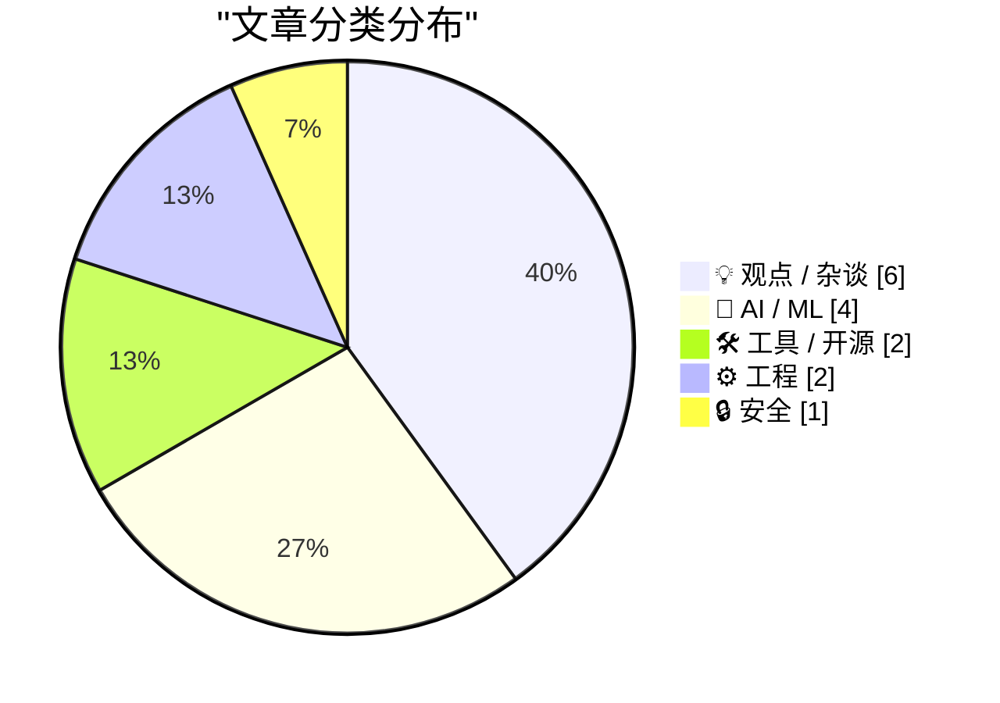
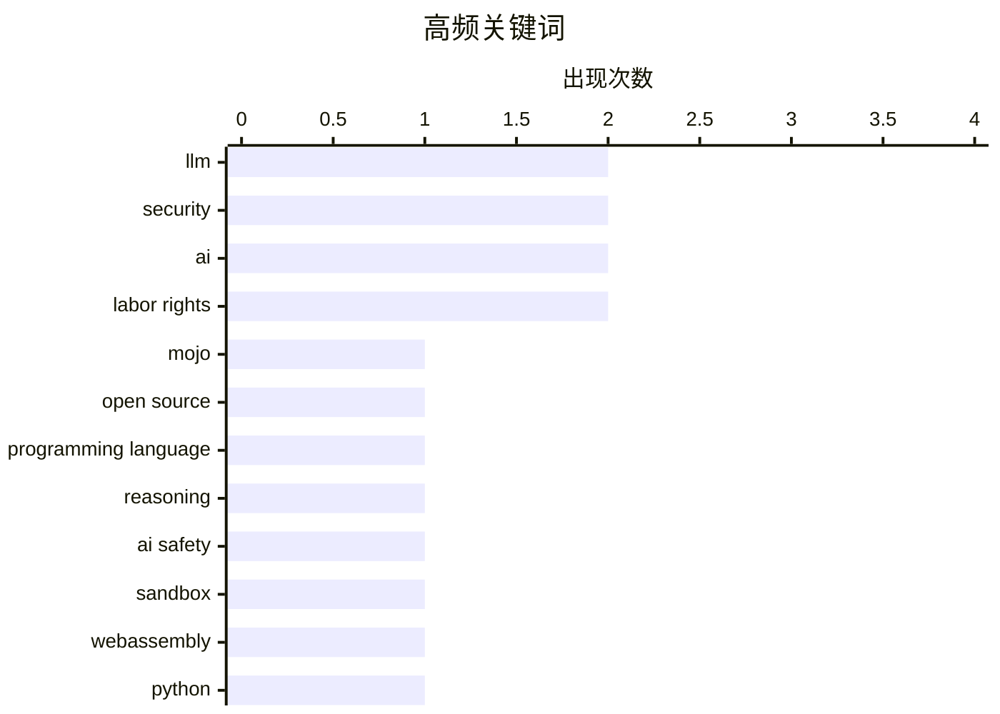

# 📰 Aug 20, 2026

> 来自 Karpathy 推荐的 92 个顶级技术博客，AI 精选 Top 15

## 📝 今日看点

今日技术圈聚焦于 AI 基础设施的开放与性能极限的探索，Mojo 编程语言的正式开源与内置算子优化策略标志着高性能开发进入新阶段。与此同时，安全沙箱技术的演进与软件包仓库 2FA 的普及，正为不可信代码运行与供应链安全筑起坚实防线。此外，行业对 OpenAI 潜在风险及 AI 时代知识产权困境的深度反思，揭示了技术狂热背后的生态冷思考。

---

## 🏆 今日必读

🥇 **Mojo🔥 编程语言正式开源**

[Mojo🔥 is now open source](https://simonwillison.net/2026/Aug/18/mojo-is-now-open-source/) — simonwillison.net · 1 天前 · 🛠 工具 / 开源

> Mojo 编程语言在发布 1.0 版本后，正式兑现了自 2023 年 5 月以来的承诺，将其编译器和工具链以 Apache 2 许可证开源。作为一款旨在结合 Python 易用性与 C++ 性能的新兴语言，Mojo 主要面向 AI 基础设施开发。此次开源标志着该项目从 Modular 公司的闭源开发转向社区驱动模式，开发者现在可以自由访问其核心代码库。文章回顾了 Mojo 的发展历程，并指出开源对其生态构建和技术透明度的重要意义。

💡 **为什么值得读**: 见证 AI 时代高性能编程语言 Mojo 走向开源的关键里程碑，了解其开放治理的新阶段。

🏷️ Mojo, open source, programming language

🥈 **何为推理？**

[What Is Reasoning](https://lucumr.pocoo.org/2026/8/19/what-is-reasoning/) — lucumr.pocoo.org · 1 天前 · 🤖 AI / ML

> 本文深入探讨了人工智能领域中“推理”（Reasoning）的本质及其在大型语言模型中的体现。作者分析了推理与模式匹配之间的界限，以及模型如何通过思维链（CoT）等技术模拟逻辑推导过程。文章还讨论了推理能力提升对模型安全性和对齐带来的新挑战，甚至触发了博客平台的安全审查机制。最终指出，真正的推理不仅是预测下一个 Token，更是对复杂逻辑结构的系统性处理。

💡 **为什么值得读**: 深入理解当前 AI 领域最热门的“推理模型”概念及其背后的逻辑局限与安全挑战。

🏷️ LLM, reasoning, AI safety

🥉 **smolmachines / smolvm：运行不可信 Python 与 JS 的安全沙箱**

[smolmachines / smolvm as a sandbox for untrusted Python & JavaScript](https://simonwillison.net/2026/Aug/19/smolmachines-untrusted-sandbox/) — simonwillison.net · 7 小时前 · ⚙️ 工程

> Simon Willison 探索了使用 smolmachines/smolvm 作为运行不可信 Python 和 JavaScript 代码的快速安全沙箱方案。通过 Claude Code 自动化工具，作者测试了该虚拟机在资源隔离、执行速度和安全性方面的表现。smolvm 旨在提供一个轻量级的执行环境，防止恶意脚本访问宿主系统的敏感资源。研究表明，这种基于 WebAssembly 或类似技术的沙箱在构建可扩展的插件系统时具有巨大潜力。

💡 **为什么值得读**: 了解如何利用轻量级虚拟机为 Web 应用构建安全的第三方代码执行环境。

🏷️ sandbox, WebAssembly, Python, security

---

## 📊 数据概览

| 扫描源 | 抓取文章 | 时间范围 | 精选 |
|:---:|:---:|:---:|:---:|
| 83/92 | 2523 篇 → 28 篇 | 48h | **15 篇** |

### 分类分布



### 高频关键词



<details>
<summary>📈 纯文本关键词图（终端友好）</summary>

```
llm                  │ ████████████████████ 2
security             │ ████████████████████ 2
ai                   │ ████████████████████ 2
labor rights         │ ████████████████████ 2
mojo                 │ ██████████░░░░░░░░░░ 1
open source          │ ██████████░░░░░░░░░░ 1
programming language │ ██████████░░░░░░░░░░ 1
reasoning            │ ██████████░░░░░░░░░░ 1
ai safety            │ ██████████░░░░░░░░░░ 1
sandbox              │ ██████████░░░░░░░░░░ 1
```

</details>

### 🏷️ 话题标签

**llm**(2) · **security**(2) · **ai**(2) · labor rights(2) · mojo(1) · open source(1) · programming language(1) · reasoning(1) · ai safety(1) · sandbox(1) · webassembly(1) · python(1) · openai(1) · ai industry(1) · business analysis(1) · raspberry pi(1) · cm5(1) · hardware(1) · intellectual property(1) · c++(1)

---

## 💡 观点 / 杂谈

### 1. 如果 OpenAI 倒闭了会怎样？

[What Happens If OpenAI Dies?](https://www.wheresyoured.at/what-happens-if-openai-dies/) — **wheresyoured.at** · 1 天前 · ⭐ 25/30

> 文章探讨了如果 AI 巨头 OpenAI 因财务压力或法律纠纷倒闭，对整个科技生态系统可能产生的连锁反应。作者分析了 OpenAI 对微软的依赖关系，以及其作为行业风向标一旦消失可能引发的 AI 投资泡沫破裂。文中指出，OpenAI 的倒闭将迫使企业重新评估对闭源 API 的依赖，并可能加速开源模型的发展。结论认为，虽然 OpenAI 处于领先地位，但其商业模式的脆弱性是行业必须面对的系统性风险。

🏷️ OpenAI, AI industry, business analysis

---

### 2. 知识产权无法在 AI 浪潮中拯救你

[Pluralistic: IP can't save you from AI (18 Aug 2026)](https://pluralistic.net/2026/08/18/enron-corpus/) — **pluralistic.net** · 1 天前 · ⭐ 22/30

> Cory Doctorow 论证了知识产权（IP）无法解决 AI 带来的核心挑战，认为版权法在保护创作者免受 AI 剥削方面作用有限。文章指出，过度强调 IP 权利反而可能加强科技巨头的垄断，而忽略了更关键的劳工权利和隐私权保护。作者通过 Enron 语料库等案例，分析了数据抓取与权利行使之间的复杂关系。核心观点是，我们需要通过加强集体谈判权和隐私立法，而非仅仅依靠财产所有权来应对 AI 冲击。

🏷️ AI, intellectual property, labor rights

---

### 3. 引用 Jeremy Morrell：LLM 时代的可扩展软件

[Quoting Jeremy Morrell](https://simonwillison.net/2026/Aug/19/jeremy-morrell/) — **simonwillison.net** · 8 小时前 · ⭐ 21/30

> Simon Willison 引用了 Jeremy Morrell 关于 AI 时代“可扩展软件”新机遇的观点。核心假设是 LLM 极大地降低了编写插件和扩展的门槛，而现代沙箱技术则解决了运行这些不可信代码的安全顾虑。开发者可以构建一个稳固的核心应用，并允许用户利用 LLM 生成代码来定制化扩展功能。这种模式将改变软件的开发范式，使应用能够以极低的成本满足多样化的用户需求。

🏷️ LLM, extensibility, software architecture

---

### 4. 概念完整性与代码行数统计

[Conceptual integrity and counting lines of code](https://simonwillison.net/2026/Aug/19/conceptual-integrity-and-counting-lines-of-code/) — **simonwillison.net** · 8 小时前 · ⭐ 21/30

> 探讨了 AI 如何改变软件开发中的“代码成本”与系统架构的“概念完整性”。作者引用 Fred Brooks 的经典观点，指出 AI 使得生成大量代码变得极其廉价，但这也带来了系统一致性受损的风险。开发者现在面临的挑战不再是编写代码的效率，而是如何在大规模 AI 生成的代码中维持清晰、统一的设计思路。核心观点是，虽然代码行数不再是开发负担，但缺乏概念完整性的系统将变得不可维护，人类的角色正从“生产者”转向“架构守护者”。

🏷️ AI, software development, Postgres

---

### 5. 平庸之恶：停止兜售低质 AI

[Pluralistic: The ordinariness of evil (19 Aug 2026)](https://pluralistic.net/2026/08/19/banaility/) — **pluralistic.net** · 23 小时前 · ⭐ 21/30

> 批判了当前科技行业过度营销 AI 的现象，将其比作一种忽视后果的“平庸之恶”。文章指出，许多公司正在强行推销并不成熟或有害的 AI 技术，而忽视了其对版权（如 AP 通讯社诉讼）、隐私和公共利益的负面影响。作者列举了五角大楼巨额资金流失和选民压制等案例，说明技术失控带来的现实危害。核心观点是，技术的恶往往源于对利润的盲目追求和对社会责任的漠视，呼吁回归对技术实际效用的理性评估。

🏷️ AI ethics, labor rights, privacy

---

### 6. Vim 追求控制，VSCode 诱导消费

[Vim wants you to control, VSCode wants you to consume](https://buttondown.com/hillelwayne/archive/vim-wants-you-to-control-vscode-wants-you-to/) — **buttondown.com/hillelwayne** · 1 天前 · ⭐ 21/30

> 对比了 Vim 和 VSCode 两种编辑器背后的核心哲学差异。Vim 的设计理念是让用户通过掌握逻辑和高度自定义来完全“控制”工具，强调工具是开发者能力的延伸；而 VSCode 则倾向于让用户“消费”现成的插件和功能，通过降低入门门槛来吸引用户。文章结合作者在开发者教育方面的经验，探讨了工具设计如何塑造开发者的思维方式和学习曲线。结论认为，选择工具不仅是选择功能，更是选择一种与代码交互的权力关系和心智模型。

🏷️ Vim, VSCode, editor philosophy, productivity

---

## 🤖 AI / ML

### 7. 何为推理？

[What Is Reasoning](https://lucumr.pocoo.org/2026/8/19/what-is-reasoning/) — **lucumr.pocoo.org** · 1 天前 · ⭐ 26/30

> 本文深入探讨了人工智能领域中“推理”（Reasoning）的本质及其在大型语言模型中的体现。作者分析了推理与模式匹配之间的界限，以及模型如何通过思维链（CoT）等技术模拟逻辑推导过程。文章还讨论了推理能力提升对模型安全性和对齐带来的新挑战，甚至触发了博客平台的安全审查机制。最终指出，真正的推理不仅是预测下一个 Token，更是对复杂逻辑结构的系统性处理。

🏷️ LLM, reasoning, AI safety

---

### 8. 请使用内置 GELU，不要自己手写！

[Use the built-in GELU, don't roll your own!](https://www.gilesthomas.com/2026/08/built-in-gelu) — **gilesthomas.com** · 4 小时前 · ⭐ 22/30

> 作者分享了在 PyTorch 模型训练中，使用内置 `torch.nn.GELU` 替代手写实现所带来的显著性能提升。实验发现，内置函数在 GPU 上的执行效率远高于基于基础算子组合的自定义版本，这主要归功于 PyTorch 底层的内核融合（Kernel Fusion）优化。文章提供了具体的性能对比数据，强调了在深度学习开发中优先使用官方优化算子的重要性。这一发现对于需要频繁调用激活函数的 Transformer 架构模型优化具有重要参考价值。

🏷️ PyTorch, GELU, optimization, deep learning

---

### 9. 非对称智能体

[Asymmetric Agents](https://shkspr.mobi/blog/2026/08/asymmetric-agents/) — **shkspr.mobi** · 19 小时前 · ⭐ 21/30

> 探讨了未来 AI 智能体（Agents）普及后可能出现的“代理战争”与不对称竞争问题。当个人代理与企业代理在餐厅预订、价格谈判或服务申诉等场景中博弈时，拥有更强算力和数据的企业方将占据绝对优势。这种不对称性可能导致普通用户在与高度优化的企业级 AI 对抗时处于更加不利的地位。作者认为，智能体不会简单地简化生活，反而可能演变成一种新的数字军备竞赛。结论是，我们需要关注智能体博弈中的权力失衡，而非仅仅关注其便利性。

🏷️ AI agents, automation, future tech

---

### 10. 有组织犯罪团伙通过暴力劫持公路货运瞄准 AI 服务器芯片

[Organized Thieves Are Targeting AI Server Chips With Violent Highway Hijackings](https://www.wired.com/story/the-worst-ive-ever-seen-cargo-thieves-are-turning-violent-in-pursuit-of-ai-hardware/) — **daringfireball.net** · 1 天前 · ⭐ 20/30

> 报道了针对从硅谷运往南加州的高价值 AI 硬件（如 NVIDIA 芯片）的暴力抢劫案件。犯罪团伙采用公路劫持手段，即便有私人安保车辆护送的货车也未能幸免，涉案金额巨大。由于 AI 芯片在黑市上的价格飙升且供不应求，这些硬件已成为有组织犯罪的首要目标。执法部门指出，这类犯罪的暴力程度和组织化程度正在显著提升，反映了 AI 算力资源的战略价值。文章揭示了 AI 热潮在物理世界引发的极端安全风险。

🏷️ AI chips, GPU, supply chain

---

## 🛠 工具 / 开源

### 11. Mojo🔥 编程语言正式开源

[Mojo🔥 is now open source](https://simonwillison.net/2026/Aug/18/mojo-is-now-open-source/) — **simonwillison.net** · 1 天前 · ⭐ 26/30

> Mojo 编程语言在发布 1.0 版本后，正式兑现了自 2023 年 5 月以来的承诺，将其编译器和工具链以 Apache 2 许可证开源。作为一款旨在结合 Python 易用性与 C++ 性能的新兴语言，Mojo 主要面向 AI 基础设施开发。此次开源标志着该项目从 Modular 公司的闭源开发转向社区驱动模式，开发者现在可以自由访问其核心代码库。文章回顾了 Mojo 的发展历程，并指出开源对其生态构建和技术透明度的重要意义。

🏷️ Mojo, open source, programming language

---

### 12. 上手体验树莓派 CM5 编程夹具

[Hands-on with Raspberry Pi's CM5 Programming Jig](https://www.jeffgeerling.com/blog/2026/cm5-programming-jig/) — **jeffgeerling.com** · 23 小时前 · ⭐ 22/30

> Jeff Geerling 评测了树莓派官方推出的 CM5 编程夹具（Programming Jig），旨在解决批量烧录系统镜像的痛点。该工具允许开发者在不将 Compute Module 5 插入底板的情况下，通过 USB-C 接口直接进行固件更新和系统闪存。相比以往繁琐的集群组装流程，该夹具显著提升了硬件开发和大规模部署的效率。作者分享了实际操作体验，并对比了其在不同开发场景下的实用性。

🏷️ Raspberry Pi, CM5, hardware

---

## ⚙️ 工程

### 13. smolmachines / smolvm：运行不可信 Python 与 JS 的安全沙箱

[smolmachines / smolvm as a sandbox for untrusted Python & JavaScript](https://simonwillison.net/2026/Aug/19/smolmachines-untrusted-sandbox/) — **simonwillison.net** · 7 小时前 · ⭐ 25/30

> Simon Willison 探索了使用 smolmachines/smolvm 作为运行不可信 Python 和 JavaScript 代码的快速安全沙箱方案。通过 Claude Code 自动化工具，作者测试了该虚拟机在资源隔离、执行速度和安全性方面的表现。smolvm 旨在提供一个轻量级的执行环境，防止恶意脚本访问宿主系统的敏感资源。研究表明，这种基于 WebAssembly 或类似技术的沙箱在构建可扩展的插件系统时具有巨大潜力。

🏷️ sandbox, WebAssembly, Python, security

---

### 14. 关于在 Lambda 中冗余包装可调用对象的思考

[On wrapping a callable in a lambda that just calls it with the same parameters](https://devblogs.microsoft.com/oldnewthing/20260819-00/?p=112624) — **devblogs.microsoft.com/oldnewthing** · 16 小时前 · ⭐ 22/30

> Raymond Chen 讨论了在代码中将一个可调用对象包装在仅透传参数的 Lambda 表达式中的冗余行为。作者指出，如果 Lambda 的参数列表与被调用函数完全一致，直接传递该函数名通常更简洁且性能更优。这种“过度包装”不仅增加了代码量，还可能导致编译器生成不必要的闭包结构。文章建议开发者在编写回调函数时，应优先考虑直接引用现有函数以保持代码简洁和执行效率。

🏷️ C++, lambda, programming

---

## 🔒 安全

### 15. 跨软件包仓库的双因子身份验证 (2FA)

[Two-Factor Authentication Across Package Registries](https://nesbitt.io/2026/08/18/two-factor-authentication-across-package-registries.html) — **nesbitt.io** · 1 天前 · ⭐ 22/30

> 本文探讨了在 npm、PyPI 等主流软件包仓库中实施双因子身份验证（2FA）的现状与挑战。作者分析了不同注册表在处理自动化发布流程与 2FA 强制要求之间的冲突，以及 OAuth 授权在其中的角色。文章指出，虽然 2FA 极大地提升了供应链安全性，但也给维护者的自动化工作流带来了复杂性。结论呼吁各平台统一安全标准，并提供更友好的 API 令牌管理机制以平衡安全与效率。

🏷️ 2FA, OAuth, package registry, security

---

*生成于 2026-08-20 06:57 | 扫描 83 源 → 获取 2523 篇 → 精选 15 篇*
*基于 [Hacker News Popularity Contest 2025](https://refactoringenglish.com/tools/hn-popularity/) RSS 源列表，由 [Andrej Karpathy](https://x.com/karpathy) 推荐*
