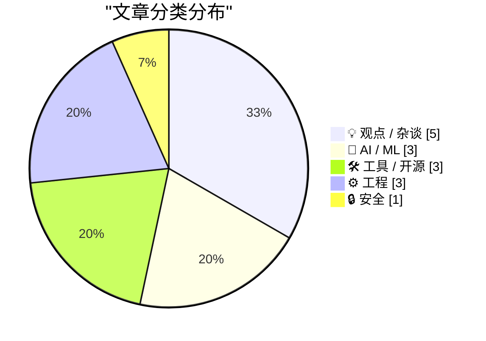
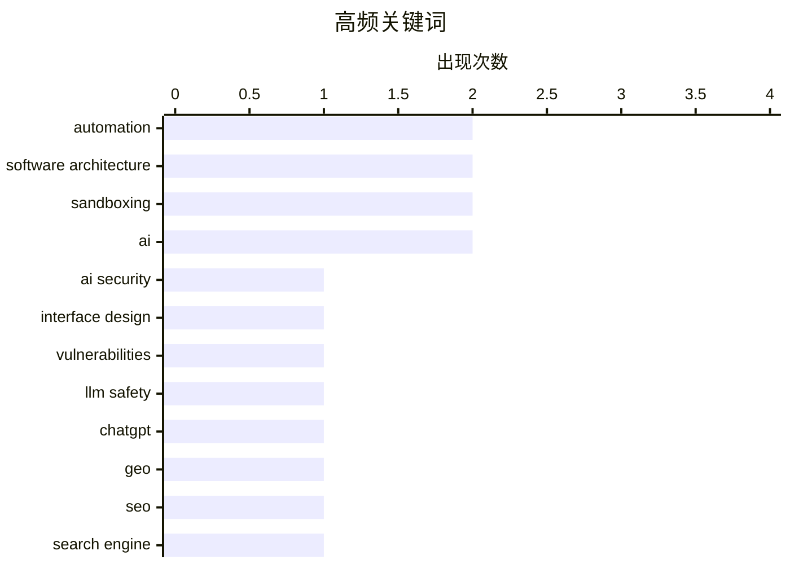

# 📰 Aug 21, 2026

> 来自 Karpathy 推荐的 92 个顶级技术博客，AI 精选 Top 15

## 📝 今日看点

今日技术动态聚焦于 AI 对软件生态与社会认知的深层重塑，从智能体引发的权力不对称到大模型驱动的软件扩展范式变革，行业正经历从工具应用向系统性重构的跨越。与此同时，工程安全与性能优化迈向精细化，UI 质量被提升至安全战略高度，而沙箱技术与原生 API 的演进则为运行不受信任代码提供了新方案。在 AI 生成内容爆发的背景下，维护代码的“概念完整性”与应对真相消解的认知危机成为开发者面临的新挑战。

---

## 🏆 今日必读

🥇 **粗糙的界面是安全隐患**

[A Sloppy Interface Is a Security Liability ](https://blog.jim-nielsen.com/2026/sloppy-ui-is-security-liability/) — blog.jim-nielsen.com · 11 小时前 · 🔒 安全

> 探讨了软件界面质量与网络安全之间的直接联系。通过分析 Axios 维护者因仿冒 Microsoft Teams 界面而遭受网络钓鱼的案例，指出粗糙的 UI 设计会降低用户的警惕性。当正版软件本身存在视觉瑕疵或不一致时，攻击者更容易通过模拟这种“粗糙感”来欺骗用户。作者认为，提升 UI 的精致度和一致性不仅是美学问题，更是防御社会工程学攻击的关键防线。这种“视觉信任”的缺失，往往是安全链条中最薄弱的一环。

💡 **为什么值得读**: 揭示了 UI 设计中常被忽视的安全维度，提醒开发者精致的细节是防范钓鱼攻击的隐形盾牌。

🏷️ AI security, interface design, vulnerabilities, LLM safety

🥈 **ChatGPT 搜索现已大规模使用 site: 操作符**

[ChatGPT search now uses the site:operator at scale](https://simonwillison.net/2026/Aug/20/chatgpt-search-now-uses-the-siteoperator-at-scale/) — simonwillison.net · 7 小时前 · 🤖 AI / ML

> 介绍了 ChatGPT 搜索功能在信息检索策略上的重大转变，即开始大规模利用 `site:` 操作符进行定向搜索。新兴的生成引擎优化（GEO）工具 Promptwatch 监测到，ChatGPT 在处理特定查询时会频繁针对特定域名进行扇出式检索。这种机制意味着网站所有者需要重新审视其内容在 AI 检索中的可见性，而不仅仅是传统的 SEO。这一变化标志着 AI 搜索正从宽泛的网页抓取转向更具针对性的结构化数据提取，对内容分发策略具有深远影响。

💡 **为什么值得读**: 深入了解 AI 搜索底层逻辑的变化，是掌握未来生成引擎优化（GEO）趋势的必读信息。

🏷️ ChatGPT, GEO, SEO, search engine

🥉 **基于 Bun 1.4 新特性 Bun.WebView 构建的 JSON API 工具**

[A shot-scraper-style JSON API on Bun 1.4's new Bun.WebView](https://simonwillison.net/2026/Aug/20/bun-webview-json-api/) — simonwillison.net · 15 小时前 · 🛠 工具 / 开源

> 探讨了 Bun 1.4 稳定版发布带来的核心变化，特别是备受关注的 Rust 重写后的性能表现。文章重点介绍了新引入的 `Bun.WebView` API，它允许开发者在 Bun 环境中直接调用原生 Web 视图。作者展示了如何利用该特性构建一个类似 `shot-scraper` 的工具，通过 JSON API 形式实现网页截图和数据抓取。这一实验证明了 Bun 在跨平台桌面应用和自动化工具开发领域具备了更强的原生集成能力，为开发者提供了更轻量级的替代方案。

💡 **为什么值得读**: 快速了解 Bun 1.4 的重大更新及 Bun.WebView 在自动化抓取场景下的实战潜力。

🏷️ Bun, WebView, scraping, API

---

## 📊 数据概览

| 扫描源 | 抓取文章 | 时间范围 | 精选 |
|:---:|:---:|:---:|:---:|
| 83/92 | 2523 篇 → 21 篇 | 48h | **15 篇** |

### 分类分布



### 高频关键词



<details>
<summary>📈 纯文本关键词图（终端友好）</summary>

```
automation            │ ████████████████████ 2
software architecture │ ████████████████████ 2
sandboxing            │ ████████████████████ 2
ai                    │ ████████████████████ 2
ai security           │ ██████████░░░░░░░░░░ 1
interface design      │ ██████████░░░░░░░░░░ 1
vulnerabilities       │ ██████████░░░░░░░░░░ 1
llm safety            │ ██████████░░░░░░░░░░ 1
chatgpt               │ ██████████░░░░░░░░░░ 1
geo                   │ ██████████░░░░░░░░░░ 1
```

</details>

### 🏷️ 话题标签

**automation**(2) · **software architecture**(2) · **sandboxing**(2) · ai(2) · ai security(1) · interface design(1) · vulnerabilities(1) · llm safety(1) · chatgpt(1) · geo(1) · seo(1) · search engine(1) · bun(1) · webview(1) · scraping(1) · api(1) · ai agents(1) · negotiation(1) · future tech(1) · pytorch(1)

---

## 💡 观点 / 杂谈

### 1. 引用 Jeremy Morrell：大模型时代的软件可扩展性

[Quoting Jeremy Morrell](https://simonwillison.net/2026/Aug/19/jeremy-morrell/) — **simonwillison.net** · 1 天前 · ⭐ 22/30

> 探讨了大语言模型（LLM）如何彻底改变 Web 软件的可扩展性范式。Jeremy Morrell 提出，LLM 极大地降低了编写插件和扩展的门槛，而现代沙箱技术则解决了部署这些不受信任代码的安全顾虑。开发者可以专注于构建稳固的应用核心，并允许用户通过 LLM 生成的扩展来定制化功能。这种模式预示着软件将从“功能堆砌”转向“核心+动态扩展”的演进方向。这种变革将使软件能够以极低的成本满足长尾用户的个性化需求。

🏷️ LLM, extensibility, software architecture, sandboxing

---

### 2. 概念完整性与代码行数统计

[Conceptual integrity and counting lines of code](https://simonwillison.net/2026/Aug/19/conceptual-integrity-and-counting-lines-of-code/) — **simonwillison.net** · 1 天前 · ⭐ 22/30

> 总结了关于 AI 如何改变软件开发模式的深度对话，重点讨论了“概念完整性”在自动化编程时代的价值。作者指出，虽然 AI 可以瞬间生成成千上万行代码，但缺乏统一设计哲学的代码堆砌会导致系统崩溃。文章强调，开发者的核心职责正从“编写代码”转向“维护系统的概念一致性”和“架构把关”。在 AI 辅助下，代码行数不再是衡量生产力的指标，系统的可理解性和长期维护性变得愈发重要。这一观点挑战了传统的开发效率衡量标准。

🏷️ AI, software development, code quality, productivity

---

### 3. 真正的认知危机：AI 对现实的冲击

[Pluralistic: The actual epistemic crisis (20 Aug 2026)](https://pluralistic.net/2026/08/20/epistemic-void/) — **pluralistic.net** · 7 小时前 · ⭐ 22/30

> 深入剖析了 AI 技术引发的认知危机，将其描述为一种针对现有信息系统漏洞的“机会性感染”。作者认为，AI 生成内容的泛滥并非危机的根源，而是加剧了社会早已存在的信任崩塌和真相消解。文章探讨了在虚假信息成本趋近于零的背景下，人类如何辨别真实与虚构的严峻挑战。这种危机不仅是技术性的，更是社会和政治性的，威胁着我们达成共识的基础。作者呼吁建立更具韧性的信息生态系统来对抗这种“认知虚空”。

🏷️ AI ethics, epistemology, misinformation, society

---

### 4. 邪恶的平庸性：停止兜售（糟糕的）AI

[Pluralistic: The ordinariness of evil (19 Aug 2026)](https://pluralistic.net/2026/08/19/banaility/) — **pluralistic.net** · 1 天前 · ⭐ 22/30

> 探讨了现代科技与政治中“平庸之恶”的体现，呼吁停止推销那些名不副实且具有破坏性的 AI 技术。文章揭露了五角大楼在一年内损失 6.5 万亿美元的惊人财务黑洞，并指出选民身份验证本质上是选民压制手段。作者通过分析“不可优化性”的概念，批判了当前科技巨头对用户行为的过度操控。核心观点认为，真正的邪恶往往隐藏在官僚主义和技术平庸的日常运作之中。

🏷️ AI, ethics, corporate, critique

---

### 5. 我们的仆人会为我们代劳：为什么后稀缺乌托邦难以实现

[Our Servants Will Do That For Us](https://borretti.me/article/our-servants-will-do-that-for-us) — **borretti.me** · 1 天前 · ⭐ 21/30

> 深入探讨了为何技术进步带来的“后稀缺乌托邦”在现实中难以实现，挑战了自动化将终结劳动的乐观预测。文章指出，人类的需求具有无限扩张性，且许多社会地位和资源分配本质上是竞争性的，无法通过单纯的物质丰富来解决。作者分析了服务型经济的本质，认为即便技术高度发达，人类依然会追求由他人提供的“地位服务”。结论认为，稀缺性是人类社会的固有属性，而非单纯的技术问题。

🏷️ post-scarcity, automation, future of work, economics

---

## 🤖 AI / ML

### 6. ChatGPT 搜索现已大规模使用 site: 操作符

[ChatGPT search now uses the site:operator at scale](https://simonwillison.net/2026/Aug/20/chatgpt-search-now-uses-the-siteoperator-at-scale/) — **simonwillison.net** · 7 小时前 · ⭐ 23/30

> 介绍了 ChatGPT 搜索功能在信息检索策略上的重大转变，即开始大规模利用 `site:` 操作符进行定向搜索。新兴的生成引擎优化（GEO）工具 Promptwatch 监测到，ChatGPT 在处理特定查询时会频繁针对特定域名进行扇出式检索。这种机制意味着网站所有者需要重新审视其内容在 AI 检索中的可见性，而不仅仅是传统的 SEO。这一变化标志着 AI 搜索正从宽泛的网页抓取转向更具针对性的结构化数据提取，对内容分发策略具有深远影响。

🏷️ ChatGPT, GEO, SEO, search engine

---

### 7. 不对称的智能体

[Asymmetric Agents](https://shkspr.mobi/blog/2026/08/asymmetric-agents/) — **shkspr.mobi** · 1 天前 · ⭐ 23/30

> 分析了 AI 智能体（Agents）在未来社会中可能引发的权力失衡问题。虽然 AI 承诺能为个人处理谈判、预订等繁琐任务，但当个人智能体面对企业级的高性能智能体时，会产生严重的“不对称性”。作者指出，如果企业的 AI 能够识别并操纵用户的 AI 偏好，那么技术进步反而可能加剧对消费者的剥削。这种不对称性意味着 AI 代理的普及并不等同于个人能力的对等提升，反而可能成为新的数字博弈场。文章呼吁在智能体普及前，需重新审视其背后的博弈论困境。

🏷️ AI agents, automation, negotiation, future tech

---

### 8. 使用内置的 GELU，不要自己手写！

[Use the built-in GELU, don't roll your own!](https://www.gilesthomas.com/2026/08/built-in-gelu) — **gilesthomas.com** · 1 天前 · ⭐ 23/30

> 分享了在 PyTorch 模型训练中通过替换自定义 GELU 激活函数获得的性能提升经验。作者发现，直接调用 PyTorch 官方内置的 `torch.nn.GELU` 函数，其运行速度远超开发者自行编写的等效实现。实验数据显示，这种简单的代码替换能显著缩短模型训练的总时长，且无需改变任何模型逻辑。这一发现强调了在深度学习框架中优先使用经过底层优化的原生算子的重要性。对于追求极致训练效率的开发者来说，这是一个极具性价比的优化点。

🏷️ PyTorch, GELU, performance, deep learning

---

## 🛠 工具 / 开源

### 9. 基于 Bun 1.4 新特性 Bun.WebView 构建的 JSON API 工具

[A shot-scraper-style JSON API on Bun 1.4's new Bun.WebView](https://simonwillison.net/2026/Aug/20/bun-webview-json-api/) — **simonwillison.net** · 15 小时前 · ⭐ 23/30

> 探讨了 Bun 1.4 稳定版发布带来的核心变化，特别是备受关注的 Rust 重写后的性能表现。文章重点介绍了新引入的 `Bun.WebView` API，它允许开发者在 Bun 环境中直接调用原生 Web 视图。作者展示了如何利用该特性构建一个类似 `shot-scraper` 的工具，通过 JSON API 形式实现网页截图和数据抓取。这一实验证明了 Bun 在跨平台桌面应用和自动化工具开发领域具备了更强的原生集成能力，为开发者提供了更轻量级的替代方案。

🏷️ Bun, WebView, scraping, API

---

### 10. 介绍 Dashboard Touch：打造你自己的独立版 Touch ID

[Introducing Dashboard Touch, a build-your-own version of Touch ID](https://anildash.com/2026/08/20/introducing-dashboard-touch/) — **anildash.com** · 1 天前 · ⭐ 21/30

> 针对 Mac 用户希望在不使用苹果官方键盘的情况下拥有 Touch ID 功能的痛点，介绍了一种自制独立指纹识别模块的方案。作者回顾了以往拆解昂贵键盘以获取传感器的极端做法，并提出了更具可行性的替代路径。该方案旨在让使用机械键盘的极客也能享受无缝的生物识别认证体验。通过整合特定的硬件组件和驱动支持，用户可以构建一个既美观又实用的桌面认证终端。

🏷️ Touch ID, macOS, hardware, DIY

---

### 11. 树莓派 CM5 烧录夹具上手体验

[Hands-on with Raspberry Pi's CM5 Programming Jig](https://www.jeffgeerling.com/blog/2026/cm5-programming-jig/) — **jeffgeerling.com** · 1 天前 · ⭐ 20/30

> 详细评测了用于树莓派 Compute Module 5 (CM5) 的官方烧录夹具，旨在解决大规模部署时系统镜像烧录效率低下的问题。该夹具通过物理接触点简化了 CM5 模块的连接过程，无需频繁插拔底板即可完成固件更新。作者分享了在构建大规模 Pi 集群时的实战经验，对比了手动烧录与使用专用工具的效率差异。对于需要批量处理 CM5 模块的开发者或企业用户，这款工具是提升生产力的关键。

🏷️ Raspberry Pi, CM5, embedded, flashing

---

## ⚙️ 工程

### 12. 更好的“自带电池”策略

[Better Batteries](https://matklad.github.io/2026/08/20/better-batteries.html) — **matklad.github.io** · 1 天前 · ⭐ 23/30

> 探讨了编程语言标准库设计中“极简主义”与“大而全”的永恒争论。作者认为，争论标准库应该包含多少功能是误导性的，核心问题应在于如何构建具备高度可组合性和稳定性的基础组件。文章提出，优秀的标准库应当像“电池”一样提供即插即用的核心能力，同时不阻碍生态系统的多样化发展。通过重新定义标准库的职责，开发者可以更好地平衡语言的易用性与长期的维护成本。这种视角为现代编程语言的演进提供了新的哲学思考。

🏷️ standard library, API design, software architecture

---

### 13. 使用 smolmachines 作为运行不受信任 Python 和 JavaScript 的沙箱

[smolmachines / smolvm as a sandbox for untrusted Python & JavaScript](https://simonwillison.net/2026/Aug/19/smolmachines-untrusted-sandbox/) — **simonwillison.net** · 1 天前 · ⭐ 22/30

> 评估了 `smolmachines`（及其核心 `smolvm`）作为安全沙箱运行不受信任代码的潜力。作者利用 Claude Code 辅助研究，探索了在隔离环境中执行 Python 和 JavaScript 的具体实现路径。该方案旨在提供一个轻量级且快速的执行环境，以防止恶意代码对宿主系统造成破坏。研究重点在于如何在保证安全边界的前提下，尽可能降低沙箱运行的性能开销。这为需要在应用中集成第三方脚本执行功能的开发者提供了重要的技术参考。

🏷️ sandboxing, Python, JavaScript, security

---

### 14. 通过提取类型无关部分来减少 C++ 模板膨胀

[Reducing C++ template bloat by factoring out the type-dependent portions of the function](https://devblogs.microsoft.com/oldnewthing/20260820-00/?p=112629) — **devblogs.microsoft.com/oldnewthing** · 16 小时前 · ⭐ 22/30

> 针对 C++ 模板导致的可执行文件体积膨胀问题，提出了一种将函数中与类型无关的代码提取到非模板基类或辅助函数中的优化策略。通过识别模板函数中的“合并点”，开发者可以将复杂的逻辑移出模板，仅保留必要的类型转换或特定类型操作。这种方法不仅能显著减少生成的机器码重复，还能缩短编译时间并提高指令缓存的效率。作者强调在编写泛型代码时，应时刻警惕那些不需要模板参数即可运行的逻辑片段。

🏷️ C++, templates, optimization, code bloat

---

## 🔒 安全

### 15. 粗糙的界面是安全隐患

[A Sloppy Interface Is a Security Liability ](https://blog.jim-nielsen.com/2026/sloppy-ui-is-security-liability/) — **blog.jim-nielsen.com** · 11 小时前 · ⭐ 26/30

> 探讨了软件界面质量与网络安全之间的直接联系。通过分析 Axios 维护者因仿冒 Microsoft Teams 界面而遭受网络钓鱼的案例，指出粗糙的 UI 设计会降低用户的警惕性。当正版软件本身存在视觉瑕疵或不一致时，攻击者更容易通过模拟这种“粗糙感”来欺骗用户。作者认为，提升 UI 的精致度和一致性不仅是美学问题，更是防御社会工程学攻击的关键防线。这种“视觉信任”的缺失，往往是安全链条中最薄弱的一环。

🏷️ AI security, interface design, vulnerabilities, LLM safety

---

*生成于 2026-08-21 06:57 | 扫描 83 源 → 获取 2523 篇 → 精选 15 篇*
*基于 [Hacker News Popularity Contest 2025](https://refactoringenglish.com/tools/hn-popularity/) RSS 源列表，由 [Andrej Karpathy](https://x.com/karpathy) 推荐*
