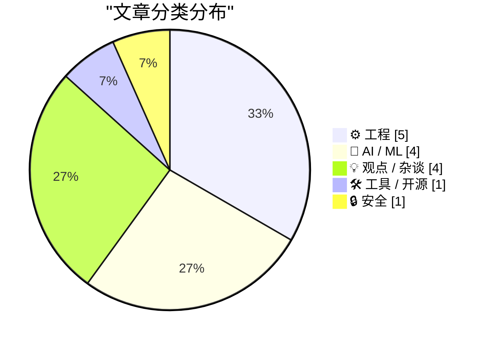
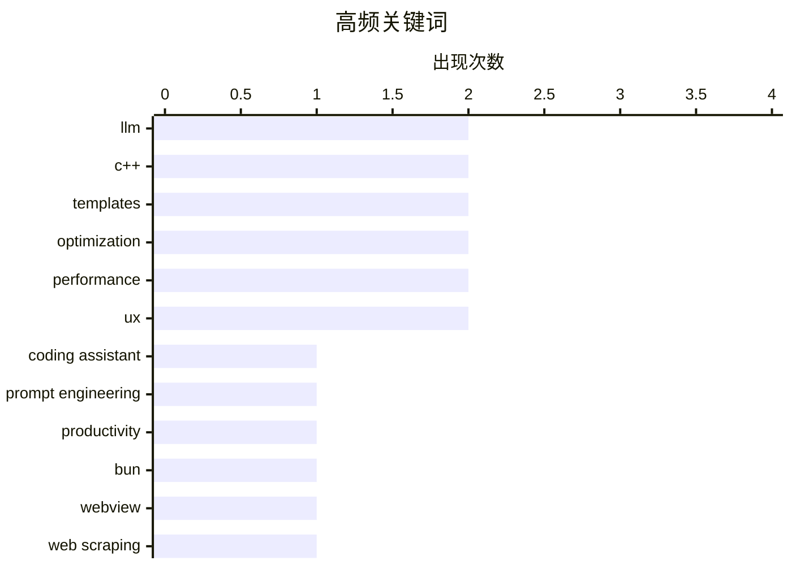

# 📰 Aug 22, 2026

> 来自 Karpathy 推荐的 92 个顶级技术博客，AI 精选 Top 15

## 📝 今日看点

今日技术圈聚焦于 AI 深度集成与工程范式的演进，开发者正通过结构化上下文和 GEO 优化重塑与大模型的交互。与此同时，Bun 1.4 的稳定发布与 C++ 性能优化策略展示了底层工具链的持续进化。在行业博弈层面，苹果对欧盟监管的微弱让步与社交平台巧妙的增长黑客手段，共同揭示了流量霸权与合规压力下的生存现状。

---

## 🏆 今日必读

🥇 **通过 agent.md 文件提升 LLM 辅助编程的代码质量**

[My agent.md to improve LLM-assisted code quality](https://fabiensanglard.net/agent.md/index.html) — fabiensanglard.net · 1 天前 · 🤖 AI / ML

> LLM 在辅助编程时常因缺乏项目上下文而产生幻觉或使用过时 API。作者提出在项目根目录创建一个名为 `agent.md` 的结构化 Markdown 文件，专门存放项目特定的编码规范、库版本要求和架构决策。通过在提示词中引用该文件，LLM 能精准遵循如“使用原生 Fetch 而非 Axios”或“保持函数纯净”等私有指令。这种方法将通用的模型能力与具体的项目约束解耦，显著减少了手动纠错的频率。最终实现了一种低成本、高效率的“项目级系统提示词”管理方案。

💡 **为什么值得读**: 为开发者提供了一种简单且极具实操性的方法，通过结构化上下文管理来解决 AI 编程中的一致性难题。

🏷️ LLM, coding assistant, prompt engineering, productivity

🥈 **基于 Bun 1.4 新特性 Bun.WebView 构建类似 shot-scraper 的 JSON API**

[A shot-scraper-style JSON API on Bun 1.4's new Bun.WebView](https://simonwillison.net/2026/Aug/20/bun-webview-json-api/) — simonwillison.net · 1 天前 · ⚙️ 工程

> Bun 1.4 版本正式发布，这是自采用 Rust 重写后的首个稳定版，并引入了实验性的 `Bun.WebView` 功能。开发者利用该特性构建了一个类似 `shot-scraper` 的工具，能够通过 JSON API 驱动原生 Web 视图进行网页截图和数据抓取。与传统的无头浏览器方案相比，`Bun.WebView` 直接调用系统原生渲染引擎，显著降低了内存占用和启动延迟。该实验展示了 Bun 从单纯的服务端运行时向跨平台桌面应用开发领域扩张的潜力。

💡 **为什么值得读**: 第一时间探索了 Bun 1.4 的重量级新特性，展示了高性能 JavaScript 运行时在桌面自动化领域的应用前景。

🏷️ Bun, WebView, web scraping, JavaScript runtime

🥉 **苹果与欧盟就 DMA 达成支付条款协议：苹果几乎未作让步**

[★ Apple and European Commission Reach Agreement on App Payment Terms Under DMA, With Apple Conceding Very Little](https://daringfireball.net/2026/08/apple_eu_business_terms_conceding_little) — daringfireball.net · 1 天前 · 💡 观点 / 杂谈

> 在欧盟《数字市场法案》（DMA）的压力下，苹果公司对其 App Store 支付条款进行了调整，但实际变动极小。苹果仅将第三方支付的佣金从 30% 降至 26%，而对于订阅一年后的 15% 佣金比例则完全没有下调。尽管面临监管高压，苹果仍通过复杂的条款设计保留了核心收入模式，仅作出了象征性的 4% 降幅让步。这反映了大型科技公司在应对区域性监管时，利用规则复杂性进行博弈的典型策略。

💡 **为什么值得读**: 揭示了苹果在监管压力下极具手腕的博弈结果，是关注移动生态和科技监管读者的必读动态。

🏷️ Apple, DMA, App Store, regulation

---

## 📊 数据概览

| 扫描源 | 抓取文章 | 时间范围 | 精选 |
|:---:|:---:|:---:|:---:|
| 83/92 | 2524 篇 → 32 篇 | 48h | **15 篇** |

### 分类分布



### 高频关键词



<details>
<summary>📈 纯文本关键词图（终端友好）</summary>

```
llm                │ ████████████████████ 2
c++                │ ████████████████████ 2
templates          │ ████████████████████ 2
optimization       │ ████████████████████ 2
performance        │ ████████████████████ 2
ux                 │ ████████████████████ 2
coding assistant   │ ██████████░░░░░░░░░░ 1
prompt engineering │ ██████████░░░░░░░░░░ 1
productivity       │ ██████████░░░░░░░░░░ 1
bun                │ ██████████░░░░░░░░░░ 1
```

</details>

### 🏷️ 话题标签

**llm**(2) · **c++**(2) · **templates**(2) · optimization(2) · performance(2) · ux(2) · coding assistant(1) · prompt engineering(1) · productivity(1) · bun(1) · webview(1) · web scraping(1) · javascript runtime(1) · apple(1) · dma(1) · app store(1) · regulation(1) · ai ethics(1) · ai slop(1) · big tech(1)

---

## ⚙️ 工程

### 1. 基于 Bun 1.4 新特性 Bun.WebView 构建类似 shot-scraper 的 JSON API

[A shot-scraper-style JSON API on Bun 1.4's new Bun.WebView](https://simonwillison.net/2026/Aug/20/bun-webview-json-api/) — **simonwillison.net** · 1 天前 · ⭐ 25/30

> Bun 1.4 版本正式发布，这是自采用 Rust 重写后的首个稳定版，并引入了实验性的 `Bun.WebView` 功能。开发者利用该特性构建了一个类似 `shot-scraper` 的工具，能够通过 JSON API 驱动原生 Web 视图进行网页截图和数据抓取。与传统的无头浏览器方案相比，`Bun.WebView` 直接调用系统原生渲染引擎，显著降低了内存占用和启动延迟。该实验展示了 Bun 从单纯的服务端运行时向跨平台桌面应用开发领域扩张的潜力。

🏷️ Bun, WebView, web scraping, JavaScript runtime

---

### 2. 实战演练：通过提取类型无关代码减少 C++ 模板膨胀

[Reducing C++ template bloat by factoring out the type-dependent portions of the function, practical exam](https://devblogs.microsoft.com/oldnewthing/20260821-00/?p=112632) — **devblogs.microsoft.com/oldnewthing** · 16 小时前 · ⭐ 25/30

> C++ 模板在提供泛型能力的同时，常因重复实例化导致二进制文件体积剧增。Raymond Chen 演示了如何通过将模板函数中与类型无关的逻辑剥离到非模板辅助函数中，来优化代码规模。这种方法利用了“战术性重构”，确保编译器只为核心逻辑生成一份机器码，而非为每个模板参数生成冗余副本。文中通过具体的代码示例展示了优化前后的对比，证明了该策略在大型项目中的有效性。结论指出，精细化的架构设计是平衡 C++ 开发效率与执行效率的关键。

🏷️ C++, templates, optimization, performance

---

### 3. 揭秘 Bluesky 和 Threads 如何在 iOS 截屏中“植入”Logo

[How Bluesky and Threads Sneak Their Logos Into iOS Screenshots](https://timmarinin.net/2026/bluesky-screenshots/) — **daringfireball.net** · 1 天前 · ⭐ 23/30

> Bluesky 和 Threads 等社交应用采用了一种巧妙的增长黑客手段来提升品牌曝光。通过监听 iOS 的截屏系统通知，应用会在用户按下截屏键的瞬间，动态地将界面上的“关注”按钮替换为官方 Logo。这种技术利用了 iOS UI 框架的响应机制，确保用户分享出去的截图自带品牌水印，而日常使用时则保持功能完整。开发者通过分析 Bluesky 的开源代码，还原了名为 `GrowthHack.tsx` 的组件实现细节。这种做法展示了移动端开发中产品增长与技术实现的深度结合。

🏷️ iOS, UI, screenshot, reverse engineering

---

### 4. 通过提取函数中类型无关部分来减少 C++ 模板膨胀

[Reducing C++ template bloat by factoring out the type-dependent portions of the function](https://devblogs.microsoft.com/oldnewthing/20260820-00/?p=112629) — **devblogs.microsoft.com/oldnewthing** · 1 天前 · ⭐ 23/30

> C++ 模板在为不同类型实例化时容易导致二进制文件体积剧增，即所谓的“代码膨胀”。通过将模板函数中与模板参数类型无关的逻辑提取到非模板的辅助函数或基类中，可以有效减少重复生成的机器码。这种“寻找整合点”的技术不仅能缩小二进制体积，还能加快编译速度并提高 CPU 指令缓存的效率。开发者应识别模板中的通用逻辑，将其重构为接受 void* 或基类指针的统一实现，从而在保持泛型便利性的同时优化性能。

🏷️ C++, templates, optimization, binary size

---

### 5. 将 Steam Deck LCD 屏幕连接到树莓派上使用

[Getting the Steam Deck LCD working on a Raspberry Pi](https://www.jeffgeerling.com/blog/2026/steam-deck-lcd-pi-hat/) — **jeffgeerling.com** · 1 天前 · ⭐ 21/30

> 原版 Steam Deck 使用的 BOE 7 英寸 LCD 屏幕在二手市场仅需约 30 美元，具备 400 尼特亮度和 1280x800 分辨率（216 ppi），性价比极高。Jeff Geerling 展示了如何通过定制的驱动板（Pi HAT）将这块高质量屏幕连接到 Raspberry Pi 5 上。该方案克服了 MIPI DSI 接口兼容性和触摸屏驱动适配的难题，使 DIY 玩家能够利用廉价的工业级零件构建高性能手持设备。文章详细记录了硬件连接过程及初步的显示效果测试。

🏷️ Raspberry Pi, Steam Deck, hardware hacking, LCD

---

## 🤖 AI / ML

### 6. 通过 agent.md 文件提升 LLM 辅助编程的代码质量

[My agent.md to improve LLM-assisted code quality](https://fabiensanglard.net/agent.md/index.html) — **fabiensanglard.net** · 1 天前 · ⭐ 26/30

> LLM 在辅助编程时常因缺乏项目上下文而产生幻觉或使用过时 API。作者提出在项目根目录创建一个名为 `agent.md` 的结构化 Markdown 文件，专门存放项目特定的编码规范、库版本要求和架构决策。通过在提示词中引用该文件，LLM 能精准遵循如“使用原生 Fetch 而非 Axios”或“保持函数纯净”等私有指令。这种方法将通用的模型能力与具体的项目约束解耦，显著减少了手动纠错的频率。最终实现了一种低成本、高效率的“项目级系统提示词”管理方案。

🏷️ LLM, coding assistant, prompt engineering, productivity

---

### 7. 实验证明：读者无法识别带有水印的 AI 生成文本

[Readers can't identify watermarked AI text](https://seangoedecke.com/readers-cant-identify-watermarked-ai-text/) — **seangoedecke.com** · 1 天前 · ⭐ 24/30

> 关于 AI 文本水印是否会损害输出质量的争论一直不断，作者对此进行了实际测试。通过对比实验发现，普通读者完全无法分辨经过水印处理的文本与原始 AI 生成文本之间的差异。研究表明，现有的水印算法（如基于 Logits 偏移的方案）在保持语义连贯性和文笔流畅度方面已经非常成熟。这意味着水印技术可以在不牺牲用户体验的前提下，成为追踪 AI 内容的有效手段。结论支持了在行业内大规模推广 AI 水印以增强内容透明度的可行性。

🏷️ AI watermarking, LLM, AI safety, content detection

---

### 8. ChatGPT 搜索现已大规模使用 site: 操作符

[ChatGPT search now uses the site:operator at scale](https://simonwillison.net/2026/Aug/20/chatgpt-search-now-uses-the-siteoperator-at-scale/) — **simonwillison.net** · 1 天前 · ⭐ 23/30

> ChatGPT 的搜索机制正在发生重大变化，开始频繁使用 `site:` 操作符来针对特定域名进行深度检索。这一趋势催生了“生成式引擎优化”（GEO）领域，即针对 AI 聊天机器人的搜索算法进行网站优化。Promptwatch 的监测数据显示，这种定向搜索策略旨在提高回答的准确性和权威性，但也改变了流量分配逻辑。网站所有者现在需要关注如何让自己的内容更容易被 LLM 的搜索插件选中并引用。这标志着互联网营销从传统的 SEO 时代正式跨入 GEO 时代。

🏷️ ChatGPT search, GEO, SEO, search engine

---

### 9. Pluralistic：AI 冲击下的真实认知危机

[Pluralistic: The actual epistemic crisis (20 Aug 2026)](https://pluralistic.net/2026/08/20/epistemic-void/) — **pluralistic.net** · 1 天前 · ⭐ 23/30

> Cory Doctorow 深入探讨了 AI 对现实感造成的“认知危机”，认为这是一种针对信息生态系统的机会性感染。AI 产生的大量虚假信息并非问题的根源，而是利用了现有的信任缺失和真相商业化漏洞。文章指出，当权力和资本能够随意定义“事实”时，AI 只是加速了共识的瓦解。解决之道不在于单纯的技术过滤，而在于修复社会底层的知识生产和验证机制。作者强调，必须警惕技术巨头利用 AI 进一步垄断解释权，导致公共讨论空间的彻底崩塌。

🏷️ AI, epistemology, misinformation, ethics

---

## 💡 观点 / 杂谈

### 10. 苹果与欧盟就 DMA 达成支付条款协议：苹果几乎未作让步

[★ Apple and European Commission Reach Agreement on App Payment Terms Under DMA, With Apple Conceding Very Little](https://daringfireball.net/2026/08/apple_eu_business_terms_conceding_little) — **daringfireball.net** · 1 天前 · ⭐ 25/30

> 在欧盟《数字市场法案》（DMA）的压力下，苹果公司对其 App Store 支付条款进行了调整，但实际变动极小。苹果仅将第三方支付的佣金从 30% 降至 26%，而对于订阅一年后的 15% 佣金比例则完全没有下调。尽管面临监管高压，苹果仍通过复杂的条款设计保留了核心收入模式，仅作出了象征性的 4% 降幅让步。这反映了大型科技公司在应对区域性监管时，利用规则复杂性进行博弈的典型策略。

🏷️ Apple, DMA, App Store, regulation

---

### 11. 为什么仅仅羞辱 AI 垃圾内容不足以阻止大科技公司的扩张

[Why shaming people about AI slop isn’t enough to stop Big AI](https://anildash.com/2026/08/21/ai-slop-and-shame/) — **anildash.com** · 1 天前 · ⭐ 25/30

> 当前社交媒体上充斥着对 AI 生成的低质量内容（AI Slop）的嘲讽和道德谴责，但这种“羞辱”策略难以撼动行业现状。作者指出，AI 的普及是由大科技公司掌握的巨额资本和基础设施驱动的，而非单纯的用户偏好。单纯的道德批判忽略了背后的权力不对等，无法解决 AI 对信息生态的结构性破坏。文章呼吁建立更具建设性的替代方案和政策干预，而非仅仅停留在文化层面的口诛笔伐。核心观点认为，对抗 AI 异化需要从改变生产关系和资源分配入手。

🏷️ AI ethics, AI slop, Big Tech, generative AI

---

### 12. 别再执着于开发 TUI 命令行界面了

[Stop Making TUIs](https://simonwillison.net/2026/Aug/21/stop-making-tuis/) — **simonwillison.net** · 14 小时前 · ⭐ 23/30

> 长期以来，开发者倾向于为内部工具编写终端用户界面（TUI），认为其开发效率高且极客感十足。然而，随着 Cursor 和 Claude 等 AI 编程助手的普及，构建原生 GUI（如 SwiftUI 应用）的门槛已降至近乎为零。GUI 在数据可视化、交互直观性和功能发现性上远超 TUI，且不再需要开发者手动处理复杂的终端字符渲染。作者建议开发者应利用 AI 能力转向 GUI 开发，以获得更好的使用体验和更高的生产力。这一观点挑战了传统黑客文化中“命令行至上”的思维定式。

🏷️ TUI, GUI, AI coding agents, UX

---

### 13. 永远不要在工作中发火

[You should never be angry at work](https://seangoedecke.com/you-should-never-be-angry-at-work/) — **seangoedecke.com** · 6 小时前 · ⭐ 21/30

> 在职场中保持情绪稳定是职业成功的核心要素，作者认为在工作中表达愤怒几乎总是一个错误。愤怒会损害个人的判断力，破坏同事间的信任关系，并显著削弱你在团队中的长期影响力。即使你的愤怒是有理有据的，它也无法帮助项目更有效地推进，反而可能让你被打上“难以合作”的标签。通过保持冷静和专业，开发者能更好地应对复杂的公司政治，并确保管理层对你的交付能力保持信心。

🏷️ career development, workplace culture, soft skills, professionalism

---

## 🛠 工具 / 开源

### 14. Rust Glancer：内存占用降低两个数量级的轻量级 Rust LSP 服务器

[Rust Glancer](https://matklad.github.io/2026/08/21/rust-glancer.html) — **matklad.github.io** · 1 天前 · ⭐ 23/30

> Rust Glancer 是一款为 Rust 语言开发的实验性轻量级 LSP 服务器，旨在解决主流工具资源消耗过大的问题。其核心优势在于极低的内存占用，相比 rust-analyzer 降低了两个数量级（约 100 倍）。该工具通过精简功能集，专注于提供极速的代码导航和基础补全，而非全量的语义分析。对于在低配设备上开发或追求极致 IDE 响应速度的开发者来说，这是一个极具潜力的替代方案。

🏷️ Rust, LSP, IDE, performance

---

## 🔒 安全

### 15. 粗糙的界面设计是安全隐患

[A Sloppy Interface Is a Security Liability ](https://blog.jim-nielsen.com/2026/sloppy-ui-is-security-liability/) — **blog.jim-nielsen.com** · 1 天前 · ⭐ 23/30

> 软件界面的精致程度直接影响系统的安全性，粗糙且不一致的 UI 往往成为钓鱼攻击的温床。以 Axios 维护者遭遇的 npm 供应链攻击为例，攻击者利用伪造的 Microsoft Teams 界面成功实施了钓鱼。当合法软件的 UI 缺乏细节打磨或存在视觉瑕疵时，用户很难分辨出恶意的伪造弹窗或登录页面。作者强调，提升界面质量不仅是为了美观，更是为了建立清晰的安全边界，降低用户因视觉误导而产生的安全风险。

🏷️ AI security, UX, vulnerability, software security

---

*生成于 2026-08-22 06:51 | 扫描 83 源 → 获取 2524 篇 → 精选 15 篇*
*基于 [Hacker News Popularity Contest 2025](https://refactoringenglish.com/tools/hn-popularity/) RSS 源列表，由 [Andrej Karpathy](https://x.com/karpathy) 推荐*
