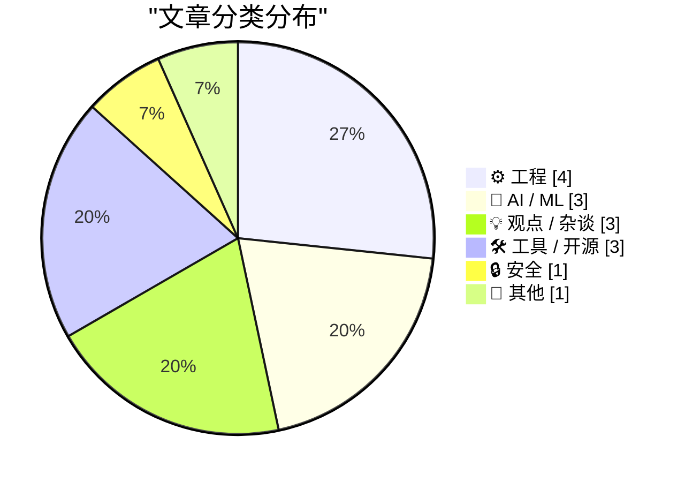
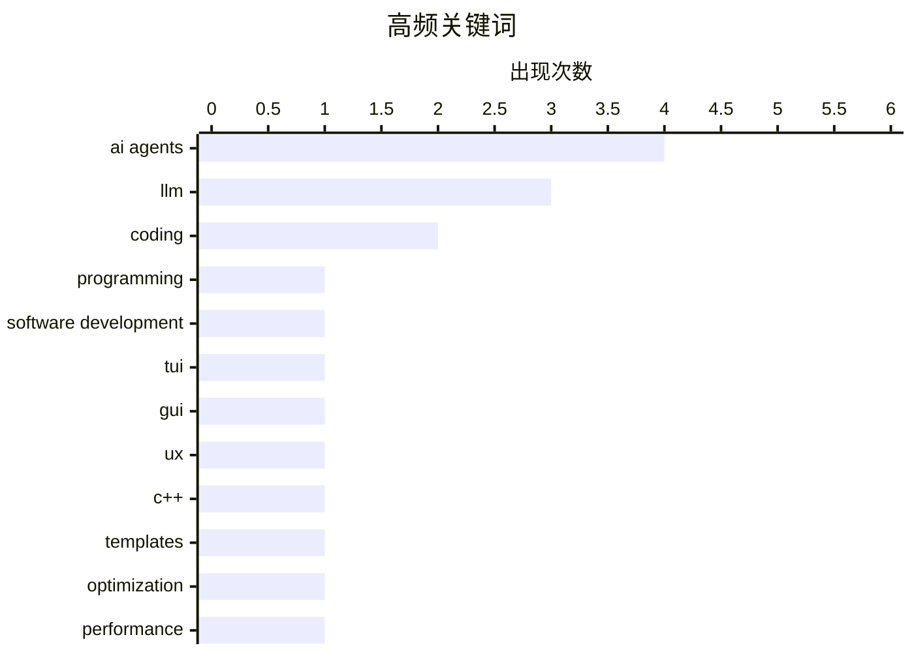

# 📰 Aug 23, 2026

> 来自 Karpathy 推荐的 92 个顶级技术博客，AI 精选 Top 15

## 📝 今日看点

今日技术圈聚焦于 AI 对软件工程范式的深刻重塑，AI 代理正通过降低底层编程门槛与 GUI 构建成本，将开发者的核心竞争力从编写代码转向指令下达与结果验证。与此同时，高性能工程实践依然在 C++ 模板优化与 Go 并发模型中持续演进，力求在底层实现极致效率。而在监管层面，针对自动化决策的巨额罚款再次敲响警钟，提醒业界在追求技术效率的同时，必须直面算法透明度与社会责任的严峻挑战。

---

## 🏆 今日必读

🥇 **快速且硬核的代码：AI 如何改变编程语言的选择**

[Fast and Hard Code](https://lucumr.pocoo.org/2026/8/22/fast-hard-code/) — lucumr.pocoo.org · 1 天前 · 🤖 AI / ML

> LLM 正在削弱编程语言选择的重要性，使得原本对人类开发者具有挑战性的“硬核”代码变得触手可及。AI 代理能够无视语言的学习曲线和语法摩擦，轻松实现跨语言重写或直接编写高性能的底层代码。这意味着开发者可以不再受限于个人熟悉的语言栈，转而追求极致的性能或特定的系统特性。作者认为，编程的未来在于利用 AI 消除语言壁垒，让开发者更专注于解决问题而非纠结于语法细节。

💡 **为什么值得读**: 探讨了 AI 如何重塑编程范式，特别是对底层语言选择和开发效率的深远影响。

🏷️ LLM, programming, AI agents, software development

🥈 **别再开发终端界面（TUI）了**

[Stop Making TUIs](https://simonwillison.net/2026/Aug/21/stop-making-tuis/) — simonwillison.net · 1 天前 · 💡 观点 / 杂谈

> 随着 AI 编程代理将构建原生图形用户界面（GUI）的成本降至近乎为零，开发者应停止开发繁琐的终端用户界面（TUI）。Thomas Ptacek 认为，即使是最小的个人工具也值得拥有真正的原生 UI，因为 AI 可以处理复杂的框架代码。Simon Willison 分享了利用 SwiftUI 和 AI 快速构建 macOS 任务栏应用的经验，证明了“氛围编程”在 GUI 开发中的高效性。这一转变标志着开发者不再需要为了省事而牺牲用户体验。

💡 **为什么值得读**: 挑战了“小工具必用命令行”的传统观念，展示了 AI 如何让高质量 GUI 开发平民化。

🏷️ TUI, GUI, AI agents, UX

🥉 **实战演练：通过提取函数中类型相关的部分来减少 C++ 模板膨胀**

[Reducing C++ template bloat by factoring out the type-dependent portions of the function, practical exam](https://devblogs.microsoft.com/oldnewthing/20260821-00/?p=112632) — devblogs.microsoft.com/oldnewthing · 1 天前 · ⚙️ 工程

> 针对 C++ 模板导致的二进制文件体积膨胀问题，本文通过实际案例演示了如何通过提取函数中与类型无关的部分来优化代码。这种技术通过将通用逻辑移至非模板基类或辅助函数中，显著减少了编译器为每个模板实例化生成的重复代码量。文章深入探讨了在保持模板灵活性的同时，如何通过精细的代码重构实现更小的内存占用和更快的编译速度。这是对 C++ 模板元编程中“代码膨胀”这一经典难题的实战化解决方案。

💡 **为什么值得读**: 微软资深工程师分享的 C++ 性能优化实战，是解决模板膨胀问题的必读指南。

🏷️ C++, templates, optimization, performance

---

## 📊 数据概览

| 扫描源 | 抓取文章 | 时间范围 | 精选 |
|:---:|:---:|:---:|:---:|
| 82/92 | 2494 篇 → 32 篇 | 48h | **15 篇** |

### 分类分布



### 高频关键词



<details>
<summary>📈 纯文本关键词图（终端友好）</summary>

```
ai agents            │ ████████████████████ 4
llm                  │ ███████████████░░░░░ 3
coding               │ ██████████░░░░░░░░░░ 2
programming          │ █████░░░░░░░░░░░░░░░ 1
software development │ █████░░░░░░░░░░░░░░░ 1
tui                  │ █████░░░░░░░░░░░░░░░ 1
gui                  │ █████░░░░░░░░░░░░░░░ 1
ux                   │ █████░░░░░░░░░░░░░░░ 1
c++                  │ █████░░░░░░░░░░░░░░░ 1
templates            │ █████░░░░░░░░░░░░░░░ 1
```

</details>

### 🏷️ 话题标签

**ai agents**(4) · **llm**(3) · **coding**(2) · programming(1) · software development(1) · tui(1) · gui(1) · ux(1) · c++(1) · templates(1) · optimization(1) · performance(1) · linus torvalds(1) · ai(1) · debugging(1) · linux(1) · code review(1) · verification(1) · uber(1) · gdpr(1)

---

## ⚙️ 工程

### 1. 实战演练：通过提取函数中类型相关的部分来减少 C++ 模板膨胀

[Reducing C++ template bloat by factoring out the type-dependent portions of the function, practical exam](https://devblogs.microsoft.com/oldnewthing/20260821-00/?p=112632) — **devblogs.microsoft.com/oldnewthing** · 1 天前 · ⭐ 25/30

> 针对 C++ 模板导致的二进制文件体积膨胀问题，本文通过实际案例演示了如何通过提取函数中与类型无关的部分来优化代码。这种技术通过将通用逻辑移至非模板基类或辅助函数中，显著减少了编译器为每个模板实例化生成的重复代码量。文章深入探讨了在保持模板灵活性的同时，如何通过精细的代码重构实现更小的内存占用和更快的编译速度。这是对 C++ 模板元编程中“代码膨胀”这一经典难题的实战化解决方案。

🏷️ C++, templates, optimization, performance

---

### 2. 并发服务器系列（八）：Go 语言篇

[Concurrent Servers: Part 8 - Go](https://eli.thegreenplace.net/2026/concurrent-servers-part-8-go/) — **eli.thegreenplace.net** · 16 小时前 · ⭐ 24/30

> 本文是并发网络服务器系列的第八部分，重点探讨 Go 语言如何应对高并发挑战。通过对比前几章介绍的线程和异步 I/O 模型，作者展示了 Go 原生的 goroutines 和 channels 如何简化并发编程的复杂性。文章包含具体的代码示例，演示了如何构建一个高性能的并发服务器，并分析了 Go 运行时在调度方面的优势。这为理解现代并发模型提供了从底层原理到高层抽象的完整视角。

🏷️ Go, concurrency, networking, server

---

### 3. WorkOS：让 AI 代理也能注册你的应用

[WorkOS: Agents Can Now Sign Up for Your App](https://workos.com/auth-md?utm_source=daringfireball&amp;utm_medium=newsletter&amp;utm_campaign=q32026) — **daringfireball.net** · 16 小时前 · ⭐ 22/30

> WorkOS 推出了全新的“代理注册”（Agent Registration）功能，旨在解决 AI 代理在访问需要登录的应用时遇到的障碍。通过在根目录发布 auth.md 文件，应用可以引导 AI 代理自动获取受控的、短效的凭证，从而完成注册和登录流程。这一方案避免了 AI 代理因无法处理人类设计的图形登录界面而流失的问题。随着 AI 代理生态的爆发，让应用具备“代理友好型”的身份验证机制正成为新的技术趋势。

🏷️ WorkOS, AI agents, authentication, SaaS

---

### 4. Syncthing 与 SQLite 配合使用的陷阱

[A Syncthing and SQLite Gotcha](https://borretti.me/article/a-syncthing-and-sqlite-gotcha) — **borretti.me** · 16 小时前 · ⭐ 21/30

> 探讨了在同步工具 Syncthing 环境下运行 SQLite 数据库时遇到的文件系统冲突问题。核心矛盾在于 SQLite 极度依赖原子的 rename 系统调用来管理日志和数据库状态，而 Syncthing 的同步机制可能在重命名过程中锁定文件或产生冲突副本。文章详细分析了 POSIX 标准下 rename 的行为以及在分布式文件同步场景中这种假设如何失效。作者建议避免在活跃同步的文件夹中直接运行高频写入的数据库，或采用更稳健的备份策略以防数据损坏。

🏷️ SQLite, Syncthing, system calls, file systems

---

## 🤖 AI / ML

### 5. 快速且硬核的代码：AI 如何改变编程语言的选择

[Fast and Hard Code](https://lucumr.pocoo.org/2026/8/22/fast-hard-code/) — **lucumr.pocoo.org** · 1 天前 · ⭐ 28/30

> LLM 正在削弱编程语言选择的重要性，使得原本对人类开发者具有挑战性的“硬核”代码变得触手可及。AI 代理能够无视语言的学习曲线和语法摩擦，轻松实现跨语言重写或直接编写高性能的底层代码。这意味着开发者可以不再受限于个人熟悉的语言栈，转而追求极致的性能或特定的系统特性。作者认为，编程的未来在于利用 AI 消除语言壁垒，让开发者更专注于解决问题而非纠结于语法细节。

🏷️ LLM, programming, AI agents, software development

---

### 6. 引用 Linus Torvalds：AI 辅助下的“地狱级”调试

[Quoting Linus Torvalds](https://simonwillison.net/2026/Aug/22/linus-torvalds/) — **simonwillison.net** · 9 小时前 · ⭐ 24/30

> Linus Torvalds 分享了他在处理一次极其困难的内核调试任务时使用 AI 的经历，称其为“地狱般的调试过程”。尽管 AI 在处理琐碎工作方面提供了巨大帮助，但它曾多次断言该问题“无法解决”，建议放弃。Linus 认为 AI 的训练数据可能缺乏像他那样的执着精神，最终通过人机协作攻克了难关。这表明 AI 虽是强大的助手，但在面对极端复杂问题时仍需人类的坚持和引导。

🏷️ Linus Torvalds, AI, debugging, Linux

---

### 7. 引用 Matt Webb：AI 作为学习复杂概念的私人导师

[Quoting Matt Webb](https://simonwillison.net/2026/Aug/21/matt-webb/) — **simonwillison.net** · 1 天前 · ⭐ 22/30

> Matt Webb 分享了利用 ChatGPT 作为交互式导师学习四元数（quaternions）的成功经验。与传统的阅读书籍或请教专家不同，AI 能够提供耐心且即时的反馈，帮助他掌握了足以完成应用开发的数学知识。作者强调，即使将代码编写外包给 AI，学习过程也不会停止，反而因为有了定制化的辅导而变得更加高效。这展示了生成式 AI 在填补开发者知识盲区方面的巨大潜力。

🏷️ ChatGPT, education, tutor, coding

---

## 💡 观点 / 杂谈

### 8. 别再开发终端界面（TUI）了

[Stop Making TUIs](https://simonwillison.net/2026/Aug/21/stop-making-tuis/) — **simonwillison.net** · 1 天前 · ⭐ 25/30

> 随着 AI 编程代理将构建原生图形用户界面（GUI）的成本降至近乎为零，开发者应停止开发繁琐的终端用户界面（TUI）。Thomas Ptacek 认为，即使是最小的个人工具也值得拥有真正的原生 UI，因为 AI 可以处理复杂的框架代码。Simon Willison 分享了利用 SwiftUI 和 AI 快速构建 macOS 任务栏应用的经验，证明了“氛围编程”在 GUI 开发中的高效性。这一转变标志着开发者不再需要为了省事而牺牲用户体验。

🏷️ TUI, GUI, AI agents, UX

---

### 9. 不仅是代码审查：AI 时代的验证技能

[More than just code review](https://simonwillison.net/2026/Aug/22/more-than-just-code-review/) — **simonwillison.net** · 14 小时前 · ⭐ 24/30

> 高效使用 AI 编程代理的核心技能已从编写代码转向精准下达指令和验证结果。虽然逐行审查 AI 生成的代码是常见做法，但作者指出这并非验证软件变更的最有效手段。开发者需要建立更完善的自动化测试和验证流程，以确保 AI 实施的变更符合预期且不引入副作用。这种范式转移要求程序员具备更强的系统架构理解能力和测试驱动开发的意识。

🏷️ AI agents, coding, code review, verification

---

### 10. Pluralistic：生于技术的“三垒”之上

[Pluralistic: Born on technology's third base (21 Aug 2026)](https://pluralistic.net/2026/08/21/world-historic-forces/) — **pluralistic.net** · 1 天前 · ⭐ 21/30

> Cory Doctorow 在本文中探讨了塑造技术与生活的物质力量，批判了技术垄断对社会公平的影响。文章涵盖了从 iPod 与工会的关系到胶水技术等广泛话题，旨在揭示技术发展背后的社会经济逻辑。作者认为，技术并非在真空中演进，而是受到物质条件和权力结构的深刻制约。通过对历史和现状的剖析，文章呼吁读者关注技术背后的劳工权利和公共利益，而非仅仅关注技术本身。

🏷️ technology, policy, monopoly, society

---

## 🛠 工具 / 开源

### 11. 包管理技术周报：2026年8月22日

[This Week in Package Management: 22 August 2026](https://nesbitt.io/2026/08/22/this-week-in-package-management.html) — **nesbitt.io** · 20 小时前 · ⭐ 21/30

> 追踪全球包管理领域的最新动态，涵盖了各大主流包管理器的版本发布、安全公告及深度技术文章。本期重点关注了 npm、PyPI 和 Cargo 等生态系统的安全漏洞修复与依赖管理工具的更新逻辑。通过汇总跨平台的开发工具链变动，帮助开发者及时掌握构建系统和供应链安全的演进趋势。对于维护大型项目依赖、关注软件物料清单（SBOM）的工程师来说，这是获取行业合规性和工具链升级信息的关键来源。

🏷️ package management, security, releases

---

### 12. LLM 命令行工具 0.33 版本发布

[llm 0.33](https://simonwillison.net/2026/Aug/22/llm/) — **simonwillison.net** · 13 小时前 · ⭐ 20/30

> 命令行工具 llm 发布 0.33 版本，完成了核心依赖的重大升级。该版本正式迁移至 OpenAI Python 客户端库 3.x 分支，并将底层的 HTTP 客户端从 httpx 切换为 httpx2，以获得更好的性能和异步支持。此次更新修复了旧版本在处理流式响应时的潜在兼容性问题，并优化了插件系统的加载逻辑。这是该工具向更现代的 Python 异步生态系统迈进的重要一步，为后续支持更复杂的模型交互奠定了基础。

🏷️ LLM, CLI, Python, OpenAI

---

### 13. llm-openrouter 0.7 发布：支持推理链显示

[llm-openrouter 0.7](https://simonwillison.net/2026/Aug/21/llm-openrouter/) — **simonwillison.net** · 1 天前 · ⭐ 20/30

> 针对 OpenRouter 平台的 llm 插件发布 0.7 版本，重点实现了对“推理链”（Reasoning Traces）的显示支持。通过与 LLM 0.32+ 版本的兼容性适配，用户现在可以直接在终端查看模型（如 o1-preview 等）的思考过程。该更新还优化了 OpenRouter API 的模型元数据获取方式，确保新上线的模型能被自动识别。这显著提升了开发者在使用具备推理能力的大模型时的透明度和调试效率。

🏷️ OpenRouter, LLM, reasoning, plugin

---

## 🔒 安全

### 14. 荷兰监管机构因 Uber 自动化停用司机账户对其罚款 10 亿美元

[Dutch Regulator Fines Uber $1 Billion for Suspending Dishonest Drivers](https://www.reuters.com/world/dutch-regulator-fines-uber-966-million-automating-driver-suspensions-document-2026-08-21/) — **daringfireball.net** · 16 小时前 · ⭐ 24/30

> 荷兰数据保护局因 Uber 使用自动化系统停用司机账户且未充分告知，对其处以 8.25 亿欧元（约 9.66 亿美元）的巨额罚款。这是 GDPR 实施以来规模第二大的罚款，仅次于 2023 年对 Meta 处以的 12 亿欧元罚款。监管机构强调，涉及个人生计的自动化决策必须具备透明度，并允许受影响者获得充分的解释。此案例为全球科技公司在算法管理和自动化人力资源决策方面敲响了法律警钟。

🏷️ Uber, GDPR, automation, privacy

---

## 📝 其他

### 15. 沃尔玛终于妥协，即将支持 Apple Pay

[Walmart Finally Caves, Will Soon Support Apple Pay](https://corporate.walmart.com/news/2026/08/21/more-ways-to-pay-tap-to-pay-is-coming-to-walmart-and-sams-club) — **daringfireball.net** · 1 天前 · ⭐ 20/30

> 全球零售巨头沃尔玛宣布结束多年来对第三方移动支付的抵制，正式引入 Tap to Pay 技术。从 2026 年 8 月 24 日起，沃尔玛及山姆会员店将分阶段在选定门店上线该功能，并逐步推向全美。此前沃尔玛一直强推自家的 Walmart Pay 以掌握用户数据并规避手续费，此次转型标志着其在提升结账便利性与顺应消费者支付习惯方面的重大策略转向。这一举动预计将显著提升 Apple Pay 在美国线下零售市场的渗透率，标志着 NFC 支付在零售端的全面胜利。

🏷️ Apple Pay, Walmart, fintech, retail

---

*生成于 2026-08-23 06:52 | 扫描 82 源 → 获取 2494 篇 → 精选 15 篇*
*基于 [Hacker News Popularity Contest 2025](https://refactoringenglish.com/tools/hn-popularity/) RSS 源列表，由 [Andrej Karpathy](https://x.com/karpathy) 推荐*
