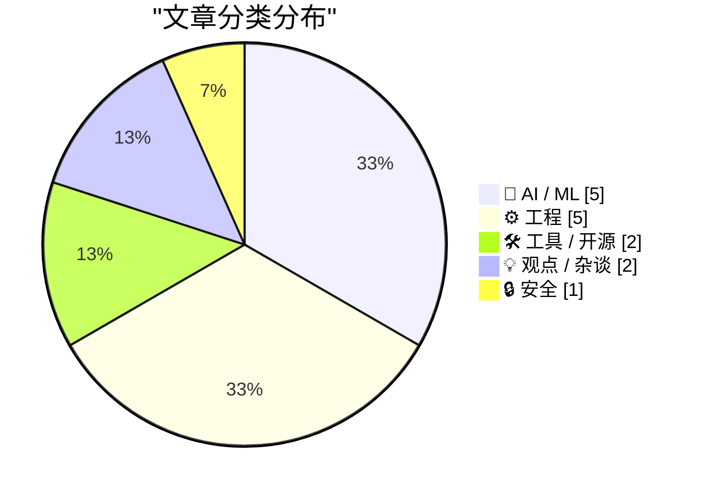
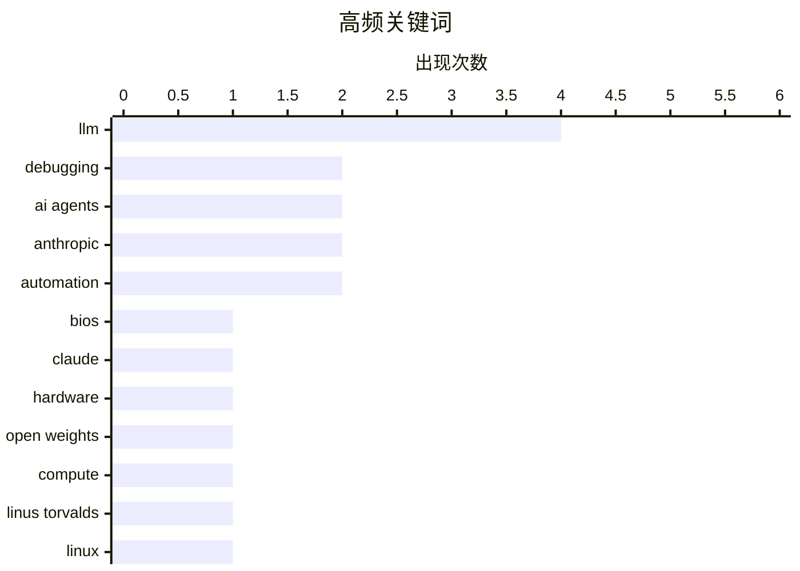

# 📰 Aug 24, 2026

> 来自 Karpathy 推荐的 92 个顶级技术博客，AI 精选 Top 15

## 📝 今日看点

今日技术圈聚焦于 AI 在底层工程领域的深度渗透，从修复 BIOS 漏洞到辅助内核调试，AI 正在重塑开发者的调试与验证范式。与此同时，大模型市场正迎来“开放权重之夏”，算力供应与开源生态的崛起正在挑战顶级厂商的定价权与用户增长。此外，关于 AI 生成内容的水印争议以及高并发架构的持续演进，也反映了技术界在伦理合规与系统性能优化之间的双重探索。

---

## 🏆 今日必读

🥇 **借助 Claude 修复 eMachines EL1200 的 BIOS 漏洞**

[Fixing an eMachines EL1200 BIOS bug with Claude](https://www.downtowndougbrown.com/2026/08/fixing-an-emachines-el1200-bios-bug-with-claude/) — downtowndougbrown.com · 11 小时前 · 🤖 AI / ML

> 作者尝试修复老旧 eMachines EL1200 电脑无法识别 4GB 内存的 BIOS 限制问题。通过使用 Claude 3.5 Sonnet 辅助分析 x86 汇编代码，作者成功定位了 ACPI 表（特别是 DSDT 中的 _CRS 方法）中 PCI 内存映射重叠的错误。在 AI 的帮助下，作者编写了补丁并重新编译了 BIOS 固件，解决了硬件层面的资源分配冲突。最终证明 AI 在处理复杂的低级逆向工程和固件调试任务中具有极高的实用价值。

💡 **为什么值得读**: 展示了如何将 LLM 应用于极其硬核的底层硬件调试和 BIOS 逆向工程，是 AI 辅助开发的深度实践案例。

🏷️ BIOS, Claude, debugging, hardware

🥈 **权重开放之夏**

[The summer of open weights](https://martinalderson.com/posts/the-summer-of-open-weights/?utm_source=rss&amp;utm_medium=rss&amp;utm_campaign=feed) — martinalderson.com · 1 天前 · 🤖 AI / ML

> 文章指出 2026 年夏季已成为开放权重模型（Open Weights）发展的转折点，正如 2025 年是 AI 编码智能体的爆发期。当前 AI 市场的定价权已从模型质量转向算力供应，开放权重模型在性能上正迅速追平闭源商业模型。这种趋势正在改变开发者构建应用的方式，使得本地部署和私有化微调变得更加经济可行。作者认为，模型能力的平民化将导致 AI 基础设施层的竞争进入白热化阶段。

💡 **为什么值得读**: 敏锐捕捉了 AI 行业从“模型为王”向“算力与开放生态”转型的宏观趋势。

🏷️ Open Weights, LLM, Compute

🥉 **引用 Linus Torvalds 关于 AI 调试的看法**

[Quoting Linus Torvalds](https://simonwillison.net/2026/Aug/22/linus-torvalds/) — simonwillison.net · 1 天前 · ⚙️ 工程

> Linus Torvalds 分享了一次极其困难的内核调试经历，期间他利用 AI 处理了大量繁琐的基础工作。尽管 AI 多次断言该问题“不可能解决”并建议放弃，但 Linus 凭借其标志性的固执最终找到了突破口。他将 AI 描述为“不知疲倦的助手”，但也指出目前的 AI 训练数据可能缺乏解决极端复杂问题所需的韧性。这一案例揭示了 AI 在辅助高级专家工作时，既能提高效率又存在认知局限的现状。

💡 **为什么值得读**: 了解 Linux 之父如何看待和使用 AI，以及人类的“固执”在解决顶级技术难题时为何依然不可替代。

🏷️ Linus Torvalds, debugging, AI agents, Linux

---

## 📊 数据概览

| 扫描源 | 抓取文章 | 时间范围 | 精选 |
|:---:|:---:|:---:|:---:|
| 83/92 | 2518 篇 → 23 篇 | 48h | **15 篇** |

### 分类分布



### 高频关键词



<details>
<summary>📈 纯文本关键词图（终端友好）</summary>

```
llm          │ ████████████████████ 4
debugging    │ ██████████░░░░░░░░░░ 2
ai agents    │ ██████████░░░░░░░░░░ 2
anthropic    │ ██████████░░░░░░░░░░ 2
automation   │ ██████████░░░░░░░░░░ 2
bios         │ █████░░░░░░░░░░░░░░░ 1
claude       │ █████░░░░░░░░░░░░░░░ 1
hardware     │ █████░░░░░░░░░░░░░░░ 1
open weights │ █████░░░░░░░░░░░░░░░ 1
compute      │ █████░░░░░░░░░░░░░░░ 1
```

</details>

### 🏷️ 话题标签

**llm**(4) · **debugging**(2) · **ai agents**(2) · anthropic(2) · automation(2) · bios(1) · claude(1) · hardware(1) · open weights(1) · compute(1) · linus torvalds(1) · linux(1) · go(1) · concurrency(1) · networking(1) · server(1) · market strategy(1) · ai business(1) · coding agents(1) · code review(1)

---

## 🤖 AI / ML

### 1. 借助 Claude 修复 eMachines EL1200 的 BIOS 漏洞

[Fixing an eMachines EL1200 BIOS bug with Claude](https://www.downtowndougbrown.com/2026/08/fixing-an-emachines-el1200-bios-bug-with-claude/) — **downtowndougbrown.com** · 11 小时前 · ⭐ 26/30

> 作者尝试修复老旧 eMachines EL1200 电脑无法识别 4GB 内存的 BIOS 限制问题。通过使用 Claude 3.5 Sonnet 辅助分析 x86 汇编代码，作者成功定位了 ACPI 表（特别是 DSDT 中的 _CRS 方法）中 PCI 内存映射重叠的错误。在 AI 的帮助下，作者编写了补丁并重新编译了 BIOS 固件，解决了硬件层面的资源分配冲突。最终证明 AI 在处理复杂的低级逆向工程和固件调试任务中具有极高的实用价值。

🏷️ BIOS, Claude, debugging, hardware

---

### 2. 权重开放之夏

[The summer of open weights](https://martinalderson.com/posts/the-summer-of-open-weights/?utm_source=rss&amp;utm_medium=rss&amp;utm_campaign=feed) — **martinalderson.com** · 1 天前 · ⭐ 25/30

> 文章指出 2026 年夏季已成为开放权重模型（Open Weights）发展的转折点，正如 2025 年是 AI 编码智能体的爆发期。当前 AI 市场的定价权已从模型质量转向算力供应，开放权重模型在性能上正迅速追平闭源商业模型。这种趋势正在改变开发者构建应用的方式，使得本地部署和私有化微调变得更加经济可行。作者认为，模型能力的平民化将导致 AI 基础设施层的竞争进入白热化阶段。

🏷️ Open Weights, LLM, Compute

---

### 3. Anthropic 顶级模型面临廉价工具竞争，用户增长乏力

[Anthropic’s best AI model struggles to attract users as cheaper tools thrive](https://simonwillison.net/2026/Aug/23/anthropics-best-ai-model-struggles-to-attract-users-as-cheaper-t/) — **simonwillison.net** · 10 小时前 · ⭐ 23/30

> 根据《金融时报》披露的数据，Anthropic 7 月份的年化收入已达到 650 亿美元，较 5 月份的 470 亿美元大幅增长。然而，尽管其 Claude 系列模型性能卓越，但在吸引用户方面却面临挑战，因为市场正转向更便宜的替代方案。企业用户在实际应用中往往倾向于选择“足够好”且成本更低的轻量级模型，而非昂贵的顶级模型。这反映出 AI 行业正面临严重的同质化竞争和价格战压力。

🏷️ Anthropic, LLM, market strategy, AI business

---

### 4. Anthropic 推出文本水印技术引发争议

[Cooper Sharp Proves That American Cheese Can Be Great Cheese](https://sixcolors.com/member/2026/08/this-week-in-apple-lets-fight/) — **daringfireball.net** · 13 小时前 · ⭐ 23/30

> Anthropic 最近宣布将对其生成的所有文本进行水印处理，以区分 AI 与人类创作的内容。该技术通过微调模型预测下一个词时的随机性（Logit Bias）来嵌入隐形标记。然而，这一做法遭到了 John Gruber 等技术评论者的强烈反对，认为这干扰了内容的纯粹性。文章探讨了在内容溯源需求与用户体验之间寻找平衡的难度，以及水印技术可能带来的潜在副作用。

🏷️ watermarking, AI safety, Anthropic, content detection

---

### 5. 利用 LLM 构建图标库颜色元数据提取工具

[Getting an LLM to Make Me a Tool for Enriching the Color Metadata in My Icon Collection](https://blog.jim-nielsen.com/2026/use-llm-to-add-color-metadata/) — **blog.jim-nielsen.com** · 12 小时前 · ⭐ 23/30

> 作者分享了如何利用 LLM 自动化处理其图标画廊网站的元数据标注工作。通过编写简单的提示词，LLM 能够准确识别图标的主导颜色（如“蓝色”或“橙色”），并将其转化为结构化数据。这种方法替代了过去多年的人工手动标记，极大地提升了图标分类和搜索的效率。该案例展示了 LLM 在处理特定领域的小型自动化任务时，比编写传统图像处理算法更灵活高效。

🏷️ LLM, metadata, automation

---

## ⚙️ 工程

### 6. 引用 Linus Torvalds 关于 AI 调试的看法

[Quoting Linus Torvalds](https://simonwillison.net/2026/Aug/22/linus-torvalds/) — **simonwillison.net** · 1 天前 · ⭐ 24/30

> Linus Torvalds 分享了一次极其困难的内核调试经历，期间他利用 AI 处理了大量繁琐的基础工作。尽管 AI 多次断言该问题“不可能解决”并建议放弃，但 Linus 凭借其标志性的固执最终找到了突破口。他将 AI 描述为“不知疲倦的助手”，但也指出目前的 AI 训练数据可能缺乏解决极端复杂问题所需的韧性。这一案例揭示了 AI 在辅助高级专家工作时，既能提高效率又存在认知局限的现状。

🏷️ Linus Torvalds, debugging, AI agents, Linux

---

### 7. 并发服务器开发系列（八）：Go 语言篇

[Concurrent Servers: Part 8 - Go](https://eli.thegreenplace.net/2026/concurrent-servers-part-8-go/) — **eli.thegreenplace.net** · 1 天前 · ⭐ 24/30

> 这是并发网络服务器系列的第八部分，重点探讨 Go 语言如何应对高并发挑战。文章对比了前几章中使用的线程模型和 select/epoll 机制，展示了 Go 原生的 goroutine 和 channel 如何简化并发逻辑。通过具体的代码示例，作者演示了 Go 运行时如何高效调度成千上万个轻量级协程，而无需开发者手动管理复杂的线程池。结论认为 Go 的并发哲学显著降低了编写高性能网络服务的门槛。

🏷️ Go, concurrency, networking, server

---

### 8. 超越代码审查：如何高效使用 AI 编码助手

[More than just code review](https://simonwillison.net/2026/Aug/22/more-than-just-code-review/) — **simonwillison.net** · 1 天前 · ⭐ 23/30

> 高效使用 AI 编码助手的核心技能不在于逐行阅读代码，而在于精准的指令下达和结果验证。作者认为，传统的“肉眼审查”并非验证软件变更的最有效方式，开发者应转向基于行为的验证。通过编写自动化测试和利用 AI 生成验证脚本，可以更快速地确保 AI 代理生成的代码符合预期功能。文章强调，开发者的角色正在从“代码编写者”转变为“系统编排者和验证者”。

🏷️ coding agents, code review, AI workflow

---

### 9. Syncthing 与 SQLite 配合使用的陷阱

[A Syncthing and SQLite Gotcha](https://borretti.me/article/a-syncthing-and-sqlite-gotcha) — **borretti.me** · 1 天前 · ⭐ 22/30

> 文章详细分析了在使用 Syncthing 同步 SQLite 数据库文件时可能遇到的数据损坏风险。核心问题源于 SQLite 的原子提交机制依赖于特定的文件重命名（rename）系统调用，而 Syncthing 的同步逻辑可能会在不恰当的时机介入。当同步工具在 SQLite 写入日志或提交事务时移动文件，会导致数据库进入不一致状态。作者建议在同步此类活跃数据库文件时，必须采取额外的锁定或备份策略。

🏷️ SQLite, Syncthing, syscall, database

---

### 10. 像素已死，ch 单位万岁！

[Death to px, long live ch!](https://shkspr.mobi/blog/2026/08/death-to-px-long-live-ch/) — **shkspr.mobi** · 19 小时前 · ⭐ 21/30

> 现代显示技术使得 CSS 中的像素（px）单位成为一种“谎言”，因为它既不对应物理像素，也不具备跨设备的准确性。作者建议开发者弃用 px，转而使用基于字符宽度的 ch 单位，以实现更科学的排版布局。ch 单位以当前字体中字符“0”的宽度为基准，能确保文本容器在不同字体大小下始终保持最佳的阅读行宽。通过将容器宽度设定为 60-80ch，可以显著提升长文本在各类屏幕上的可读性和响应式表现。

🏷️ CSS, web development, typography, pixels

---

## 🛠 工具 / 开源

### 11. llm 0.33 版本发布

[llm 0.33](https://simonwillison.net/2026/Aug/22/llm/) — **simonwillison.net** · 1 天前 · ⭐ 22/30

> Simon Willison 发布了其知名 CLI 工具 llm 的 0.33 版本。本次更新的核心是将 OpenAI Python 库升级至 3.x 版本，并将底层 HTTP 客户端依赖从 httpx 切换到了 httpx2。这些底层库的升级旨在提升请求的稳定性和性能，同时兼容最新的 API 特性。此外，该版本还包含了一些快速修复和小的功能改进，以增强命令行交互体验。

🏷️ Python, CLI, LLM, OpenAI

---

### 12. WorkOS：支持 AI 智能体自动注册你的应用

[WorkOS: Agents Can Now Sign Up for Your App](https://workos.com/auth-md?utm_source=daringfireball&amp;utm_medium=newsletter&amp;utm_campaign=q32026) — **daringfireball.net** · 1 天前 · ⭐ 21/30

> WorkOS 推出的 Agent Registration 功能旨在解决 AI 智能体在传统人类登录流程中因无法处理浏览器交互而流失的问题。开发者只需在 AuthKit 仪表板启用，系统便会发布一个 auth.md 文件供智能体读取。智能体通过该文件可自动注册并获取受控的、短期的访问凭证，无需模拟复杂的浏览器登录过程。这一方案不仅能将智能体流量转化为有效注册，还为开发者提供了针对机器人的细粒度权限管理手段。

🏷️ WorkOS, AI agents, authentication, SaaS

---

## 💡 观点 / 杂谈

### 13. 引用 Drew Breunig：摩尔定律在 AI 领域的终结？

[Quoting Drew Breunig](https://simonwillison.net/2026/Aug/23/drew-breunig/) — **simonwillison.net** · 11 小时前 · ⭐ 21/30

> 随着顶级 AI 模型 Fable 的发布，开发者依靠模型升级来自动修复工程缺陷的时代正在终结。虽然 Fable 性能卓越，但其极高的运行成本迫使开发者重新审视 Opus、5.6 或 K3 等性价比更高的模型。这一转变要求工程师重新投入精力优化代码脚手架（coding harness）和上下文管理策略，而非盲目等待更强的模型。文章指出，当模型性能提升的边际成本过高时，精细化的工程实践将重新成为核心竞争力。

🏷️ AI models, software engineering, productivity, optimization

---

### 14. 荷兰监管机构因 Uber 自动化停用司机账号对其罚款 10 亿美元

[Dutch Regulator Fines Uber $1 Billion for Suspending Dishonest Drivers](https://www.reuters.com/world/dutch-regulator-fines-uber-966-million-automating-driver-suspensions-document-2026-08-21/) — **daringfireball.net** · 1 天前 · ⭐ 21/30

> 荷兰数据保护局 (DPA) 对 Uber 处以 8.25 亿欧元（约 9.66 亿美元）的巨额罚款，理由是其自动化账户停用系统严重违反了 GDPR 规定。调查发现，Uber 在通过算法注销司机账号时，未能向受影响者提供充分的解释和透明度。该罚款金额在 GDPR 历史上排名第二，仅次于 2023 年 Meta 因数据传输问题被罚的 12 亿欧元。此案例再次强调了企业在利用 AI 进行人事决策时，必须遵守算法透明度和人类干预的法律红线。

🏷️ Uber, regulation, GDPR, automation

---

## 🔒 安全

### 15. 欢迎斯里兰卡政府加入 Have I Been Pwned 服务

[Welcoming the Sri Lankan Government to Have I Been Pwned](https://www.troyhunt.com/welcoming-the-sri-lankan-government-to-have-i-been-pwned/) — **troyhunt.com** · 1 天前 · ⭐ 22/30

> 斯里兰卡正式成为第 48 个加入 Have I Been Pwned (HIBP) 免费政府服务的国家。斯里兰卡计算机应急响应小组 (CERT) 现在获权监控其所有政府域名在 HIBP 数据库中的暴露情况。该服务允许政府机构识别已泄露的官方账户，并在新的数据泄露事件涉及政府数据时及时获得预警。此举旨在利用 HIBP 海量的泄露凭据数据，增强斯里兰卡国家级的网络安全防御和响应能力。

🏷️ HIBP, Data Breach, Cyber Security

---

*生成于 2026-08-24 07:10 | 扫描 83 源 → 获取 2518 篇 → 精选 15 篇*
*基于 [Hacker News Popularity Contest 2025](https://refactoringenglish.com/tools/hn-popularity/) RSS 源列表，由 [Andrej Karpathy](https://x.com/karpathy) 推荐*
