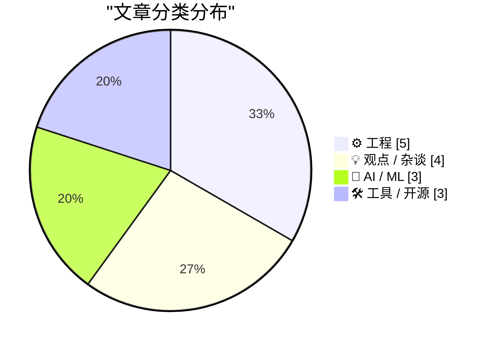
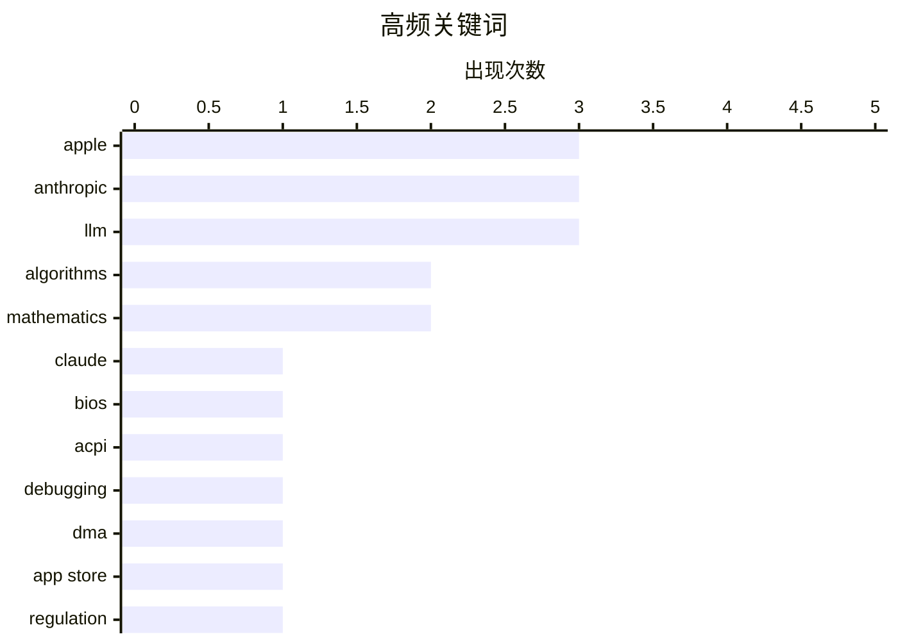

# 📰 Aug 25, 2026

> 来自 Karpathy 推荐的 92 个顶级技术博客，AI 精选 Top 15

## 📝 今日看点

今日技术圈聚焦 AI 的深度应用与市场变局，从辅助硬件逆向工程到引发争议的文本水印技术，AI 正在重塑工程边界，但顶级模型也面临廉价工具的市场冲击。基础工程领域迎来反思，开发者开始质疑像素单位的权威并探索文件格式的跨界玩法，同时苹果在监管压力下不断微调其隐私与市场准入策略。无论是数值计算的稳定性探讨，还是职场情绪管理的深度剖析，都体现了开发者在技术演进中对精确性与职业素养的持续追求。

---

## 🏆 今日必读

🥇 **使用 Claude 修复 eMachines EL1200 的 BIOS 缺陷**

[Fixing an eMachines EL1200 BIOS bug with Claude](https://www.downtowndougbrown.com/2026/08/fixing-an-emachines-el1200-bios-bug-with-claude/) — downtowndougbrown.com · 1 天前 · 🤖 AI / ML

> 探讨了如何利用 AI 工具 Claude 辅助修复老旧硬件 eMachines EL1200 的 BIOS 固件问题。作者通过逆向工程定位了导致硬件限制的 ACPI 表错误，并利用 Claude 辅助编写和验证汇编代码补丁。文章详细记录了从发现 PCI 地址重叠到修改 BIOS 镜像的完整过程，展示了 AI 在底层系统调试中的潜力。最终成功突破了原有的硬件限制，实现了对更大内存或特定硬件的支持。这种方法为缺乏文档的老旧设备维护提供了新的可能性。

💡 **为什么值得读**: 展示了 AI 如何在极具挑战性的底层逆向工程和 BIOS 修复任务中提供实际帮助。

🏷️ Claude, BIOS, ACPI, debugging

🥈 **欧盟《数字市场法案》(DMA) 的意义何在？**

[★ What Is the Point of the DMA?](https://daringfireball.net/2026/08/what_is_the_point_of_the_dma) — daringfireball.net · 8 小时前 · 💡 观点 / 杂谈

> 深入探讨了欧盟《数字市场法案》(DMA) 在面对苹果公司合规策略时的实际效力。尽管 DMA 旨在打破垄断，但苹果仍对通过 App Store 链接到网页的交易收取 15% 的佣金，并对第三方市场应用征收 5% 的“核心技术费”。作者质疑如果开发者仍需支付高额费用且流程受限，DMA 所承诺的竞争与自由是否已经沦为空谈。文章分析了监管政策与大型科技公司商业模式之间的博弈现状。结论认为，目前的合规方案可能并未达到立法者的初衷。

💡 **为什么值得读**: 尖锐地剖析了科技巨头如何通过复杂的收费结构规避反垄断监管的实质影响。

🏷️ DMA, Apple, App Store, regulation

🥉 **你的可执行文件其实是一个 SQLite 数据库**

[Your executable is a SQLite database](https://simonwillison.net/2026/Aug/24/your-executable-is-a-sqlite-database/) — simonwillison.net · 19 小时前 · ⚙️ 工程

> 介绍了一种在 Linux 环境下将 SQLite 数据库文件伪装成可执行二进制文件的奇技淫巧。该方案利用 SQLite 文件格式中偏移量 68 字节处的 4 字节应用 ID，将其设置为代表“结构化可执行与链接格式”的 SELF 标识。通过将 ELF 格式的各个组件嵌入到数据库的特定区域，使得文件既能被系统执行，也能被 SQLite 驱动读取。这种模式为构建自包含的数据驱动型工具提供了一种全新的思路。这种“双重身份”文件在分发小型工具和配套数据时极具优势。

💡 **为什么值得读**: 揭示了一个极具创意的底层文件格式黑客技巧，适合喜欢探索系统底层机制的读者。

🏷️ SQLite, Linux, executable, database

---

## 📊 数据概览

| 扫描源 | 抓取文章 | 时间范围 | 精选 |
|:---:|:---:|:---:|:---:|
| 82/92 | 2504 篇 → 26 篇 | 48h | **15 篇** |

### 分类分布



### 高频关键词



<details>
<summary>📈 纯文本关键词图（终端友好）</summary>

```
apple       │ ████████████████████ 3
anthropic   │ ████████████████████ 3
llm         │ ████████████████████ 3
algorithms  │ █████████████░░░░░░░ 2
mathematics │ █████████████░░░░░░░ 2
claude      │ ███████░░░░░░░░░░░░░ 1
bios        │ ███████░░░░░░░░░░░░░ 1
acpi        │ ███████░░░░░░░░░░░░░ 1
debugging   │ ███████░░░░░░░░░░░░░ 1
dma         │ ███████░░░░░░░░░░░░░ 1
```

</details>

### 🏷️ 话题标签

**apple**(3) · **anthropic**(3) · **llm**(3) · algorithms(2) · mathematics(2) · claude(1) · bios(1) · acpi(1) · debugging(1) · dma(1) · app store(1) · regulation(1) · sqlite(1) · linux(1) · executable(1) · database(1) · ai market(1) · business(1) · authentication(1) · privacy(1)

---

## ⚙️ 工程

### 1. 你的可执行文件其实是一个 SQLite 数据库

[Your executable is a SQLite database](https://simonwillison.net/2026/Aug/24/your-executable-is-a-sqlite-database/) — **simonwillison.net** · 19 小时前 · ⭐ 23/30

> 介绍了一种在 Linux 环境下将 SQLite 数据库文件伪装成可执行二进制文件的奇技淫巧。该方案利用 SQLite 文件格式中偏移量 68 字节处的 4 字节应用 ID，将其设置为代表“结构化可执行与链接格式”的 SELF 标识。通过将 ELF 格式的各个组件嵌入到数据库的特定区域，使得文件既能被系统执行，也能被 SQLite 驱动读取。这种模式为构建自包含的数据驱动型工具提供了一种全新的思路。这种“双重身份”文件在分发小型工具和配套数据时极具优势。

🏷️ SQLite, Linux, executable, database

---

### 2. 苹果重新考虑合并“隐藏邮件”与“通过 Apple 登录”域名的计划

[Apple Rethinks Plan to Merge ‘Hide My Email’ Domain Name With ‘Sign In With Apple’](https://developer.apple.com/news/?id=1ptvdtcm) — **daringfireball.net** · 7 小时前 · ⭐ 23/30

> 苹果公司更新了其开发者文档，宣布调整“通过 Apple 登录”与“隐藏邮件”功能的域名迁移计划。原计划将两者统一迁移至 private.icloud.com，但基于社区反馈，现决定将 iCloud+ 的“隐藏邮件”地址保留在 icloud.com 域名下。新生成的“通过 Apple 登录”地址将从 privaterelay.appleid.com 迁移至新域名，而旧地址将保持有效以确保邮件转发不受影响。这一变动反映了苹果在统一服务品牌与维持现有生态稳定性之间的权衡。开发者需注意相关域名的变化以确保邮件过滤规则的准确性。

🏷️ Apple, authentication, privacy, developer

---

### 3. 像素已死，字符单位 (ch) 万岁！

[Death to px, long live ch!](https://shkspr.mobi/blog/2026/08/death-to-px-long-live-ch/) — **shkspr.mobi** · 1 天前 · ⭐ 22/30

> 批判了在现代 Web 开发中过度依赖像素 (px) 单位的现状，指出像素在高清显示器上已失去其物理意义。文章解释了 CSS 像素与物理像素之间的脱节，以及 1px 在不同设备上表现不一的问题。作者强烈推荐使用 ch 单位，该单位基于当前字体中数字“0”的宽度，能更好地适应排版需求。通过采用相对单位，开发者可以构建出在不同缩放级别和字体设置下更具鲁棒性的响应式布局。这种方法能显著提升网页的可访问性和视觉一致性。

🏷️ CSS, web design, typography, accessibility

---

### 4. 递推关系的数值（不）稳定性

[Numerical (in)stability of recurrence relations](https://www.johndcook.com/blog/2026/08/24/numerical-instability-recurrece/) — **johndcook.com** · 5 小时前 · ⭐ 20/30

> 深入分析了在计算特殊函数时常用的三项递推关系及其潜在的数值稳定性风险。文章以贝塞尔函数 (Bessel functions) 为例，展示了看似简单的递归公式在特定方向计算时可能导致误差迅速放大。作者强调了在数值算法设计中区分“稳定递推”与“不稳定递推”的重要性，并提供了识别这些风险的理论基础。这对于从事科学计算和高性能算法开发的工程师具有重要的指导意义。结论指出，盲目套用公式而不考虑数值稳定性会导致灾难性的精度损失。

🏷️ numerical analysis, algorithms, mathematics, stability

---

### 5. 三项递推公式

[Three-term recurrences](https://www.johndcook.com/blog/2026/08/24/three-term-recurrences/) — **johndcook.com** · 16 小时前 · ⭐ 18/30

> 介绍了数学中广泛存在的“三项递推公式”（Three-term recurrence formula）。这类公式允许通过前两项的线性组合来计算序列中的下一项，其中系数 a 和 b 通常是变量 x 的函数，但与项数 n 无关。文章强调了这种模式在正交多项式和特殊函数计算中的普遍性。掌握这些递推关系对于提高数学建模和数值计算的效率至关重要，是许多复杂函数求值的底层逻辑。

🏷️ mathematics, algorithms, recurrence relations

---

## 💡 观点 / 杂谈

### 6. 欧盟《数字市场法案》(DMA) 的意义何在？

[★ What Is the Point of the DMA?](https://daringfireball.net/2026/08/what_is_the_point_of_the_dma) — **daringfireball.net** · 8 小时前 · ⭐ 24/30

> 深入探讨了欧盟《数字市场法案》(DMA) 在面对苹果公司合规策略时的实际效力。尽管 DMA 旨在打破垄断，但苹果仍对通过 App Store 链接到网页的交易收取 15% 的佣金，并对第三方市场应用征收 5% 的“核心技术费”。作者质疑如果开发者仍需支付高额费用且流程受限，DMA 所承诺的竞争与自由是否已经沦为空谈。文章分析了监管政策与大型科技公司商业模式之间的博弈现状。结论认为，目前的合规方案可能并未达到立法者的初衷。

🏷️ DMA, Apple, App Store, regulation

---

### 7. 愤怒、焦虑与行动力

[Anger, Anxiety and Agency](https://lucumr.pocoo.org/2026/8/24/anger-anxiety-agency/) — **lucumr.pocoo.org** · 1 天前 · ⭐ 21/30

> 探讨了职场中负面情绪的管理，特别是愤怒对个人职业发展和团队氛围的负面影响。作者认同“永远不要在工作中生气”的观点，认为愤怒虽然是某种信号，但通常无法解决问题，反而会削弱周围人的积极性。文章深入分析了愤怒往往源于对现状缺乏控制感（即缺乏 Agency），并建议将情绪转化为建设性的行动。通过调整心态和明确共同愿景，职场人士可以更有效地应对压力和分歧。最终目标是提升个人的行动力而非沉溺于情绪宣泄。

🏷️ career, workplace culture, soft skills, psychology

---

### 8. 引用 Drew Breunig：摩尔定律在 AI 编码领域的终结

[Quoting Drew Breunig](https://simonwillison.net/2026/Aug/23/drew-breunig/) — **simonwillison.net** · 1 天前 · ⭐ 19/30

> 引用了 Drew Breunig 关于 AI 模型演进与编码效率的深度思考。在高性能模型 Fable 出现之前，开发者倾向于等待更便宜、更强大的模型来自动解决编码上下文问题，而非优化自身的工具链。然而，Fable 虽然性能卓越但成本极高，这标志着单纯依靠模型升级来掩盖工程缺陷的时代已经结束。文章指出，开发者现在必须重新关注编码框架（harness）和上下文策略的优化，在 Opus、GLM 等“足够好”的模型与高昂成本之间寻找平衡。

🏷️ AI, Moore's Law, software engineering, productivity

---

### 9. 多元化：加拿大如何帮助美国人并击败美国

[Pluralistic: How Canada can help Americans and defeat America (23 Aug 2026)](https://pluralistic.net/2026/08/24/elbows-really-up/) — **pluralistic.net** · 9 小时前 · ⭐ 18/30

> 探讨了加拿大如何通过挑战美国的企业霸权来维护自身及美国民众的数字权利。文章深入分析了“卡尼主义”（Carneyism）的潜在影响，并串联了巴西抗击艾滋病药物专利、EFF 法律诉讼以及数字版权保护等多个案例。核心观点认为，系统中的摩擦力无法被消除，只能被重新分配，加拿大应在知识产权和数字权利领域采取更激进的立场。通过对历史事件和当前政策的梳理，作者呼吁建立一种能够对抗大科技公司垄断的替代路径。

🏷️ politics, policy, economics, copyright

---

## 🤖 AI / ML

### 10. 使用 Claude 修复 eMachines EL1200 的 BIOS 缺陷

[Fixing an eMachines EL1200 BIOS bug with Claude](https://www.downtowndougbrown.com/2026/08/fixing-an-emachines-el1200-bios-bug-with-claude/) — **downtowndougbrown.com** · 1 天前 · ⭐ 25/30

> 探讨了如何利用 AI 工具 Claude 辅助修复老旧硬件 eMachines EL1200 的 BIOS 固件问题。作者通过逆向工程定位了导致硬件限制的 ACPI 表错误，并利用 Claude 辅助编写和验证汇编代码补丁。文章详细记录了从发现 PCI 地址重叠到修改 BIOS 镜像的完整过程，展示了 AI 在底层系统调试中的潜力。最终成功突破了原有的硬件限制，实现了对更大内存或特定硬件的支持。这种方法为缺乏文档的老旧设备维护提供了新的可能性。

🏷️ Claude, BIOS, ACPI, debugging

---

### 11. Anthropic 顶级模型陷入获客困境，廉价工具正占据市场

[Anthropic’s best AI model struggles to attract users as cheaper tools thrive](https://simonwillison.net/2026/Aug/23/anthropics-best-ai-model-struggles-to-attract-users-as-cheaper-t/) — **simonwillison.net** · 1 天前 · ⭐ 23/30

> 报道了 AI 巨头 Anthropic 在市场竞争中面临的挑战，即顶级模型在廉价替代品的冲击下难以吸引用户。尽管公司 7 月的年化收入已从 5 月的 470 亿美元增长至 650 亿美元，但用户增长速度并未达到预期。市场趋势显示，开发者和企业正转向更具成本效益的中小型模型，而非追求极致性能的旗舰型号。文章通过《金融时报》披露的数据分析了 AI 行业从性能竞赛向商业效率转型的现状。这反映了当前 AI 消耗端对成本敏感度极高的现实。

🏷️ Anthropic, AI market, LLM, business

---

### 12. Anthropic 推出 AI 文本水印技术引发争议

[Cooper Sharp Proves That American Cheese Can Be Great Cheese](https://sixcolors.com/member/2026/08/this-week-in-apple-lets-fight/) — **daringfireball.net** · 1 天前 · ⭐ 20/30

> 讨论了 Anthropic 公司为识别 AI 生成内容而推出的文本水印技术及其引发的争议。该技术通过微调模型预测下一个词时的随机性概率，在生成的文本中嵌入不可见的特征。虽然此举旨在提高 AI 内容的可追溯性，但遭到了包括 John Gruber 在内的部分技术评论家的强烈反对。文章探讨了这种水印技术是否会损害文本的自然度，以及在透明度与用户体验之间应如何取得平衡。这种技术手段可能成为未来 AI 内容监管的标准配置。

🏷️ Anthropic, watermarking, AI safety, LLM

---

## 🛠 工具 / 开源

### 13. llm-anthropic 0.27 版本发布

[llm-anthropic 0.27](https://simonwillison.net/2026/Aug/24/llm-anthropic/) — **simonwillison.net** · 14 小时前 · ⭐ 21/30

> 知名开发者 Simon Willison 发布了其 LLM 工具的 Anthropic 插件 0.27 版本。此次更新的核心是实现了对 Anthropic 官方 Python SDK v1.0.0 的全面兼容。技术栈方面，底层库从 httpx 切换到了 httpx2，这与 OpenAI 插件的近期变动保持了一致。该版本确保了用户在使用命令行调用 Claude 系列模型时能够获得最新的 API 支持和性能优化。对于依赖该 CLI 工具进行 AI 开发的工程师来说，这是一个必要的升级。

🏷️ Anthropic, LLM, CLI, plugin

---

### 14. 每周更新 518：利用 UniFi 打造理想的 IoT 门锁方案

[Weekly Update 518: IoT Doorlock Nirvana with UniFi](https://www.troyhunt.com/weekly-update-518/) — **troyhunt.com** · 1 天前 · ⭐ 20/30

> 探讨了如何利用 Ubiquiti 的 UniFi Access 系列产品打造一套高可靠性的住宅 IoT 门禁系统。该方案的核心在于彻底抛弃电池供电，转而采用 PoE（以太网供电）连接，确保门锁永久在线且响应迅速。通过将企业级硬件引入家庭环境，解决了传统消费级智能锁频繁更换电池、Wi-Fi 连接不稳以及依赖第三方云服务的痛点。作者分享了具体的布线思路和设备选型，证明了 UniFi 生态在高端智能家居实战中的可行性。

🏷️ IoT, UniFi, smart home, security

---

### 15. 再谈 TestFlight 混乱的应用排序逻辑

[More on TestFlight’s Screwy Sort Order](https://daringfireball.net/2026/08/apple_testflight_list_sort_order) — **daringfireball.net** · 15 小时前 · ⭐ 18/30

> 追踪了 Apple TestFlight 应用列表中排序逻辑异常的问题。许多用户反映，原本按更新时间（Recency）排序的列表在近期更新后变成了按字母顺序（Alphabetical）排列，严重影响了寻找最新测试版本的效率。这种变化并非全局性的，部分用户仍保留旧有排序，暗示这可能是一次未公开的 A/B 测试或特定版本的 Bug。文章对比了不同用户的反馈，指出该问题最早可追溯至 2026 年 8 月 13 日的 iPhone 版本更新。

🏷️ TestFlight, iOS, Apple, UX

---

*生成于 2026-08-25 06:59 | 扫描 82 源 → 获取 2504 篇 → 精选 15 篇*
*基于 [Hacker News Popularity Contest 2025](https://refactoringenglish.com/tools/hn-popularity/) RSS 源列表，由 [Andrej Karpathy](https://x.com/karpathy) 推荐*
