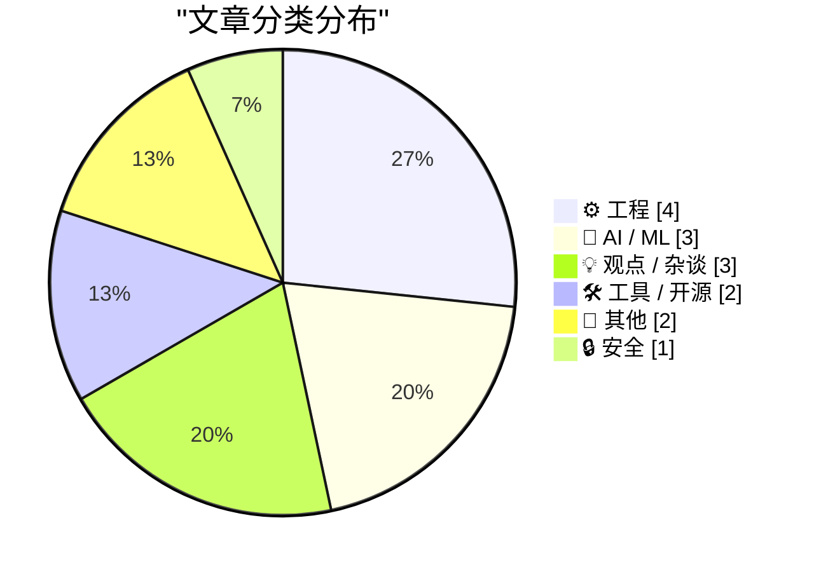
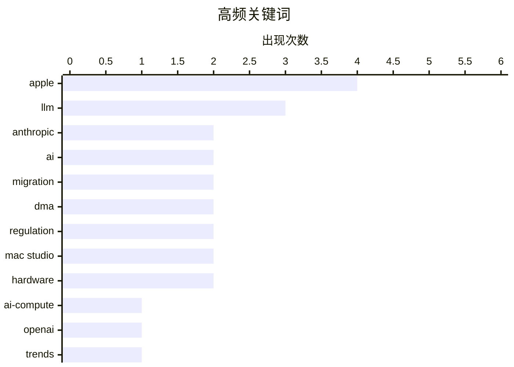

# 📰 Aug 26, 2026

> 来自 Karpathy 推荐的 92 个顶级技术博客，AI 精选 Top 15

## 📝 今日看点

今日技术圈核心聚焦于AI算力资源的极度中心化，OpenAI与Anthropic的垄断趋势引发了关于开发者自主性与行业泡沫的深刻反思。硬件层面，苹果凭借2纳米工艺的M6芯片再次推高算力天花板，而《EVE Online》的Python 3迁移则展示了长青工程在现代化转型中的韧性。同时，围绕欧盟数字市场法案的博弈与“去发明时代”的讨论，揭示了技术进步背后复杂的监管困境与数字资产退化风险。

---

## 🏆 今日必读

🥇 **Dylan Patel：到 2028 年，Anthropic 和 OpenAI 将拥有全球大部分算力**

[Dylan Patel – Anthropic & OpenAI will have most of the world’s compute by 2028](https://www.dwarkesh.com/p/dylan-patel-3) — dwarkesh.com · 15 小时前 · 🤖 AI / ML

> AI 算力资源正在以前所未有的速度向头部厂商集中，预计到 2028 年 Anthropic 和 OpenAI 将占据全球绝大部分算力份额。这种中心化趋势主要由极高的资本支出（CapEx）门槛驱动，领先者通过大规模采购芯片和建设数据中心构建了难以逾越的壁垒。文章深入分析了算力供应链的现状，指出初创公司和小型玩家在算力竞赛中正迅速失去竞争力。最终结论是，AI 行业将演变为由少数几家拥有海量“算力主权”的巨头主导的格局，这种集中化将深刻影响未来的技术准入。

💡 **为什么值得读**: 深入剖析了 AI 算力霸权背后的经济逻辑和未来五年的行业格局演变，是理解大模型竞争终局的重要参考。

🏷️ ai-compute, openai, anthropic, trends

🥈 **待售的“搬起石头砸自己脚”工具**

[Foot Guns for Sale](https://idiallo.com/blog/foot-gun-for-sale) — idiallo.com · 23 小时前 · 🤖 AI / ML

> 针对当前 AI 行业宣扬的“中心化是唯一出路”的叙事提出了尖锐质疑。作者认为，如果开发者仅作为 Prompt 工程师向 OpenAI 或 Anthropic 等“门卫”提交请求，将沦为 API 驱动的封建领地下的租户。文章警示这种模式会削弱开发者的自主权，并指出将核心逻辑外包给黑盒 AI 可能会带来不可预见的系统性风险。作者呼吁开发者应警惕这种被包装成“安全合规”的中心化陷阱，积极寻求更具独立性和可控性的技术路径。

💡 **为什么值得读**: 提供了对主流 AI 商业模式的冷静反思，提醒开发者在拥抱 AI 的同时不要丧失核心技术自主权。

🏷️ AI, LLM, decentralization, software engineering

🥉 **关于数据泄露声明、验证与 Carhartt 的警示故事**

[A Cautionary Tale About Data Breach Claims, Verification and Carhartt](https://www.troyhunt.com/a-cautionary-tale-about-data-breach-claims-verification-and-carhartt/) — troyhunt.com · 9 小时前 · 🔒 安全

> 探讨了在处理数据泄露声明时验证真实性的极端重要性，并以 Carhartt 品牌为例揭示了犯罪分子虚假陈述的套路。网络犯罪分子经常夸大泄露规模或使用旧数据冒充新漏洞，导致企业和安全研究员面临误导。安全专家 Troy Hunt 详细演示了如何通过数据比对、元数据分析等手段拆穿虚假泄露，强调不能仅凭黑客的一面之词就下结论。结论是，在缺乏严谨验证的情况下，任何关于数据泄露的公开声明都应被视为不可信的噪音。

💡 **为什么值得读**: 安全专家 Troy Hunt 分享的实战经验，是了解数据泄露调查流程和反欺诈技巧的必读案例。

🏷️ data breach, verification, cybersecurity, Troy Hunt

---

## 📊 数据概览

| 扫描源 | 抓取文章 | 时间范围 | 精选 |
|:---:|:---:|:---:|:---:|
| 80/92 | 2476 篇 → 38 篇 | 48h | **15 篇** |

### 分类分布



### 高频关键词



<details>
<summary>📈 纯文本关键词图（终端友好）</summary>

```
apple      │ ████████████████████ 4
llm        │ ███████████████░░░░░ 3
anthropic  │ ██████████░░░░░░░░░░ 2
ai         │ ██████████░░░░░░░░░░ 2
migration  │ ██████████░░░░░░░░░░ 2
dma        │ ██████████░░░░░░░░░░ 2
regulation │ ██████████░░░░░░░░░░ 2
mac studio │ ██████████░░░░░░░░░░ 2
hardware   │ ██████████░░░░░░░░░░ 2
ai-compute │ █████░░░░░░░░░░░░░░░ 1
```

</details>

### 🏷️ 话题标签

**apple**(4) · **llm**(3) · **anthropic**(2) · ai(2) · migration(2) · dma(2) · regulation(2) · mac studio(2) · hardware(2) · ai-compute(1) · openai(1) · trends(1) · decentralization(1) · software engineering(1) · data breach(1) · verification(1) · cybersecurity(1) · troy hunt(1) · m6(1) · m5 ultra(1)

---

## ⚙️ 工程

### 1. 苹果发布 M6 和 M5 Ultra 芯片，助力新款 Mac Mini 和 Mac Studio 性能飞跃

[Apple Introduces M6 and M5 Ultra Chips, in New Mac Mini and Mac Studio](https://www.apple.com/newsroom/2026/08/apple-introduces-m6-and-m5-ultra-for-a-big-leap-in-performance-and-ai-compute/) — **daringfireball.net** · 17 小时前 · ⭐ 25/30

> 苹果正式发布了采用 2 纳米工艺的 M6 芯片以及性能强劲的 M5 Ultra，标志着 Mac 系列在 AI 计算能力上的重大突破。M6 芯片配备了 12 核 CPU 和 12 核 GPU，并集成双 16 核神经网络引擎，统一内存带宽高达 170GB/s。新款 Mac mini 搭载 M6 芯片，而 Mac Studio 则升级至 M5 Ultra，旨在为专业创作和本地 AI 模型运行提供极致性能。这次更新通过制程工艺的突破，在提升能效比的同时，大幅强化了端侧 AI 处理的吞吐量。

🏷️ Apple, M6, M5 Ultra, silicon

---

### 2. EVE Online：向 Python 3 迁移的征程开启！

[EVE Online: The Move to Python 3 Begins!](https://simonwillison.net/2026/Aug/25/eve-online-move-to-python-3/) — **simonwillison.net** · 8 小时前 · ⭐ 24/30

> 运行超过二十年的大型多人在线游戏《EVE Online》正式启动了从 Stackless Python 2.7 向 Python 3 的迁移工程。作为 Python 大规模应用的经典案例，该项目自 2003 年发布以来一直依赖 Stackless 变体，上次重大升级已是 16 年前。迁移过程面临巨大的技术债挑战，包括处理数百万行遗留代码以及确保游戏逻辑在异步环境下的稳定性。这次升级不仅是为了获得 Python 3 的现代特性，更是为了解决长期存在的性能瓶颈和维护难题。

🏷️ Python, migration, EVE Online, backend

---

### 3. 你的可执行文件其实是一个 SQLite 数据库

[Your executable is a SQLite database](https://simonwillison.net/2026/Aug/24/your-executable-is-a-sqlite-database/) — **simonwillison.net** · 1 天前 · ⭐ 23/30

> 介绍了一种巧妙的 Linux 技术模式，通过修改 SQLite 文件格式的特定字节，使其能够直接作为可执行的二进制文件运行。该技巧的核心在于将 SQLite 文件偏移 68 字节处的 4 字节应用程序 ID 设置为 "SELF"（代表结构化可执行与链接格式）。通过这种方式，文件既能被 SQLite 引擎识别为合法的数据库，又能被 Linux 内核识别为 ELF 格式的可执行文件。这种“多态”文件格式为分发自带数据的自包含应用程序提供了一种全新的思路。

🏷️ SQLite, Linux, executable, binary

---

### 4. 调试 Ubiquiti 在 AT&T 网络下的 5G 备份方案

[Debugging Ubiquiti's 5G Backup on AT&T](https://www.jeffgeerling.com/blog/2026/unifi-u5g-backup-debugging/) — **jeffgeerling.com** · 11 小时前 · ⭐ 22/30

> Jeff Geerling 在构建移动微型家庭实验室时，尝试将 UniFi U5G-Backup 作为主要的移动网络连接方案。该设备旨在提供 5G 网络备份，但在 AT&T 网络环境下需要特定的调试以确保稳定性。文章详细记录了在移动机架中集成 5G 模块的硬件配置，以及在室内环境下达到 20 Mbps 速率的实测表现。作者通过分析 UniFi 设备的连接逻辑，探讨了如何实现移动 5G 与固定宽带之间的无缝切换。最终指出该方案在移动场景下的潜力及目前面临的配置挑战。

🏷️ Ubiquiti, 5G, networking, homelab

---

## 🤖 AI / ML

### 5. Dylan Patel：到 2028 年，Anthropic 和 OpenAI 将拥有全球大部分算力

[Dylan Patel – Anthropic & OpenAI will have most of the world’s compute by 2028](https://www.dwarkesh.com/p/dylan-patel-3) — **dwarkesh.com** · 15 小时前 · ⭐ 27/30

> AI 算力资源正在以前所未有的速度向头部厂商集中，预计到 2028 年 Anthropic 和 OpenAI 将占据全球绝大部分算力份额。这种中心化趋势主要由极高的资本支出（CapEx）门槛驱动，领先者通过大规模采购芯片和建设数据中心构建了难以逾越的壁垒。文章深入分析了算力供应链的现状，指出初创公司和小型玩家在算力竞赛中正迅速失去竞争力。最终结论是，AI 行业将演变为由少数几家拥有海量“算力主权”的巨头主导的格局，这种集中化将深刻影响未来的技术准入。

🏷️ ai-compute, openai, anthropic, trends

---

### 6. 待售的“搬起石头砸自己脚”工具

[Foot Guns for Sale](https://idiallo.com/blog/foot-gun-for-sale) — **idiallo.com** · 23 小时前 · ⭐ 26/30

> 针对当前 AI 行业宣扬的“中心化是唯一出路”的叙事提出了尖锐质疑。作者认为，如果开发者仅作为 Prompt 工程师向 OpenAI 或 Anthropic 等“门卫”提交请求，将沦为 API 驱动的封建领地下的租户。文章警示这种模式会削弱开发者的自主权，并指出将核心逻辑外包给黑盒 AI 可能会带来不可预见的系统性风险。作者呼吁开发者应警惕这种被包装成“安全合规”的中心化陷阱，积极寻求更具独立性和可控性的技术路径。

🏷️ AI, LLM, decentralization, software engineering

---

### 7. AI 厌恶者宣言

[The AI Hater's Manifesto](https://www.wheresyoured.at/the-ai-haters-manifesto/) — **wheresyoured.at** · 14 小时前 · ⭐ 25/30

> 这是一份针对当前 AI 狂热现象的批判性宣言，深入剖析了 AI 行业在泡沫驱动下的种种弊端。作者 Ed Zitron 认为，当前的 AI 浪潮更多是资本运作的结果，而非真正解决了用户的核心痛点，甚至在破坏互联网的生态平衡。文章详细列举了 AI 生成内容的低质量化、版权争议以及对人类创造力的潜在威胁。作者呼吁读者保持清醒，拒绝被科技巨头的营销叙事裹挟，并重新审视技术进步的真正价值。

🏷️ AI, industry analysis, critique, LLM

---

## 💡 观点 / 杂谈

### 8. Pluralistic：去发明的时代

[Pluralistic: The age of disinvention (25 Aug 2026)](https://pluralistic.net/2026/08/25/gammamax/) — **pluralistic.net** · 3 小时前 · ⭐ 24/30

> Cory Doctorow 提出了“去发明时代”（The age of disinvention）的概念，探讨了技术退化和数字资产消失的现象。文章通过分析“元数据垃圾”（Metacrap）和互联网平台的腐败，指出用户正在失去对数字工具和信息的持久控制权。作者批评了现代科技公司通过 DRM 和订阅制剥夺用户所有权的行为，认为这导致了技术文明的某种倒退。结论是，如果不能建立起有效的数字抗争机制，我们将进入一个功能不断丧失、所有权被剥夺的“技术黑暗时代”。

🏷️ digital rights, monopoly, internet culture

---

### 9. DMA 数字市场法案的意义究竟何在？

[★ What Is the Point of the DMA?](https://daringfireball.net/2026/08/what_is_the_point_of_the_dma) — **daringfireball.net** · 1 天前 · ⭐ 23/30

> 深入探讨了欧盟《数字市场法案》（DMA）在苹果公司实施下的实际效果，质疑其是否真正实现了促进竞争的初衷。尽管法案旨在打破垄断，但苹果通过收取 15% 的网页链接佣金以及 5% 的“核心技术费”（CTF）建立了新的准入壁垒。文章指出，即使开发者选择第三方应用市场或支付渠道，依然无法摆脱苹果的抽成体系，这使得 DMA 的合规性显得极其讽刺。作者认为，目前的执行结果并未给开发者带来真正的自由，反而增加了一层复杂的官僚和财务负担。

🏷️ DMA, Apple, regulation, App Store

---

### 10. 关于 GDPR 与 Cookie 许可弹窗的补充说明

[Footnote Regarding the GDPR and Cookie Permission Prompts](https://daringfireball.net/2026/08/what_is_the_point_of_the_dma#fn1-2026-08-24) — **daringfireball.net** · 15 小时前 · ⭐ 21/30

> 本文是针对欧盟《数字市场法案》（DMA）讨论的深度补充，重点抨击了其前身 GDPR 在实际执行中的弊端。作者指出 GDPR 实施十年来，最显著的成果却是让互联网充斥着令人厌烦的 Cookie 许可弹窗。这种设计不仅没有真正保护隐私，反而极大地破坏了用户体验，被作者戏称为“由欧盟带来的骚扰”。文章认为监管机构对这种现状的默许反映了政策与实际用户感受的脱节。通过这一视角，作者反思了技术监管在保护用户权利与维持易用性之间的矛盾。

🏷️ GDPR, DMA, privacy, regulation

---

## 🛠 工具 / 开源

### 11. llm-anthropic 0.27 版本发布

[llm-anthropic 0.27](https://simonwillison.net/2026/Aug/24/llm-anthropic/) — **simonwillison.net** · 1 天前 · ⭐ 23/30

> Simon Willison 发布了 llm-anthropic 插件的 0.27 版本，主要实现了对 Anthropic 官方 Python SDK v1.0.0 的全面兼容。该版本最核心的技术变化是底层通信库从 `httpx` 切换到了 `httpx2`，这与 Anthropic 最新的 SDK 架构保持一致。此外，更新还优化了与 OpenAI 兼容接口的交互逻辑，提升了在 LLM 命令行工具中调用 Claude 系列模型的稳定性。对于依赖 LLM 工具链进行自动化开发的工程师来说，这是一个必须跟进的基础设施更新。

🏷️ LLM, Anthropic, CLI, plugin

---

### 12. Forgejo 技巧：如何设置 Issue 和 Pull Request 的起始编号

[Forgejo hack: How to set a starting issue and pull request number](https://blog.miguelgrinberg.com/post/forgejo-hack-how-to-set-a-starting-issue-and-pull-request-number) — **miguelgrinberg.com** · 17 小时前 · ⭐ 22/30

> 作者在将开源项目从 GitHub 迁移到自托管 Forgejo 实例的过程中，发现管理界面无法直接修改 Issue 和 PR 的起始编号。通过深入研究 Forgejo 源代码，作者找到了通过直接操作数据库来实现自定义编号的方法。该方案涉及在数据库中修改 issue 表的自增 ID 计数器，以确保迁移后的项目能保持原有的编号序列。文章提供了具体的 SQL 操作思路，解决了迁移过程中版本号不连续的痛点。这对于追求项目历史完整性的自托管用户具有极高的实用价值。

🏷️ Forgejo, git, self-hosting, migration

---

## 📝 其他

### 13. 新一代 Mac Mini (M6/M5 Pro) 与 Mac Studio (M5 Max/M5 Ultra) 内存与存储配置及价格指南

[★ Memory and Storage Configurations and Pricing for the New Mac Minis (M6/M5 Pro) and Mac Studios (M5 Max/M5 Ultra)](https://daringfireball.net/2026/08/configurations_and_pricing_for_new_mac_minis_and_mac_studios) — **daringfireball.net** · 16 小时前 · ⭐ 22/30

> 本文整理了苹果最新发布的 Mac Mini 和 Mac Studio 系列产品的详细配置表格，涵盖 M6、M5 Pro、M5 Max 及 M5 Ultra 芯片版本。作者将复杂的 RAM 和 SSD 升级选项进行了归纳，清晰展示了不同芯片型号所支持的内存上限与存储容量组合。通过对比发现，不同层级的芯片在基础配置和升级溢价上存在显著差异。读者可以直观查阅各档位升级的具体价格，避免在苹果官网复杂的选购页面中迷失。这为计划购买高性能 Mac 桌面设备的用户提供了决策参考。

🏷️ Apple, Mac Mini, Mac Studio, hardware

---

### 14. 关于 M5 Max Mac Studio 起售价的更新说明

[Update Regarding the Base Prices of the M5 Max Mac Studio](https://daringfireball.net/2026/08/configurations_and_pricing_for_new_mac_minis_and_mac_studios) — **daringfireball.net** · 8 小时前 · ⭐ 21/30

> 作者修正了此前关于 M5 Max Mac Studio 起售价的错误信息，并指出了苹果官网购买流程中具有误导性的设计。虽然两款 M5 Max 芯片均搭载 18 核 CPU，但起售价 2,500 美元的入门款配备的是 32 核 GPU。官网将 40 核 GPU 的升级选项标注为“+ $300”，容易让用户误以为该型号起售价更高，而实际上这只是同一芯片层级的内部配置差异。文章揭示了苹果如何通过界面设计隐藏不同 GPU 核心数带来的价格变动。这一更新提醒消费者在下单前需仔细核对具体的 SoC 规格参数。

🏷️ Apple, Mac Studio, M5 Max, hardware

---

## 🔒 安全

### 15. 关于数据泄露声明、验证与 Carhartt 的警示故事

[A Cautionary Tale About Data Breach Claims, Verification and Carhartt](https://www.troyhunt.com/a-cautionary-tale-about-data-breach-claims-verification-and-carhartt/) — **troyhunt.com** · 9 小时前 · ⭐ 26/30

> 探讨了在处理数据泄露声明时验证真实性的极端重要性，并以 Carhartt 品牌为例揭示了犯罪分子虚假陈述的套路。网络犯罪分子经常夸大泄露规模或使用旧数据冒充新漏洞，导致企业和安全研究员面临误导。安全专家 Troy Hunt 详细演示了如何通过数据比对、元数据分析等手段拆穿虚假泄露，强调不能仅凭黑客的一面之词就下结论。结论是，在缺乏严谨验证的情况下，任何关于数据泄露的公开声明都应被视为不可信的噪音。

🏷️ data breach, verification, cybersecurity, Troy Hunt

---

*生成于 2026-08-26 07:00 | 扫描 80 源 → 获取 2476 篇 → 精选 15 篇*
*基于 [Hacker News Popularity Contest 2025](https://refactoringenglish.com/tools/hn-popularity/) RSS 源列表，由 [Andrej Karpathy](https://x.com/karpathy) 推荐*
