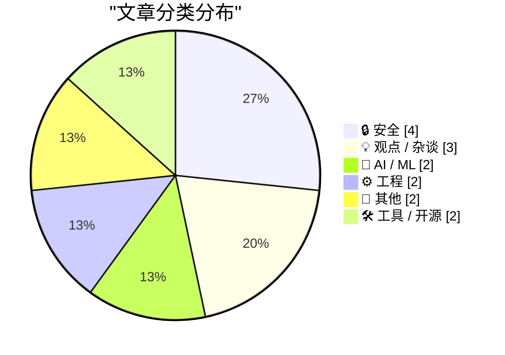
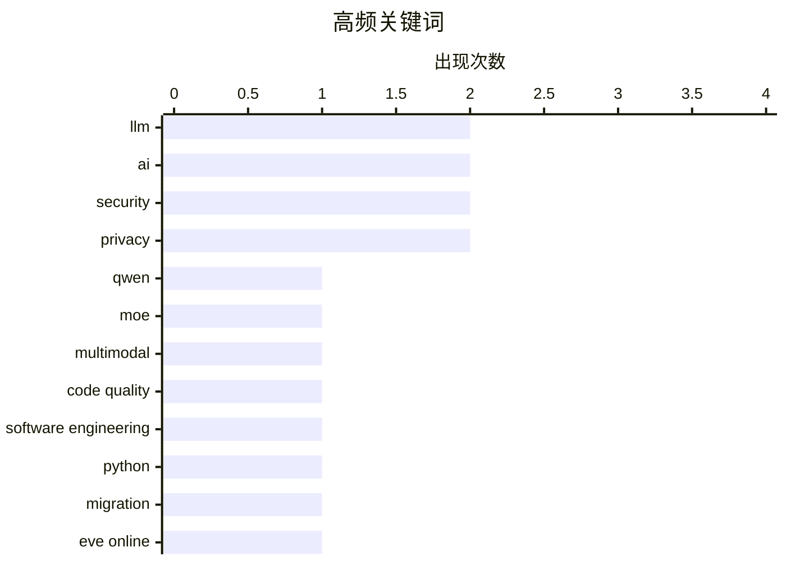

# 📰 Aug 27, 2026

> 来自 Karpathy 推荐的 92 个顶级技术博客，AI 精选 Top 15

## 📝 今日看点

AI 模型架构的持续演进正深刻重塑编程范式，Qwen4 预览版的发布与 AI 生成代码质量的争论，预示着软件工程正面临从“人写”到“机写”的转折点。与此同时，技术债治理与安全防御依然是行业基石，无论是《EVE Online》跨越十六年的 Python 迁移，还是内存安全漏洞与供应链攻击的持续博弈，都凸显了现代系统维护的复杂性。在追求技术突破的同时，开发者也在反思自托管的简约化与网络监管的边界。

---

## 🏆 今日必读

🥇 **Qwen3.8-Flash-Next：Qwen4 架构的先行预览版**

[Qwen3.8-Flash-Next](https://simonwillison.net/2026/Aug/26/qwen38-flash-next/) — simonwillison.net · 17 小时前 · 🤖 AI / ML

> Qwen 发布了全新的多模态混合专家（MoE）模型 Qwen3.8-Flash-Next，该模型被视为 Qwen4 架构设计的早期预览。它拥有 125B 的总参数量，但通过 MoE 机制在推理时仅激活 6B 参数，从而在保持大规模模型能力的同时显著提升了处理速度。目前该模型已提供由 Unsloth 优化的 GGUF 量化版本，支持在 DGX Spark 等硬件上进行本地部署。作者在初步测试中验证了其在多模态任务下的高效表现，认为其代表了下一代开源模型的高效率方向。

💡 **为什么值得读**: 提前窥探 Qwen4 的架构设计，了解如何通过 MoE 架构在 125B 参数规模下实现极高的推理效率。

🏷️ Qwen, MoE, LLM, multimodal

🥈 **AI 编写的软件质量究竟如何？**

[What is the quality of software that AI writes?](https://www.johndcook.com/blog/2026/08/26/what-is-the-quality-of-software-that-ai-writes/) — johndcook.com · 22 小时前 · 🤖 AI / ML

> 随着 AI 编程代理的普及，开发者生产力大幅提升，但其生成的代码质量引发了广泛争议。一种观点认为我们正走向“黑暗软件工厂”时代，源代码将像汇编代码一样不再被人类阅读或检查；而另一种观点则坚持人类必须理解并维护代码逻辑以确保安全。文章探讨了在 AI 辅助开发背景下，代码可维护性、安全性和人类角色的转变。作者指出，虽然 AI 能快速生成功能，但缺乏对复杂系统上下文的深度理解仍是其短板。

💡 **为什么值得读**: 深入思考 AI 时代下“源代码”定义的演变，以及开发者在自动化浪潮中应如何定位自己的核心价值。

🏷️ AI, code quality, software engineering, LLM

🥉 **EVE Online：向 Python 3 迁移的征程正式开启！**

[EVE Online: The Move to Python 3 Begins!](https://simonwillison.net/2026/Aug/25/eve-online-move-to-python-3/) — simonwillison.net · 1 天前 · ⚙️ 工程

> 运行超过 20 年的知名网游《EVE Online》宣布正式启动从 Python 2 到 Python 3 的迁移工程，这是该项目 16 年来最重大的技术升级。自 2003 年发布以来，EVE 一直深度依赖 Stackless Python 框架来处理大规模并发，其核心逻辑长期停留在 Python 2.7 版本。此次迁移不仅是为了摆脱已过时的技术栈，更是为了利用 Python 3 的现代特性提升服务器性能和开发效率。作为 Python 大规模应用的经典案例，其迁移过程对处理遗留系统具有极高的参考价值。

💡 **为什么值得读**: 见证史上最复杂的 Python 遗留系统迁移案例，学习大型在线游戏如何处理长达 20 年的技术债。

🏷️ Python, migration, EVE Online, legacy code

---

## 📊 数据概览

| 扫描源 | 抓取文章 | 时间范围 | 精选 |
|:---:|:---:|:---:|:---:|
| 81/92 | 2486 篇 → 31 篇 | 48h | **15 篇** |

### 分类分布



### 高频关键词



<details>
<summary>📈 纯文本关键词图（终端友好）</summary>

```
llm                  │ ████████████████████ 2
ai                   │ ████████████████████ 2
security             │ ████████████████████ 2
privacy              │ ████████████████████ 2
qwen                 │ ██████████░░░░░░░░░░ 1
moe                  │ ██████████░░░░░░░░░░ 1
multimodal           │ ██████████░░░░░░░░░░ 1
code quality         │ ██████████░░░░░░░░░░ 1
software engineering │ ██████████░░░░░░░░░░ 1
python               │ ██████████░░░░░░░░░░ 1
```

</details>

### 🏷️ 话题标签

**llm**(2) · **ai**(2) · **security**(2) · privacy(2) · qwen(1) · moe(1) · multimodal(1) · code quality(1) · software engineering(1) · python(1) · migration(1) · eve online(1) · legacy code(1) · cve(1) · gzip(1) · memory safety(1) · cybercrime(1) · supply chain attack(1) · data-breach(1) · cybersecurity(1)

---

## 🔒 安全

### 1. “没办法预防”——某类编程语言用户在内存安全漏洞频发时的无奈之举

["No way to prevent this" say users of only language where this regularly happens](https://xeiaso.net/shitposts/no-way-to-prevent-this/memory-safety/CVE-2026-41992/) — **xeiaso.net** · 17 小时前 · ⭐ 24/30

> 文章针对 GNU gzip 披露的 CVE-2026-41992 内存安全漏洞进行了讽刺性评述，该漏洞源于 LZH 解码器在处理并发调用时未重置共享全局缓冲区。攻击者可以通过触发越界读取（Out-of-bound reads）来读取敏感数据，这暴露了 C 语言在内存管理上的固有缺陷。作者借此讽刺那些坚持使用非内存安全语言却在漏洞爆发时声称“无法预防”的开发者。文章强调，这类由于全局变量状态残留导致的漏洞在现代内存安全语言中本可以完全避免。

🏷️ security, CVE, gzip, memory safety

---

### 2. 两名“TeamPCP”黑客嫌疑人在澳大利亚被捕

[Two Alleged ‘TeamPCP’ Hackers Arrested in Australia](https://krebsonsecurity.com/2026/08/two-alleged-teampcp-hackers-arrested-in-australia/) — **krebsonsecurity.com** · 6 小时前 · ⭐ 23/30

> 澳大利亚联邦警察（AFP）近日逮捕了两名年龄分别为 21 岁和 23 岁的男子，指控其为臭名昭著的黑客组织 TeamPCP 的成员。该组织被认为是历史上持续时间最长的软件供应链攻击的发起者，通过创建和分发恶意开源软件来窃取全球数千名用户的数据。TeamPCP 擅长在流行的包管理器中植入后门，利用开发者对开源生态的信任进行大规模渗透。此次逮捕行动标志着打击针对开源基础设施的复杂网络犯罪取得了重大进展。

🏷️ cybercrime, supply chain attack, security

---

### 3. 关于数据泄露声明、验证与 Carhartt 品牌的警示录

[A Cautionary Tale About Data Breach Claims, Verification and Carhartt](https://www.troyhunt.com/a-cautionary-tale-about-data-breach-claims-verification-and-carhartt/) — **troyhunt.com** · 1 天前 · ⭐ 23/30

> 网络安全专家 Troy Hunt 通过 Carhartt 品牌疑似泄露的案例，探讨了验证黑客组织数据泄露声明的复杂性。他指出，犯罪分子经常夸大泄露规模或使用旧数据冒充新漏洞，以提升自身名望或勒索赎金。文章详细介绍了如何通过样本比对、哈希验证等手段识别虚假泄露，并强调了在未经验证前盲目传播泄露消息的危害。作者提醒企业和用户，面对所谓的“重大数据泄露”时应保持审慎，依赖专业平台的验证结果。

🏷️ data-breach, cybersecurity, verification

---

### 4. 荷兰新情报与安全服务法：现有权限与设立初衷

[Nieuwe wet Inlichtingen- en veiligheidsdiensten: wat mogen ze nu al en waar zijn ze voor](https://berthub.eu/articles/posts/geheime-veiligheids-en-inlichtingendiensten/) — **berthub.eu** · 7 小时前 · ⭐ 22/30

> 荷兰政府即将出台关于 AIVD 和 MIVD 的新情报法案，引发了公众对隐私与国家安全边界的激烈讨论。文章批评了情报部门近期的一系列失误，包括错误的逮捕行动、关于俄乌冲突的误导性信息以及对海量公民数据的处理不当。尽管现有的监听计划规模庞大，但其实际产出的有效情报却寥寥无几，这让人们对扩大监控权限的必要性产生怀疑。作者呼吁对新法案进行严格审查，以防止权力的进一步滥用和对个人隐私的侵蚀。

🏷️ privacy, surveillance, legislation

---

## 💡 观点 / 杂谈

### 5. 引用 Paul Dix：编程的终结？

[Quoting Paul Dix](https://simonwillison.net/2026/Aug/26/paul-dix/) — **simonwillison.net** · 1 天前 · ⭐ 22/30

> 文章引用了 InfluxData 创始人 Paul Dix 关于 AI 改变软件工程的观点，重点讨论了 AI 编写并优化百万行代码（1M LOC）的惊人能力。Dix 认为，尽管 AI 在迁移代码时可能有“参考答案”，但其生成并精炼出能在数百万台机器上稳定运行的软件，标志着编程范式的根本转变。这种规模的自动化不仅是效率的提升，更是对传统“程序员”定义的挑战。作者认为，我们正处于一个“编程终结”或至少是编程本质重构的转折点。

🏷️ AI, software development, automation

---

### 6. 自托管能变得简单吗？

[Can Self-Hosting Be Simple?](https://feed.tedium.co/link/15204/17432610/self-hosting-third-place-strategy) — **tedium.co** · 14 小时前 · ⭐ 22/30

> 许多自托管（Self-hosting）项目往往因为过度配置而变得极其复杂，文章探讨了是否可以通过“少即是多”的原则来实现简约化。作者分享了构建“第三空间”服务器的尝试，旨在寻找易于维护且功能够用的平衡点，而非追求极致的性能或复杂的容器编排。通过精简服务列表和选择轻量化工具，作者证明了自托管可以回归服务生活的本质，而不是变成另一份全职工作。文章为那些被复杂技术栈劝退的爱好者提供了一套实用的减法思维。

🏷️ self-hosting, homelab, simplicity

---

### 7. Pluralistic：去发明时代

[Pluralistic: The age of disinvention (25 Aug 2026)](https://pluralistic.net/2026/08/25/gammamax/) — **pluralistic.net** · 1 天前 · ⭐ 21/30

> Cory Doctorow 在本文中探讨了“去发明时代”（The age of disinvention）的概念，反思了技术退化与数字腐败的现状。文章通过 GammaMax 等案例，分析了现代科技产品如何在商业利益驱动下逐渐丧失原有功能或变得不可用。内容涵盖了对 Metacrap（元数据垃圾）的持续批判，以及对 CmdrTaco 等互联网先驱退出的观察。作者呼吁读者关注数字资产的持久性问题，警惕那些以“创新”之名行“剥夺”之实的技术趋势。这种“去发明”现象正在侵蚀互联网的开放性与可用性。

🏷️ monopoly, disinvention, technology, society

---

## 🤖 AI / ML

### 8. Qwen3.8-Flash-Next：Qwen4 架构的先行预览版

[Qwen3.8-Flash-Next](https://simonwillison.net/2026/Aug/26/qwen38-flash-next/) — **simonwillison.net** · 17 小时前 · ⭐ 26/30

> Qwen 发布了全新的多模态混合专家（MoE）模型 Qwen3.8-Flash-Next，该模型被视为 Qwen4 架构设计的早期预览。它拥有 125B 的总参数量，但通过 MoE 机制在推理时仅激活 6B 参数，从而在保持大规模模型能力的同时显著提升了处理速度。目前该模型已提供由 Unsloth 优化的 GGUF 量化版本，支持在 DGX Spark 等硬件上进行本地部署。作者在初步测试中验证了其在多模态任务下的高效表现，认为其代表了下一代开源模型的高效率方向。

🏷️ Qwen, MoE, LLM, multimodal

---

### 9. AI 编写的软件质量究竟如何？

[What is the quality of software that AI writes?](https://www.johndcook.com/blog/2026/08/26/what-is-the-quality-of-software-that-ai-writes/) — **johndcook.com** · 22 小时前 · ⭐ 26/30

> 随着 AI 编程代理的普及，开发者生产力大幅提升，但其生成的代码质量引发了广泛争议。一种观点认为我们正走向“黑暗软件工厂”时代，源代码将像汇编代码一样不再被人类阅读或检查；而另一种观点则坚持人类必须理解并维护代码逻辑以确保安全。文章探讨了在 AI 辅助开发背景下，代码可维护性、安全性和人类角色的转变。作者指出，虽然 AI 能快速生成功能，但缺乏对复杂系统上下文的深度理解仍是其短板。

🏷️ AI, code quality, software engineering, LLM

---

## ⚙️ 工程

### 10. EVE Online：向 Python 3 迁移的征程正式开启！

[EVE Online: The Move to Python 3 Begins!](https://simonwillison.net/2026/Aug/25/eve-online-move-to-python-3/) — **simonwillison.net** · 1 天前 · ⭐ 25/30

> 运行超过 20 年的知名网游《EVE Online》宣布正式启动从 Python 2 到 Python 3 的迁移工程，这是该项目 16 年来最重大的技术升级。自 2003 年发布以来，EVE 一直深度依赖 Stackless Python 框架来处理大规模并发，其核心逻辑长期停留在 Python 2.7 版本。此次迁移不仅是为了摆脱已过时的技术栈，更是为了利用 Python 3 的现代特性提升服务器性能和开发效率。作为 Python 大规模应用的经典案例，其迁移过程对处理遗留系统具有极高的参考价值。

🏷️ Python, migration, EVE Online, legacy code

---

### 11. 调试 Ubiquiti 在 AT&T 网络下的 5G 备份方案

[Debugging Ubiquiti's 5G Backup on AT&T](https://www.jeffgeerling.com/blog/2026/unifi-u5g-backup-debugging/) — **jeffgeerling.com** · 1 天前 · ⭐ 21/30

> 知名博主 Jeff Geerling 分享了他在构建移动“微型家庭实验室”时，调试 Ubiquiti UniFi 5G 备份网关的实战经历。他试图将 5G 作为移动场景下的主连接，但在接入 AT&T 网络时遇到了性能瓶颈，实测速率仅为 20 Mbps。文章详细记录了排查天线信号、运营商限速以及 UniFi 设备配置问题的过程，并探讨了如何优化移动网络切换逻辑。这为需要在移动环境部署高可用网络架构的开发者提供了宝贵的硬件选型与调试经验。

🏷️ networking, 5G, Ubiquiti, debugging

---

## 📝 其他

### 12. 苹果官宣“惊喜闪耀”发布会：9 月 9 日见

[‘Surprise and Shine’ Apple Event: Wednesday 9 September](https://9to5mac.com/2026/08/26/apple-officially-announces-iphone-18-pro-foldable-event/) — **daringfireball.net** · 22 小时前 · ⭐ 21/30

> 苹果正式宣布将于太平洋时间 9 月 9 日上午 10 点举行新品发布会，口号为“惊喜闪耀”（Surprise and shine）。本次活动的核心看点是 iPhone 18 Pro 系列以及苹果首款折叠屏 iPhone 的正式亮相。由于 9 月第二周恰逢美国劳动节，苹果将惯例的周二发布会调整至周三举行。邀请函采用了发光的苹果 Logo 结合阳光穿透的设计元素，暗示了显示技术或影像系统的重大升级。这是苹果首次进入折叠屏市场，标志着其产品线的重大战略调整。

🏷️ Apple, iPhone, hardware

---

### 13. Twitter/X 镜像服务 XCancel 因收到 X Corp 律师函宣布关停

[XCancel, the Twitter/X Mirror, Shuts Down After Cease and Desist From the Fine Folks at X Corp](https://xcancel.com/) — **daringfireball.net** · 1 天前 · ⭐ 21/30

> 隐私友好的 Twitter/X 镜像服务 XCancel 在收到 X Corp 发出的停止并终止（Cease and Desist）律师函后，已于 8 月 24 日正式停止服务。该服务在过去两年中为用户提供了无需登录即可浏览推文的替代方案，目前开发者正寻求法律建议。知名博主 John Gruber 指出，此类第三方镜像服务一直面临巨大的法律风险，这也是他此前未将其作为主要链接来源的原因。此事件标志着 X 平台对第三方数据访问和展示的管控进一步收紧，第三方生态空间被进一步压缩。

🏷️ Twitter, legal, API, privacy

---

## 🛠 工具 / 开源

### 14. Microlighter：利用 CSS Custom Highlights API 实现轻量化语法高亮

[Have You Heard the Good News About Microlighter?](https://blog.jim-nielsen.com/2026/shipping-microlighter/) — **blog.jim-nielsen.com** · 1 天前 · ⭐ 21/30

> 开发者 Dave Rupert 推出了名为 Microlighter 的轻量化语法高亮工具，旨在利用现代浏览器的 CSS Custom Highlights API 替代传统的 DOM 注入方案。该方案通过 JavaScript 定义文本范围并使用 CSS ::highlight() 伪元素进行样式渲染，显著减少了页面 DOM 节点的数量。Jim Nielsen 在该工具发布当天即在个人博客中完成了集成 PR，验证了其在生产环境的可行性。这种方法不仅提升了渲染性能，还避免了传统高亮库带来的复杂 HTML 结构污染，是 Web 标准演进的典型应用。

🏷️ syntax highlighting, Web API, frontend

---

### 15. VS Code 远程连接失效？请降级至 v1.124.x 版本

[If your VS Code remotes stopped working, downgrade to v1.124.x](https://xeiaso.net/notes/2026/vscode-remotes-not-working-downgrade/) — **xeiaso.net** · 1 天前 · ⭐ 20/30

> 近期 VS Code 的更新导致大量用户的远程开发（Remote Development）功能出现故障，无法正常连接服务器。受影响的用户在尝试连接 SSH 或容器环境时会遇到连接中断或插件加载失败的问题。目前的临时解决方案是将 VS Code 客户端及相关远程插件降级至 v1.124.x 稳定版本。作者强调在官方发布修复补丁之前，手动回滚版本是恢复生产力的唯一可靠途径。这一问题再次引发了开发者对软件自动更新机制稳定性的讨论。

🏷️ VS Code, remote development, bug fix, IDE

---

*生成于 2026-08-27 17:34 | 扫描 81 源 → 获取 2486 篇 → 精选 15 篇*
*基于 [Hacker News Popularity Contest 2025](https://refactoringenglish.com/tools/hn-popularity/) RSS 源列表，由 [Andrej Karpathy](https://x.com/karpathy) 推荐*
