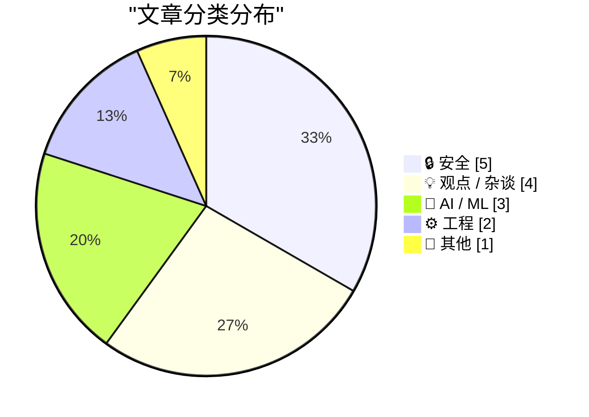
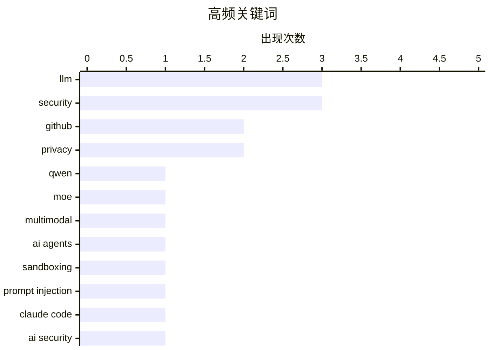

# 📰 Aug 28, 2026

> 来自 Karpathy 推荐的 92 个顶级技术博客，AI 精选 Top 15

## 📝 今日看点

今日技术圈聚焦于 AI 架构的迭代与安全治理，Qwen 预览版展示了 MoE 架构的效能潜力，而 AI 编程代理的普及正推动沙箱隔离与代码质量评估成为核心议题。网络安全领域依然面临严峻挑战，从 C 语言项目的顽固内存漏洞到针对供应链攻击的法律制裁，凸显了底层防御与监管合规的紧迫性。此外，权威硬件媒体 Anandtech 的突然谢幕与 Anthropic 卷入的国防部禁令纠纷，折射出技术行业正处于深度转型与政策博弈的交汇点。

---

## 🏆 今日必读

🥇 **Qwen3.8-Flash-Next：Qwen4 架构的早期预览版**

[Qwen3.8-Flash-Next](https://simonwillison.net/2026/Aug/26/qwen38-flash-next/) — simonwillison.net · 1 天前 · 🤖 AI / ML

> Qwen 发布了全新的多模态混合专家模型 (MoE) Qwen3.8-Flash-Next，该模型被视为 Qwen4 架构的早期预览版。它拥有 125B 的总参数量，但通过 MoE 架构仅需 6B 激活参数，在保持高性能的同时显著提升了推理效率。该模型支持多模态输入，并已在 DGX Spark 等硬件上通过 Unsloth 量化版本进行了初步测试。作者认为这种“大总参数、小激活量”的策略是未来大模型兼顾能力与速度的关键方向。

💡 **为什么值得读**: 提前了解 Qwen4 的架构雏形，并掌握 MoE 模型在降低推理成本方面的最新进展。

🏷️ Qwen, MoE, LLM, multimodal

🥈 **为编程代理构建安全沙箱**

[Sandboxing coding agents](https://micahflee.com/sandboxing-coding-agents/) — micahflee.com · 22 小时前 · 🔒 安全

> 随着 AI 编程代理的普及，如何在保证生产力的同时防止其对本地系统造成安全威胁成为核心挑战。文章详细介绍了为编程代理构建隔离沙箱的技术方案，确保代理仅能访问特定的 GitHub 仓库。通过容器化或虚拟机技术限制代理的执行权限，可以有效防止恶意代码注入或意外的系统破坏。作者强调，安全沙箱是企业级 AI 辅助开发流程中不可或缺的基础设施。

💡 **为什么值得读**: 针对 AI 编程代理的安全风险提供了实用的隔离方案，适合关注开发安全的工程师。

🏷️ AI agents, sandboxing, security, GitHub

🥉 **破解 Claude Code Opus 5 的自动模式**

[Breaking Claude Code Opus 5 Auto Mode](https://simonwillison.net/2026/Aug/27/breaking-claude-code-opus-5-auto-mode/) — simonwillison.net · 19 小时前 · 🔒 安全

> 安全专家 Johann Rehberger 成功破解了 Anthropic 为 Claude Code 推出的“自动模式”（Auto Mode），挑战了官方关于该模式能有效防御提示词注入攻击的声明。Anthropic 此前将自动模式设为默认选项，并宣称其具备极高的安全性，但实测证明攻击者仍能绕过限制。文章深入探讨了编程代理在执行自动化任务时面临的信任边界问题。作者指出，过度依赖 AI 自我防御机制而缺乏外部硬性约束是目前 AI 工具的一大安全隐患。

💡 **为什么值得读**: 揭示了顶级 AI 编程工具在安全防御上的局限性，提醒开发者警惕 AI 自动化的潜在风险。

🏷️ prompt injection, Claude Code, AI security, LLM

---

## 📊 数据概览

| 扫描源 | 抓取文章 | 时间范围 | 精选 |
|:---:|:---:|:---:|:---:|
| 83/92 | 2525 篇 → 37 篇 | 48h | **15 篇** |

### 分类分布



### 高频关键词



<details>
<summary>📈 纯文本关键词图（终端友好）</summary>

```
llm              │ ████████████████████ 3
security         │ ████████████████████ 3
github           │ █████████████░░░░░░░ 2
privacy          │ █████████████░░░░░░░ 2
qwen             │ ███████░░░░░░░░░░░░░ 1
moe              │ ███████░░░░░░░░░░░░░ 1
multimodal       │ ███████░░░░░░░░░░░░░ 1
ai agents        │ ███████░░░░░░░░░░░░░ 1
sandboxing       │ ███████░░░░░░░░░░░░░ 1
prompt injection │ ███████░░░░░░░░░░░░░ 1
```

</details>

### 🏷️ 话题标签

**llm**(3) · **security**(3) · **github**(2) · privacy(2) · qwen(1) · moe(1) · multimodal(1) · ai agents(1) · sandboxing(1) · prompt injection(1) · claude code(1) · ai security(1) · anthropic(1) · ai safety(1) · legal(1) · pentagon(1) · memory safety(1) · c(1) · vulnerability(1) · anandtech(1)

---

## 🔒 安全

### 1. 为编程代理构建安全沙箱

[Sandboxing coding agents](https://micahflee.com/sandboxing-coding-agents/) — **micahflee.com** · 22 小时前 · ⭐ 26/30

> 随着 AI 编程代理的普及，如何在保证生产力的同时防止其对本地系统造成安全威胁成为核心挑战。文章详细介绍了为编程代理构建隔离沙箱的技术方案，确保代理仅能访问特定的 GitHub 仓库。通过容器化或虚拟机技术限制代理的执行权限，可以有效防止恶意代码注入或意外的系统破坏。作者强调，安全沙箱是企业级 AI 辅助开发流程中不可或缺的基础设施。

🏷️ AI agents, sandboxing, security, GitHub

---

### 2. 破解 Claude Code Opus 5 的自动模式

[Breaking Claude Code Opus 5 Auto Mode](https://simonwillison.net/2026/Aug/27/breaking-claude-code-opus-5-auto-mode/) — **simonwillison.net** · 19 小时前 · ⭐ 25/30

> 安全专家 Johann Rehberger 成功破解了 Anthropic 为 Claude Code 推出的“自动模式”（Auto Mode），挑战了官方关于该模式能有效防御提示词注入攻击的声明。Anthropic 此前将自动模式设为默认选项，并宣称其具备极高的安全性，但实测证明攻击者仍能绕过限制。文章深入探讨了编程代理在执行自动化任务时面临的信任边界问题。作者指出，过度依赖 AI 自我防御机制而缺乏外部硬性约束是目前 AI 工具的一大安全隐患。

🏷️ prompt injection, Claude Code, AI security, LLM

---

### 3. “无法预防”：内存安全漏洞再次席卷 C 语言项目

["No way to prevent this" say users of only language where this regularly happens](https://xeiaso.net/shitposts/no-way-to-prevent-this/memory-safety/CVE-2026-41992/) — **xeiaso.net** · 1 天前 · ⭐ 25/30

> GNU gzip 项目近期披露了编号为 CVE-2026-41992 的安全漏洞，该漏洞源于 LZH 解码器在处理共享全局缓冲区时的逻辑错误。当在同一次调用中解压两个文件时，由于缓冲区未正确重置，攻击者可触发越界读取（Out-of-bound reads）。文章以讽刺的口吻指出，这类内存安全问题在 C 语言编写的项目中屡见不鲜，却常被视为“无法避免”。作者借此案例再次呼吁开发者关注内存安全语言（如 Rust）在系统级工具开发中的必要性。

🏷️ Memory Safety, C, Vulnerability, Security

---

### 4. 两名 TeamPCP 黑客在澳大利亚被捕

[Two Alleged ‘TeamPCP’ Hackers Arrested in Australia](https://krebsonsecurity.com/2026/08/two-alleged-teampcp-hackers-arrested-in-australia/) — **krebsonsecurity.com** · 1 天前 · ⭐ 24/30

> 澳大利亚联邦警察近日逮捕了两名涉嫌属于“TeamPCP”黑客组织的成员，该组织被指控策划了历史上持续时间最长的软件供应链攻击。这两名年轻嫌疑人通过创建恶意的开源软件，诱导数千名用户下载，进而实施数据勒索和资产窃取。警方称该犯罪团伙的手段极其复杂，利用了开发者对开源生态系统的信任。此案再次敲响了开源软件安全性的警钟，强调了对第三方依赖库进行严格审计的重要性。

🏷️ cybercrime, supply chain attack, security, TeamPCP

---

### 5. 荷兰新情报法案：职权范围与社会争议

[Nieuwe wet Inlichtingen- en veiligheidsdiensten: wat mogen ze nu al en waar zijn ze voor](https://berthub.eu/articles/posts/geheime-veiligheids-en-inlichtingendiensten/) — **berthub.eu** · 1 天前 · ⭐ 24/30

> 荷兰政府近期推出了针对情报与安全机构（AIVD 和 MIVD）的新法律草案，引发了公众对隐私与监管权力的广泛讨论。文章指出，这些机构近期在数据处理上表现草率，甚至因错误情报导致误捕，其在乌克兰局势中的信息准确性也遭到质疑。新法案旨在明确机构的职权范围，但批评者担心这会赋予政府过度访问海量个人数据的权限。作者呼吁社会必须对情报机构的权力扩张保持高度警惕和严厉审查。

🏷️ surveillance, privacy, legislation, intelligence

---

## 💡 观点 / 杂谈

### 6. Anandtech 于 2024 年 8 月 30 日突然关闭

[Anandtech shut down abruptly, August 30, 2024](https://dfarq.homeip.net/anandtech-shut-down-abruptly-august-30-2024/?utm_source=rss&#038;utm_medium=rss&#038;utm_campaign=anandtech-shut-down-abruptly-august-30-2024) — **dfarq.homeip.net** · 7 小时前 · ⭐ 25/30

> 拥有 27 年历史的权威硬件评测网站 Anandtech 于 2024 年 8 月 30 日突然宣布停止运营，标志着深度硬件分析时代的终结。该网站自 1997 年创立以来，以其极其详尽的 CPU、GPU 和系统架构评测成为科技媒体的标杆。文章回顾了 Anandtech 在半导体行业报道中的重要地位，以及它对一代硬件发烧友的深远影响。作者认为，在快节奏的短视频时代，这种高质量、长篇幅的技术分析正面临严峻的生存挑战。

🏷️ Anandtech, hardware, journalism, tech history

---

### 7. AI 编写的软件质量究竟如何？

[What is the quality of software that AI writes?](https://www.johndcook.com/blog/2026/08/26/what-is-the-quality-of-software-that-ai-writes/) — **johndcook.com** · 1 天前 · ⭐ 23/30

> 随着 AI 编程代理显著提升开发效率，其生成的代码质量引发了技术界的激烈争论。一种观点认为源代码正演变为“新时代的汇编语言”，未来将由 AI 自动维护而无需人类检查；另一种观点则坚持人类必须对代码质量负责，以防止技术债的无限堆积。文章探讨了“黑暗软件工厂”的概念，即代码完全由机器生成且不可读的极端场景。作者最终引导读者思考，在追求速度的同时，如何平衡系统的可维护性与安全性。

🏷️ AI coding, code quality, software engineering

---

### 8. 循环融资黑粉指南（第一部分）

[Premium: The Hater's Guide To Circular Financing (Part One)](https://www.wheresyoured.at/premium-the-haters-guide-to-circular-financing-part-one/) — **wheresyoured.at** · 2 小时前 · ⭐ 23/30

> 揭示了当前 AI 泡沫中 NVIDIA 与其核心客户之间复杂的“循环融资”模式。AI 初创公司通过风投获得巨额资金，随后立即将其用于购买 NVIDIA 的昂贵 GPU，从而推高 NVIDIA 的营收和股价。这种模式本质上是资本在闭环内流动，而非通过实际产品产生可持续利润。文章质疑这种依赖资本注入而非市场需求的增长是否具有长期稳定性，并对 Jensen Huang 领导下的 NVIDIA 市场策略提出了尖锐批评。

🏷️ NVIDIA, AI industry, finance

---

### 9. 从谁在反对 GDPR 就能看出它是项好政策

[You Know GDPR Is Good Based on Who Hates It](https://matduggan.com/you-know-gdpr-is-good-based-on-who-hates-it/) — **matduggan.com** · 6 小时前 · ⭐ 22/30

> 文章通过类比富兰克林·罗斯福和林肯的政治遗产，探讨了 GDPR（通用数据保护条例）的社会价值。作者认为，判断一项政策是否成功的有效标准是看谁在强烈反对它，而科技巨头对 GDPR 的普遍敌视恰恰证明了其在保护个人隐私方面的有效性。尽管合规过程繁琐，但它迫使企业在处理用户数据时必须更加透明和负责。这种从“敌人”的反应来评估政策效果的视角，为评价隐私立法提供了一个独特的政治经济学维度。

🏷️ GDPR, privacy, regulation, policy

---

## 🤖 AI / ML

### 10. Qwen3.8-Flash-Next：Qwen4 架构的早期预览版

[Qwen3.8-Flash-Next](https://simonwillison.net/2026/Aug/26/qwen38-flash-next/) — **simonwillison.net** · 1 天前 · ⭐ 26/30

> Qwen 发布了全新的多模态混合专家模型 (MoE) Qwen3.8-Flash-Next，该模型被视为 Qwen4 架构的早期预览版。它拥有 125B 的总参数量，但通过 MoE 架构仅需 6B 激活参数，在保持高性能的同时显著提升了推理效率。该模型支持多模态输入，并已在 DGX Spark 等硬件上通过 Unsloth 量化版本进行了初步测试。作者认为这种“大总参数、小激活量”的策略是未来大模型兼顾能力与速度的关键方向。

🏷️ Qwen, MoE, LLM, multimodal

---

### 11. 美国法官阻止国防部将 Anthropic 列入黑名单

[U.S. Judge Blocks Trump Defense Department’s Anthropic Blacklisting](https://www.reuters.com/legal/government/us-judge-blocks-pentagons-anthropic-blacklisting-2026-08-28/) — **daringfireball.net** · 15 小时前 · ⭐ 25/30

> 美国联邦法官近日暂时阻止了国防部将 AI 巨头 Anthropic 列入黑名单的决定，这标志着该公司与军方在 AI 安全领域的法律斗争取得阶段性进展。此前，国防部长 Pete Hegseth 以国家安全供应链风险为由限制 Anthropic，指控其可能导致军事系统遭受渗透。Anthropic 则在诉讼中反驳称政府滥用职权，并强调其在战场 AI 安全性上的合规性。此案反映了美国政府在利用尖端 AI 技术与维护军事系统封闭性之间的深刻矛盾。

🏷️ Anthropic, AI safety, legal, Pentagon

---

### 12. Claude 的“承重”词汇表：AI 生成内容的同质化分析

[The Load-Bearing Vocabulary of Claude](https://louisabraham.github.io/load-bearing/) — **daringfireball.net** · 21 小时前 · ⭐ 22/30

> Louis Abraham 通过对 GitHub 拉取请求（PR）描述的数据分析，揭示了 Claude 模型在文本生成中表现出的极高重复性。研究发现，Claude 倾向于使用八种固定的写作模式，其中一种特定风格在语料库中的占比从 2025 年初的 1.0% 激增至 2026 年中的 45%。这种词汇的“承重”现象意味着 AI 生成的内容正迅速趋同，导致技术文档失去多样性。数据表明，如果不加干预，AI 辅助编程可能会让开源社区的沟通变得机械化且高度可预测。

🏷️ Claude, LLM, GitHub, NLP

---

## ⚙️ 工程

### 13. 如何强制所有派生类实现特定的非虚方法（第一部分）

[On forcing all derived classes to implement a specific non-virtual method, part 1](https://devblogs.microsoft.com/oldnewthing/20260827-00/?p=112651) — **devblogs.microsoft.com/oldnewthing** · 1 天前 · ⭐ 23/30

> 微软资深工程师 Raymond Chen 探讨了如何在 C++ 中强制派生类实现特定的非虚方法（non-virtual method）。文章指出，传统的虚函数机制无法直接满足这一需求，开发者往往错误地使用空桩函数（stub）来规避问题。作者提出了一种设计思路，即通过不提供默认实现来迫使编译器在派生类未定义该方法时报错。这是系列文章的第一部分，旨在通过编译期约束提升代码的健壮性和一致性。

🏷️ C++, OOP, Software Design, Inheritance

---

### 14. 欧洲是如何扼杀创客与微型创业者的

[‘How Europe Is Killing Makers and Micro-Entrepreneurs’](https://lectronz.com/u/lectronz/articles/how-europe-is-killing-makers-and-micro-entrepreneurs) — **daringfireball.net** · 22 小时前 · ⭐ 22/30

> Lectronz 创始人 Alain Pannetrat 批评欧洲日益复杂的监管政策正成为开源硬件创客和独立设计师的沉重负担。对于在车库或小型工作室工作的微型企业而言，遵守网络安全法案（CRA）和复杂的增值税（VAT）规则所需的合规成本已远超其盈利能力。许多创客因为无法承担高昂的认证费用和法律风险，被迫停止分享或销售其创新的电子产品。这种监管环境虽然初衷是保护消费者，但客观上正在摧毁欧洲的草根创新生态系统。

🏷️ Open Source Hardware, EU Regulation, Makers, Compliance

---

## 📝 其他

### 15. 苹果“惊喜闪耀”发布会：9 月 9 日星期三

[‘Surprise and Shine’ Apple Event: Wednesday 9 September](https://9to5mac.com/2026/08/26/apple-officially-announces-iphone-18-pro-foldable-event/) — **daringfireball.net** · 1 天前 · ⭐ 22/30

> 苹果官方宣布将于太平洋时间 9 月 9 日上午 10 点举行主题为“Surprise and shine”的新品发布会。本次活动的重头戏是 iPhone 18 Pro 系列以及备受期待的苹果首款折叠屏 iPhone 的正式亮相。发布会邀请函展示了一个发光的苹果标志，背景中阳光穿透其中，暗示了显示技术或外观设计的重大更新。由于今年劳动节的时间安排，苹果将惯常的周二发布会调整至周三举行。

🏷️ Apple Event, iPhone, Foldable, iOS

---

*生成于 2026-08-28 18:30 | 扫描 83 源 → 获取 2525 篇 → 精选 15 篇*
*基于 [Hacker News Popularity Contest 2025](https://refactoringenglish.com/tools/hn-popularity/) RSS 源列表，由 [Andrej Karpathy](https://x.com/karpathy) 推荐*
