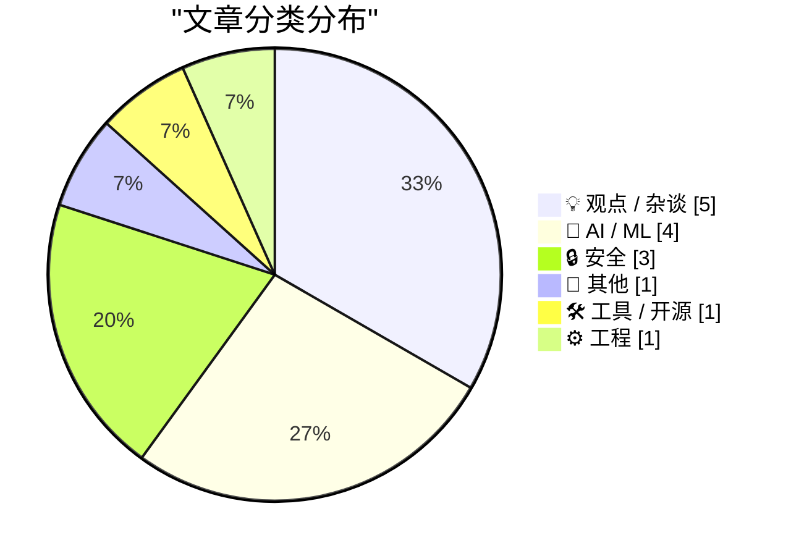
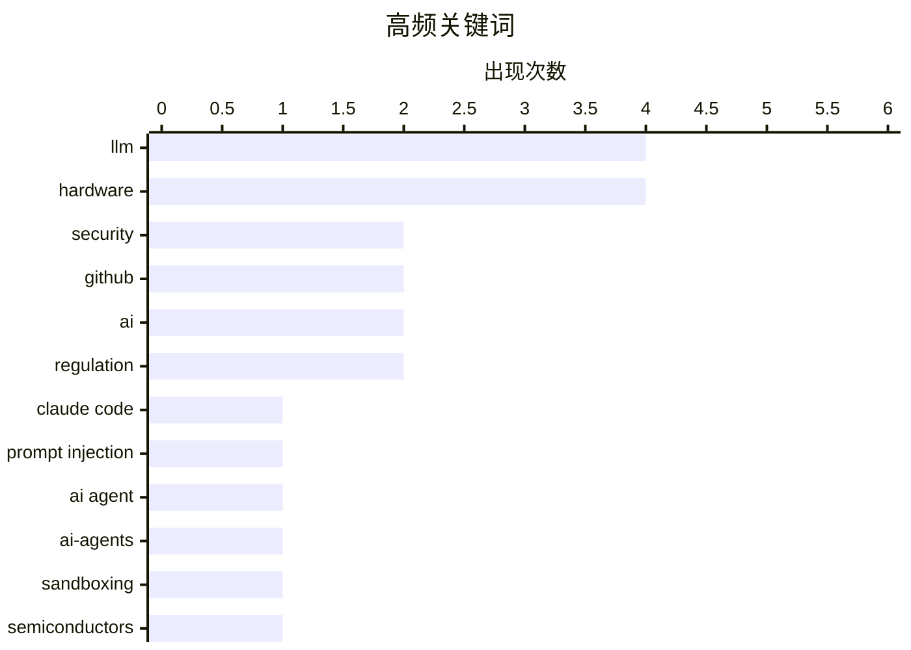

# 📰 Aug 29, 2026

> 来自 Karpathy 推荐的 92 个顶级技术博客，AI 精选 Top 15

## 📝 今日看点

今日技术圈聚焦 AI 代理的安全性与底层基建，针对 Claude Code 等编程助手的沙箱隔离与提示词注入防御成为安全领域的新焦点。与此同时，AI 产业正深陷资本博弈与地缘政治的复杂交织，从英伟达的“循环融资”争议到国产芯片适配的硬核突破，揭示了技术繁荣背后的结构性挑战。此外，安全漏洞利用的极速化与欧洲监管对创客生态的挤压，正迫使开发者在日益严苛的环境中重新审视技术伦理与职业路径。

---

## 🏆 今日必读

🥇 **攻破 Claude Code Opus 5 的自动模式**

[Breaking Claude Code Opus 5 Auto Mode](https://simonwillison.net/2026/Aug/27/breaking-claude-code-opus-5-auto-mode/) — simonwillison.net · 1 天前 · 🔒 安全

> 探讨了 Anthropic 为其命令行 AI 编程助手 Claude Code 引入的“自动模式（auto mode）”在防御提示词注入攻击方面的实际表现。Anthropic 最近将该模式设为默认，并声称其能有效保护用户免受恶意指令侵害。然而，安全专家 Johann Rehberger 成功演示了如何绕过这些防护措施，揭示了 AI 代理在处理不受信任输入时的脆弱性。这表明即便有专门的安全层，提示词注入依然是当前 AI 代理架构中难以根除的威胁。开发者在使用此类自动化工具时，仍需保持高度警惕。

💡 **为什么值得读**: 揭示了 AI 编程工具在自动化执行任务时潜藏的严重安全漏洞，提醒开发者警惕提示词注入风险。

🏷️ Claude Code, prompt injection, LLM, AI agent

🥈 **为编程代理构建沙箱环境**

[Sandboxing coding agents](https://micahflee.com/sandboxing-coding-agents/) — micahflee.com · 1 天前 · 🔒 安全

> 详细介绍了如何为 AI 编程代理（coding agents）构建隔离的沙箱环境，以确保其在编写代码时的安全性。作者分享了具体的配置方案，使代理只能访问特定的、受限的单个 GitHub 仓库，而无法触及宿主机的其他敏感数据。通过这种隔离机制，开发者可以在利用 AI 提升效率的同时，有效防止代理执行恶意命令或发生意外的数据泄露。文章提供了从环境搭建到权限控制的实操细节，是构建安全 AI 工作流的参考指南。

💡 **为什么值得读**: 提供了将 AI 编程代理安全落地的实战方案，适合对 AI 安全和自动化流程感兴趣的工程师。

🏷️ AI-agents, sandboxing, security, GitHub

🥉 **GLM-5.3 Flash 在国产硬件上运行的真实意义**

[What GLM-5.3 Flash running on Chinese hardware actually means](https://martinalderson.com/posts/glm-5-3-flash-chinese-hardware/?utm_source=rss&amp;utm_medium=rss&amp;utm_campaign=feed) — martinalderson.com · 12 小时前 · 🤖 AI / ML

> 分析了智谱 AI（Z.AI）在国产芯片上发布 GLM-5.3 Flash 全量模型的行业影响。虽然成功适配国产硬件标志着中国 AI 产业链的进步，但文章指出 EUV 光刻技术的缺失是一道难以逾越的“硬墙”。作者认为，受限于制造工艺，国产推理硬件与西方顶尖硬件（如 NVIDIA）之间的性能差距在短期内更有可能扩大而非缩小。这一结论为观察中国 AI 算力自主化进程提供了一个冷静的技术视角。

💡 **为什么值得读**: 客观评价了国产 AI 芯片与大模型适配的现状，帮助读者理解全球 AI 算力竞争的技术壁垒。

🏷️ AI, semiconductors, LLM, hardware

---

## 📊 数据概览

| 扫描源 | 抓取文章 | 时间范围 | 精选 |
|:---:|:---:|:---:|:---:|
| 83/92 | 2517 篇 → 37 篇 | 48h | **15 篇** |

### 分类分布



### 高频关键词



<details>
<summary>📈 纯文本关键词图（终端友好）</summary>

```
llm              │ ████████████████████ 4
hardware         │ ████████████████████ 4
security         │ ██████████░░░░░░░░░░ 2
github           │ ██████████░░░░░░░░░░ 2
ai               │ ██████████░░░░░░░░░░ 2
regulation       │ ██████████░░░░░░░░░░ 2
claude code      │ █████░░░░░░░░░░░░░░░ 1
prompt injection │ █████░░░░░░░░░░░░░░░ 1
ai agent         │ █████░░░░░░░░░░░░░░░ 1
ai-agents        │ █████░░░░░░░░░░░░░░░ 1
```

</details>

### 🏷️ 话题标签

**llm**(4) · **hardware**(4) · **security**(2) · github(2) · ai(2) · regulation(2) · claude code(1) · prompt injection(1) · ai agent(1) · ai-agents(1) · sandboxing(1) · semiconductors(1) · claude(1) · data analysis(1) · gpt-2(1) · dropout(1) · training(1) · anthropic(1) · ai safety(1) · pentagon(1)

---

## 💡 观点 / 杂谈

### 1. 讨厌者指南：循环融资的内幕（第一部分）

[Premium: The Hater's Guide To Circular Financing (Part One)](https://www.wheresyoured.at/premium-the-haters-guide-to-circular-financing-part-one/) — **wheresyoured.at** · 20 小时前 · ⭐ 24/30

> 文章以讽刺的笔调剖析了当前 AI 行业中存在的“循环融资”现象，重点关注 NVIDIA 与顶级 AI 实验室之间的资金往来。作者质疑了这种商业模式的可持续性：芯片巨头向 AI 公司投资，而这些公司转头又用这些资金购买昂贵的 GPU。通过模拟 NVIDIA 内部会议的视角，文章揭示了这种看似繁荣的生态系统背后可能存在的财务泡沫。这是对 AI 淘金热中资本运作逻辑的一次深度批判。

🏷️ NVIDIA, AI-economics, finance, tech-industry

---

### 2. “欧洲是如何扼杀创客和微型创业者的”

[‘How Europe Is Killing Makers and Micro-Entrepreneurs’](https://lectronz.com/u/lectronz/articles/how-europe-is-killing-makers-and-micro-entrepreneurs) — **daringfireball.net** · 1 天前 · ⭐ 23/30

> Lectronz 创始人 Alain Pannetrat 撰文批评了欧洲日益严苛的监管政策对开源硬件创客和 DIY 爱好者的打击。文章指出，诸如 CE 认证、WEEE 指令等合规要求原本针对大型工厂，但现在却强加给了在车库或小作坊工作的独立设计师。高昂的合规成本使得许多每年仅售出少量产品的微型企业难以为继，被迫退出市场。作者认为，这种“一刀切”的监管正在摧毁欧洲的硬件创新土壤。

🏷️ hardware, open source, regulation, EU

---

### 3. 论“被招安”：如何在大型组织中获得成功

[Selling out](https://seangoedecke.com/selling-out/) — **seangoedecke.com** · 1 天前 · ⭐ 21/30

> 文章重新定义了程序员“被招安（selling out）”——即进入大型企业追求高薪和稳定——的现代含义。作者指出，在当今环境下，这不再是简单的妥协，而是一项需要高超技术能力和对大型组织运作逻辑深刻理解的复杂任务。文章旨在教授工程师如何平衡个人技术追求与大公司的职场规则，从而在体制内获得成功。这不仅关乎代码，更关乎如何在复杂的官僚体系中发挥影响力并获取回报。

🏷️ career, software engineering, ethics, industry

---

### 4. 让“不必要的事”变得更容易：反思 AI 自动化陷阱

[Making the unnecessary easier](https://www.johndcook.com/blog/2026/08/28/making-the-unnecessary-easier/) — **johndcook.com** · 22 小时前 · ⭐ 21/30

> 文章探讨了 AI 时代一个普遍的误区：利用 AI 代理去自动化那些本就不该频繁进行的任务。作者以“每 30 分钟监控一次科技新闻”的 AI 代理为例，指出虽然技术降低了操作门槛，但过度获取碎片化信息反而会损害深度思考。这种“效率提升”实际上是在优化错误的目标，让人们在无意义的琐事上投入更多精力。作者呼吁在应用 AI 之前，应先审视任务本身的必要性，而非盲目追求自动化。

🏷️ AI, productivity, automation, philosophy

---

### 5. Anandtech 突然关停：一个硬件评测时代的终结

[Anandtech shut down abruptly, August 30, 2024](https://dfarq.homeip.net/anandtech-shut-down-abruptly-august-30-2024/?utm_source=rss&#038;utm_medium=rss&#038;utm_campaign=anandtech-shut-down-abruptly-august-30-2024) — **dfarq.homeip.net** · 1 天前 · ⭐ 21/30

> 传奇硬件评测网站 Anandtech 在运行 27 年后，于 2024 年 8 月 30 日突然宣布关闭。该网站由 Anand Lal Shimpi 创办于 1997 年，以其极其详尽、深度的处理器和系统架构分析闻名于世。它的倒闭不仅是老牌科技媒体的损失，也反映了当前互联网内容生态从深度长文向碎片化视频转型的残酷现状。文章回顾了 Anandtech 对硬件发烧友社区的深远影响及其不可替代的历史地位。

🏷️ tech journalism, Anandtech, hardware, industry news

---

## 🤖 AI / ML

### 6. GLM-5.3 Flash 在国产硬件上运行的真实意义

[What GLM-5.3 Flash running on Chinese hardware actually means](https://martinalderson.com/posts/glm-5-3-flash-chinese-hardware/?utm_source=rss&amp;utm_medium=rss&amp;utm_campaign=feed) — **martinalderson.com** · 12 小时前 · ⭐ 26/30

> 分析了智谱 AI（Z.AI）在国产芯片上发布 GLM-5.3 Flash 全量模型的行业影响。虽然成功适配国产硬件标志着中国 AI 产业链的进步，但文章指出 EUV 光刻技术的缺失是一道难以逾越的“硬墙”。作者认为，受限于制造工艺，国产推理硬件与西方顶尖硬件（如 NVIDIA）之间的性能差距在短期内更有可能扩大而非缩小。这一结论为观察中国 AI 算力自主化进程提供了一个冷静的技术视角。

🏷️ AI, semiconductors, LLM, hardware

---

### 7. Claude 的“承重词汇”：AI 生成内容的重复性分析

[The Load-Bearing Vocabulary of Claude](https://louisabraham.github.io/load-bearing/) — **daringfireball.net** · 1 天前 · ⭐ 25/30

> 这是一个关于 Claude 在提交 GitHub 拉取请求（PR）时用词重复性的趣味数据分析项目。研究者 Louis Abraham 发现，Claude 生成的 PR 描述可以归类为 8 种固定的写作模式，且每条描述都属于其中之一。数据显示，其中一种特定模式在 2025 年初仅占语料库的 1.0%，但到 2026 年中期已飙升至 45%。这种高度的模式化揭示了 LLM 在特定任务下输出的同质化倾向，使得 AI 生成的内容越来越容易被识别。

🏷️ Claude, LLM, GitHub, data analysis

---

### 8. 为什么 OpenAI 的 GPT-2 权重比我的更好？第四部分：深入研究 Dropout

[Why do OpenAI's GPT-2 weights beat mine?  Part four: digging into dropout](https://www.gilesthomas.com/2026/08/why-do-openai-gpt2-weights-beat-mine-4-ift-dropout) — **gilesthomas.com** · 1 天前 · ⭐ 25/30

> 作者继续探究其自训练模型在指令微调（IFT）测试中表现不如 OpenAI 原始 GPT-2 权重的原因，尽管其模型的测试集损失（loss）更低。本篇重点研究了 Dropout 机制对模型性能的影响，并引用了 Switch Transformers 论文中的相关论点。通过对比实验，作者试图查明在预训练阶段引入的正则化手段如何影响后续的微调效果。这一系列研究深入到了模型训练的底层细节，旨在复现并超越经典的基准权重。

🏷️ GPT-2, LLM, dropout, training

---

### 9. 美国法官阻止国防部将 Anthropic 列入黑名单

[U.S. Judge Blocks Trump Defense Department’s Anthropic Blacklisting](https://www.reuters.com/legal/government/us-judge-blocks-pentagons-anthropic-blacklisting-2026-08-28/) — **daringfireball.net** · 1 天前 · ⭐ 24/30

> 报道了美国法院的一项最新裁决，暂时阻止了五角大楼将 AI 公司 Anthropic 列入黑名单。此前，国防部长 Pete Hegseth 以国家安全供应链风险为由，指控 Anthropic 可能导致军事系统遭受渗透。Anthropic 随后提起诉讼，指控政府滥用职权并对其 AI 安全立场存在误解。这一法律纠纷反映了 AI 领军企业与军方在战场 AI 安全及监管边界上的激烈博弈。

🏷️ Anthropic, AI safety, Pentagon, regulation

---

## 🔒 安全

### 10. 攻破 Claude Code Opus 5 的自动模式

[Breaking Claude Code Opus 5 Auto Mode](https://simonwillison.net/2026/Aug/27/breaking-claude-code-opus-5-auto-mode/) — **simonwillison.net** · 1 天前 · ⭐ 27/30

> 探讨了 Anthropic 为其命令行 AI 编程助手 Claude Code 引入的“自动模式（auto mode）”在防御提示词注入攻击方面的实际表现。Anthropic 最近将该模式设为默认，并声称其能有效保护用户免受恶意指令侵害。然而，安全专家 Johann Rehberger 成功演示了如何绕过这些防护措施，揭示了 AI 代理在处理不受信任输入时的脆弱性。这表明即便有专门的安全层，提示词注入依然是当前 AI 代理架构中难以根除的威胁。开发者在使用此类自动化工具时，仍需保持高度警惕。

🏷️ Claude Code, prompt injection, LLM, AI agent

---

### 11. 为编程代理构建沙箱环境

[Sandboxing coding agents](https://micahflee.com/sandboxing-coding-agents/) — **micahflee.com** · 1 天前 · ⭐ 26/30

> 详细介绍了如何为 AI 编程代理（coding agents）构建隔离的沙箱环境，以确保其在编写代码时的安全性。作者分享了具体的配置方案，使代理只能访问特定的、受限的单个 GitHub 仓库，而无法触及宿主机的其他敏感数据。通过这种隔离机制，开发者可以在利用 AI 提升效率的同时，有效防止代理执行恶意命令或发生意外的数据泄露。文章提供了从环境搭建到权限控制的实操细节，是构建安全 AI 工作流的参考指南。

🏷️ AI-agents, sandboxing, security, GitHub

---

### 12. 如今仅凭漏洞传闻就足以触发安全攻击

[Just a rumour of a bug is enough to find a security exploit these days](https://simonwillison.net/2026/Aug/28/just-a-rumour-of-a-bug/) — **simonwillison.net** · 14 小时前 · ⭐ 23/30

> 剑桥大学教授、OCaml 核心维护者 Anil Madhavapeddy 指出，现在的安全漏洞利用速度已达到惊人的程度。他在 OCaml 项目中观察到，仅仅在补丁被分享讨论后的几分钟内，就会出现针对该漏洞的攻击尝试。过去开发者通常有几天时间来部署补丁，但现在这个窗口期已缩短至近乎为零。这一现象警示开源社区和企业，必须重新审视漏洞披露流程和自动化的补丁管理机制。

🏷️ security, exploit, OCaml, vulnerability

---

## 📝 其他

### 13. Apple Maps 广告正式上线：出现在搜索建议与搜索结果中

[Ads in Apple Maps Have Now Launched](https://9to5mac.com/2026/08/25/apple-maps-launches-ads-on-iphone-heres-whats-new/) — **daringfireball.net** · 1 天前 · ⭐ 21/30

> Apple 官方确认已在地图应用中正式推出广告业务，并将在未来几周内向全球用户全面铺开。广告主要出现在两个核心位置：搜索前的“建议地点”列表以及搜索后的相关结果中。目前已有用户在距离 12 英里的“建议地点”中看到了暖通空调承包商的推广信息。这一举措标志着 Apple 正在进一步扩大其服务业务的广告变现范围。对于用户而言，这意味着原生系统应用的纯净体验将进一步受到商业化影响。

🏷️ Apple Maps, advertising, UX, iOS

---

## 🛠 工具 / 开源

### 14. 包管理周报：2026 年 8 月 29 日

[This Week in Package Management: 29 August 2026](https://nesbitt.io/2026/08/29/this-week-in-package-management.html) — **nesbitt.io** · 2 小时前 · ⭐ 21/30

> 本周包管理领域汇总了全球范围内的最新版本发布、安全公告及深度文章。内容涵盖了主流包管理工具的更新动态，以及针对软件供应链安全的最新漏洞预警。对于开发者而言，这是追踪 npm、PyPI、Cargo 等生态系统底层基础设施变化的快速通道。通过阅读本周简报，可以及时掌握包管理领域的最佳实践与潜在风险。该系列文章是保持开发环境安全与现代化的重要信息源。

🏷️ package-management, ecosystem, security-advisories

---

## ⚙️ 工程

### 15. 打造可装入登机箱的迷你家庭实验室

[Building a mini Homelab that fits in my carry-on](https://www.jeffgeerling.com/blog/2026/mini-homelab-network-fits-in-carry-on/) — **jeffgeerling.com** · 21 小时前 · ⭐ 20/30

> 知名博主 Jeff Geerling 分享了为参加 VCF Midwest 复古计算机展而构建的便携式家庭实验室方案。该系统集成了 Ubiquiti 迷你机架网络设备和 UPS 电源，核心任务是为老式 Mac 提供基于 GPS 的 NTP 时间同步服务。为了兼容 90 年代的设备，他还采用了特殊的 AppleTalk 时间扩展协议。这套方案展示了如何在有限的登机箱空间内，实现高性能网络与复古硬件的完美融合。

🏷️ homelab, hardware, networking, NTP

---

*生成于 2026-08-29 12:35 | 扫描 83 源 → 获取 2517 篇 → 精选 15 篇*
*基于 [Hacker News Popularity Contest 2025](https://refactoringenglish.com/tools/hn-popularity/) RSS 源列表，由 [Andrej Karpathy](https://x.com/karpathy) 推荐*
