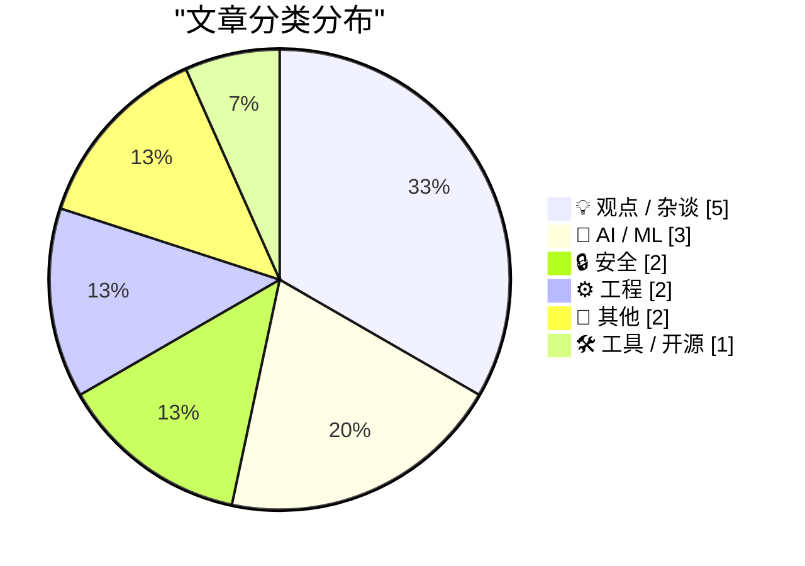
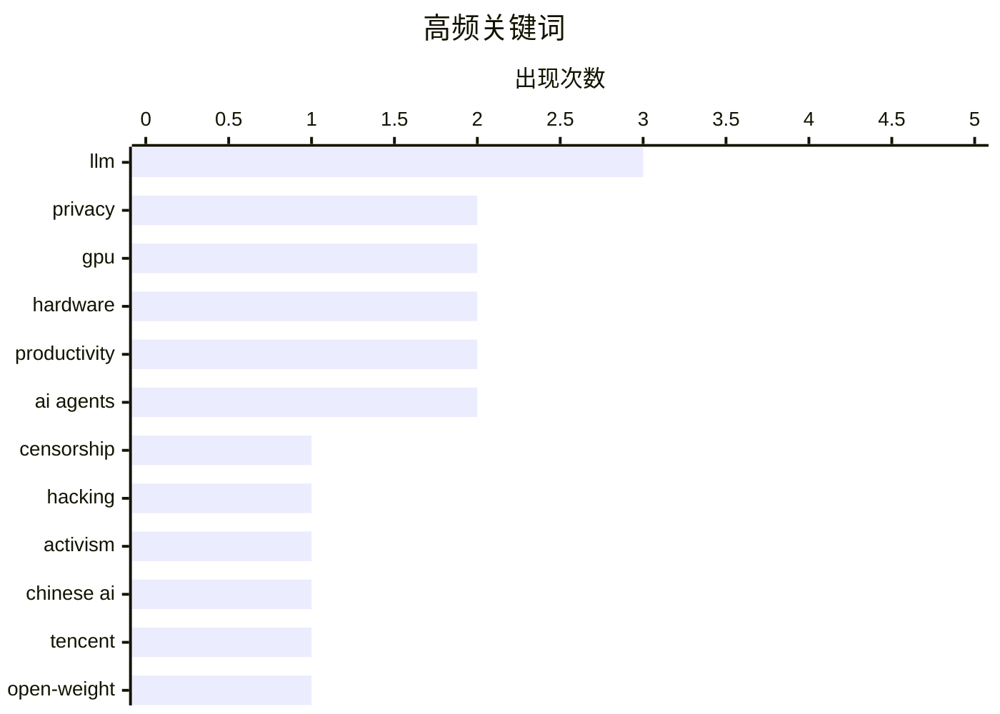

# 📰 Aug 30, 2026

> 来自 Karpathy 推荐的 92 个顶级技术博客，AI 精选 Top 15

## 📝 今日看点

今日技术圈见证了 AI 算力与规模的持续狂飙，腾讯发布 770B 超大模型，国产硬件自主化亦取得关键进展，但繁荣背后隐藏着循环融资与文化掠夺的争议。安全领域形势愈发紧迫，漏洞利用已进入“传闻即攻击”的分钟级时代，隐私保护组织则面临严苛的监管风暴。面对 AI 对技术底线的快速重构，开发者正从单纯的交付任务转向追求不可替代的深度价值。

---

## 🏆 今日必读

🥇 **名为“偏执”的服务器：捍卫 Autistici/Inventati 组织**

[The Server Called Paranoia: Defend Autistici/Inventati](https://micahflee.com/the-server-called-paranoia-defend-autistici-inventati/) — micahflee.com · 16 小时前 · 🔒 安全

> 意大利黑客组织 Autistici/Inventati (A/I) 过去 25 年致力于构建能抵御审查、监控和警方突袭的通信基础设施。然而，美国政府于 8 月 26 日将其列为恐怖组织，导致其面临 9 月 25 日截止的清算期。该组织提供的加密邮件、VPN 和托管服务一直被视为数字隐私的最后堡垒。这一制裁不仅威胁到该组织的技术遗产，也引发了关于国家权力干预开源隐私工具的广泛争议。目前该组织正面临被彻底关停的危机，其长期维护的抗审查网络命悬一线。

💡 **为什么值得读**: 了解数字隐私基础设施在国家监管压力下的生存现状及其对全球黑客文化的影响。

🏷️ privacy, censorship, hacking, activism

🥈 **在国产硬件上运行 GLM-5.3 Flash 的真实意义**

[What GLM-5.3 Flash running on Chinese hardware actually means](https://martinalderson.com/posts/glm-5-3-flash-chinese-hardware/?utm_source=rss&amp;utm_medium=rss&amp;utm_campaign=feed) — martinalderson.com · 1 天前 · 🤖 AI / ML

> 智谱 AI (Zhipu AI) 成功在国产芯片上运行了 GLM-5.3 Flash 模型，展示了中国在 AI 硬件自主化方面的进展。尽管能在本土硬件上完成全模型发布令人印象深刻，但受限于 EUV 光刻技术的封锁，国产硬件在先进制程上仍面临巨大挑战。作者指出，随着西方推理硬件的快速迭代，国产芯片与国际顶尖水平的差距在短期内更有可能扩大而非缩小。这一案例体现了中国 AI 产业在“算力突围”与“技术壁垒”之间的博弈。结论认为，国产化虽有进步，但硬件代差仍是难以逾越的红墙。

💡 **为什么值得读**: 深入分析国产 AI 芯片在实际模型运行中的表现及其面临的长期技术瓶颈。

🏷️ Chinese AI, GPU, hardware, LLM

🥉 **腾讯发布 Hy4 预览版：770B 参数与 1M 上下文窗口**

[Introducing Hy4 Preview](https://simonwillison.net/2026/Aug/29/hy4/) — simonwillison.net · 11 小时前 · 🤖 AI / ML

> 腾讯发布了最新开源权重的大语言模型 Hy4 Preview，其总参数量达到 770B，激活参数量为 49B。该模型支持高达 1M token 的超长上下文窗口，在 Hugging Face 上的权重文件体积达 1.56TB。相比 7 月发布的 Hy3（295B 总参数、21B 激活、256k 上下文），Hy4 在规模和处理能力上实现了显著跨越。目前该版本仅支持纯文本输入，暂不具备视觉处理能力。这一发布标志着国产大模型在超大规模 MoE 架构上迈出了重要一步。

💡 **为什么值得读**: 关注腾讯混元大模型在超大规模 MoE 架构和长文本处理能力上的最新突破。

🏷️ LLM, Tencent, open-weight, Hy4

---

## 📊 数据概览

| 扫描源 | 抓取文章 | 时间范围 | 精选 |
|:---:|:---:|:---:|:---:|
| 83/92 | 2528 篇 → 28 篇 | 48h | **15 篇** |

### 分类分布



### 高频关键词



<details>
<summary>📈 纯文本关键词图（终端友好）</summary>

```
llm          │ ████████████████████ 3
privacy      │ █████████████░░░░░░░ 2
gpu          │ █████████████░░░░░░░ 2
hardware     │ █████████████░░░░░░░ 2
productivity │ █████████████░░░░░░░ 2
ai agents    │ █████████████░░░░░░░ 2
censorship   │ ███████░░░░░░░░░░░░░ 1
hacking      │ ███████░░░░░░░░░░░░░ 1
activism     │ ███████░░░░░░░░░░░░░ 1
chinese ai   │ ███████░░░░░░░░░░░░░ 1
```

</details>

### 🏷️ 话题标签

**llm**(3) · **privacy**(2) · **gpu**(2) · hardware(2) · productivity(2) · ai agents(2) · censorship(1) · hacking(1) · activism(1) · chinese ai(1) · tencent(1) · open-weight(1) · hy4(1) · career(1) · ai(1) · software engineering(1) · c++(1) · oop(1) · design patterns(1) · windows(1)

---

## 💡 观点 / 杂谈

### 1. 你必须在某些方面击败 AI 模型

[You have to beat the models at something](https://seangoedecke.com/you-have-to-beat-the-models-at-something/) — **seangoedecke.com** · 11 小时前 · ⭐ 25/30

> 随着 AI 编程能力的提升，软件工程师的评价标准正从单纯的产出转向“替代价值”（Value Over Replacement）。AI 正在迅速提高行业的技术底线，导致那些仅能完成 JIRA 任务的普通工程师面临价值缩水。作者认为，开发者必须在某些特定领域——如复杂系统架构、深层业务理解或极端性能优化——超越 AI 模型。在 2025 年后的职场环境中，平庸的编码能力将不再是核心竞争力。寻找并深耕 AI 无法覆盖的专业壁垒，是程序员维持职业生命力的唯一途径。

🏷️ career, AI, software engineering, productivity

---

### 2. 讨厌者指南：循环融资的秘密（第一部分）

[Premium: The Hater's Guide To Circular Financing (Part One)](https://www.wheresyoured.at/premium-the-haters-guide-to-circular-financing-part-one/) — **wheresyoured.at** · 1 天前 · ⭐ 24/30

> 深入剖析了 AI 行业中存在的“循环融资”现象，特别是 NVIDIA 在其中扮演的角色。文章以讽刺的笔触揭示了芯片巨头如何通过投资初创公司，再让这些公司用融资款购买其 GPU，从而在账面上创造营收增长的闭环。这种模式虽然推高了估值和股价，但也埋下了巨大的泡沫风险。作者质疑这种缺乏真实终端需求的增长是否可持续，并对当前 AI 投资热潮中的财务透明度提出了严厉批评。这种“左手倒右手”的游戏可能是当前 AI 繁荣中最危险的财务隐患。

🏷️ NVIDIA, AI bubble, venture capital, GPU

---

### 3. 让不必要的事情变得更容易

[Making the unnecessary easier](https://www.johndcook.com/blog/2026/08/28/making-the-unnecessary-easier/) — **johndcook.com** · 1 天前 · ⭐ 23/30

> 探讨了 AI 自动化工具在处理“非必要任务”时的泛滥现象。作者观察到许多 AI 代理被用于每 30 分钟监控一次新闻网站并发送通知，虽然这比手动刷新省力，但其本质价值存疑。文章指出，技术进步往往倾向于让那些原本就不必做的事情变得更容易，而非解决核心难题。这种“低效任务的高效化”可能会误导开发者和用户，让他们在琐碎的自动化中产生虚假的生产力成就感。作者呼吁应将 AI 的力量集中在真正能产生增量的复杂问题上。

🏷️ AI agents, productivity, automation

---

### 4. 我是那个在扫描完古籍后将其销毁的 AI 平台员工

[‘I’m the Guy Who Destroys Antique Books After We Scan Them Into Our Company’s Insatiable AI Platform’](https://www.mcsweeneys.net/articles/im-the-guy-who-destroys-antique-books-after-we-scan-them-into-our-companys-insatiable-ai-platform) — **daringfireball.net** · 1 天前 · ⭐ 22/30

> 这是一篇讽刺文学，以第一人称视角描述了为 AI 平台扫描并随后销毁古籍的工作过程。文章通过“切掉书脊、粉碎纸张”的细节，隐喻了 AI 训练过程中对人类文化遗产的掠夺式消费。虽然 AI 吸收了所有知识来生成平庸的社交媒体文案，但物理载体却在这一过程中被作为“废料”永久破坏。这种荒诞的描述深刻批判了科技巨头在追求数据规模时，对文化价值和历史沉淀的漠视。它引发了读者对于 AI 进步成本与文化遗产保护之间矛盾的深思。

🏷️ AI training, ethics, satire, copyright

---

### 5. 从反对者的身份看 GDPR 的成功

[You Know GDPR Is Good Based on Who Hates It](https://matduggan.com/you-know-gdpr-is-good-based-on-who-hates-it/) — **matduggan.com** · 1 天前 · ⭐ 19/30

> 文章通过政治史的视角，论证了 GDPR（通用数据保护条例）之所以是一项成功的立法，正是因为它触动了大型科技公司和既得利益集团的根基。作者将 GDPR 的推行比作罗斯福和林肯的治理风格，即通过违背精英阶层的预期来保护公众利益。文中指出，科技巨头对合规成本的抱怨恰恰证明了该条例在限制数据滥用和保护隐私方面的实质性威力。结论认为，判断一项监管政策优劣的最佳标准，往往是看它让哪些原本不受约束的权力感到痛苦。

🏷️ GDPR, privacy, regulation, tech policy

---

## 🤖 AI / ML

### 6. 在国产硬件上运行 GLM-5.3 Flash 的真实意义

[What GLM-5.3 Flash running on Chinese hardware actually means](https://martinalderson.com/posts/glm-5-3-flash-chinese-hardware/?utm_source=rss&amp;utm_medium=rss&amp;utm_campaign=feed) — **martinalderson.com** · 1 天前 · ⭐ 26/30

> 智谱 AI (Zhipu AI) 成功在国产芯片上运行了 GLM-5.3 Flash 模型，展示了中国在 AI 硬件自主化方面的进展。尽管能在本土硬件上完成全模型发布令人印象深刻，但受限于 EUV 光刻技术的封锁，国产硬件在先进制程上仍面临巨大挑战。作者指出，随着西方推理硬件的快速迭代，国产芯片与国际顶尖水平的差距在短期内更有可能扩大而非缩小。这一案例体现了中国 AI 产业在“算力突围”与“技术壁垒”之间的博弈。结论认为，国产化虽有进步，但硬件代差仍是难以逾越的红墙。

🏷️ Chinese AI, GPU, hardware, LLM

---

### 7. 腾讯发布 Hy4 预览版：770B 参数与 1M 上下文窗口

[Introducing Hy4 Preview](https://simonwillison.net/2026/Aug/29/hy4/) — **simonwillison.net** · 11 小时前 · ⭐ 25/30

> 腾讯发布了最新开源权重的大语言模型 Hy4 Preview，其总参数量达到 770B，激活参数量为 49B。该模型支持高达 1M token 的超长上下文窗口，在 Hugging Face 上的权重文件体积达 1.56TB。相比 7 月发布的 Hy3（295B 总参数、21B 激活、256k 上下文），Hy4 在规模和处理能力上实现了显著跨越。目前该版本仅支持纯文本输入，暂不具备视觉处理能力。这一发布标志着国产大模型在超大规模 MoE 架构上迈出了重要一步。

🏷️ LLM, Tencent, open-weight, Hy4

---

### 8. 智能体文明的兴衰：OpenAI 与 Hugging Face 的故事

[The Rise and Fall of Agent Civilizations](https://www.dwarkesh.com/p/openai-huggingface) — **dwarkesh.com** · 12 小时前 · ⭐ 25/30

> 以通俗易懂的语言梳理了 OpenAI 与 Hugging Face 之间的恩怨情仇及其对 AI 生态的影响。文章回顾了从早期开源合作到后来走向封闭竞争的转折点，分析了两者在模型权重共享与平台化战略上的分歧。通过“代理文明”的视角，探讨了 AI 社区如何在巨头博弈中演化，以及开源力量在闭源模型压力下的生存状态。这不仅是一段技术史，更是关于 AI 行业权力结构变迁的深度观察。作者揭示了当前 AI 领域“围墙花园”与“开放森林”两种路线的本质冲突。

🏷️ AI agents, OpenAI, Hugging Face, LLM

---

## 🔒 安全

### 9. 名为“偏执”的服务器：捍卫 Autistici/Inventati 组织

[The Server Called Paranoia: Defend Autistici/Inventati](https://micahflee.com/the-server-called-paranoia-defend-autistici-inventati/) — **micahflee.com** · 16 小时前 · ⭐ 26/30

> 意大利黑客组织 Autistici/Inventati (A/I) 过去 25 年致力于构建能抵御审查、监控和警方突袭的通信基础设施。然而，美国政府于 8 月 26 日将其列为恐怖组织，导致其面临 9 月 25 日截止的清算期。该组织提供的加密邮件、VPN 和托管服务一直被视为数字隐私的最后堡垒。这一制裁不仅威胁到该组织的技术遗产，也引发了关于国家权力干预开源隐私工具的广泛争议。目前该组织正面临被彻底关停的危机，其长期维护的抗审查网络命悬一线。

🏷️ privacy, censorship, hacking, activism

---

### 10. 如今仅凭漏洞传闻就足以触发安全攻击

[Just a rumour of a bug is enough to find a security exploit these days](https://simonwillison.net/2026/Aug/28/just-a-rumour-of-a-bug/) — **simonwillison.net** · 1 天前 · ⭐ 24/30

> 剑桥大学教授、OCaml 编译器核心维护者 Anil Madhavapeddy 指出，当前的漏洞利用速度已达到惊人水平。在 OCaml 项目中，仅仅是关于补丁的讨论或传闻流出，几分钟内就会出现针对性的攻击尝试。这种现象表明，黑产组织正利用自动化工具甚至 AI 快速逆向补丁并生成 Exploit，传统的“负责任披露”窗口期正在消失。安全防御者现在面临着从漏洞发现到被利用之间几乎零延迟的严峻挑战。文章警告称，这种极速攻击模式将迫使开源社区重新思考漏洞修复的流程。

🏷️ security, exploit, OCaml, vulnerability

---

## ⚙️ 工程

### 11. 强制派生类实现特定的非虚方法（第二部分）

[On forcing all derived classes to implement a specific non-virtual method, part 2](https://devblogs.microsoft.com/oldnewthing/20260828-00/?p=112654) — **devblogs.microsoft.com/oldnewthing** · 1 天前 · ⭐ 25/30

> 探讨了在 C++ 中如何强制派生类实现特定的非虚方法，并重点讨论了“显式拒绝实现”的技术细节。通过利用模板元编程或特定的编译器技巧，开发者可以确保子类必须提供自己的方法定义，否则将导致编译错误。这种模式在需要严格接口约束但又不希望承担虚函数表（vtable）性能开销的场景中非常有用。文章延续了第一部分的讨论，深入分析了在复杂继承体系中维护代码一致性的进阶方案。这为高性能库的设计提供了一种强类型的约束手段。

🏷️ C++, OOP, design patterns, Windows

---

### 12. 打造一套能塞进手提行李箱的微型家庭实验室

[Building a mini Homelab that fits in my carry-on](https://www.jeffgeerling.com/blog/2026/mini-homelab-network-fits-in-carry-on/) — **jeffgeerling.com** · 1 天前 · ⭐ 20/30

> 知名博主 Jeff Geerling 分享了为 VCF Midwest 展会设计的便携式网络方案，旨在展示复古 Mac 的 NTP 时间同步历史。该系统核心是一台由 GPS 驱动的 Xserve G5 NTP 服务器，通过 Ubiquiti 微型机架设备构建网络环境。技术难点在于利用 90 年代的 AppleTalk 时间扩展协议实现老式设备的同步，并确保整套硬件符合登机携带标准。这套方案展示了如何在极小空间内集成 UPS 电源、交换机及高性能服务器，实现复古与现代技术的融合。

🏷️ homelab, hardware, NTP, networking

---

## 📝 其他

### 13. 苹果首次 MLB 沉浸式转播观后感：洋基队 1-0 胜红袜队

[★ Thoughts and Observations on Apple’s First Immersive MLB Broadcast, a Yankees 1-0 Win Over the Red Sox](https://daringfireball.net/2026/08/thoughts_and_observations_apple_immersive_mlb_broadcast) — **daringfireball.net** · 17 小时前 · ⭐ 20/30

> 深度评测了 Apple Vision Pro 带来的首场 MLB 沉浸式赛事直播，认为其变革程度堪比从广播到电视的跨越。转播采用了超高分辨率的 180 度 3D 摄影机位，让观众仿佛置身于洋基体育场本垒板后的黄金位置。文章指出，这种体验彻底打破了传统屏幕的边界感，通过空间音频和极高清晰度提供了前所未有的临场感。尽管目前仍处于早期阶段，但其展示的体育赛事消费新模式预示了未来媒体传播的重大转型。

🏷️ Apple Vision Pro, immersive video, MLB, VR

---

### 14. 建筑物理阅读清单：2026年8月29日

[Reading List 08/29/26](https://www.construction-physics.com/p/reading-list-082926) — **construction-physics.com** · 23 小时前 · ⭐ 19/30

> 本期阅读清单聚焦于基础设施与前沿工业技术，探讨了伦敦房屋因地质变化下沉的结构性危机。内容涵盖了美国镁制造业的现状分析，以及世界类人机器人大赛中展现的最新动力学突破。此外，还分析了尼泊尔灾难性洪水对当地建筑韧性的挑战，并提供了多篇关于材料科学与城市规划的深度文章链接。通过跨学科的视角，揭示了气候变化与技术进步如何共同影响现代建筑工程的演进。

🏷️ robotics, manufacturing, engineering

---

## 🛠 工具 / 开源

### 15. 包管理周报：2026年8月29日

[This Week in Package Management: 29 August 2026](https://nesbitt.io/2026/08/29/this-week-in-package-management.html) — **nesbitt.io** · 1 天前 · ⭐ 22/30

> 汇总了 2026 年 8 月底全球包管理生态的最新动态，涵盖 npm、PyPI、Cargo 等主流仓库的安全公告与版本发布。重点关注了供应链攻击的防御策略以及跨语言依赖管理的标准化进展。文章详细列出了本周修复的关键漏洞编号及受影响的包版本，为开发者提供了及时的安全更新指南。通过对生态系统趋势的分析，揭示了自动化审计工具在 CI/CD 流程中日益增长的重要性。

🏷️ package management, software supply chain, devops

---

*生成于 2026-08-30 11:43 | 扫描 83 源 → 获取 2528 篇 → 精选 15 篇*
*基于 [Hacker News Popularity Contest 2025](https://refactoringenglish.com/tools/hn-popularity/) RSS 源列表，由 [Andrej Karpathy](https://x.com/karpathy) 推荐*
