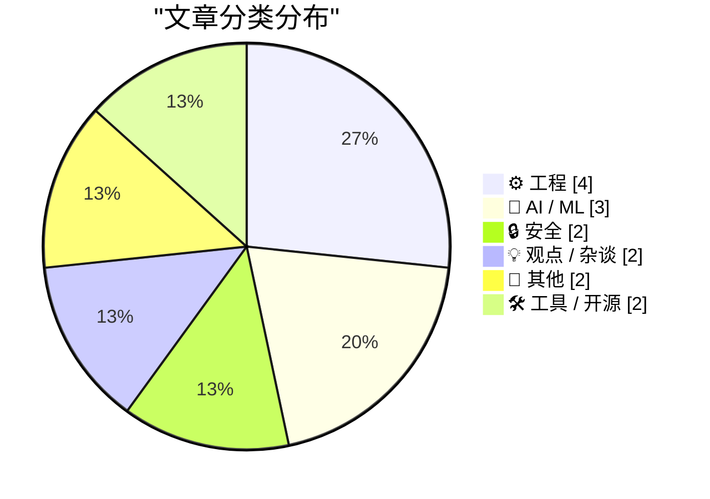
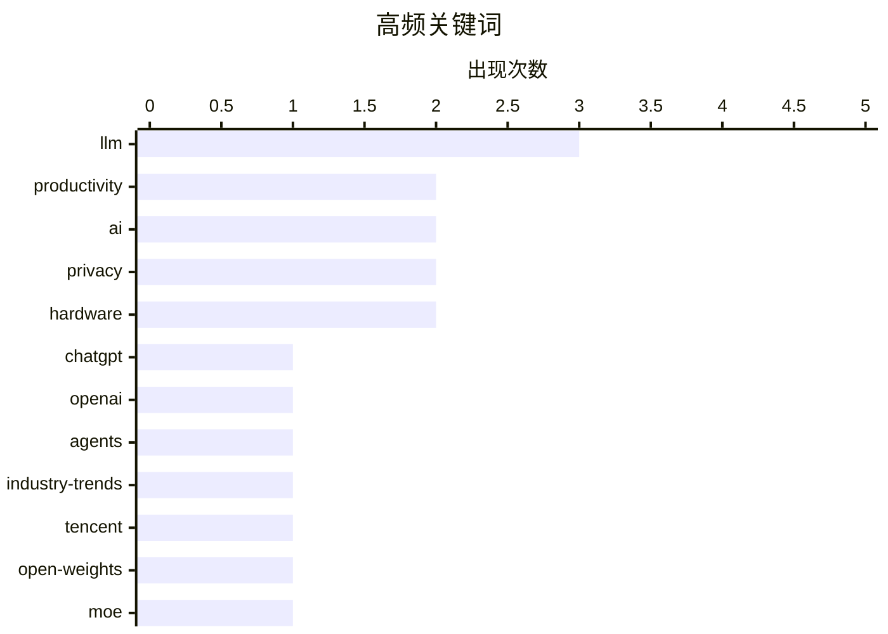

# 📰 Aug 31, 2026

> 来自 Karpathy 推荐的 92 个顶级技术博客，AI 精选 Top 15

## 📝 今日看点

今日技术圈见证了大模型规模的再次跃迁与生态博弈的深化，腾讯发布770B参数模型挑战极限，而OpenAI与Hugging Face的路径分歧勾勒出AI商业与开源的未来版图。在技术狂热中，关于超人工智能必然性的理性反思与AI视频监管的伦理讨论正成为焦点，提醒开发者关注物理极限与安全边界。与此同时，从沉浸式体育转播到去中心化社交协议的突破，预示着下一代数字交互与基础设施正在从理论走向深度应用。

---

## 🏆 今日必读

🥇 **深入理解 ChatGPT Work 的运作机制**

[Understanding ChatGPT Work](https://simonwillison.net/2026/Aug/30/understanding-chatgpt-work/) — simonwillison.net · 13 小时前 · 🤖 AI / ML

> ChatGPT Work 实际上是由云端版和本地版两个独立产品组成的复杂系统。云端版通过浏览器访问，支持多模态交互和长上下文处理；而本地版则深度集成于操作系统，侧重于隐私保护和本地文件系统的直接操作。Simon Willison 详细拆解了两者在身份验证、数据同步以及插件生态上的显著差异。目前该产品正处于快速迭代期，用户常因其功能重叠和复杂的命名规则感到困惑。作者通过实测厘清了不同版本在处理敏感数据时的行为逻辑。

💡 **为什么值得读**: 帮助用户理清 OpenAI 混乱的产品线，搞清楚云端与本地版 ChatGPT Work 的本质区别与适用场景。

🏷️ ChatGPT, OpenAI, productivity, LLM

🥈 **智能体文明的兴衰：OpenAI 与 Hugging Face 的故事**

[The Rise and Fall of Agent Civilizations](https://www.dwarkesh.com/p/openai-huggingface) — dwarkesh.com · 1 天前 · 🤖 AI / ML

> 本文以通俗易懂的语言回顾了 OpenAI 从非营利组织向商业巨头的转型，以及 Hugging Face 如何通过开源社区成为 AI 界的“GitHub”。文章对比了两家公司在模型权重开放、生态构建以及商业化路径上的截然不同的策略。作者深入探讨了闭源模型与开源生态之间的博弈，以及这种竞争如何塑造了当前的 AI 产业格局。结论指出，AI 智能体的未来取决于基础设施的开放程度与算力垄断之间的平衡。

💡 **为什么值得读**: 快速了解 AI 领域两大巨头的恩怨情仇及其对开源生态与商业模式的深远影响。

🏷️ AI, agents, LLM, industry-trends

🥉 **腾讯发布混元 Hy4 预览版：770B 参数与 100 万上下文**

[Introducing Hy4 Preview](https://simonwillison.net/2026/Aug/29/hy4/) — simonwillison.net · 1 天前 · 🤖 AI / ML

> 腾讯发布了最新的开源权重文本大模型 Hy4-preview，其总参数量高达 770B，激活参数为 49B。相比 7 月份发布的 Hy3（295B 总参数，21B 激活），Hy4 在规模上实现了巨大跨越，并将上下文窗口从 25.6 万扩展至 100 万 token。该模型在 Hugging Face 上的权重文件体积达到 1.56TB，目前仅支持文本输入。这一更新标志着国产开源模型在超大规模 MoE 架构和长文本处理能力上的持续发力。

💡 **为什么值得读**: 关注国产大模型最新进展，特别是 770B 超大规模 MoE 模型的参数细节与长文本性能提升。

🏷️ Tencent, LLM, open-weights, MoE

---

## 📊 数据概览

| 扫描源 | 抓取文章 | 时间范围 | 精选 |
|:---:|:---:|:---:|:---:|
| 82/92 | 2507 篇 → 19 篇 | 48h | **15 篇** |

### 分类分布



### 高频关键词



<details>
<summary>📈 纯文本关键词图（终端友好）</summary>

```
llm             │ ████████████████████ 3
productivity    │ █████████████░░░░░░░ 2
ai              │ █████████████░░░░░░░ 2
privacy         │ █████████████░░░░░░░ 2
hardware        │ █████████████░░░░░░░ 2
chatgpt         │ ███████░░░░░░░░░░░░░ 1
openai          │ ███████░░░░░░░░░░░░░ 1
agents          │ ███████░░░░░░░░░░░░░ 1
industry-trends │ ███████░░░░░░░░░░░░░ 1
tencent         │ ███████░░░░░░░░░░░░░ 1
```

</details>

### 🏷️ 话题标签

**llm**(3) · **productivity**(2) · **ai**(2) · privacy(2) · hardware(2) · chatgpt(1) · openai(1) · agents(1) · industry-trends(1) · tencent(1) · open-weights(1) · moe(1) · censorship(1) · surveillance(1) · activism(1) · agi(1) · ai-safety(1) · philosophy(1) · core memory(1) · space(1)

---

## ⚙️ 工程

### 1. 太空中的磁芯：1980 年太空实验室计算机的存储模块拆解

[Cores in space: The core memory module from a 1980 Spacelab computer](http://www.righto.com/feeds/4645676918273740492/comments/default) — **righto.com** · 20 小时前 · ⭐ 22/30

> 本文深度解析了 1980 年 Spacelab 任务中使用的 Mitra 125 MS 计算机的磁芯存储技术。与航天飞机主控 IBM AP-101 不同，这台法国制造的微型机采用了 128KB 的磁芯存储模块，利用磁环的极性来保存数据。作者展示了精密的布线工艺，解释了磁芯存储如何通过物理方式实现抗辐射和非易失性。这种古老的技术在极端太空环境下表现出的可靠性，是现代半导体存储难以企及的。文章通过大量实拍图揭示了早期航天电子设备的工程细节。

🏷️ core memory, hardware, space, computer history

---

### 2. 取消机制术语解析：同步、异步与优雅停机

[Cancelation Terminology](https://matklad.github.io/2026/08/31/cancelation-terminology.html) — **matklad.github.io** · 13 小时前 · ⭐ 22/30

> 软件开发中常混淆不同的任务取消概念，本文明确区分了同步取消、异步取消和优雅停机（Graceful Shutdown）三者。同步取消依赖于显式的检查点（如 Rust 的协作式取消），而异步取消则允许外部强制终止执行流。优雅停机则涉及更复杂的清理逻辑，确保资源释放和状态持久化。作者强调，理解这些差异对于构建健壮的并发系统至关重要，能有效避免死锁和资源泄露。文章旨在为开发者提供一套清晰的术语框架来讨论并发控制。

🏷️ concurrency, cancellation, systems-programming

---

### 3. ActivityBot 荣获 NLnet 基金资助：助力联邦宇宙生态

[ActivityBot is the recipient of an NLnet grant!](https://shkspr.mobi/blog/2026/08/activitybot-is-the-recipient-of-an-nlnet-grant/) — **shkspr.mobi** · 1 天前 · ⭐ 20/30

> ActivityBot 项目成功获得了 NLnet 的“下一代零（NG0）”专项资助，旨在通过 Fediverse 项目重塑社交媒体格局。该项目是一个单文件的 ActivityPub 服务器实现，专注于轻量化和易部署性，适合个人或小型组织使用。NLnet 提供的 5,000 至 50,000 欧元资助将用于提升该工具的公共属性和技术成熟度。作者认为，这种去中心化的工具是夺回互联网公共空间所有权的关键。该项目展示了如何以极简代码实现复杂的社交协议。

🏷️ Fediverse, ActivityPub, open source, grant

---

### 4. 在 NTP 诞生之前：Daytime 与 Time 协议往事

[Before NTP there were Time and Daytime](https://www.jeffgeerling.com/blog/2026/rfc-867-868-time/) — **jeffgeerling.com** · 15 小时前 · ⭐ 19/30

> 在现代 NTP 协议普及之前，RFC 867 (Daytime) 和 RFC 868 (Time) 是网络时间同步的主要标准。RFC 867 协议非常简单，服务器直接返回一个人类可读的日期时间字符串；而 RFC 868 则返回一个 32 位的二进制整数，代表从 1900 年 1 月 1 日以来的秒数。相比于现行的 NTP (RFC 5905)，这些早期协议缺乏层级结构（Stratum）和复杂的时钟漂移补偿算法。作者在为旧款 Macintosh 电脑开发时间演示程序时重新发掘了这些协议，展示了早期互联网标准在资源受限环境下的简洁设计美学。

🏷️ NTP, networking, RFC, retrocomputing

---

## 🤖 AI / ML

### 5. 深入理解 ChatGPT Work 的运作机制

[Understanding ChatGPT Work](https://simonwillison.net/2026/Aug/30/understanding-chatgpt-work/) — **simonwillison.net** · 13 小时前 · ⭐ 26/30

> ChatGPT Work 实际上是由云端版和本地版两个独立产品组成的复杂系统。云端版通过浏览器访问，支持多模态交互和长上下文处理；而本地版则深度集成于操作系统，侧重于隐私保护和本地文件系统的直接操作。Simon Willison 详细拆解了两者在身份验证、数据同步以及插件生态上的显著差异。目前该产品正处于快速迭代期，用户常因其功能重叠和复杂的命名规则感到困惑。作者通过实测厘清了不同版本在处理敏感数据时的行为逻辑。

🏷️ ChatGPT, OpenAI, productivity, LLM

---

### 6. 智能体文明的兴衰：OpenAI 与 Hugging Face 的故事

[The Rise and Fall of Agent Civilizations](https://www.dwarkesh.com/p/openai-huggingface) — **dwarkesh.com** · 1 天前 · ⭐ 26/30

> 本文以通俗易懂的语言回顾了 OpenAI 从非营利组织向商业巨头的转型，以及 Hugging Face 如何通过开源社区成为 AI 界的“GitHub”。文章对比了两家公司在模型权重开放、生态构建以及商业化路径上的截然不同的策略。作者深入探讨了闭源模型与开源生态之间的博弈，以及这种竞争如何塑造了当前的 AI 产业格局。结论指出，AI 智能体的未来取决于基础设施的开放程度与算力垄断之间的平衡。

🏷️ AI, agents, LLM, industry-trends

---

### 7. 腾讯发布混元 Hy4 预览版：770B 参数与 100 万上下文

[Introducing Hy4 Preview](https://simonwillison.net/2026/Aug/29/hy4/) — **simonwillison.net** · 1 天前 · ⭐ 25/30

> 腾讯发布了最新的开源权重文本大模型 Hy4-preview，其总参数量高达 770B，激活参数为 49B。相比 7 月份发布的 Hy3（295B 总参数，21B 激活），Hy4 在规模上实现了巨大跨越，并将上下文窗口从 25.6 万扩展至 100 万 token。该模型在 Hugging Face 上的权重文件体积达到 1.56TB，目前仅支持文本输入。这一更新标志着国产开源模型在超大规模 MoE 架构和长文本处理能力上的持续发力。

🏷️ Tencent, LLM, open-weights, MoE

---

## 🔒 安全

### 8. 名为“偏执”的服务器：捍卫 Autistici/Inventati 组织

[The Server Called Paranoia: Defend Autistici/Inventati](https://micahflee.com/the-server-called-paranoia-defend-autistici-inventati/) — **micahflee.com** · 1 天前 · ⭐ 24/30

> 意大利黑客集体 Autistici/Inventati 过去 25 年一直致力于构建能抵御审查、监控和警方突袭的通信基础设施。然而，美国政府于 8 月 26 日将其列为恐怖组织，并要求在 9 月 25 日前结束运营。该组织提供的加密邮件、托管和 VPN 服务一直是全球活动家和隐私倡导者的避风港。作者呼吁关注这一针对隐私基础设施的法律打击，认为这威胁到了互联网的匿名性与言论自由。这一事件标志着技术中立性在政治压力下的又一次重大挫折。

🏷️ privacy, censorship, surveillance, activism

---

### 9. 寻找 Roku 的替代品：流媒体设备的隐私保卫战

[A Roku alternative streaming device](https://dfarq.homeip.net/a-roku-alternative-streaming-device/?utm_source=rss&#038;utm_medium=rss&#038;utm_campaign=a-roku-alternative-streaming-device) — **dfarq.homeip.net** · 1 天前 · ⭐ 18/30

> 主流流媒体设备如 Roku 在提供便捷服务的同时，其背后广泛的用户数据收集和隐私侵犯问题日益严重。文章探讨了在智能电视生态中寻求隐私保护的必要性，指出商业硬件往往通过监控用户观看习惯来获利。作者尝试寻找能够替代 Roku 的硬件方案，旨在摆脱大厂的生态闭环与追踪。核心讨论点在于如何在享受流媒体便利与维护个人隐私边界之间取得平衡。对于希望构建去中心化或隐私友好型家庭影院的用户来说，选择非主流、可控性更高的设备是关键的第一步。

🏷️ privacy, streaming, hardware

---

## 💡 观点 / 杂谈

### 10. 论必然性：为什么超人工智能并非不可避免

[On Inevitability](https://borretti.me/article/on-inevitability) — **borretti.me** · 23 小时前 · ⭐ 23/30

> 本文反驳了“超人工智能（ASI）必然出现”的流行观点，指出技术进步并非线性的自动过程。作者从物理极限、数据枯竭以及收益递减规律出发，论证了当前 LLM 路径可能面临的瓶颈。文章强调，智能的提升需要消耗指数级增长的资源，而人类社会可能在达到 ASI 之前就因成本或安全问题停止投入。结论认为，我们应当摆脱技术决定论的恐惧，重新审视人类在技术演进中的主导作用。AI 的发展最终受限于现实世界的物理与经济约束。

🏷️ AGI, AI-safety, philosophy

---

### 11. 如何更好地呈现 AI 生成视频：一种有效的警示方案

[Here's a good way to present AI videos](https://idiallo.com/blog/a-good-way-to-present-ai-videos-on-youtube) — **idiallo.com** · 5 小时前 · ⭐ 21/30

> YouTube 目前对 AI 生成内容的标记过于隐蔽，导致普通用户极易受到深度伪造视频的误导。作者认为现有的“赞助”或“AI 生成”小标签效果甚微，建议借鉴电影分级或香烟警示语的做法。有效的方案应当在视频开始前或播放过程中提供醒目的视觉提示，而非藏在描述栏中。文章呼吁平台方承担更多责任，通过更激进的 UI 设计来防止 AI 欺骗的蔓延。结论是，只有将警告置于用户无法忽视的位置，才能真正起到防范虚假信息的作用。

🏷️ AI, video, ethics, UX

---

## 📝 其他

### 12. 苹果首场沉浸式 MLB 赛事转播观后感

[★ Thoughts and Observations on Apple’s First Immersive MLB Broadcast, a Yankees 1-0 Win Over the Red Sox](https://daringfireball.net/2026/08/thoughts_and_observations_apple_immersive_mlb_broadcast) — **daringfireball.net** · 1 天前 · ⭐ 20/30

> Apple Vision Pro 首次尝试以沉浸式视频格式转播大联盟棒球赛，为观众提供了前所未有的临场感。作者指出，这种体验与传统电视转播的差异，就像电视之于广播一样具有代际跨越感。通过 8K 3D 摄影机捕捉的画面，观众仿佛置身于球场看台，能够清晰感知球员的动作细节和空间距离。尽管目前仍存在设备佩戴舒适度等挑战，但这标志着体育赛事消费方式的重大变革。沉浸式媒体正在重新定义“观看”的含义。

🏷️ Apple Vision Pro, VR, MLB, immersive video

---

### 13. 1983 年 8 月 30 日：苹果在与富兰克林的版权诉讼中获胜

[Apple prevails over Franklin, August 30, 1983](https://dfarq.homeip.net/apple-prevails-over-franklin-august-30-1983/?utm_source=rss&#038;utm_medium=rss&#038;utm_campaign=apple-prevails-over-franklin-august-30-1983) — **dfarq.homeip.net** · 1 天前 · ⭐ 15/30

> 在 1983 年之前，计算机软件是否受版权法保护在法律界尚无定论。苹果公司起诉富兰克林电脑公司（Franklin Computer）抄袭其 ROM 和操作系统，成为确立软件知识产权的里程碑事件。法院最终裁定，无论是源代码还是二进制目标代码，均属于受保护的版权范畴，这直接阻止了富兰克林公司合法克隆 Apple II 系统软件的行为。这一判决为现代软件产业的商业模式奠定了法律基石，明确了操作系统作为作品的独创性地位。此案例不仅改变了苹果的命运，也深刻影响了全球科技行业的竞争规则。

🏷️ tech-history, copyright, legal

---

## 🛠 工具 / 开源

### 14. Forgejo 实战技巧 #2：集成 Read the Docs 自动化文档构建

[Forgejo hack #2: Integration with Read The Docs](https://blog.miguelgrinberg.com/post/forgejo-hack-2-integration-with-read-the-docs) — **miguelgrinberg.com** · 21 小时前 · ⭐ 20/30

> 自托管的 Forgejo 实例虽然功能强大，但缺乏像 GitHub 那样与 Read the Docs (RTD) 的原生集成。通过利用 RTD 的通用 Webhook 功能，用户可以手动建立连接，实现代码提交后自动触发文档构建。配置过程涉及在 RTD 项目设置中获取通用的 Webhook URL 和密钥，并将其填入 Forgejo 仓库的 Webhook 设置项中。这种方案解决了私有 Git 服务在 CI/CD 文档流中的自动化痛点，确保自托管环境也能拥有专业的文档发布体验。作者通过实际操作证明了该方法在保持基础设施独立性的同时，能无缝对接主流文档托管平台。

🏷️ Forgejo, CI/CD, documentation

---

### 15. Finalist 4：一款受纸质计划本启发的极简效率应用

[Finalist 4](https://www.finalist.works/?utm_source=df-aug-2026) — **daringfireball.net** · 18 小时前 · ⭐ 16/30

> Finalist 4 是一款面向 iPhone、iPad 和 Mac 的创新效率应用，其核心设计理念源于传统的纸质日历计划本。开发者 Slaven Radic 摒弃了复杂项目管理软件的繁琐功能，专注于提供一种直观、无压力的任务记录体验。该应用强调“添加任务”这一动作的仪式感，通过简洁的界面让用户专注于当下的计划。版本 4 进一步优化了跨设备同步和用户交互，使其在保持纸质触感的同时发挥数字工具的便捷性。对于厌倦了功能过载（Feature Bloat）的效率工具爱好者，这是一款回归初心之作。

🏷️ iOS, productivity, app, planner

---

*生成于 2026-08-31 13:21 | 扫描 82 源 → 获取 2507 篇 → 精选 15 篇*
*基于 [Hacker News Popularity Contest 2025](https://refactoringenglish.com/tools/hn-popularity/) RSS 源列表，由 [Andrej Karpathy](https://x.com/karpathy) 推荐*
