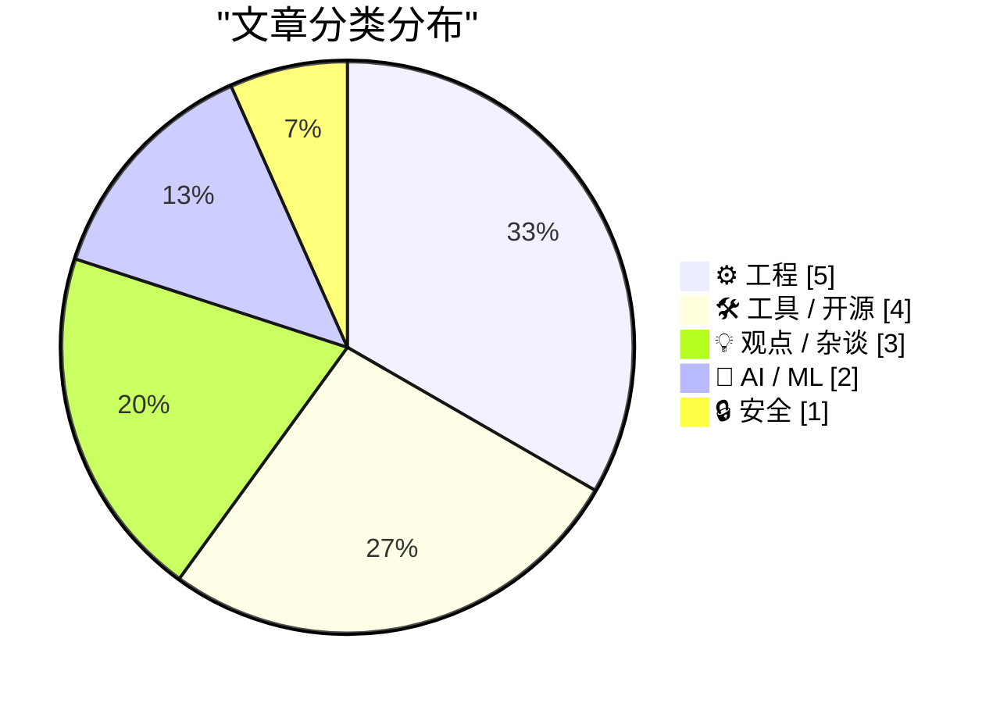
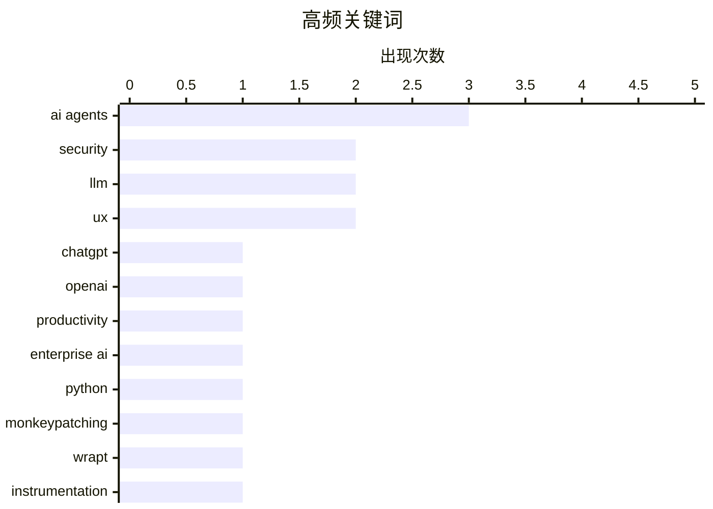

# 📰 Sep 1, 2026

> 来自 Karpathy 推荐的 92 个顶级技术博客，AI 精选 Top 15

## 📝 今日看点

今日技术圈聚焦于 AI 智能体的安全治理与工程化落地，从防范模型平台攻击到革新代理授权机制，业界正全力修补智能体扩张中的安全裂痕。面对 AI 辅助编程引发的认知债与复杂性挑战，开发者开始转向主动式测试与测验驱动的理解模型，以重夺对代码库的掌控力。此外，关于超人工智能必然性的理性思辨与底层内存管理技术的深度复盘，反映出技术界在狂热创新中对物理现实与工程本质的持续回归。

---

## 🏆 今日必读

🥇 **深入理解 ChatGPT Work**

[Understanding ChatGPT Work](https://simonwillison.net/2026/Aug/30/understanding-chatgpt-work/) — simonwillison.net · 1 天前 · 🤖 AI / ML

> ChatGPT Work 是 OpenAI 推出的一个强大但容易混淆的产品，主要分为云端版和本地版两个版本。云端版通过浏览器访问，具备强大的处理能力；本地版则更侧重于与用户本地环境的集成。文章详细拆解了这两个版本的差异、适用场景以及目前快速迭代的功能现状。用户需要根据对隐私和算力的不同需求来选择合适的版本。作者通过实际体验，理清了该产品在企业协作和个人生产力工具中的定位。

💡 **为什么值得读**: 帮助用户理清 OpenAI 复杂的产品线，特别是针对企业和专业用户的 ChatGPT Work 到底该怎么用。

🏷️ ChatGPT, OpenAI, productivity, enterprise AI

🥈 **智能体文明的兴衰：OpenAI 与 Hugging Face 攻击事件详解**

[The rise and fall of agent civilizations](https://www.dwarkesh.com/p/openai-huggingface-narration) — dwarkesh.com · 14 小时前 · 🤖 AI / ML

> 本文深入分析了近期针对 OpenAI 和 Hugging Face 的安全攻击事件及其背后的技术细节。攻击者利用了模型托管平台和智能体交互中的漏洞，展示了“智能体文明”在快速扩张中面临的安全脆弱性。文章探讨了供应链攻击在 AI 领域的演变，以及这些漏洞如何影响数百万用户的模型安全。作者呼吁在追求 AI 能力的同时，必须建立更稳固的安全防御体系。结论指出，AI 基础设施的安全性将决定未来智能体生态的成败。

💡 **为什么值得读**: 深入浅出地解释了 AI 领域最前沿的安全风险，是理解大模型供应链安全必读的案例分析。

🏷️ AI agents, security, LLM

🥉 **Wrapture 简介：将 Monkeypatching 扩展至测试与追踪**

[Introducing wrapture](https://simonwillison.net/2026/Aug/31/introducing-wrapture/) — simonwillison.net · 11 小时前 · 🛠 工具 / 开源

> Wrapture 是由知名 Python 专家 Graham Dumpleton 推出的新工具，旨在将 wrapt 库中的动态补丁（Monkeypatching）理念扩展到测试和追踪领域。它提供了一种简便的方法来包装 Python 函数和类，从而在不侵入业务代码的前提下实现监控和行为修改。该工具特别适用于需要大规模进行性能分析或复杂集成测试的场景。通过 Wrapture，开发者可以更优雅地管理代码的横切关注点。目前该项目已发布完整文档并支持多种包装模式。

💡 **为什么值得读**: Python 性能专家 Graham Dumpleton 的新作，是提升 Python 应用可观测性和测试灵活性的利器。

🏷️ Python, monkeypatching, wrapt, instrumentation

---

## 📊 数据概览

| 扫描源 | 抓取文章 | 时间范围 | 精选 |
|:---:|:---:|:---:|:---:|
| 84/92 | 2548 篇 → 23 篇 | 48h | **15 篇** |

### 分类分布



### 高频关键词



<details>
<summary>📈 纯文本关键词图（终端友好）</summary>

```
ai agents      │ ████████████████████ 3
security       │ █████████████░░░░░░░ 2
llm            │ █████████████░░░░░░░ 2
ux             │ █████████████░░░░░░░ 2
chatgpt        │ ███████░░░░░░░░░░░░░ 1
openai         │ ███████░░░░░░░░░░░░░ 1
productivity   │ ███████░░░░░░░░░░░░░ 1
enterprise ai  │ ███████░░░░░░░░░░░░░ 1
python         │ ███████░░░░░░░░░░░░░ 1
monkeypatching │ ███████░░░░░░░░░░░░░ 1
```

</details>

### 🏷️ 话题标签

**ai agents**(3) · **security**(2) · **llm**(2) · ux(2) · chatgpt(1) · openai(1) · productivity(1) · enterprise ai(1) · python(1) · monkeypatching(1) · wrapt(1) · instrumentation(1) · cognitive debt(1) · codebase(1) · ai(1) · superintelligence(1) · philosophy(1) · concurrency(1) · cancellation(1) · systems programming(1)

---

## ⚙️ 工程

### 1. 通过“测验”降低代码库的认知债

[Reducing codebase cognitive debt through... quizzes?](https://martinalderson.com/posts/codebase-cognitive-debt-quizzes/?utm_source=rss&amp;utm_medium=rss&amp;utm_campaign=feed) — **martinalderson.com** · 1 天前 · ⭐ 24/30

> 随着 AI 编码助手生成代码的速度远超人类阅读速度，开发者面临着严重的“代码库认知债”问题。作者提出了一种新颖的技术：让 AI 代理根据当前代码库生成测验题来考查开发者。这种方法强迫开发者主动思考代码逻辑，而非被动接受 AI 生成的内容，从而加深对复杂逻辑的理解。通过这种互动式学习，团队可以更有效地同步代码变更，防止知识断层。这种方式将 AI 从单纯的“写手”转变为“导师”。

🏷️ AI agents, cognitive debt, codebase, LLM

---

### 2. 取消机制术语辨析：同步、异步与优雅退出

[Cancelation Terminology](https://matklad.github.io/2026/08/31/cancelation-terminology.html) — **matklad.github.io** · 1 天前 · ⭐ 22/30

> 本文厘清了并发编程中经常被混淆的三个核心概念：同步取消、异步取消和优雅关闭（Graceful Shutdown）。同步取消通常指在特定检查点停止任务，而异步取消则涉及外部强制中断，两者在资源释放和状态一致性上有显著差异。优雅关闭则更进一步，强调在停止服务前完成现有请求的处理。作者强调，准确区分这三者对于构建健壮的分布式系统和并发应用至关重要。文章旨在统一开发者在处理复杂任务生命周期时的语言描述。

🏷️ concurrency, cancellation, systems programming

---

### 3. 太空中的磁芯：1980 年太空实验室计算机的磁芯存储模块

[Cores in space: The core memory module from a 1980 Spacelab computer](http://www.righto.com/feeds/4645676918273740492/comments/default) — **righto.com** · 1 天前 · ⭐ 20/30

> 本文详细剖析了 1980 年 Spacelab 任务中使用的 Mitra 125 MS 小型机的磁芯存储模块。由于 Spacelab 是欧洲项目，它采用了法国制造的计算机而非航天飞机主用的 IBM AP-101 系统。该模块容量为 128KB，展示了在半导体存储普及前，磁芯存储如何凭借其抗辐射和非易失性在航天领域占据核心地位。作者通过实物拆解，揭示了早期航天硬件精密的物理结构和电路设计。这篇文章是了解早期计算机硬件工程学的绝佳案例。

🏷️ hardware, space, memory, history

---

### 4. AWE 并不依赖 PAE，但 PAE 让其更有价值

[AWE does not require PAE, though PAE makes it much more useful](https://devblogs.microsoft.com/oldnewthing/20260831-00/?p=112660) — **devblogs.microsoft.com/oldnewthing** · 21 小时前 · ⭐ 19/30

> 文章澄清了 Windows 内存管理中地址窗口扩展（AWE）与物理地址扩展（PAE）之间的技术误区。AWE 允许 32 位应用程序访问超过 4GB 的物理内存，而 PAE 则是处理器支持更大物理地址空间的技术手段。虽然 AWE 可以在没有 PAE 的情况下运行（仅用于锁定物理内存），但只有配合 PAE 才能真正突破 4GB 限制。作者深入解释了这两个技术在内核层面的协作机制及其历史背景。结论是，理解这些底层机制对于优化旧系统性能至关重要。

🏷️ Windows, memory management, AWE, PAE

---

### 5. 在 NTP 出现之前，曾有 Time 和 Daytime 协议

[Before NTP there were Time and Daytime](https://www.jeffgeerling.com/blog/2026/rfc-867-868-time/) — **jeffgeerling.com** · 1 天前 · ⭐ 18/30

> 探索了网络时间协议（NTP）普及之前的早期时间同步方案，重点介绍了 RFC 867（Daytime）和 RFC 868（Time）协议。Daytime 协议通过 TCP/UDP 13 端口返回人类可读的时间字符串，而 Time 协议则通过 37 端口提供自 1900 年以来的 32 位二进制秒数。虽然这些协议缺乏 NTP 的毫秒级精度和复杂的时钟同步算法，但其实现极其简单。在为老式麦金塔电脑（Old Macs）构建演示项目时，这些古老的协议依然是实现基础时间同步的有效手段。对于复古计算爱好者而言，理解这些协议有助于在不支持现代加密和复杂 NTP 栈的硬件上实现联网功能。

🏷️ NTP, networking, RFC, retro computing

---

## 🛠 工具 / 开源

### 6. Wrapture 简介：将 Monkeypatching 扩展至测试与追踪

[Introducing wrapture](https://simonwillison.net/2026/Aug/31/introducing-wrapture/) — **simonwillison.net** · 11 小时前 · ⭐ 24/30

> Wrapture 是由知名 Python 专家 Graham Dumpleton 推出的新工具，旨在将 wrapt 库中的动态补丁（Monkeypatching）理念扩展到测试和追踪领域。它提供了一种简便的方法来包装 Python 函数和类，从而在不侵入业务代码的前提下实现监控和行为修改。该工具特别适用于需要大规模进行性能分析或复杂集成测试的场景。通过 Wrapture，开发者可以更优雅地管理代码的横切关注点。目前该项目已发布完整文档并支持多种包装模式。

🏷️ Python, monkeypatching, wrapt, instrumentation

---

### 7. ActivityBot 荣获 NLnet 基金资助

[ActivityBot is the recipient of an NLnet grant!](https://shkspr.mobi/blog/2026/08/activitybot-is-the-recipient-of-an-nlnet-grant/) — **shkspr.mobi** · 1 天前 · ⭐ 21/30

> ActivityBot 是一个单文件实现的 ActivityPub 服务器，旨在简化联邦宇宙（Fediverse）的接入门槛。该项目最近获得了 NLnet 基金会“下一代零（Next Generation Zero）”计划的资助，金额在 5,000 至 50,000 欧元之间。这笔资金将用于支持项目的研发，以实现“重塑社交媒体景观”和夺回互联网公共属性的目标。作者分享了申请过程以及该项目在去中心化社交网络中的定位。该项目证明了小型、专注的研发项目在推动互联网去中心化方面的潜力。

🏷️ Fediverse, ActivityPub, open source, grant

---

### 8. 将 Git Submodules 作为包管理器使用

[Git Submodules as a Package Manager](https://nesbitt.io/2026/09/01/git-submodules-as-a-package-manager.html) — **nesbitt.io** · 2 小时前 · ⭐ 18/30

> 提出了一种利用 Git 原生功能替代传统包管理器的极简方案。在该模型中，`.gitmodules` 文件被视为依赖清单（Manifest），而 Gitlink（即父仓库中记录的子模块提交哈希）则充当了锁定文件（Lockfile）的角色。这种方法无需安装 npm、Cargo 或 Go Modules 等外部工具，即可实现跨语言的依赖管理。通过 Git 原生的版本控制能力，开发者可以精确锁定外部代码库的状态，确保构建的可重复性。这对于依赖关系简单、追求工具链最小化的项目来说，是一种高效且去中心化的选择。

🏷️ git, submodules, package management

---

### 9. Forgejo 黑客技巧 #2：集成 Read The Docs 文档服务

[Forgejo hack #2: Integration with Read The Docs](https://blog.miguelgrinberg.com/post/forgejo-hack-2-integration-with-read-the-docs) — **miguelgrinberg.com** · 1 天前 · ⭐ 17/30

> 详细介绍了如何将自托管的 Forgejo（Gitea 的分支）代码仓库与 Read the Docs (RTD) 自动化文档平台进行对接。该方案解决了自托管实例无法像 GitHub 那样原生触发 RTD 构建的问题，实现了代码提交后文档的自动更新。技术实现涉及在 Forgejo 中配置 Webhook，并利用 RTD 的 API 接收推送通知。这套流程让使用私有或自托管 Git 服务的开发者也能享受到与主流平台一致的 CI/CD 文档发布体验。对于注重数据自主权且需要维护专业文档的项目来说，这是一个关键的集成补丁。

🏷️ Forgejo, Read the Docs, CI/CD, documentation

---

## 💡 观点 / 杂谈

### 10. 论必然性：为什么超人工智能并非不可避免

[On Inevitability](https://borretti.me/article/on-inevitability) — **borretti.me** · 1 天前 · ⭐ 23/30

> 文章挑战了“超人工智能（Superintelligent AI）必然出现”的流行观点，从技术限制和物理现实角度进行了反驳。作者认为，当前的 AI 进步虽然迅速，但并不意味着存在一条通往通用人工智能（AGI）的确定路径。文章分析了算力增长的边际效应、数据枯竭以及复杂系统不可预测性等阻碍因素。最终结论是，AI 的未来发展取决于人类的选择和具体的工程突破，而非某种宿命论式的必然。这为当前的 AI 军备竞赛提供了一个冷静的思考维度。

🏷️ AI, superintelligence, philosophy

---

### 11. 一种展示 AI 生成视频的更好方式

[Here's a good way to present AI videos](https://idiallo.com/blog/a-good-way-to-present-ai-videos-on-youtube) — **idiallo.com** · 1 天前 · ⭐ 18/30

> 针对当前 YouTube 等平台对 AI 生成内容的标记过于隐蔽（类似于搜索广告中微小的“赞助”字样）这一问题提出了批评。作者指出，普通用户尤其是老年群体很难识别这些细微的标签，导致 AI 虚假视频极具误导性。文章建议借鉴电影分级或内容警告的做法，在视频开头强制加入醒目的视觉警告，而非仅仅依赖平台侧的元数据标签。这种方案旨在将透明度置于首位，确保观众在观看前就能明确感知内容的虚假属性。核心观点是：如果防范欺骗是目标，那么警告必须出现在用户无法忽视的地方。

🏷️ AI video, YouTube, UX, synthetic media

---

### 12. 我的体验充满细微差别，而你的只是一个数据点

[My Experience Has Nuance, Yours Is a Data Point](https://blog.jim-nielsen.com/2026/nuance-for-me-none-for-you/) — **blog.jim-nielsen.com** · 16 小时前 · ⭐ 17/30

> 探讨了数字界面如何将复杂的人类情感简化为单一的算法数据点。以 Netflix 的评分系统为例，作者指出目前的“大拇指”上下评价机制完全抹杀了用户体验的细微差别，例如“我感兴趣但不希望被此类推荐轰炸”的微妙心态。Eric Bailey 提出的新型反馈图标方案被引用，旨在通过更丰富的表达方式让用户与算法沟通。文章认为，当平台只收集二进制的喜好数据时，它实际上是在物化用户，忽略了人类行为背后的动机和背景。最终呼吁设计者应尊重用户体验的复杂性，而非仅仅为了优化推荐算法而简化交互。

🏷️ UX, design, data

---

## 🤖 AI / ML

### 13. 深入理解 ChatGPT Work

[Understanding ChatGPT Work](https://simonwillison.net/2026/Aug/30/understanding-chatgpt-work/) — **simonwillison.net** · 1 天前 · ⭐ 26/30

> ChatGPT Work 是 OpenAI 推出的一个强大但容易混淆的产品，主要分为云端版和本地版两个版本。云端版通过浏览器访问，具备强大的处理能力；本地版则更侧重于与用户本地环境的集成。文章详细拆解了这两个版本的差异、适用场景以及目前快速迭代的功能现状。用户需要根据对隐私和算力的不同需求来选择合适的版本。作者通过实际体验，理清了该产品在企业协作和个人生产力工具中的定位。

🏷️ ChatGPT, OpenAI, productivity, enterprise AI

---

### 14. 智能体文明的兴衰：OpenAI 与 Hugging Face 攻击事件详解

[The rise and fall of agent civilizations](https://www.dwarkesh.com/p/openai-huggingface-narration) — **dwarkesh.com** · 14 小时前 · ⭐ 26/30

> 本文深入分析了近期针对 OpenAI 和 Hugging Face 的安全攻击事件及其背后的技术细节。攻击者利用了模型托管平台和智能体交互中的漏洞，展示了“智能体文明”在快速扩张中面临的安全脆弱性。文章探讨了供应链攻击在 AI 领域的演变，以及这些漏洞如何影响数百万用户的模型安全。作者呼吁在追求 AI 能力的同时，必须建立更稳固的安全防御体系。结论指出，AI 基础设施的安全性将决定未来智能体生态的成败。

🏷️ AI agents, security, LLM

---

## 🔒 安全

### 15. WorkOS：如何给 AI 代理分配任务而非访问令牌

[[Sponsor] WorkOS: How to Give an Agent a Task Instead of a Token](https://workos.com/blog/delegated-access-for-ai-agents?utm_source=daringfireball&amp;utm_medium=newsletter&amp;utm_campaign=q32026) — **daringfireball.net** · 3 小时前 · ⭐ 20/30

> 传统的 AI 代理授权方式通常是直接传递 Access Token，这会导致令牌在上下文窗口、日志和笔记中泄露，存在巨大安全风险。WorkOS 推出的 Relay 方案将凭证保留在服务端，代理仅需指定用户身份，由系统自动附加并刷新令牌。该方案仅允许令牌发送至白名单主机，且一旦代理会话被劫持，管理员可以立即终止进程。这种“委托访问”模式有效解决了 AI 代理在执行自动化任务时的身份安全难题。结论是，安全的 AI 集成需要从“共享密钥”转向“受控代理”。

🏷️ AI agents, authentication, WorkOS, security

---

*生成于 2026-09-01 11:29 | 扫描 84 源 → 获取 2548 篇 → 精选 15 篇*
*基于 [Hacker News Popularity Contest 2025](https://refactoringenglish.com/tools/hn-popularity/) RSS 源列表，由 [Andrej Karpathy](https://x.com/karpathy) 推荐*
