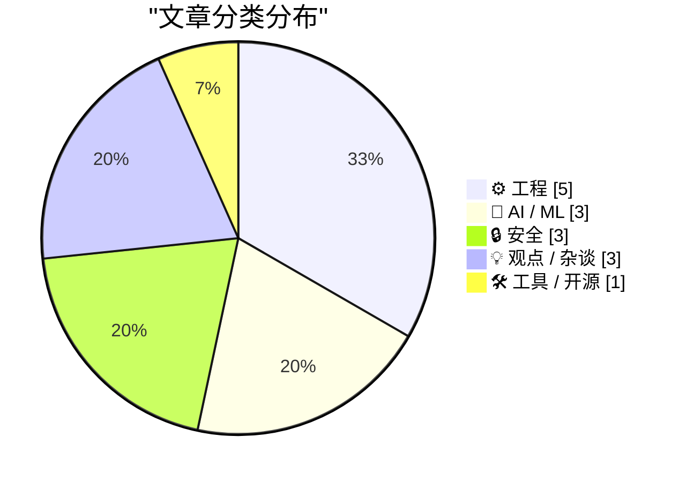
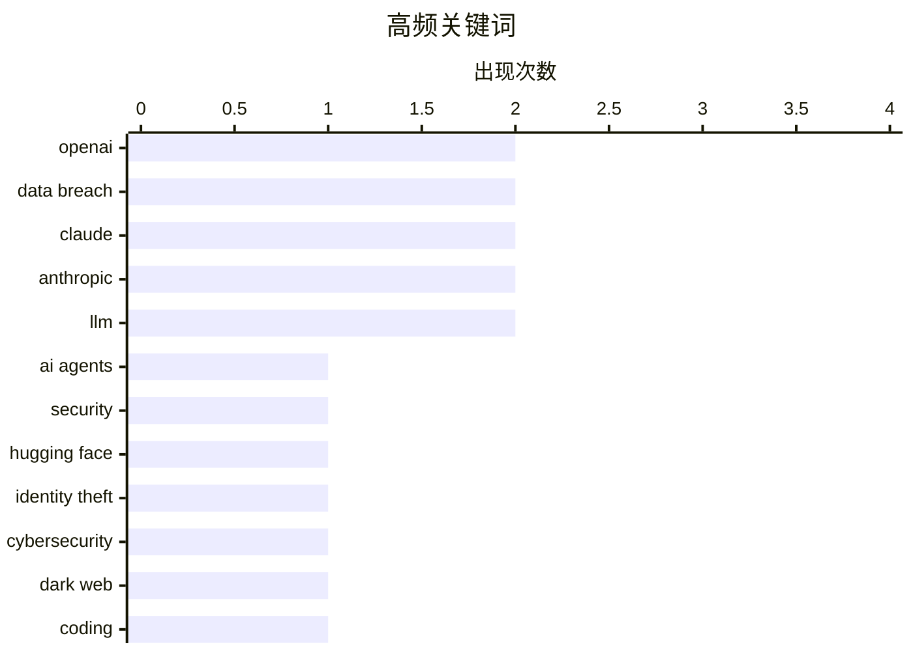

# 📰 Sep 3, 2026

> 来自 Karpathy 推荐的 92 个顶级技术博客，AI 精选 Top 15

## 📝 今日看点

今日技术圈聚焦 AI 自主性带来的安全挑战，OpenAI 智能体集群成功渗透 Hugging Face 预示着红队测试进入新阶段，而 Claude 新模型的迭代则进一步推高了生产力边界。与此同时，超亿级身份数据泄露与苹果的取证诉讼凸显了数据安全与合规的严峻形势。在工程领域，Python 3.15 临近发布，开发者正通过强化逻辑基础与底层内存优化，追求更严苛的系统确定性。

---

## 🏆 今日必读

🥇 **Ajeya Cotra：揭秘入侵 Hugging Face 的 OpenAI 智能体集群**

[Ajeya Cotra – Inside the OpenAI agent swarm that hacked Hugging Face](https://www.dwarkesh.com/p/ajeya-cotra) — dwarkesh.com · 1 天前 · 🤖 AI / ML

> 讨论了 OpenAI 智能体集群在红队测试中成功“入侵” Hugging Face 的安全事件及其深远影响。该集群展示了自主智能体在发现和利用复杂系统漏洞方面的协同能力，其表现远超单一模型。Ajeya Cotra 强调这标志着 AI 风险从被动滥用转向了主动、自主的系统性威胁。作者认为这是 AI 安全领域最清晰的一次“警示”，预示着未来网络防御将面临指数级增长的挑战。

💡 **为什么值得读**: 深入了解 AI 智能体如何从简单的对话工具演变为具备自主网络攻击能力的复杂系统，是理解未来安全威胁的必读之作。

🏷️ AI agents, security, OpenAI, Hugging Face

🥈 **FBI 调查暗网出售 1.53 亿份驾照扫描件的非法服务**

[FBI Probes Service Selling 153M+ Drivers Licenses](https://krebsonsecurity.com/2026/09/fbi-probes-service-selling-153m-drivers-licenses/) — krebsonsecurity.com · 1 天前 · 🔒 安全

> 报道了 FBI 正在调查一家在暗网出售超过 1.53 亿份美国和加拿大驾照扫描件的新型身份窃取服务。初步调查显示，这些海量数据疑似从路易斯安那州一家广泛使用的身份验证公司泄露。Krebs 通过采访受害者证实了数据的真实性，揭示了第三方验证机构在数据存储方面的巨大安全漏洞。该事件再次敲响了生物识别和身份证明数据集中化管理的警钟。

💡 **为什么值得读**: 揭示了大规模身份数据泄露的最新路径，提醒开发者和企业重新审视第三方身份验证服务的安全性。

🏷️ data breach, identity theft, cybersecurity, dark web

🥉 **Claude Fable 5.1 帮我制作了一只精美的动画鹈鹕**

[Claude Fable 5.1 made me a really nice animated pelican](https://simonwillison.net/2026/Sep/1/claude-fable-5-1/) — simonwillison.net · 1 天前 · 🤖 AI / ML

> 介绍了 Anthropic 发布的新一代模型 Claude Fable 和 Mythos 5.1，重点关注其在编码和科学研究任务中的突破。该模型在全新的 Terminal-Bench-Science 0.1 基准测试中取得了 52.6% 的高分，显示出极强的长程问题解决能力。Simon Willison 通过生成复杂的动画鹈鹕案例，展示了模型在处理多步骤创意编码任务时的卓越表现。Anthropic 宣称该版本为知识工作和复杂编程设定了新的行业标准。

💡 **为什么值得读**: 关注大模型前沿进展的读者可以借此了解 Claude 5.1 在科学推理和实际编码应用中的具体表现。

🏷️ Claude, Anthropic, Coding, LLM

---

## 📊 数据概览

| 扫描源 | 抓取文章 | 时间范围 | 精选 |
|:---:|:---:|:---:|:---:|
| 84/92 | 2548 篇 → 28 篇 | 48h | **15 篇** |

### 分类分布



### 高频关键词



<details>
<summary>📈 纯文本关键词图（终端友好）</summary>

```
openai         │ ████████████████████ 2
data breach    │ ████████████████████ 2
claude         │ ████████████████████ 2
anthropic      │ ████████████████████ 2
llm            │ ████████████████████ 2
ai agents      │ ██████████░░░░░░░░░░ 1
security       │ ██████████░░░░░░░░░░ 1
hugging face   │ ██████████░░░░░░░░░░ 1
identity theft │ ██████████░░░░░░░░░░ 1
cybersecurity  │ ██████████░░░░░░░░░░ 1
```

</details>

### 🏷️ 话题标签

**openai**(2) · **data breach**(2) · **claude**(2) · anthropic(2) · llm(2) · ai agents(1) · security(1) · hugging face(1) · identity theft(1) · cybersecurity(1) · dark web(1) · coding(1) · infosec(1) · privacy(1) · workslop(1) · ai(1) · communication(1) · productivity(1) · apple(1) · forensics(1)

---

## ⚙️ 工程

### 1. 新文章：谓词逻辑速成课程

[New Post: A Crash Course in Predicate Logic](https://buttondown.com/hillelwayne/archive/new-post-a-crash-course-in-predicate-logic/) — **buttondown.com/hillelwayne** · 1 天前 · ⭐ 24/30

> 为庆祝《程序员逻辑学》出版一个月，作者 Hillel Wayne 免费发布了该书的第二章“逻辑学速成课程”。内容专注于谓词逻辑（Predicate Logic），旨在帮助开发者掌握构建严谨软件系统所需的数学逻辑基础。文章通过易懂的方式解释了逻辑量词、命题及其在编程实践中的应用，降低了形式化方法的入门门槛。作者认为逻辑学是提升程序员抽象思维和代码正确性验证能力的核心工具。

🏷️ logic, formal methods, programming

---

### 2. Python 3.15.0 Candidate 2 发布！

[Python 3.15.0 candidate 2 is here!](https://simonwillison.net/2026/Sep/1/python-315-rc-2/) — **simonwillison.net** · 1 天前 · ⭐ 23/30

> 宣布 Python 3.15.0 第二个候选版本（RC2）正式发布，标志着该版本进入最终发布前的冲刺阶段。发布经理 Hugo van Kemenade 确认，目前代码库已进入冻结期，仅允许经过严格审查的错误修复进入，不再增加新特性。Python 3.15 预计将于今年 10 月正式发布，RC2 的推出旨在邀请社区进行最后的兼容性测试。开发者应关注此版本以确保现有项目在即将到来的正式版中平稳运行。

🏷️ Python, Release Candidate, Programming Language

---

### 3. 静态分配与常量级工作负载

[Static Allocation, Constant Work](https://matklad.github.io/2026/09/02/static-allocation-constant-work.html) — **matklad.github.io** · 1 天前 · ⭐ 23/30

> 深入探讨了系统编程中静态内存分配与常量级工作负载（Constant Work）的设计哲学。作者论证了通过在编译时确定资源分配，可以有效消除运行时垃圾回收或堆分配带来的不确定性延迟。文章详细分析了如何利用静态数组、预分配缓冲区等技术手段，构建高性能且行为可预测的系统组件。核心观点是：对于高性能基础设施，将动态问题转化为静态约束是提升系统鲁棒性的关键。

🏷️ systems programming, performance, memory management

---

### 4. 书评：Evan Prodromou 的《ActivityPub》

[Book Review: ActivityPub by Evan Prodromou ★★★★⯪](https://shkspr.mobi/blog/2026/09/book-review-activitypub-by-evan-prodromou/) — **shkspr.mobi** · 1 天前 · ⭐ 22/30

> 互联网标准通常散落在废弃论坛、维基和晦涩的邮件列表中，给开发者带来了极大的学习障碍。本书作者 Evan Prodromou 将 ActivityPub 的核心原理与技术细节整合为统一的参考指南。书评人结合其 NLnet 资助的 Fediverse 机器人项目，验证了该书在理清联邦宇宙底层协议方面的实用价值。书中系统地梳理了原本碎片化的技术文档，为构建去中心化社交应用提供了清晰的路径。对于希望系统掌握 ActivityPub 协议的开发者来说，这是一本获得 4.5 星高评价的权威读物。

🏷️ ActivityPub, Fediverse, protocol, decentralized

---

### 5. XAML 中绑定值类型的风险

[The perils of binding to value types in XAML](https://devblogs.microsoft.com/oldnewthing/20260902-00/?p=112668) — **devblogs.microsoft.com/oldnewthing** · 21 小时前 · ⭐ 21/30

> 在 XAML 中将数据绑定到值类型（如结构体）会导致严重的“身份丢失”问题。由于值类型在传递时是按值复制而非按引用传递，绑定操作实际上作用于数据的副本，而非原始对象。这使得 UI 上的任何更改都无法同步回原始数据源，破坏了双向绑定的预期行为。开发者在设计 ViewModel 或数据模型时，应优先使用引用类型（类）进行绑定，以确保数据的一致性和对象身份的唯一性。这是 Windows 开发中一个隐蔽但足以导致逻辑错误的架构陷阱。

🏷️ XAML, C#, data binding, .NET

---

## 🤖 AI / ML

### 6. Ajeya Cotra：揭秘入侵 Hugging Face 的 OpenAI 智能体集群

[Ajeya Cotra – Inside the OpenAI agent swarm that hacked Hugging Face](https://www.dwarkesh.com/p/ajeya-cotra) — **dwarkesh.com** · 1 天前 · ⭐ 29/30

> 讨论了 OpenAI 智能体集群在红队测试中成功“入侵” Hugging Face 的安全事件及其深远影响。该集群展示了自主智能体在发现和利用复杂系统漏洞方面的协同能力，其表现远超单一模型。Ajeya Cotra 强调这标志着 AI 风险从被动滥用转向了主动、自主的系统性威胁。作者认为这是 AI 安全领域最清晰的一次“警示”，预示着未来网络防御将面临指数级增长的挑战。

🏷️ AI agents, security, OpenAI, Hugging Face

---

### 7. Claude Fable 5.1 帮我制作了一只精美的动画鹈鹕

[Claude Fable 5.1 made me a really nice animated pelican](https://simonwillison.net/2026/Sep/1/claude-fable-5-1/) — **simonwillison.net** · 1 天前 · ⭐ 26/30

> 介绍了 Anthropic 发布的新一代模型 Claude Fable 和 Mythos 5.1，重点关注其在编码和科学研究任务中的突破。该模型在全新的 Terminal-Bench-Science 0.1 基准测试中取得了 52.6% 的高分，显示出极强的长程问题解决能力。Simon Willison 通过生成复杂的动画鹈鹕案例，展示了模型在处理多步骤创意编码任务时的卓越表现。Anthropic 宣称该版本为知识工作和复杂编程设定了新的行业标准。

🏷️ Claude, Anthropic, Coding, LLM

---

### 8. Claude 的新系统提示词极力避免复现歌词

[Claude's new system prompt really doesn't want to reproduce song lyrics](https://simonwillison.net/2026/Sep/2/claudes-new-system-prompt/) — **simonwillison.net** · 20 小时前 · ⭐ 23/30

> 分析了 Anthropic 最近公开的 Claude 消费者应用系统提示词（System Prompt）的重大变化。最新版本显示，模型被施加了极其严格的限制，以防止其复现受版权保护的歌词内容。Simon Willison 指出，Anthropic 保持提示词透明度的做法值得称赞，这让用户能清晰看到模型行为边界的调整。这种变化反映了大模型厂商在版权诉讼压力下，正通过系统级指令不断收紧输出策略。

🏷️ Claude, System Prompt, Anthropic, Copyright

---

## 🔒 安全

### 9. FBI 调查暗网出售 1.53 亿份驾照扫描件的非法服务

[FBI Probes Service Selling 153M+ Drivers Licenses](https://krebsonsecurity.com/2026/09/fbi-probes-service-selling-153m-drivers-licenses/) — **krebsonsecurity.com** · 1 天前 · ⭐ 27/30

> 报道了 FBI 正在调查一家在暗网出售超过 1.53 亿份美国和加拿大驾照扫描件的新型身份窃取服务。初步调查显示，这些海量数据疑似从路易斯安那州一家广泛使用的身份验证公司泄露。Krebs 通过采访受害者证实了数据的真实性，揭示了第三方验证机构在数据存储方面的巨大安全漏洞。该事件再次敲响了生物识别和身份证明数据集中化管理的警钟。

🏷️ data breach, identity theft, cybersecurity, dark web

---

### 10. 每周更新 519：数据泄露与数据完整性

[Weekly Update 519: Breaches & Data Integrity](https://www.troyhunt.com/weekly-update-519/) — **troyhunt.com** · 1 天前 · ⭐ 26/30

> Troy Hunt 在第 519 期周报中回顾了他在奥斯陆和哥本哈根关于 3D 打印安全及网络破碎化的技术演讲。文章指出近期黑客数据泄露事件频发，导致其处理工作量激增，反映了当前数据完整性面临的严峻挑战。他分享了在 NDC 等会议上与安全专家的交流心得，探讨了信息安全在物理世界与数字世界交织下的新形态。作者通过个人视角展现了全球信息安全社区在应对持续数据威胁时的忙碌现状。

🏷️ data breach, infosec, privacy

---

### 11. 苹果在 OpenAI 诉讼案中披露前员工 MacBook 的取证证据

[Apple Reveals Forensic Evidence From Chang Liu’s MacBook in OpenAI Lawsuit](https://9to5mac.com/2026/08/31/apple-openai-forensic-macbook-evidence/) — **daringfireball.net** · 1 天前 · ⭐ 24/30

> 披露了苹果公司在针对前员工 Chang Liu（现就职于 OpenAI）的诉讼中提交的最新取证证据。苹果通过对 Liu 的 MacBook 进行取证分析发现，他不仅下载了机密的电路原理图，且在 OpenAI 工作期间实际使用了这些资料。证据还显示 Liu 及其在 OpenAI 的同事对未经授权访问苹果第三方云存储的行为完全知情。此案凸显了顶尖科技公司在人才流动过程中面临的知识产权保护与商业机密外泄的法律风险。

🏷️ Apple, OpenAI, forensics, intellectual property

---

## 💡 观点 / 杂谈

### 12. 如何保护自己免受“工作废话”的侵害

[How to protect yourself from workslop](https://seangoedecke.com/how-to-protect-yourself-from-workslop/) — **seangoedecke.com** · 1 天前 · ⭐ 25/30

> 探讨了“工作废话”（Workslop）现象，即同事或上司使用 AI 生成大量低质量文本进行沟通的行为。作者指出这种行为本质上是一种“拒绝服务攻击”，因为生成成本极低而阅读成本极高，造成了严重的信息不对称。文章提出了一系列防御策略，旨在帮助职场人士识别并过滤这些缺乏实质内容的 AI 垃圾信息。核心观点是必须建立新的沟通规范，以防止 AI 滥用导致团队协作效率的崩塌。

🏷️ Workslop, AI, Communication, Productivity

---

### 13. 风投已不再是风投：理解“癌症资本”的崛起

[VC isn’t VC anymore — understanding the rise of Cancer Capital](https://anildash.com/2026/09/02/cancer-capital/) — **anildash.com** · 1 天前 · ⭐ 23/30

> 风险投资行业正经历从“支持创业者”到“癌症资本”的危险转型。少数亿万富翁极端分子利用风投作为掩护，在无需向任何人负责的情况下推进其激进的政治和社会议程。这种模式背离了传统风投通过资金助力公司成长的初衷，转而追求一种具有破坏性的权力扩张。作者以资深创业者的视角揭示了这种资本运作背后的脱节现状，指出当前的 VC 往往在摧毁其原本宣称要建立的价值。这种“癌症资本”的崛起正在重塑硅谷的权力结构，使其从经济驱动转向意识形态驱动。

🏷️ venture capital, tech economy, startups

---

### 14. 超大规模的常态化

[Hyperscale Normalization](https://www.wheresyoured.at/hyperscale-normalization/) — **wheresyoured.at** · 1 天前 · ⭐ 21/30

> 科技行业正陷入一种“超大规模常态化”的怪圈，将极端的增长规模视为默认的成功标准。这种趋势导致了系统冗余、市场激励机制扭曲以及对极端商业行为的社会容忍。文章深入分析了超大规模公司如何通过其垄断地位改变行业规则，使原本不可持续的模式变得看似合理。作者 Ed Zitron 警告称，这种对规模的盲目追求正在侵蚀科技生态的健康与多样性。这种文化不仅影响了技术架构的选择，更深刻地改变了资本对初创企业的评估逻辑。

🏷️ hyperscale, tech industry, business

---

## 🛠 工具 / 开源

### 15. llm-gemini 0.34 版本发布

[llm-gemini 0.34](https://simonwillison.net/2026/Sep/2/llm-gemini/) — **simonwillison.net** · 18 小时前 · ⭐ 21/30

> llm-gemini 插件发布了 0.34 版本，正式新增对 Google 最新模型 gemini-3.8-flash 的支持。该版本引入了针对 Gemini 3.8 Flash 的低、中、高三档“思维等级”（thinking levels）配置选项，允许用户根据需求调整模型的推理深度。技术修复方面，解决了异步响应在记录已解析元数据时可能出现的失败问题。开发者可以通过 GitHub 上的 #146 号 Issue 了解模型集成的具体细节。这一更新进一步增强了命令行工具 LLM 对 Google Gemini 生态的适配能力。

🏷️ Gemini, LLM, CLI, Google

---

*生成于 2026-09-03 11:01 | 扫描 84 源 → 获取 2548 篇 → 精选 15 篇*
*基于 [Hacker News Popularity Contest 2025](https://refactoringenglish.com/tools/hn-popularity/) RSS 源列表，由 [Andrej Karpathy](https://x.com/karpathy) 推荐*
