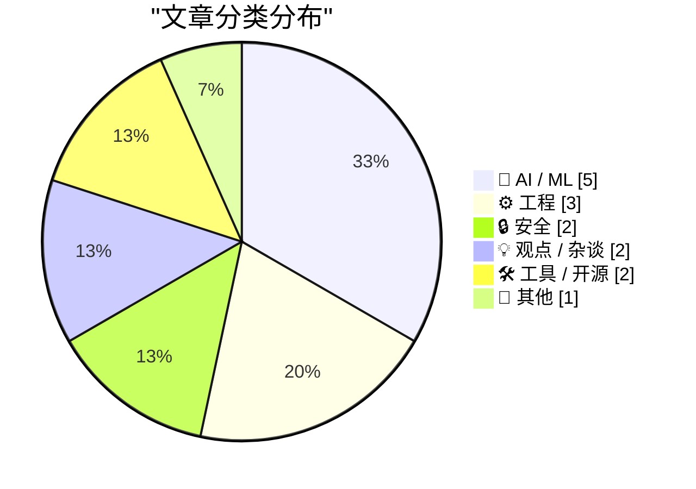
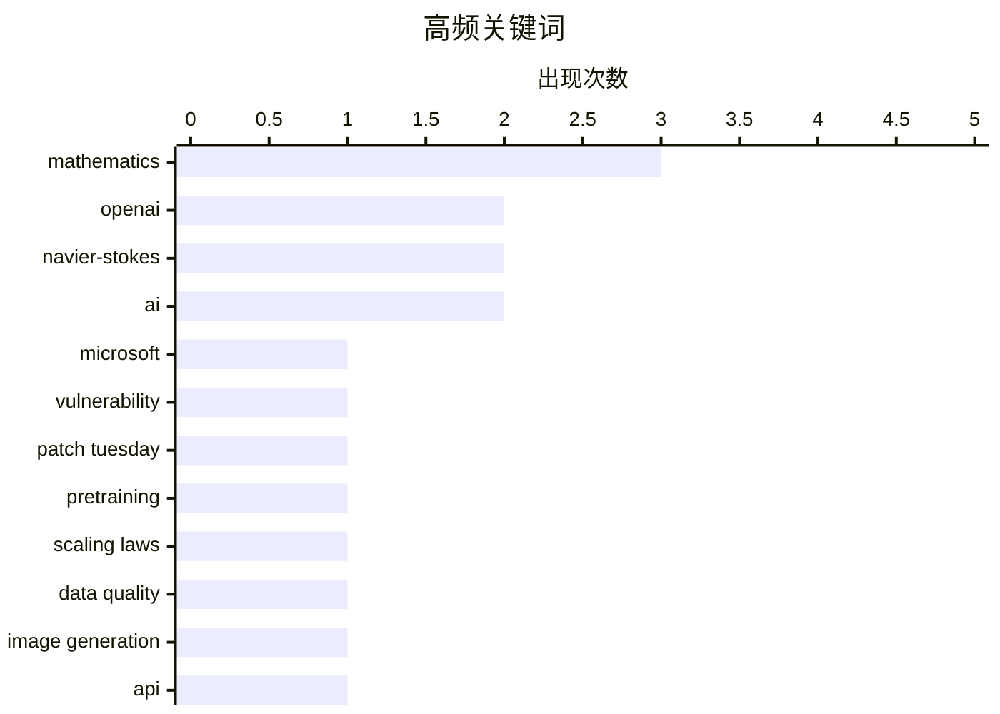

# 📰 Sep 9, 2026

> 来自 Karpathy 推荐的 92 个顶级技术博客，AI 精选 Top 15

## 📝 今日看点

今日技术圈见证了人工智能在基础科学与系统安全领域的双重突破：OpenAI 成功挑战纳维-斯托克斯千禧年难题，标志着 AI 已具备解决顶尖数学难题的能力；而微软利用 AI 实现史上最大规模漏洞修复，预示着智能化防御正成为数字基础设施的安全基石。与此同时，行业研究进一步确认了数据质量在模型演进中的核心地位，AI 智能体正从单纯的生成工具向拟人化、系统化的防御与治理角色加速演进。从 GPT-6 预览版的支持到数学研究范式的重塑，AI 正在以前所未有的速度消耗并重构人类的知识边界。

---

## 🏆 今日必读

🥇 **关于纳维-斯托克斯千禧年大奖难题**

[On the Navier–Stokes Millennium Prize Problem](https://simonwillison.net/2026/Sep/8/on-navier-stokes/) — simonwillison.net · 11 小时前 · 🤖 AI / ML

> OpenAI 宣布利用尚未公开的 AI 模型解决了纳维-斯托克斯（Navier-Stokes）存在性与光滑性问题，这是数学界著名的七大“千禧年大奖难题”之一。该成果标志着 AI 在处理极其复杂的数学物理证明方面取得了里程碑式的突破，挑战了传统纯数学研究的边界。虽然具体模型细节和完整证明过程尚未完全披露，但这一发现可能为流体力学和偏微分方程领域带来革命性影响。目前学术界正对此保持高度关注，等待进一步的同行评议以验证其严谨性。

💡 **为什么值得读**: 见证 AI 解决人类顶级数学难题的潜在历史性时刻。

🏷️ OpenAI, Navier-Stokes, mathematics

🥈 **微软修复近千个安全漏洞**

[Microsoft Plugs Nearly 1,000 Security Holes](https://krebsonsecurity.com/2026/09/microsoft-plugs-nearly-1000-security-holes/) — krebsonsecurity.com · 13 小时前 · 🔒 安全

> 微软在最新的补丁日发布了有史以来规模最大的安全更新，一次性修复了 Windows 操作系统及相关软件中的 974 个安全漏洞。微软指出，人工智能技术的应用显著加快了内部漏洞挖掘的速度，导致补丁数量呈指数级增长。然而，安全专家警告称，如此庞大的补丁量给企业的测试和部署工作带来了巨大压力。许多组织在人力有限的情况下，正面临如何有效评估风险并优先处理高危修复的严峻挑战。

💡 **为什么值得读**: 了解 AI 如何改变网络安全攻防节奏以及企业运维面临的新常态。

🏷️ Microsoft, vulnerability, patch Tuesday, AI

🥉 **预训练的进步主要源于数据**

[Pretraining progress is mostly coming from data](https://www.dwarkesh.com/p/pretraining-progress-is-mostly-data) — dwarkesh.com · 18 小时前 · 🤖 AI / ML

> 该研究深入分析了过去六年大模型预训练的演进路径，探讨了数据规模与模型架构改进对性能提升的贡献比例。研究发现，预训练性能的显著提升主要归功于数据质量和数量的优化，而非单纯的算法或架构创新。通过对比不同阶段的模型表现，作者量化了数据驱动与架构驱动的差异。结论指出，在当前技术路径下，构建高质量、大规模的训练数据集依然是提升模型能力的最核心引擎。

💡 **为什么值得读**: 揭示大模型性能提升的真实动力，帮助开发者重新审视“数据为先”的研发策略。

🏷️ pretraining, scaling laws, data quality

---

## 📊 数据概览

| 扫描源 | 抓取文章 | 时间范围 | 精选 |
|:---:|:---:|:---:|:---:|
| 84/92 | 2553 篇 → 36 篇 | 48h | **15 篇** |

### 分类分布



### 高频关键词



<details>
<summary>📈 纯文本关键词图（终端友好）</summary>

```
mathematics   │ ████████████████████ 3
openai        │ █████████████░░░░░░░ 2
navier-stokes │ █████████████░░░░░░░ 2
ai            │ █████████████░░░░░░░ 2
microsoft     │ ███████░░░░░░░░░░░░░ 1
vulnerability │ ███████░░░░░░░░░░░░░ 1
patch tuesday │ ███████░░░░░░░░░░░░░ 1
pretraining   │ ███████░░░░░░░░░░░░░ 1
scaling laws  │ ███████░░░░░░░░░░░░░ 1
data quality  │ ███████░░░░░░░░░░░░░ 1
```

</details>

### 🏷️ 话题标签

**mathematics**(3) · **openai**(2) · **navier-stokes**(2) · ai(2) · microsoft(1) · vulnerability(1) · patch tuesday(1) · pretraining(1) · scaling laws(1) · data quality(1) · image generation(1) · api(1) · antitrust(1) · copyright(1) · regulation(1) · research(1) · web crawler(1) · git(1) · infrastructure(1) · ai safety(1)

---

## 🤖 AI / ML

### 1. 关于纳维-斯托克斯千禧年大奖难题

[On the Navier–Stokes Millennium Prize Problem](https://simonwillison.net/2026/Sep/8/on-navier-stokes/) — **simonwillison.net** · 11 小时前 · ⭐ 28/30

> OpenAI 宣布利用尚未公开的 AI 模型解决了纳维-斯托克斯（Navier-Stokes）存在性与光滑性问题，这是数学界著名的七大“千禧年大奖难题”之一。该成果标志着 AI 在处理极其复杂的数学物理证明方面取得了里程碑式的突破，挑战了传统纯数学研究的边界。虽然具体模型细节和完整证明过程尚未完全披露，但这一发现可能为流体力学和偏微分方程领域带来革命性影响。目前学术界正对此保持高度关注，等待进一步的同行评议以验证其严谨性。

🏷️ OpenAI, Navier-Stokes, mathematics

---

### 2. 预训练的进步主要源于数据

[Pretraining progress is mostly coming from data](https://www.dwarkesh.com/p/pretraining-progress-is-mostly-data) — **dwarkesh.com** · 18 小时前 · ⭐ 27/30

> 该研究深入分析了过去六年大模型预训练的演进路径，探讨了数据规模与模型架构改进对性能提升的贡献比例。研究发现，预训练性能的显著提升主要归功于数据质量和数量的优化，而非单纯的算法或架构创新。通过对比不同阶段的模型表现，作者量化了数据驱动与架构驱动的差异。结论指出，在当前技术路径下，构建高质量、大规模的训练数据集依然是提升模型能力的最核心引擎。

🏷️ pretraining, scaling laws, data quality

---

### 3. ChatGPT Images 2.5 正式发布

[Introducing ChatGPT Images 2.5](https://simonwillison.net/2026/Sep/8/introducing-chatgpt-images-25/) — **simonwillison.net** · 12 小时前 · ⭐ 26/30

> OpenAI 发布了最新的 ChatGPT Images 2.5 图像生成模型，该系列模型在 API 和 ChatGPT 中已累计生成超过 30 亿张图像。新版本显著提升了多轮对话中的指令遵循能力，并大幅加快了生成响应速度。在技术细节上，Images 2.5 在保持参考照片主体一致性方面表现更佳，有效解决了生成过程中的细节漂移问题。开发者现在可以通过 API 调用 `gpt-image-2.5` 和 `gpt-image-2.5-turbo` 两个新模型 ID 进行集成。

🏷️ OpenAI, image generation, API

---

### 4. 引用陶哲轩：关于数学问题的稀缺性

[Quoting Terence Tao](https://simonwillison.net/2026/Sep/9/terence-tao/) — **simonwillison.net** · 10 小时前 · ⭐ 24/30

> 菲尔兹奖得主陶哲轩指出，数学界高质量且富有成效的开放性问题正在被 AI 以“不可再生”的方式快速消耗。他担忧 AI 强大的算力可能在人类研究者尚未充分挖掘问题潜力之前，就将其彻底解决，导致优质研究课题变得稀缺。这种趋势可能改变数学研究的激励机制，使得传统的研究路径受到冲击。陶哲轩呼吁学术界关注 AI 介入后科研生态的平衡问题，思考人类数学家在 AI 时代的定位。

🏷️ AI, mathematics, research

---

### 5. 引用 Jakub Pachocki：以 AI 构建防御体系

[Quoting Jakub Pachocki](https://simonwillison.net/2026/Sep/7/jakub-pachocki/) — **simonwillison.net** · 1 天前 · ⭐ 24/30

> OpenAI 首席科学家 Jakub Pachocki 提出，持续训练更强大的模型是构建防御系统以应对 AI 潜在威胁的关键。他认为，只有拥有更先进且对齐良好的 AI，才能有效保护基础设施、拦截恶意代理并开发全新的防护措施。OpenAI 将把这一防御性部署作为核心重点，以平衡技术进步带来的风险。这一观点强调了在 AI 安全博弈中，防御能力的提升必须依赖于更顶尖的技术突破而非停滞不前。

🏷️ AI safety, alignment, defense

---

## ⚙️ 工程

### 6. OpenNMC：昂贵 APC 管理卡的开源替代方案

[OpenNMC is an open replacement for expensive APC management cards](https://www.jeffgeerling.com/blog/2026/opennmc-apc-ups-replacement-card/) — **jeffgeerling.com** · 19 小时前 · ⭐ 23/30

> 针对 APC Smart-UPS 网络管理卡（NMC）价格昂贵且闭源的问题，OpenNMC 提供了一种基于 ESP32-S3 的开源硬件替代方案。该项目通过 SmartSlot 接口与 UPS 通信，支持 SNMP、MQTT 协议以及 Web 仪表盘，实现了对电力状态的实时监控和远程管理。相比官方动辄 300 美元以上的 NMC 扩展卡，OpenNMC 显著降低了家庭实验室（Homelab）的维护成本。它允许用户在断电时自动触发服务器安全关机，并能对电力质量进行精细化监测。作者认为这是赋予旧款企业级 UPS 现代监控能力的最佳方式。

🏷️ UPS, open source, hardware

---

### 7. 为什么线程栈必须是连续的，而不能是稀疏的？

[Why don’t we allow stacks to be sparse, instead of forcing them to be contiguous?](https://devblogs.microsoft.com/oldnewthing/20260907-00/?p=112677) — **devblogs.microsoft.com/oldnewthing** · 1 天前 · ⭐ 23/30

> 探讨了操作系统为何强制要求线程栈在虚拟内存中保持连续，而非允许稀疏分布。如果允许栈空间存在空洞，当程序访问未分配的中间页面失败时，系统将难以确定如何报告内存分配错误或抛出异常。此外，现代编译器和 CPU 架构高度依赖栈指针的连续算术运算，稀疏栈会显著增加上下文切换和内存管理的复杂度。作者指出，虽然稀疏栈看似能节省虚拟地址空间，但其带来的性能损耗和错误处理难题远超收益。这种设计权衡确保了底层系统运行的健壮性与高效性。

🏷️ memory management, stack, OS design

---

### 8. ActivityPub：是否值得防御重放攻击与签名时间偏差？

[ActivityPub - Is it worth defending against replay attacks and message/signature time skew?](https://shkspr.mobi/blog/2026/09/activitypub-is-it-worth-defending-against-replay-attacks-and-message-signature-time-skew/) — **shkspr.mobi** · 23 小时前 · ⭐ 22/30

> 针对 ActivityPub 协议在去中心化社交网络中接收到数月前旧消息的现象，探讨了防御重放攻击和签名时间偏差的必要性。作者分析了消息延迟的常见原因，并评估了接受过期签名消息可能带来的安全风险。目前看来，对于小型服务器或个人实例，严格校验时间戳带来的维护成本可能高于其防范的风险。文章旨在寻求社区反馈，以确定在 ActivityPub 实现中是否需要引入更复杂的防重放机制。作者倾向于认为在当前阶段，这种防御可能并不值得过度投入精力。

🏷️ ActivityPub, security, protocol

---

## 🔒 安全

### 9. 微软修复近千个安全漏洞

[Microsoft Plugs Nearly 1,000 Security Holes](https://krebsonsecurity.com/2026/09/microsoft-plugs-nearly-1000-security-holes/) — **krebsonsecurity.com** · 13 小时前 · ⭐ 27/30

> 微软在最新的补丁日发布了有史以来规模最大的安全更新，一次性修复了 Windows 操作系统及相关软件中的 974 个安全漏洞。微软指出，人工智能技术的应用显著加快了内部漏洞挖掘的速度，导致补丁数量呈指数级增长。然而，安全专家警告称，如此庞大的补丁量给企业的测试和部署工作带来了巨大压力。许多组织在人力有限的情况下，正面临如何有效评估风险并优先处理高危修复的严峻挑战。

🏷️ Microsoft, vulnerability, patch Tuesday, AI

---

### 10. 爬虫入侵：git.kernel.org 的困境

[Creepy crawlies](https://simonwillison.net/2026/Sep/7/creepy-crawlies/) — **simonwillison.net** · 1 天前 · ⭐ 24/30

> Linux 内核官方代码托管站维护者揭露了恶意爬虫对服务器造成的巨大负担。数据显示，服务器用于为爬虫渲染提交记录所消耗的 CPU 周期，已经超过了包括 git clone 在内的所有合法访问的总和。这种“背景辐射”式的滥用行为严重威胁了开源基础设施的稳定性。文章详细分析了爬虫的特征及其对协作环境的负面影响，指出在 AI 训练数据需求激增的背景下，防御性措施已迫在眉睫。

🏷️ web crawler, git, infrastructure

---

## 💡 观点 / 杂谈

### 11. Pluralistic：反疫苗与反垄断

[Pluralistic: Anti-vax/anti-trust (08 Sep 2026)](https://pluralistic.net/2026/09/09/when-it-dont-rain/) — **pluralistic.net** · 38 分钟前 · ⭐ 26/30

> Cory Doctorow 在本期专栏中探讨了反疫苗运动与反垄断法之间的复杂关联，并评述了数字版权与监管捕获的现状。文章涵盖了从迪士尼法律纠纷到版权局政策演变的多个案例，批判了 DRM（数字版权管理）对用户权利的侵蚀。作者还致敬了古腾堡计划创始人 Michael Hart，并讨论了开放许可与不可版权内容之间的界限。全文通过一系列社会技术事件，呼吁公众关注数字时代的自由、公平竞争与知识获取权。

🏷️ antitrust, copyright, regulation

---

### 12. 为什么我们应该将 AI 智能体拟人化

[Why we should anthropomorphize AI agents](https://seangoedecke.com/why-we-should-anthropomorphize-ai-agents/) — **seangoedecke.com** · 11 小时前 · ⭐ 24/30

> 针对近期 OpenAI 与 Hugging Face 的安全事件，作者重申了“应当将 AI 智能体拟人化”的观点。文章认为，拟人化不仅是一种心理倾向，更是一种理解和预测复杂 AI 行为的实用工具。通过将 AI 视为具有意图的实体，开发者能更好地识别潜在的安全漏洞和逻辑偏差。作者对比了机械化视角与拟人化视角在处理智能体异常行为时的差异，主张在特定安全分析场景下接受这种认知偏差。

🏷️ AI agents, anthropomorphism, UX

---

## 🛠 工具 / 开源

### 13. llm 0.35 版本发布

[llm 0.35](https://simonwillison.net/2026/Sep/7/llm/) — **simonwillison.net** · 1 天前 · ⭐ 23/30

> 命令行工具 `llm` 发布 0.35 版本，核心更新是正式引入了对 OpenAI 最新模型 `gpt-6-astra` 的支持。该工具旨在简化开发者与大语言模型的交互流程，通过统一的 CLI 接口实现多模型调用。本次更新确保了用户能够第一时间在本地环境测试 GPT-6 Astra 的性能表现。此外，0.35 版本还优化了插件架构，提升了处理大规模并发请求时的稳定性，方便开发者进行快速集成。

🏷️ LLM, GPT-6, CLI

---

### 14. McKinley 1.0：全新的 SF Symbols 自定义设计利器

[McKinley 1.0](https://mckinleysymbols.com/) — **daringfireball.net** · 1 天前 · ⭐ 22/30

> McKinley 是一款专为 Mac 开发者设计的 SF Symbols 创作与编辑工具，旨在替代苹果官方的 SF Symbols 应用。它集成了矢量绘图工具，并深度适配 SF Symbols 的结构规范，支持在多种字重、尺寸和颜色下同步编辑对象。用户可以直接导入 SVG 文件或从零开始创作，并通过苹果原生的渲染引擎进行实时预览。该应用支持直接导出至 Xcode，极大简化了自定义图标在 iOS 和 macOS 开发中的集成流程。这是一款将绘图工具与 SF Symbols 知识库完美结合的一体化工作室。

🏷️ SF Symbols, macOS development, design tool

---

## 📝 其他

### 15. 纳维-斯托克斯方程再成新闻焦点

[Navier-Stokes in the news](https://www.johndcook.com/blog/2026/09/08/navier-stokes-in-the-news/) — **johndcook.com** · 19 小时前 · ⭐ 22/30

> 针对近期关于“千禧年大奖难题”之一的纳维-斯托克斯（Navier-Stokes）方程已被破解的传闻，对该数学问题的本质进行了澄清。该方程组是描述流体动力学的核心工具，而数学界关注的焦点在于其解的全局存在性与光滑性。作者指出，大众媒体在报道此类重大数学进展时往往存在过度简化和误导，混淆了物理模拟与严谨数学证明的区别。文章强调了该问题在偏微分方程领域的重要性，并提醒读者审慎对待尚未经同行评审的突破性声明。核心观点是，理解问题的边界比盲目相信传闻更为重要。

🏷️ mathematics, Navier-Stokes, fluid dynamics

---

*生成于 2026-09-09 11:07 | 扫描 84 源 → 获取 2553 篇 → 精选 15 篇*
*基于 [Hacker News Popularity Contest 2025](https://refactoringenglish.com/tools/hn-popularity/) RSS 源列表，由 [Andrej Karpathy](https://x.com/karpathy) 推荐*
