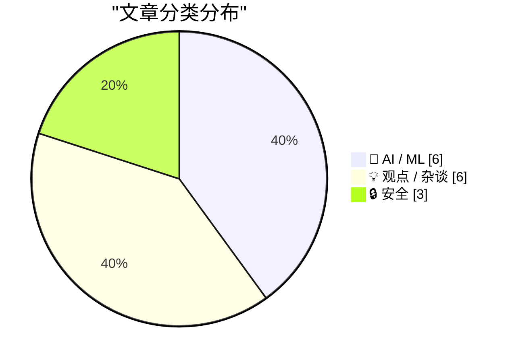
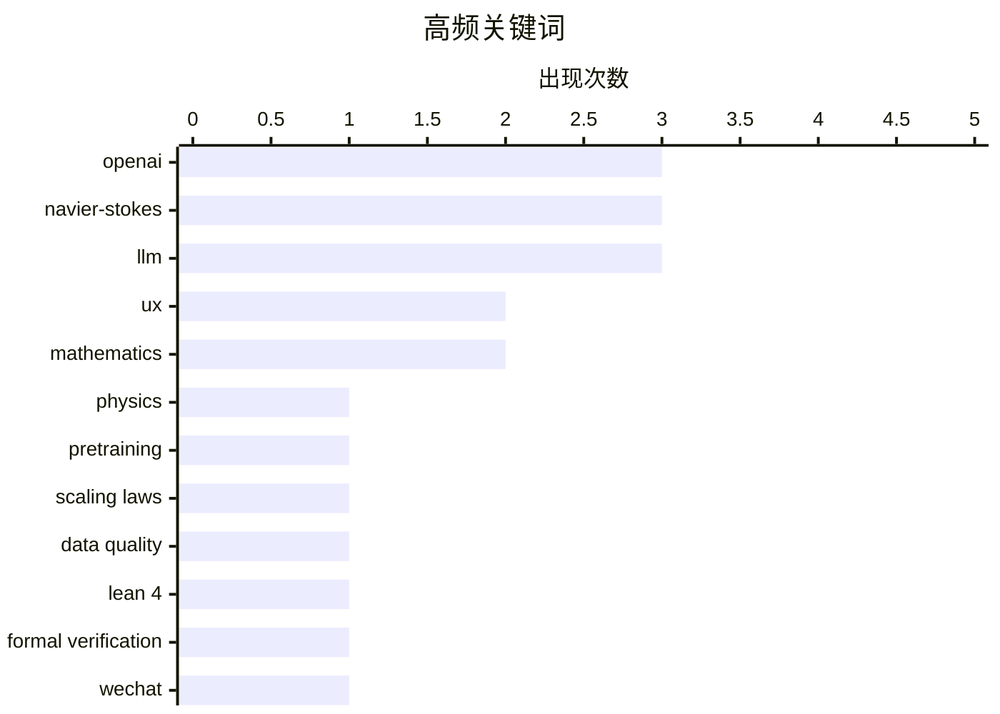

# 📰 Sep 10, 2026

> 来自 Karpathy 推荐的 92 个顶级技术博客，AI 精选 Top 15

## 📝 今日看点

今日技术圈见证了 AI 在基础科学领域的里程碑式跨越，OpenAI 宣称利用 AI 模型与形式化证明解决了纳维-斯托克斯千禧年难题，标志着机器智能正深入科学底层逻辑。与此同时，网络安全攻防战进入白热化，首个针对即时通讯工具的零点击蠕虫与微软创纪录的漏洞修复量，揭示了 AI 时代安全威胁与防御能力的同步激增。此外，关于 AI 作为“智力倍增器”的讨论也再次引发关注，强调了数据质量与顶尖人才在技术变革中的核心地位。

---

## 🏆 今日必读

🥇 **关于纳维-斯托克斯千禧年大奖难题**

[On the Navier–Stokes Millennium Prize Problem](https://simonwillison.net/2026/Sep/8/on-navier-stokes/) — simonwillison.net · 1 天前 · 🤖 AI / ML

> OpenAI 宣布利用一个尚未发布的 AI 模型解决了纳维-斯托克斯（Navier-Stokes）方程的解的存在性与光滑性问题。这是数学界著名的七大“千禧年大奖难题”之一，长期以来一直困扰着物理学和数学界。该成果针对描述流体动力学的核心方程提供了严谨证明，有望获得 100 万美元的奖金。OpenAI 通过这一突破展示了其模型在处理极端复杂数学逻辑和物理建模方面的跨越式进步。这一发现不仅是数学领域的里程碑，也标志着 AI 在科学发现（AI for Science）领域进入了全新阶段。

💡 **为什么值得读**: 见证 AI 首次攻克世界级数学难题的历史性时刻，了解 AI 在基础科学研究中的巨大潜力。

🏷️ OpenAI, Navier-Stokes, Physics, LLM

🥈 **预训练的进步主要源于数据**

[Pretraining progress is mostly coming from data](https://www.dwarkesh.com/p/pretraining-progress-is-mostly-data) — dwarkesh.com · 1 天前 · 🤖 AI / ML

> 本文深入拆解了过去 6 年大模型预训练取得的进展，探讨了数据质量与模型架构改进对性能提升的贡献比例。研究发现，尽管 Transformer 架构有所微调，但模型能力的指数级增长主要归功于训练数据规模的扩大和清洗技术的进步。作者对比了不同代际模型的训练效率，指出数据工程在当前技术周期中占据了主导地位。结论认为，未来的突破将更多依赖于合成数据和更高质量的人类反馈，而非单纯的算法创新。

💡 **为什么值得读**: 揭示了大模型进化的核心驱动力，帮助开发者重新审视“数据”与“算法”的权重分配。

🏷️ LLM, pretraining, scaling laws, data quality

🥉 **纳维-斯托克斯难题中被忽视的关键点**

[The part of Navier-Stokes no one is talking about](https://www.johndcook.com/blog/2026/09/09/formal-method-revolution/) — johndcook.com · 22 小时前 · 🤖 AI / ML

> 在 OpenAI 宣布解决纳维-斯托克斯难题的同时，其同步发布的 Lean 4 形式化证明文件是该成果中最值得关注的技术细节。形式化证明意味着该数学推导不仅通过了人类专家的同行评审，还通过了计算机逻辑的严苛验证，确保了证明的绝对正确性。这种将 AI 生成的数学洞察与形式化验证工具相结合的方法，预示着数学研究范式的重大转变。作者强调，这种“机器可验证”的特性才是该成果在技术层面上最令人震撼的部分。

💡 **为什么值得读**: 深入探讨 AI 证明的可靠性问题，揭示形式化方法（Formal Methods）在现代科学研究中的革命性作用。

🏷️ Navier-Stokes, Lean 4, OpenAI, formal verification

---

## 📊 数据概览

| 扫描源 | 抓取文章 | 时间范围 | 精选 |
|:---:|:---:|:---:|:---:|
| 82/92 | 2157 篇 → 34 篇 | 48h | **15 篇** |

### 分类分布



### 高频关键词



<details>
<summary>📈 纯文本关键词图（终端友好）</summary>

```
openai        │ ████████████████████ 3
navier-stokes │ ████████████████████ 3
llm           │ ████████████████████ 3
ux            │ █████████████░░░░░░░ 2
mathematics   │ █████████████░░░░░░░ 2
physics       │ ███████░░░░░░░░░░░░░ 1
pretraining   │ ███████░░░░░░░░░░░░░ 1
scaling laws  │ ███████░░░░░░░░░░░░░ 1
data quality  │ ███████░░░░░░░░░░░░░ 1
lean 4        │ ███████░░░░░░░░░░░░░ 1
```

</details>

### 🏷️ 话题标签

**openai**(3) · **navier-stokes**(3) · **llm**(3) · ux(2) · mathematics(2) · physics(1) · pretraining(1) · scaling laws(1) · data quality(1) · lean 4(1) · formal verification(1) · wechat(1) · zero-click(1) · worm(1) · mobile security(1) · microsoft(1) · patch tuesday(1) · vulnerability(1) · ai security(1) · ai(1)

---

## 🤖 AI / ML

### 1. 关于纳维-斯托克斯千禧年大奖难题

[On the Navier–Stokes Millennium Prize Problem](https://simonwillison.net/2026/Sep/8/on-navier-stokes/) — **simonwillison.net** · 1 天前 · ⭐ 29/30

> OpenAI 宣布利用一个尚未发布的 AI 模型解决了纳维-斯托克斯（Navier-Stokes）方程的解的存在性与光滑性问题。这是数学界著名的七大“千禧年大奖难题”之一，长期以来一直困扰着物理学和数学界。该成果针对描述流体动力学的核心方程提供了严谨证明，有望获得 100 万美元的奖金。OpenAI 通过这一突破展示了其模型在处理极端复杂数学逻辑和物理建模方面的跨越式进步。这一发现不仅是数学领域的里程碑，也标志着 AI 在科学发现（AI for Science）领域进入了全新阶段。

🏷️ OpenAI, Navier-Stokes, Physics, LLM

---

### 2. 预训练的进步主要源于数据

[Pretraining progress is mostly coming from data](https://www.dwarkesh.com/p/pretraining-progress-is-mostly-data) — **dwarkesh.com** · 1 天前 · ⭐ 28/30

> 本文深入拆解了过去 6 年大模型预训练取得的进展，探讨了数据质量与模型架构改进对性能提升的贡献比例。研究发现，尽管 Transformer 架构有所微调，但模型能力的指数级增长主要归功于训练数据规模的扩大和清洗技术的进步。作者对比了不同代际模型的训练效率，指出数据工程在当前技术周期中占据了主导地位。结论认为，未来的突破将更多依赖于合成数据和更高质量的人类反馈，而非单纯的算法创新。

🏷️ LLM, pretraining, scaling laws, data quality

---

### 3. 纳维-斯托克斯难题中被忽视的关键点

[The part of Navier-Stokes no one is talking about](https://www.johndcook.com/blog/2026/09/09/formal-method-revolution/) — **johndcook.com** · 22 小时前 · ⭐ 27/30

> 在 OpenAI 宣布解决纳维-斯托克斯难题的同时，其同步发布的 Lean 4 形式化证明文件是该成果中最值得关注的技术细节。形式化证明意味着该数学推导不仅通过了人类专家的同行评审，还通过了计算机逻辑的严苛验证，确保了证明的绝对正确性。这种将 AI 生成的数学洞察与形式化验证工具相结合的方法，预示着数学研究范式的重大转变。作者强调，这种“机器可验证”的特性才是该成果在技术层面上最令人震撼的部分。

🏷️ Navier-Stokes, Lean 4, OpenAI, formal verification

---

### 4. AI 是智力的倍增器

[AI is an intelligence multiplier](https://www.johndcook.com/blog/2026/09/09/ai-multiplier/) — **johndcook.com** · 20 小时前 · ⭐ 26/30

> 本文提出 AI 并非普适的“救星”，而是一种“智力倍增器”，其对不同人群的生产力提升效果存在显著差异。数据显示，顶尖程序员和数学家从 AI 工具中获得的效率提升远超普通从业者，他们正利用 AI 解决长期悬而未决的科学难题。作者认为，AI 本质上是增强人类能力的工具，其产出质量高度依赖于使用者的原始智力和专业素养。结论指出，AI 将进一步拉大精英与普通人之间的产出差距，而非缩小这种差距。

🏷️ AI, productivity, software engineering, career

---

### 5. 新闻中的纳维-斯托克斯方程

[Navier-Stokes in the news](https://www.johndcook.com/blog/2026/09/08/navier-stokes-in-the-news/) — **johndcook.com** · 1 天前 · ⭐ 25/30

> 针对近期关于纳维-斯托克斯千禧年难题被解决的传闻，本文对该数学问题的本质进行了科普和澄清。该问题核心在于证明描述流体运动的非线性偏微分方程在三维空间中是否存在全局光滑解，而非简单的物理模拟。作者指出，许多大众媒体的报道过于简化甚至存在误导，未能准确描述该问题的技术难度。文章强调了严谨数学证明与物理直觉之间的区别，并提醒读者关注该成果在数学理论上的真实贡献。

🏷️ Navier-Stokes, mathematics, fluid dynamics

---

### 6. ChatGPT Images 2.5 正式发布

[Introducing ChatGPT Images 2.5](https://simonwillison.net/2026/Sep/8/introducing-chatgpt-images-25/) — **simonwillison.net** · 1 天前 · ⭐ 24/30

> OpenAI 推出了最新的图像生成模型 ChatGPT Images 2.5，该系列模型目前已累计生成超过 30 亿张图像。新版本显著提升了多轮对话中的指令遵循能力，能够更精准地根据用户反馈修改细节。此外，模型在生成速度上进行了优化，并增强了对参考照片中主体特征的保持能力。API 同步推出了 gpt-im 等新模型 ID，旨在为开发者提供更稳定、更高质量的视觉创作工具。

🏷️ ChatGPT, Image Generation, DALL-E, OpenAI

---

## 💡 观点 / 杂谈

### 7. 失去马特·穆伦维格的 Automattic

[Automattic Minus Matt](https://feed.tedium.co/link/15204/17444080/matt-mullenweg-automattic-leave-absence) — **tedium.co** · 5 小时前 · ⭐ 25/30

> WordPress 母公司 Automattic 的创始人 Matt Mullenweg 宣布进入非自愿休假状态，这一变动在开源社区引发了巨大震动。作为 WordPress 生态的核心人物，Matt 的暂时离职可能与近期公司内部的治理争议或外部法律纠纷有关。文章回顾了 Matt 对 WordPress 发展的深远影响，并对其休假期间公司的运营方向表示关注。作者希望这次权力真空能成为公司反思领导风格和社区关系的契机。

🏷️ WordPress, Automattic, Matt Mullenweg, open source

---

### 8. 他们真的认为 AI 可能会毁灭全人类

[They really do think AI might kill everyone](https://seangoedecke.com/they-really-do-think-ai-might-kill-everyone/) — **seangoedecke.com** · 11 小时前 · ⭐ 24/30

> Anthropic 研究员的离职推文再次引发了关于 AI 末日的讨论，揭示了顶尖 AI 开发者普遍认为 AI 可能在十年内导致人类灭绝。这种观点常被外界解读为营销手段或寻求监管保护的策略，但作者指出这其实是开发者们根深蒂固的真实信念。文章强调，无论这种末日预言是否科学，它已成为驱动 AI 行业决策的核心心理动力。理解这种“真实恐惧”对于评估 AI 公司的行为逻辑至关重要，因为这决定了他们如何平衡开发速度与安全限制。

🏷️ AI Safety, Existential Risk, Anthropic, Alignment

---

### 9. 引用陶哲轩：AI 正在“过度开采”数学难题

[Quoting Terence Tao](https://simonwillison.net/2026/Sep/9/terence-tao/) — **simonwillison.net** · 1 天前 · ⭐ 23/30

> 菲尔兹奖得主陶哲轩指出，数学界的高质量开放性问题正被 AI 以“不可再生”的方式快速消耗，可能导致未来研究课题的稀缺。即便只是传出有人在研究某个问题的风声，AI 驱动的算力也会迅速介入并将其“铲平”，使人类研究者失去深入探索的机会。这种现象改变了科研的激励机制，使得传统的研究路径面临被 AI 暴力破解的威胁。数学界必须重新思考在 AI 算力挤压下，如何定义和寻找具有长期价值的研究方向，以防止人类智力探索被算力霸权所取代。

🏷️ Mathematics, AI Research, Terence Tao, Open Problems

---

### 10. 为什么我们应该将 AI 智能体拟人化

[Why we should anthropomorphize AI agents](https://seangoedecke.com/why-we-should-anthropomorphize-ai-agents/) — **seangoedecke.com** · 1 天前 · ⭐ 23/30

> 针对 OpenAI 与 Hugging Face 近期的安全事件，文章探讨了将 AI 智能体拟人化的必要性。作者认为，尽管 LLM 本质上是代码和权重，但将它们视为具有意图的“代理人”是预测其复杂行为的最有效心理模型。随着 AI 从简单的对话框转向能够自主执行任务的 Agent，传统的软件思维已不足以应对其表现出的目标导向性。拟人化并非承认 AI 具有意识，而是一种帮助人类理解和操控高度复杂系统的实用策略，能让我们更直观地预判智能体的潜在风险。

🏷️ AI Agents, Anthropomorphism, UX, LLM

---

### 11. 我们拥有这块屏幕：智能电视的控制权之争

[We own the Glass](https://idiallo.com/byte-size/) — **idiallo.com** · 14 小时前 · ⭐ 23/30

> LG 高管在广告推销中明确表示“我们拥有这块玻璃”，揭示了智能电视厂商对用户硬件的绝对控制权。即便消费者支付了购买费用，厂商仍通过服务条款将电视转变为广告平台和监控终端。这些设备集成了麦克风、Wi-Fi 和追踪软件，能够在用户不知情的情况下记录家庭活动并上传数据。文章警示，在现代消费电子领域，硬件所有权已与使用控制权完全剥离。用户在同意冗长的条款时，实际上已经让渡了家庭隐私权，使客厅变成了厂商的盈利工具。

🏷️ privacy, smart TV, consumer rights, advertising

---

### 12. Pluralistic：反疫苗与反垄断的交织

[Pluralistic: Anti-vax/anti-trust (09 Sep 2026)](https://pluralistic.net/2026/09/09/when-it-dont-rain/) — **pluralistic.net** · 1 天前 · ⭐ 22/30

> Cory Doctorow 探讨了公众对疫苗的抵触情绪与企业垄断及监管俘获之间的深层联系。文章指出，当版权局等监管机构被大企业利益绑架时，公众对制度的信任便会崩塌，进而波及公共卫生领域。内容涵盖了从历史上最大的监狱罢工到反对 DRM（数字版权管理）的斗争等多个维度。作者核心观点认为，要解决反科学思潮，必须先通过反垄断手段拆解那些为了利润而牺牲公共利益的企业结构。只有恢复监管的公正性，才能重建公众对科学建议和公共政策的信任。

🏷️ antitrust, copyright, policy, monopoly

---

## 🔒 安全

### 13. WeWorm：通过微信通话传播的零点击蠕虫

[Quoting Calif Research](https://simonwillison.net/2026/Sep/10/calif-research/) — **simonwillison.net** · 10 小时前 · ⭐ 26/30

> Calif Research 发布了名为 WeWorm 的演示，这是首个能通过微信通话在 iOS 和 Android 系统间传播的零点击蠕虫病毒。受害者无需接听电话或进行任何操作，甚至在静音状态下也会被植入远程代码执行（RCE）漏洞。该团队在 AI 的辅助下，仅用两天时间就完成了从发现漏洞到编写 RCE 利用程序的全部过程。这一案例凸显了 AI 在自动化网络攻击和漏洞挖掘方面的极高效率，对移动社交软件的安全性提出了严峻挑战。

🏷️ WeChat, Zero-click, Worm, Mobile Security

---

### 14. 微软修复近 1000 个安全漏洞，创历史新高

[Microsoft Plugs Nearly 1,000 Security Holes](https://krebsonsecurity.com/2026/09/microsoft-plugs-nearly-1000-security-holes/) — **krebsonsecurity.com** · 1 天前 · ⭐ 26/30

> 微软在最新的安全更新中修复了 Windows 操作系统及相关软件中的 974 个漏洞，这是其有史以来规模最大的单次补丁发布。微软表示，AI 技术的应用大幅加快了内部发现和定位漏洞的速度，导致补丁数量激增。然而，安全专家警告称，如此庞大的补丁量给企业的测试和部署工作带来了巨大压力，许多组织难以在短时间内完成修复。这反映了防御方在利用 AI 提效的同时，也面临着运维成本和响应速度的严峻考验。

🏷️ Microsoft, Patch Tuesday, Vulnerability, AI Security

---

### 15. 吐槽网络钓鱼：这不是用户的错（也不是 DNS 的错）

[A rant about phishing: It's not the user's fault (and not DNS either)](https://maurycyz.com/misc/domains/) — **maurycyz.com** · 1 天前 · ⭐ 25/30

> 作者通过分析某大型组织的真实登录流程，指出复杂的 URL 重定向是导致网络钓鱼泛滥的根本原因。在实际案例中，用户登录时会经历从主域名到第三方服务商（如 login.smallcrow.com）的多次跳转，这种混乱的跳转逻辑让用户无法分辨合法链接与钓鱼链接。文章批评了企业在安全设计上的失职，认为要求用户识别“可疑链接”在当前复杂的 Web 环境下是不切实际的。作者主张应通过简化认证流程和统一域名管理来从源头上解决钓鱼问题。

🏷️ phishing, authentication, UX, security

---

*生成于 2026-09-10 11:03 | 扫描 82 源 → 获取 2157 篇 → 精选 15 篇*
*基于 [Hacker News Popularity Contest 2025](https://refactoringenglish.com/tools/hn-popularity/) RSS 源列表，由 [Andrej Karpathy](https://x.com/karpathy) 推荐*
