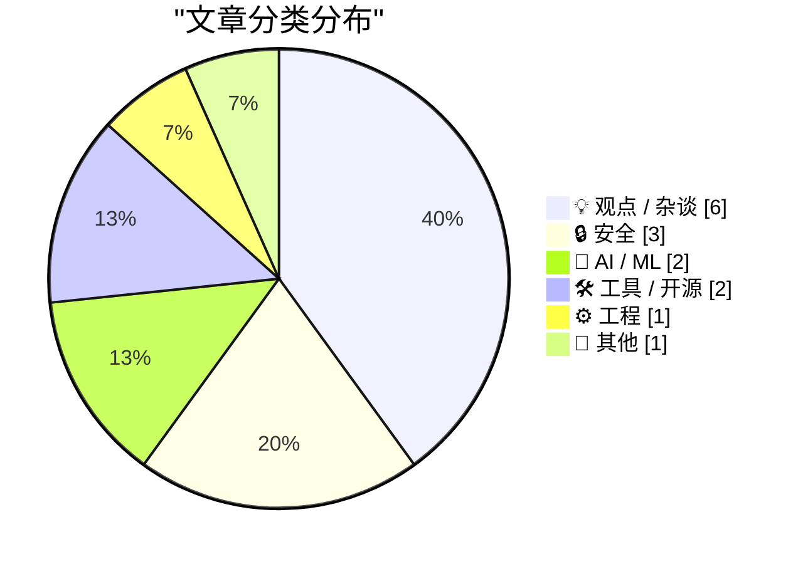
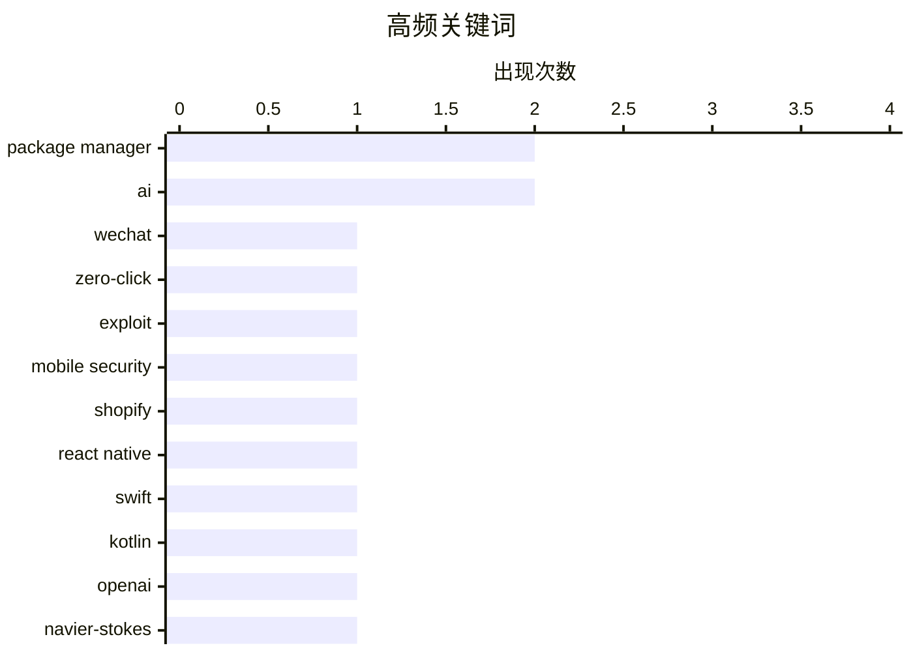

# 📰 Sep 11, 2026

> 来自 Karpathy 推荐的 92 个顶级技术博客，AI 精选 Top 15

## 📝 今日看点

今日技术圈呈现出 AI 深度渗透与工程架构回归的双重趋势。AI 正从解决流体力学难题的“智力倍增器”转向引发末日担忧与信任危机的双刃剑，而 Shopify 重回原生开发则标志着移动端架构在效率与性能间的重新权衡。此外，微信零点击蠕虫漏洞的曝光与 WordPress 社区的治理动荡，再次敲响了移动安全与开源生态治理的警钟。

---

## 🏆 今日必读

🥇 **Calif Research 发布 WeWorm：首个针对微信语音通话的零点击蠕虫漏洞**

[Quoting Calif Research](https://simonwillison.net/2026/Sep/10/calif-research/) — simonwillison.net · 1 天前 · 🔒 安全

> Calif Research 发布了名为 WeWorm 的演示，这是首个能通过微信语音通话在 iOS 和 Android 间传播的零点击（zero-click）蠕虫。受害者无需接听电话或进行任何操作，甚至在通话中听不到声音，攻击即可成功实现远程代码执行（RCE）。该团队在 AI 的辅助下，仅用约两天时间就发现了漏洞并编写了首个 RCE 利用程序。构建完整的蠕虫病毒也仅耗时数周，展示了 AI 在加速高难度漏洞挖掘方面的巨大潜力。这一发现凸显了即时通讯软件在面对自动化漏洞利用时的脆弱性。

💡 **为什么值得读**: 揭示了 AI 辅助下零点击漏洞挖掘的惊人效率，提醒移动端社交应用面临的严峻安全挑战。

🏷️ WeChat, zero-click, exploit, mobile security

🥈 **原生开发重回 Shopify 移动端的主导地位**

[Native is now the future of mobile at Shopify](https://simonwillison.net/2026/Sep/10/shopify-react-native/) — simonwillison.net · 13 小时前 · ⚙️ 工程

> Shopify 宣布将其移动应用从 React Native 架构迁回基于 Swift 和 Kotlin 的纯原生开发模式。该公司曾在 2020 年为了减少重复开发和实现全栈协作而转向 React Native，但实践证明跨平台方案在性能追求和底层优化上存在局限。目前 Shopify 决定重新拥抱原生技术栈，以追求极致的用户体验和更深度的系统集成。这一决策标志着大型电商平台在跨平台与原生开发权衡中的重要转向。对于追求极致性能的应用来说，原生开发依然是不可替代的终点。

💡 **为什么值得读**: 深入了解顶级工程团队在 React Native 实践四年后，为何最终选择回归原生开发的底层逻辑。

🏷️ Shopify, React Native, Swift, Kotlin

🥉 **纳维-斯托克斯方程研究中被忽视的关键点：形式化证明的革命**

[The part of Navier-Stokes no one is talking about](https://www.johndcook.com/blog/2026/09/09/formal-method-revolution/) — johndcook.com · 1 天前 · 🤖 AI / ML

> OpenAI 最近宣布证明了一个关于流体力学纳维-斯托克斯（Navier-Stokes）方程的长期悬而未决的问题，引发学术界轰动。作者指出，此次成果最值得关注但被大众忽视的细节是 OpenAI 同时发布了 Lean 4 形式化证明脚本。这意味着该数学证明不仅经过了人类专家的同行评审，还通过了计算机程序的逻辑验证。这种将前沿数学突破与形式化验证工具深度结合的模式，预示着数学研究范式的重大变革。未来，机器可验证性可能成为顶级科学发现的标配要求。

💡 **为什么值得读**: 探讨 AI 如何通过 Lean 4 等工具改变数学证明的可靠性验证，是理解未来科学研究范式转移的窗口。

🏷️ OpenAI, Navier-Stokes, Lean 4, formal verification

---

## 📊 数据概览

| 扫描源 | 抓取文章 | 时间范围 | 精选 |
|:---:|:---:|:---:|:---:|
| 84/92 | 2554 篇 → 23 篇 | 48h | **15 篇** |

### 分类分布



### 高频关键词



<details>
<summary>📈 纯文本关键词图（终端友好）</summary>

```
package manager │ ████████████████████ 2
ai              │ ████████████████████ 2
wechat          │ ██████████░░░░░░░░░░ 1
zero-click      │ ██████████░░░░░░░░░░ 1
exploit         │ ██████████░░░░░░░░░░ 1
mobile security │ ██████████░░░░░░░░░░ 1
shopify         │ ██████████░░░░░░░░░░ 1
react native    │ ██████████░░░░░░░░░░ 1
swift           │ ██████████░░░░░░░░░░ 1
kotlin          │ ██████████░░░░░░░░░░ 1
```

</details>

### 🏷️ 话题标签

**package manager**(2) · **ai**(2) · **wechat**(1) · zero-click(1) · exploit(1) · mobile security(1) · shopify(1) · react native(1) · swift(1) · kotlin(1) · openai(1) · navier-stokes(1) · lean 4(1) · formal verification(1) · moe(1) · gpt-2(1) · llm(1) · training(1) · wordpress(1) · automattic(1)

---

## 💡 观点 / 杂谈

### 1. 失去马特·穆伦维格的 Automattic

[Automattic Minus Matt](https://feed.tedium.co/link/15204/17444080/matt-mullenweg-automattic-leave-absence) — **tedium.co** · 1 天前 · ⭐ 25/30

> WordPress 背后的母公司 Automattic 宣布其创始人 Matt Mullenweg 将进入非自愿休假状态。这一变动发生在 WordPress 社区近期经历一系列争议和动荡之后，反映了公司内部治理的重大调整。作为开源界的领军人物，Matt 的暂时离职对 Automattic 的未来走向及 WordPress 生态的稳定性产生了巨大的不确定性。业界普遍关注这次“权力真空”是否能缓解公司近期的舆论压力并促成管理层的反思。这标志着 WordPress 历史上一个关键的转折点。

🏷️ WordPress, Automattic, Matt Mullenweg, open source

---

### 2. 他们真的认为 AI 可能会毁灭人类

[They really do think AI might kill everyone](https://seangoedecke.com/they-really-do-think-ai-might-kill-everyone/) — **seangoedecke.com** · 1 天前 · ⭐ 24/30

> 一名 Anthropic 研究员的辞职推文再次引发了关于 AI 末日的讨论，他声称 AI 开发者们普遍认为 AI 可能在十年内导致人类灭绝。这种观点在硅谷核心圈内并非玩笑，而是许多顶尖研究员深信不疑的风险预测。文章探讨了这种“末日论”在 AI 实验室内部的普遍性，以及它究竟是基于科学推演的担忧，还是某种类似宗教的群体狂热。这种深层的恐惧正在影响着 AI 安全政策的制定和顶尖人才的流动。理解这种心态对于预判未来 AI 监管趋势至关重要。

🏷️ AI safety, Anthropic, alignment, X-risk

---

### 3. AI 是智力的倍增器

[AI is an intelligence multiplier](https://www.johndcook.com/blog/2026/09/09/ai-multiplier/) — **johndcook.com** · 1 天前 · ⭐ 24/30

> AI 并非简单的替代工具，而是一种“智力倍增器”，它对不同能力水平者的提升效果并不均衡。数据显示，顶尖程序员和数学家从 AI 中获得的生产力增幅远超普通从业者，他们正利用 AI 攻克长期的数学难题和复杂的工程挑战。这种效应意味着 AI 可能会进一步拉大精英与普通人之间的产出差距，而非抹平差异。作者强调，工具本身不会产生奇迹，其最终效果取决于使用者原有的知识储备和智力水平。在 AI 时代，个人的基础素质反而变得更加关键。

🏷️ AI, productivity, intelligence multiplier

---

### 4. AI 正在破坏我们所谓的“信任”

[AI Is Breaking This Thing We Call Trust](https://terriblesoftware.org/2026/09/10/ai-is-breaking-this-thing-we-call-trust/) — **terriblesoftware.org** · 20 小时前 · ⭐ 24/30

> AI 生成的内容往往具有极高的迷惑性，看起来非常完美但实际上可能缺乏深度理解或存在隐蔽错误。这种“虚假的完成感”正在侵蚀团队内部的信任，导致代码审查和内容核对的工作量不降反增。当同事们不得不花费更多精力去修补 AI 生成物中缺失的逻辑时，协作效率反而受到了负面影响。文章警示，过度依赖 AI 可能会破坏职场中基于专业理解的信任基石。这种信任的侵蚀是 AI 普及过程中一个被低估的社会性成本。

🏷️ AI, trust, software engineering, culture

---

### 5. 我们拥有这块屏幕：智能电视的隐私侵权现状

[We own the Glass](https://idiallo.com/byte-size/) — **idiallo.com** · 1 天前 · ⭐ 20/30

> LG 高管在广告推介中直言不讳地表示“我们拥有这块屏幕”，揭示了智能电视厂商对用户隐私的深度掌控。尽管用户购买了硬件，但厂商通过服务条款获得了在屏幕上投放任何内容并收集数据的权利。智能电视普遍配备麦克风、Wi-Fi 和追踪软件，甚至要求用户告知访客电视可能会在无警告的情况下录音。这种商业模式将电视从单纯的显示设备转变为全天候的监控和广告分发终端。用户在签署 T&C 条款时，实际上交出了家庭环境的隐私权。

🏷️ privacy, advertising, Smart TV, LG

---

### 6. 另一条路：超人类主义与 AGI 的未来之争

[The Other Road](https://borretti.me/article/the-other-road) — **borretti.me** · 1 天前 · ⭐ 19/30

> 本文深入探讨了人类未来的两种演进路径：超人类主义（Transhumanism）与通用人工智能（AGI）。超人类主义侧重于通过技术手段增强人类自身能力，而 AGI 愿景则倾向于创造超越人类的独立智能实体。作者对比了这两种路径在伦理、技术可行性以及对人类文明定义的影响。文章指出，我们目前正处于选择技术发展重心的关键十字路口。这决定了未来是“人的进化”还是“机器的取代”，是技术哲学领域的核心争论。

🏷️ transhumanism, AGI, future

---

## 🔒 安全

### 7. Calif Research 发布 WeWorm：首个针对微信语音通话的零点击蠕虫漏洞

[Quoting Calif Research](https://simonwillison.net/2026/Sep/10/calif-research/) — **simonwillison.net** · 1 天前 · ⭐ 27/30

> Calif Research 发布了名为 WeWorm 的演示，这是首个能通过微信语音通话在 iOS 和 Android 间传播的零点击（zero-click）蠕虫。受害者无需接听电话或进行任何操作，甚至在通话中听不到声音，攻击即可成功实现远程代码执行（RCE）。该团队在 AI 的辅助下，仅用约两天时间就发现了漏洞并编写了首个 RCE 利用程序。构建完整的蠕虫病毒也仅耗时数周，展示了 AI 在加速高难度漏洞挖掘方面的巨大潜力。这一发现凸显了即时通讯软件在面对自动化漏洞利用时的脆弱性。

🏷️ WeChat, zero-click, exploit, mobile security

---

### 8. Datasette 发布 1.0a39 和 0.65.4 安全更新版本

[Datasette 1.0a39 and 0.65.4 security releases](https://simonwillison.net/2026/Sep/11/datasette-security/) — **simonwillison.net** · 7 小时前 · ⭐ 20/30

> 开源数据探索工具 Datasette 紧急发布了两个安全补丁版本，分别针对 Alpha 系列的 1.0a39 和稳定版的 0.65.4。本次更新旨在修复已知的安全漏洞，确保用户在处理敏感数据时的安全性。开发者强烈建议所有正在运行旧版本的用户立即升级到对应的补丁版本。详细的变更日志已在官方文档中同步更新，涵盖了具体的修复细节。这是维护项目安全性的常规但关键的维护操作。

🏷️ Datasette, security, patch, SQLite

---

### 9. 包管理器新趋势：引入发布冷却期机制

[Package Manager Trends](https://nesbitt.io/2026/09/10/package-manager-trends.html) — **nesbitt.io** · 1 天前 · ⭐ 20/30

> 现代包管理器正逐渐引入“最小发布时长”（min-release-age）或“冷却期”机制，以应对日益严重的供应链攻击。通过设置 -Zmin-publish-age 等参数，系统可以强制要求新发布的包在经过一段时间的社区验证后才能被自动下载。这一趋势旨在防止恶意开发者利用新包发布的瞬间窗口期注入恶意代码。Rust 的 Cargo 和其他主流包管理器都在探索类似的防御性配置。这种机制在开发效率与安全性之间寻找新的平衡点。

🏷️ package manager, supply chain security, devops

---

## 🤖 AI / ML

### 10. 纳维-斯托克斯方程研究中被忽视的关键点：形式化证明的革命

[The part of Navier-Stokes no one is talking about](https://www.johndcook.com/blog/2026/09/09/formal-method-revolution/) — **johndcook.com** · 1 天前 · ⭐ 26/30

> OpenAI 最近宣布证明了一个关于流体力学纳维-斯托克斯（Navier-Stokes）方程的长期悬而未决的问题，引发学术界轰动。作者指出，此次成果最值得关注但被大众忽视的细节是 OpenAI 同时发布了 Lean 4 形式化证明脚本。这意味着该数学证明不仅经过了人类专家的同行评审，还通过了计算机程序的逻辑验证。这种将前沿数学突破与形式化验证工具深度结合的模式，预示着数学研究范式的重大变革。未来，机器可验证性可能成为顶级科学发现的标配要求。

🏷️ OpenAI, Navier-Stokes, Lean 4, formal verification

---

### 11. 扩展 Raschka 的 GPT-2：在 RTX 3090 上从零训练 MoE 模型

[Extending Raschka's GPT-2: an MoE trained from scratch on an RTX 3090](https://www.gilesthomas.com/2026/09/gpt-2-to-moe) — **gilesthomas.com** · 16 小时前 · ⭐ 26/30

> 作者基于 Sebastian Raschka 的 GPT-2 代码库，成功在单张 RTX 3090 显卡上从零开始训练了一个混合专家（MoE）模型。MoE 架构通过稀疏激活机制，在保持与同规模稠密模型相当的内存占用的同时，显著提升了推理速度和模型智能。文中详细介绍了如何将标准的 GPT-2 架构改造为包含多个专家层的 MoE 结构，并分享了在消费级硬件上的训练心得。这证明了即便没有顶级算力集群，开发者也能探索如 Claude 或 ChatGPT 所采用的先进 MoE 架构。该实验为小规模团队研究大模型核心技术提供了可行路径。

🏷️ MoE, GPT-2, LLM, training

---

## 🛠 工具 / 开源

### 12. 在浏览器中即时运行任何 Nix 软件包

[Any Nix package, live in your browser](https://simonwillison.net/2026/Sep/10/trynix/) — **simonwillison.net** · 11 小时前 · ⭐ 24/30

> trynix.dev 项目利用 qemu-wasm 技术，在浏览器中构建了一个完全运行在 WebAssembly 之上的 x86_64 Linux 虚拟机。用户无需在本地安装 Nix 环境，即可直接在网页端启动并试用 Nix 仓库中的数万个软件包。该方案解决了 Nix 学习曲线陡峭和环境配置复杂的问题，实现了软件包的即时预览与隔离测试。这是 Nix 生态在 Web 化和可访问性方面的一次重大技术突破。它为开发者提供了一个零门槛的沙盒环境来探索复杂的 Nix 生态系统。

🏷️ Nix, WebAssembly, browser, package manager

---

### 13. .blend 文件在线查看器

[.blend URL Viewer](https://simonwillison.net/2026/Sep/9/blender-viewer/) — **simonwillison.net** · 1 天前 · ⭐ 21/30

> Simon Willison 利用 GPT-6 Astra 辅助开发了一款名为 .blend URL Viewer 的在线工具，支持直接通过 URL 查看 Blender 3D 模型文件。该工具的灵感源于作者对法贝热彩蛋（Fabergé eggs）的喜爱，旨在通过现代技术重现和分享复杂的 3D 艺术设计。用户只需输入 .blend 文件的链接，即可在浏览器中进行交互式预览，无需下载大型专业软件。这展示了 LLM 辅助编程在快速构建特定领域实用工具方面的强大能力。它为 3D 设计师提供了一个极其便捷的轻量化展示方案。

🏷️ Blender, GPT-6, visualization, 3D

---

## ⚙️ 工程

### 14. 原生开发重回 Shopify 移动端的主导地位

[Native is now the future of mobile at Shopify](https://simonwillison.net/2026/Sep/10/shopify-react-native/) — **simonwillison.net** · 13 小时前 · ⭐ 26/30

> Shopify 宣布将其移动应用从 React Native 架构迁回基于 Swift 和 Kotlin 的纯原生开发模式。该公司曾在 2020 年为了减少重复开发和实现全栈协作而转向 React Native，但实践证明跨平台方案在性能追求和底层优化上存在局限。目前 Shopify 决定重新拥抱原生技术栈，以追求极致的用户体验和更深度的系统集成。这一决策标志着大型电商平台在跨平台与原生开发权衡中的重要转向。对于追求极致性能的应用来说，原生开发依然是不可替代的终点。

🏷️ Shopify, React Native, Swift, Kotlin

---

## 📝 其他

### 15. 苹果 OS 27 系列更新将于 9 月 14 日周一发布

[Apple’s OS 27 Updates Will Be Released on Monday, 14 September](https://9to5mac.com/2026/09/09/apple-confirms-macos-27-golden-gate-launch-date-september-14/) — **daringfireball.net** · 14 小时前 · ⭐ 21/30

> 苹果官方确认 iOS 27 和 macOS 27 Golden Gate 将于 9 月 14 日正式发布。iOS 27 在测试阶段表现稳健，被评价为近年来质量最高的 .0 版本之一。macOS 27 带来了代号为 Golden Gate 的重大更新，但对于生产力工具用户，建议采取分阶段升级策略。作者建议普通用户可以等待 27.0.1 或 27.1 版本以规避潜在的初期 Bug。9to5Mac 同步发布了 iOS 27 的详细发行说明，涵盖了从 WWDC 至今的所有功能变更。

🏷️ Apple, iOS, macOS, release

---

*生成于 2026-09-11 11:01 | 扫描 84 源 → 获取 2554 篇 → 精选 15 篇*
*基于 [Hacker News Popularity Contest 2025](https://refactoringenglish.com/tools/hn-popularity/) RSS 源列表，由 [Andrej Karpathy](https://x.com/karpathy) 推荐*
