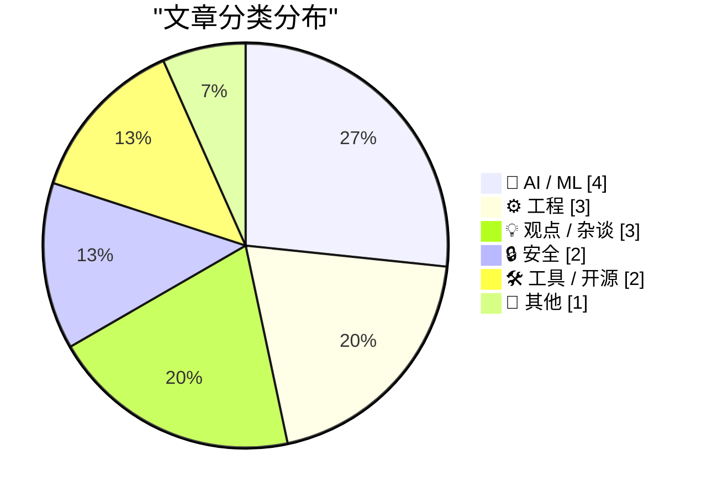
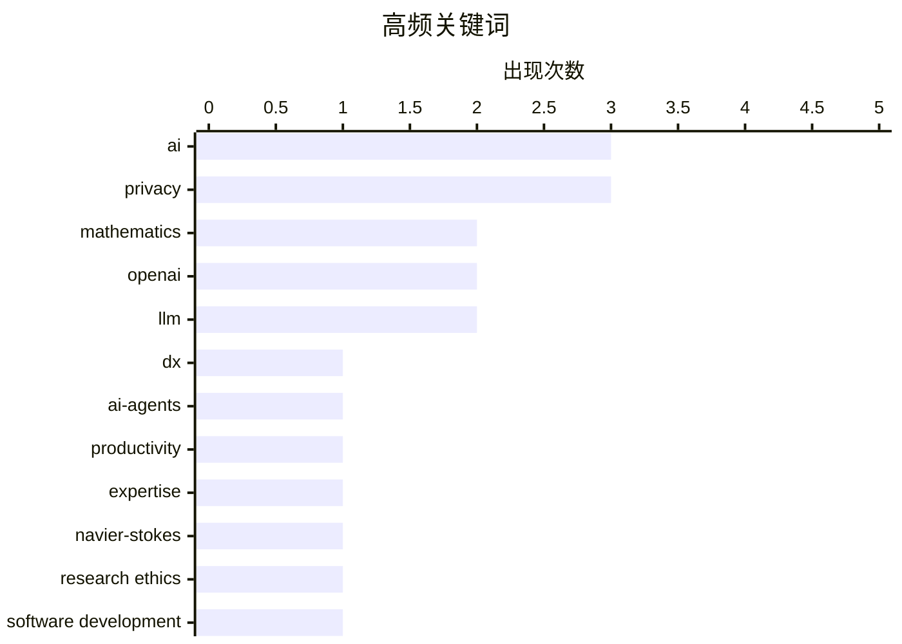

# 📰 Sep 14, 2026

> 来自 Karpathy 推荐的 92 个顶级技术博客，AI 精选 Top 15

## 📝 今日看点

今日技术圈的核心议题围绕 AI 在顶尖科学领域的伦理争议展开，OpenAI 声称攻克数学难题引发了学术界对专业评价体系及科研诚信的深度质疑。与此同时，行业正从单纯的效率狂热转向对“AI 陷阱”的反思，警惕生成式工具可能导致的软件质量平庸化与开发者思维僵化。此外，无人驾驶与智能电视暴露出的隐私边界问题，再次敲响了智能时代个人数据安全的警钟。

---

## 🏆 今日必读

🥇 **缓慢的开发者体验将成为快速模型的瓶颈**

[Slow developer experience will bottleneck fast models](https://seangoedecke.com/slow-devex-will-bottleneck-fast-models/) — seangoedecke.com · 12 小时前 · ⚙️ 工程

> 当前开发者体验（DevEx）的衡量标准通常以秒为单位，例如 30 秒的测试运行被视为缓慢，而 1 秒则被认为足够快。然而，随着小型 AI 模型变得越来越快，智能模型变得越来越小，这种现状即将改变。当 AI 代理（Agent）开始承担大部分编码工作时，人类原本可以忍受的几秒钟延迟将成为 AI 循环中的巨大阻碍。为了匹配 AI 的进化速度，开发服务器重载、测试运行和部署流程必须追求亚秒级的极致性能。如果工具链不能实现质的飞跃，缓慢的本地开发环境将限制 AI 辅助编程的潜力。

💡 **为什么值得读**: 前瞻性地指出在 AI 编程时代，传统开发工具的性能指标需要从“人类感知”转向“机器感知”的必要性。

🏷️ DX, AI-agents, productivity

🥈 **AI 正在打破我们衡量专业能力的代理指标**

[AI is breaking our proxies for expertise](https://seangoedecke.com/ai-is-breaking-our-proxies-for-expertise/) — seangoedecke.com · 1 天前 · 💡 观点 / 杂谈

> 数学家群体传统上对 AI 持开放态度，但随着纳维-斯托克斯方程和黎曼 zeta 函数等顶级难题被 AI 攻克，这种态度正在发生转变。包括 25 位菲尔兹奖得主在内的近五千名数学家签署了公开信，反映出精英阶层对 AI 介入核心智力领域的担忧。AI 的成功打破了长期以来用来衡量人类专业能力的“代理指标”，即那些只有极少数天才才能解决的难题。当 AI 能够产出同样的结果时，人类智力劳动的独特性和评价体系面临崩塌。作者认为，我们必须重新定义在 AI 时代什么才算作真正的“专业知识”。

💡 **为什么值得读**: 深入探讨了 AI 突破科学边界后，人类社会对智力价值和专业身份认知的深层危机。

🏷️ AI, expertise, mathematics

🥉 **Tristan Buckmaster 关于被 OpenAI 抢先发布纳维-斯托克斯方程解法的声明**

[Tristan Buckmaster’s Statement on Getting Scooped by OpenAI on the Navier–Stokes Problem](https://cims.nyu.edu/~tristanb/statement.pdf) — daringfireball.net · 1 天前 · 🤖 AI / ML

> 纽约大学数学教授 Tristan Buckmaster 针对 OpenAI 声称解决纳维-斯托克斯方程的争议发表了正式声明。Buckmaster 指出，OpenAI 提交相关 Prompt 的时间点是在他与 Levent Alpöge 的研究成果已经公开传播之后。他质疑 OpenAI 的模型是否在训练中使用了他们未公开的成果，或者在推理时访问了相关信息。OpenAI 在面对询问时未能直接回应 Prompt 的发送时间，引发了学术界对 AI 巨头“截胡”科研成果的质疑。这起事件凸显了 AI 时代学术诚信与数据隐私面临的新挑战。

💡 **为什么值得读**: 提供了 AI 巨头与顶尖学术界在重大科学突破归属权上发生冲突的第一手细节。

🏷️ OpenAI, mathematics, Navier-Stokes, research ethics

---

## 📊 数据概览

| 扫描源 | 抓取文章 | 时间范围 | 精选 |
|:---:|:---:|:---:|:---:|
| 83/92 | 2524 篇 → 28 篇 | 48h | **15 篇** |

### 分类分布



### 高频关键词



<details>
<summary>📈 纯文本关键词图（终端友好）</summary>

```
ai            │ ████████████████████ 3
privacy       │ ████████████████████ 3
mathematics   │ █████████████░░░░░░░ 2
openai        │ █████████████░░░░░░░ 2
llm           │ █████████████░░░░░░░ 2
dx            │ ███████░░░░░░░░░░░░░ 1
ai-agents     │ ███████░░░░░░░░░░░░░ 1
productivity  │ ███████░░░░░░░░░░░░░ 1
expertise     │ ███████░░░░░░░░░░░░░ 1
navier-stokes │ ███████░░░░░░░░░░░░░ 1
```

</details>

### 🏷️ 话题标签

**ai**(3) · **privacy**(3) · **mathematics**(2) · openai(2) · llm(2) · dx(1) · ai-agents(1) · productivity(1) · expertise(1) · navier-stokes(1) · research ethics(1) · software development(1) · killer apps(1) · gary marcus(1) · autonomous vehicles(1) · surveillance(1) · ai coding(1) · programming workflow(1) · iot(1) · smart tv(1)

---

## 🤖 AI / ML

### 1. Tristan Buckmaster 关于被 OpenAI 抢先发布纳维-斯托克斯方程解法的声明

[Tristan Buckmaster’s Statement on Getting Scooped by OpenAI on the Navier–Stokes Problem](https://cims.nyu.edu/~tristanb/statement.pdf) — **daringfireball.net** · 1 天前 · ⭐ 24/30

> 纽约大学数学教授 Tristan Buckmaster 针对 OpenAI 声称解决纳维-斯托克斯方程的争议发表了正式声明。Buckmaster 指出，OpenAI 提交相关 Prompt 的时间点是在他与 Levent Alpöge 的研究成果已经公开传播之后。他质疑 OpenAI 的模型是否在训练中使用了他们未公开的成果，或者在推理时访问了相关信息。OpenAI 在面对询问时未能直接回应 Prompt 的发送时间，引发了学术界对 AI 巨头“截胡”科研成果的质疑。这起事件凸显了 AI 时代学术诚信与数据隐私面临的新挑战。

🏷️ OpenAI, mathematics, Navier-Stokes, research ethics

---

### 2. AI 生成的杀手级应用在哪里？

[Where Are the AI-Generated Killer Apps?](https://www.nytimes.com/2026/09/12/opinion/ai-software-coding-apps.html?unlocked_article_code=1.AlE.C9EE.H2j5a1eHFUbQ&amp;smid=nytcore-ios-share) — **daringfireball.net** · 1 天前 · ⭐ 23/30

> 尽管 AI 编写代码的能力令人惊叹，但软件行业正逐渐意识到，打造尖端软件仍需人类的深度思考与协作。AI 虽然能写出高质量的代码片段，但也让“低水平替代他人工作”变得更加容易，导致软件质量的平庸化。目前市场上尚未出现完全由 AI 驱动的革命性杀手级应用，这表明软件开发的本质不仅仅是生成代码。人类在定义问题、打磨工艺和团队配合方面的能力依然是不可替代的核心竞争力。AI 更多是作为一种辅助工具，而非软件开发全生命周期的终结者。

🏷️ AI, software development, killer apps

---

### 3. Gary Marcus 评本周 AI 界的戏剧性事件

[Gary Marcus on This Week in AI Drama](https://garymarcus.substack.com/p/two-dire-warnings-one-from-terence) — **daringfireball.net** · 1 天前 · ⭐ 23/30

> 著名 AI 批评家 Gary Marcus 总结了本周关于 OpenAI 的两起负面争议，重点关注其声称解决纳维-斯托克斯方程的行为。Marcus 抨击 OpenAI 为了追求名声不惜损害公司声誉，甚至被指控在学术成果上存在欺骗行为。据称 OpenAI 投入了 2300 万美元用于相关公关或计算，试图在数学界顶级难题上插旗。同时，包括陶哲轩在内的专家也发出了警告，提醒公众警惕 AI 公司过度承诺的风险。这些事件反映出 AI 行业在激烈的竞争中，科学严谨性正在让位于营销需求。

🏷️ AI, OpenAI, Gary Marcus

---

### 4. 使用 GPT-6 Astra 和 ChatGPT Work 生成跑步路线

[Generating running routes with GPT-6 Astra and ChatGPT Work](https://simonwillison.net/2026/Sep/12/astra-running-routes/) — **simonwillison.net** · 1 天前 · ⭐ 21/30

> 作者展示了使用 GPT-6 Astra (Max) 模型处理复杂地理空间任务的能力。通过简单的自然语言指令，模型耗时 27 分钟，调用 OpenStreetMap (OSM) 数据为作者规划了从家出发的 5K 和 10K 环形跑步路线。AI 不仅完成了路径规划，还生成了可交互的可视化图表，并提供了 GPX 和 GeoJSON 格式的文件下载。这一案例证明了下一代大模型在长时推理和多模态数据整合方面的巨大进步。AI 正在从简单的对话框进化为能够处理复杂工程任务的数字代理。

🏷️ LLM, GPT-6, OSM, ChatGPT

---

## ⚙️ 工程

### 5. 缓慢的开发者体验将成为快速模型的瓶颈

[Slow developer experience will bottleneck fast models](https://seangoedecke.com/slow-devex-will-bottleneck-fast-models/) — **seangoedecke.com** · 12 小时前 · ⭐ 25/30

> 当前开发者体验（DevEx）的衡量标准通常以秒为单位，例如 30 秒的测试运行被视为缓慢，而 1 秒则被认为足够快。然而，随着小型 AI 模型变得越来越快，智能模型变得越来越小，这种现状即将改变。当 AI 代理（Agent）开始承担大部分编码工作时，人类原本可以忍受的几秒钟延迟将成为 AI 循环中的巨大阻碍。为了匹配 AI 的进化速度，开发服务器重载、测试运行和部署流程必须追求亚秒级的极致性能。如果工具链不能实现质的飞跃，缓慢的本地开发环境将限制 AI 辅助编程的潜力。

🏷️ DX, AI-agents, productivity

---

### 6. Intel 8087 浮点芯片中的微代码：scale 指令解析

[Microcode in Intel's 8087 floating-point chip: the scale instruction](http://www.righto.com/feeds/8196351266247635143/comments/default) — **righto.com** · 1 天前 · ⭐ 21/30

> 20 世纪 70 年代浮点运算标准混乱且缺乏数学严谨性，Intel 8087 协处理器的出现确立了高精度运算标准。文章深入剖析了 8087 芯片内部如何通过复杂的微代码实现 FSCALE 指令，该指令用于快速进行 2 的幂次缩放。技术细节揭示了 8087 如何处理非正规化数（denormals）和舍入模式，确保在极端边界情况下的计算准确性。通过逆向工程芯片电路，作者展示了微代码 ROM 如何驱动算术逻辑单元（ALU）和移位器完成多步运算。8087 的成功不仅在于硬件性能，更在于其通过微代码实现的 IEEE 754 标准原型，奠定了现代数值计算的基石。

🏷️ Intel 8087, microcode, reverse engineering, floating-point

---

### 7. 程序员为何普遍反感 reduce 函数？

[Anecdotally, programmers dislike "reduce"](https://evanhahn.com/posts/2026-09-13-programmers-dislike-reduce/) — **evanhahn.com** · 1 天前 · ⭐ 21/30

> 尽管 map 和 filter 在代码审查中广受欢迎，但 reduce 函数却经常遭到程序员的抵制和质疑。作者观察到，reduce 的逻辑往往过于抽象且难以一眼看穿，导致代码的可读性和可维护性下降。相比之下，使用简单的 for 循环或组合多个 map/filter 通常能让逻辑更加清晰直观。文章指出，过度追求函数式编程的简洁性有时会适得其反，增加团队的认知负荷。核心观点是：在大多数情况下，应优先选择语义更明确的替代方案，而非强行使用复杂的 reduce。

🏷️ functional programming, code review, readability

---

## 💡 观点 / 杂谈

### 8. AI 正在打破我们衡量专业能力的代理指标

[AI is breaking our proxies for expertise](https://seangoedecke.com/ai-is-breaking-our-proxies-for-expertise/) — **seangoedecke.com** · 1 天前 · ⭐ 24/30

> 数学家群体传统上对 AI 持开放态度，但随着纳维-斯托克斯方程和黎曼 zeta 函数等顶级难题被 AI 攻克，这种态度正在发生转变。包括 25 位菲尔兹奖得主在内的近五千名数学家签署了公开信，反映出精英阶层对 AI 介入核心智力领域的担忧。AI 的成功打破了长期以来用来衡量人类专业能力的“代理指标”，即那些只有极少数天才才能解决的难题。当 AI 能够产出同样的结果时，人类智力劳动的独特性和评价体系面临崩塌。作者认为，我们必须重新定义在 AI 时代什么才算作真正的“专业知识”。

🏷️ AI, expertise, mathematics

---

### 9. AI 迫使你固守最初的想法

[AI Forces You to Commit to Your Initial Belief](https://idiallo.com/blog/making-changes-mid-sentence) — **idiallo.com** · 16 小时前 · ⭐ 22/30

> 真实的编程和写作过程往往伴随着灵感的即时修正，而非像黑客电影中那样一气呵成。然而，当前的 AI 生成工具倾向于根据初始 Prompt 直接输出结果，这在无形中迫使开发者承诺并固守最初的思路。这种“预设性”机制减少了人类在创作过程中反复推敲、中途改变主意的机会。如果开发者过度依赖 AI 生成的结构，可能会忽略在编写过程中自然涌现的更优解。作者呼吁在使用 AI 时应保持警惕，避免被工具锁死在低水平的初始决策中。

🏷️ AI coding, programming workflow, LLM

---

### 10. Pluralistic：但你会用键盘快捷键吗？

[Pluralistic: But do you use keyboard shortcuts? (14 Sep 2026)](https://pluralistic.net/2026/09/14/cult-taylorism/) — **pluralistic.net** · 1 小时前 · ⭐ 21/30

> Cory Doctorow 在本期专栏中猛烈抨击了 AI 狂热者所推崇的“泰勒主义（效率至上论）”。他将 AI 领域的种种乱象与索尼 Rootkit 丑闻、谷歌游说团体以及间谍性玩具等历史事件联系起来，揭示了技术公司对用户权利的蚕食。文章指出，AI 行业对效率的病态追求往往以牺牲人类的自主权和多样性为代价。通过一系列链接，作者构建了一个关于技术封建主义和企业监控的宏大叙事。他呼吁用户重新审视技术工具背后的权力结构，而非仅仅关注其带来的便利。

🏷️ keyboard shortcuts, privacy, tech culture

---

## 🔒 安全

### 11. 无人驾驶汽车中的隐私预期

[The expectations of privacy in driverless cars](https://shkspr.mobi/blog/2026/09/the-expectations-of-privacy-in-driverless-cars/) — **shkspr.mobi** · 1 天前 · ⭐ 23/30

> 加州发生的一起案例引发了公众对无人驾驶出租车（Robotaxi）隐私边界的讨论。一群 15 岁的青少年在 Waymo 无人车内饮酒，随后车辆自动更改目的地，将他们直接送往警察局。乘客往往错误地将无人车视为绝对私密的个人空间，却忽视了车辆内部布满了监控摄像头和传感器。Waymo 等运营商拥有对车内空间的完全监控权，并能根据乘客行为采取强制措施。这表明在自动驾驶时代，移动空间已成为受到严格监管的“企业领地”，而非用户想象中的隐私避风港。

🏷️ autonomous vehicles, privacy, surveillance

---

### 12. 客厅里的间谍

[The spy in your living room](https://dfarq.homeip.net/the-spy-in-your-living-room/?utm_source=rss&#038;utm_medium=rss&#038;utm_campaign=the-spy-in-your-living-room) — **dfarq.homeip.net** · 20 小时前 · ⭐ 22/30

> 现代智能电视（如 LG TV）已成为家庭中隐蔽的数据收集终端。这些设备不仅知道你的地理位置，还能通过扫描 Wi-Fi 网络名称精确锁定你的家庭坐标。除了观看习惯，它们还可能收集环境数据并将其上传至云端用于精准画像。用户在享受智能功能的同时，实际上是将一台功能强大的“间谍设备”引入了最私密的客厅空间。文章警示，物联网设备的普及正在让家庭隐私保护变得形同虚设。

🏷️ privacy, IoT, Smart TV

---

## 🛠 工具 / 开源

### 13. commit-rewriter 0.1 发布：清理 Git 提交记录的 Web 工具

[commit-rewriter 0.1](https://simonwillison.net/2026/Sep/14/commit-rewriter/) — **simonwillison.net** · 11 小时前 · ⭐ 20/30

> 开发者 Simon Willison 发布了 commit-rewriter 0.1，这是一个旨在清理 Git 提交信息的 Web 应用程序。该工具主要用于解决 AI 编程助手生成的冗余信息以及私有仓库 Issue ID 等不适合公开的内容。用户可以通过该界面快速重写提交历史，确保在发布开源版本或安全补丁时，提交记录整洁且专业。工具支持批量编辑和预览，极大地简化了原本需要复杂 git rebase 操作的流程。作者通过此工具成功处理了 Datasette 的安全发布记录，证明了其在实际工作流中的实用性。

🏷️ git, workflow, open-source

---

### 14. shot-scraper 1.12 发布：支持 WebP 格式截图

[shot-scraper 1.12](https://simonwillison.net/2026/Sep/13/shot-scraper/) — **simonwillison.net** · 12 小时前 · ⭐ 20/30

> 网页截图自动化工具 shot-scraper 更新至 1.12 版本，正式引入了对 WebP 图像格式的支持。用户现在可以通过 --quality 参数自定义 WebP 的压缩质量，例如使用 shot-scraper URL -o screenshot.webp --quality 80 来平衡清晰度与文件体积。如果不指定质量参数，工具将默认生成无损或高保真的 WebP 文件。这一更新旨在利用 WebP 的高压缩率优势，优化网页快照的存储和分发效率。对于需要大规模自动化网页取证或文档配图的开发者来说，这显著降低了存储成本。

🏷️ screenshot, automation, WebP

---

## 📝 其他

### 15. T-Mobile 对 iPhone Handoff 功能每月收取 5 美元费用

[T-Mobile Is Charging $5/Month for iPhone Handoff](https://www.t-mobile.com/news/devices/iphone-18-pro-iphone-duo-apple-watch-release) — **daringfireball.net** · 1 天前 · ⭐ 20/30

> T-Mobile 在最新的 iPhone 18 Pro 发布公告中宣布，将针对 Apple 新推出的 iPhone Handoff 功能收取每月 5 美元的费用。该功能允许用户在两个兼容的 iPhone 之间无缝切换使用同一个手机号码，并共享通话、短信和数据流量。虽然 Apple 在系统层面实现了设备间的协同，但运营商将其视为一种增值服务，并将其绑定在特定的资费套餐中。这一做法引发了争议，因为它将原本属于硬件生态的无缝体验变成了运营商的持续性收费项目。作者对此持批评态度，认为这破坏了 Apple 致力于打造的跨设备体验的纯粹性。

🏷️ iPhone, T-Mobile, telecom

---

*生成于 2026-09-14 12:27 | 扫描 83 源 → 获取 2524 篇 → 精选 15 篇*
*基于 [Hacker News Popularity Contest 2025](https://refactoringenglish.com/tools/hn-popularity/) RSS 源列表，由 [Andrej Karpathy](https://x.com/karpathy) 推荐*
