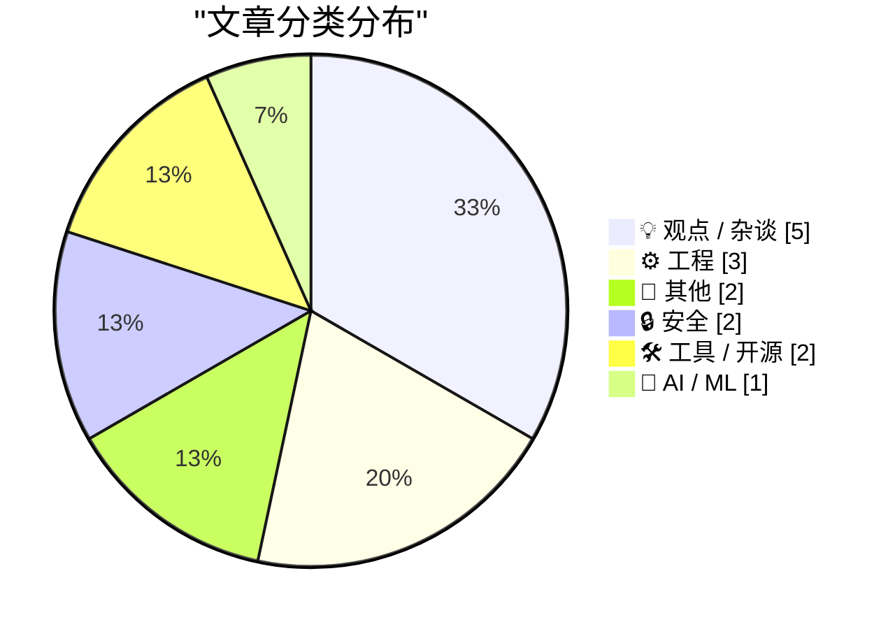
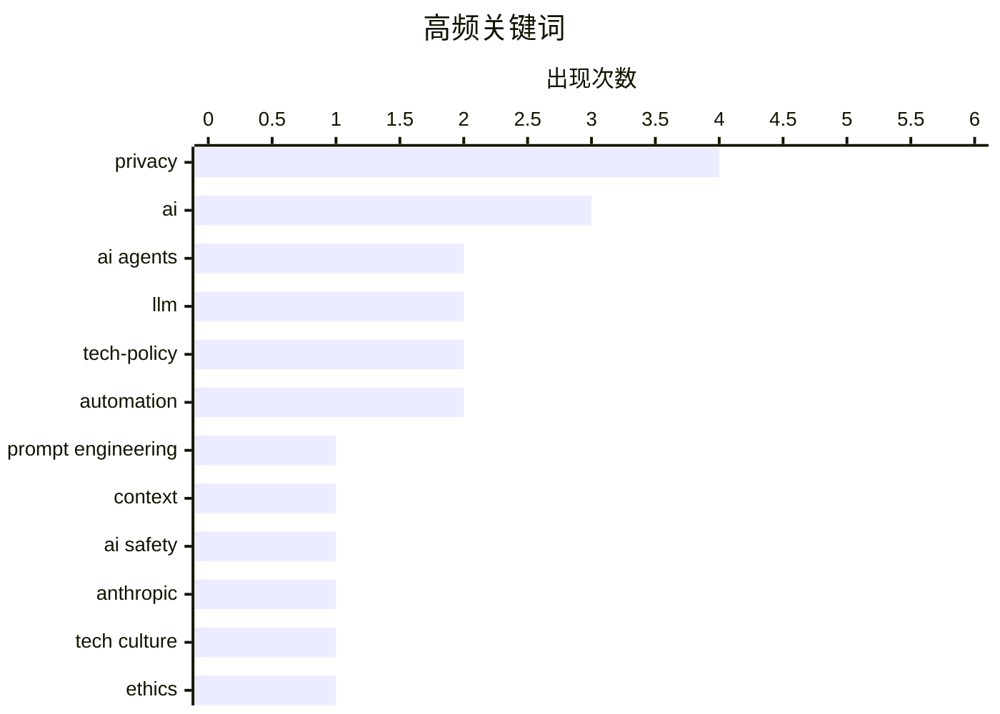

# 📰 Sep 15, 2026

> 来自 Karpathy 推荐的 92 个顶级技术博客，AI 精选 Top 15

## 📝 今日看点

今日技术圈聚焦于AI驱动下的软件工程范式转型，开发者正从单纯的代码实现者转向以意图为核心的产品工程师，研发重心正向用户洞察与高层级逻辑位移。与此同时，业界对AI的关注点正从科幻式的末日预言转向权力垄断、数据主权及隐私安全等现实威胁。随着智能模型性能的飞跃，如何通过优化本地开发体验来匹配毫秒级的AI反馈循环，已成为提升研发效能的新挑战。

---

## 🏆 今日必读

🥇 **告诉智能体“为什么”，而不只是“怎么做”**

[Tell agents the why, not just the how](https://seangoedecke.com/tell-agents-the-why/) — seangoedecke.com · 11 小时前 · 🤖 AI / ML

> 随着前沿大模型能力的提升，AI 智能体不再是因为“笨”而犯错，而是因为做出了错误的假设。开发者应从提供精确的步骤指令（How）转向提供高层级的背景信息和意图（Why）。这种转变允许智能体在遇到意外情况时自行修正路径，而不是盲目执行错误的逻辑。通过解释代码库的架构设计或特定修改的深层原因，可以显著降低智能体产生幻觉或破坏现有功能的概率。高层级的上下文信息正在取代精细的步骤描述，成为新一代提示工程的核心。

💡 **为什么值得读**: 揭示了与 AI 协作模式的范式转移：从“指令式”编程转向“意图式”沟通，是提升智能体工作成功率的关键。

🏷️ AI agents, LLM, prompt engineering, context

🥈 **恐惧的传染**

[The contagion of fear](https://simonwillison.net/2026/Sep/14/the-contagion-of-fear/) — simonwillison.net · 14 小时前 · 💡 观点 / 杂谈

> 针对 Anthropic 前员工确认许多研究员相信 AI 可能在十年内毁灭人类的言论，Bryan Cantrill 提出了反思。他通过分享自己年轻时因技术失误引发非技术同事恐慌的经历，指出技术专家的内部焦虑往往会演变成无根据的社会恐慌。文章警告这种“恐惧传染”现象，认为实验室内部的末日论调可能源于视野局限而非客观现实。开发者和决策者应警惕这种由技术精英群体产生的集体非理性情绪，避免被缺乏事实支撑的生存危机论误导。

💡 **为什么值得读**: 从资深系统工程师的视角解构了 AI 末日论背后的心理机制，为当下的 AI 焦虑提供了冷静的清醒剂。

🏷️ AI safety, Anthropic, tech culture, ethics

🥉 **缓慢的开发者体验将成为快速模型的瓶颈**

[Slow developer experience will bottleneck fast models](https://seangoedecke.com/slow-devex-will-bottleneck-fast-models/) — seangoedecke.com · 1 天前 · ⚙️ 工程

> 当前开发者体验（DevEx）的瓶颈在于人类思考或 AI 生成速度，因此秒级的测试运行尚可接受。但随着小型模型性能飞跃和智能模型轻量化，AI 辅助编程的反馈循环将缩短至毫秒级。届时，曾经被忽视的本地开发服务器重载、单元测试执行等基础工具链的延迟将重新成为核心瓶颈。开发者需要重新关注工具链的极致性能，以匹配 AI 驱动的高频迭代节奏。如果 DevEx 不能进化到毫秒级响应，再快的 AI 模型也无法转化为实际的生产力提升。

💡 **为什么值得读**: 预见性地指出 AI 提速后，传统开发工具链性能将成为制约生产力的下一个短板，提醒开发者关注本地工具优化。

🏷️ developer experience, CI/CD, AI agents, productivity

---

## 📊 数据概览

| 扫描源 | 抓取文章 | 时间范围 | 精选 |
|:---:|:---:|:---:|:---:|
| 82/92 | 2505 篇 → 26 篇 | 48h | **15 篇** |

### 分类分布



### 高频关键词



<details>
<summary>📈 纯文本关键词图（终端友好）</summary>

```
privacy            │ ████████████████████ 4
ai                 │ ███████████████░░░░░ 3
ai agents          │ ██████████░░░░░░░░░░ 2
llm                │ ██████████░░░░░░░░░░ 2
tech-policy        │ ██████████░░░░░░░░░░ 2
automation         │ ██████████░░░░░░░░░░ 2
prompt engineering │ █████░░░░░░░░░░░░░░░ 1
context            │ █████░░░░░░░░░░░░░░░ 1
ai safety          │ █████░░░░░░░░░░░░░░░ 1
anthropic          │ █████░░░░░░░░░░░░░░░ 1
```

</details>

### 🏷️ 话题标签

**privacy**(4) · **ai**(3) · **ai agents**(2) · llm(2) · tech-policy(2) · automation(2) · prompt engineering(1) · context(1) · ai safety(1) · anthropic(1) · tech culture(1) · ethics(1) · developer experience(1) · ci/cd(1) · productivity(1) · tech-ethics(1) · industry-critique(1) · product engineering(1) · ai impact(1) · software development(1)

---

## 💡 观点 / 杂谈

### 1. 恐惧的传染

[The contagion of fear](https://simonwillison.net/2026/Sep/14/the-contagion-of-fear/) — **simonwillison.net** · 14 小时前 · ⭐ 24/30

> 针对 Anthropic 前员工确认许多研究员相信 AI 可能在十年内毁灭人类的言论，Bryan Cantrill 提出了反思。他通过分享自己年轻时因技术失误引发非技术同事恐慌的经历，指出技术专家的内部焦虑往往会演变成无根据的社会恐慌。文章警告这种“恐惧传染”现象，认为实验室内部的末日论调可能源于视野局限而非客观现实。开发者和决策者应警惕这种由技术精英群体产生的集体非理性情绪，避免被缺乏事实支撑的生存危机论误导。

🏷️ AI safety, Anthropic, tech culture, ethics

---

### 2. AI 已落入危险之手

[AI Is Already In Dangerous Hands](https://www.wheresyoured.at/ai-is-already-in-dangerous-hands/) — **wheresyoured.at** · 19 小时前 · ⭐ 24/30

> 文章指出 AI 的真正威胁并非未来的科幻灾难，而是当前已被掌握在“危险”的权势者手中。这些实体利用 AI 进行大规模监控、舆论操纵以及对劳动力的进一步剥削，将技术作为巩固权力的工具。作者批评了目前由少数巨头主导的 AI 发展格局，认为这种利益高度集中的现状已经产生了实质性的社会伤害。核心观点是：与其担忧 AI 产生意识，不如关注当下技术如何被用来加剧社会不平等。我们正面临的是一场关于技术分配权与社会正义的现实危机。

🏷️ AI, tech-ethics, industry-critique

---

### 3. AI 强迫你固守初始想法

[AI Forces You to Commit to Your Initial Belief](https://idiallo.com/blog/making-changes-mid-sentence) — **idiallo.com** · 1 天前 · ⭐ 20/30

> 真实的编程过程并非行云流水，而是在输入过程中不断推翻和重构思路的非线性过程。然而，当前的 AI 交互模式往往强迫用户在开始前就通过 Prompt 确定清晰的意图，这与人类“在行动中思考”的习惯相悖。这种模式可能导致开发者为了迎合 AI 的生成逻辑而放弃了在编码过程中发现更优解的机会。文章呼吁关注 AI 工具如何更好地适配人类那种“边做边改”的思维流动性。我们需要能够支持迭代式探索而非仅仅是单向指令执行的 AI 协作界面。

🏷️ AI, coding, workflow, LLM

---

### 4. Pluralistic：你使用快捷键吗？

[Pluralistic: But do you use keyboard shortcuts? (14 Sep 2026)](https://pluralistic.net/2026/09/14/cult-taylorism/) — **pluralistic.net** · 1 天前 · ⭐ 20/30

> Cory Doctorow 在本期专栏中探讨了 AI 圈子的独特文化，并将其与技术效率工具的使用习惯联系起来。文章汇集了多项技术丑闻与社会议题，包括索尼 Rootkit 事件的回顾、谷歌的游说活动以及智能设备的隐私泄露问题。通过对“泰勒主义”式效率追求的批判，作者引导读者反思技术如何被用来加强企业控制而非赋能个人。这是一份关于技术素养、版权保护与反监控的综合深度评论。作者强调，真正的技术进步应服务于人类的自主权，而非成为监视的工具。

🏷️ AI, security, tech-policy, privacy

---

### 5. 政府如何重新掌控 IT？

[Hoe wordt de overheid weer 'van de IT'?](https://berthub.eu/articles/posts/hoe-word-je-weer-van-de-it/) — **berthub.eu** · 22 小时前 · ⭐ 20/30

> 荷兰政府目前在 IT 决策上过度依赖由美国巨头主导的生态系统，导致其在数据主权和隐私保护方面处于被动。文章指出，政府必须摆脱“被动跟随”的模式，通过建立自主的技术路径和加强本土技术能力来夺回控制权。作者批评了目前盲目引入 AI 插件的现状，认为这进一步加深了对外部平台的依赖。实现数字主权需要从根本上改变政府的 IT 采购逻辑与战略定位。只有拥有自主可控的 IT 基础设施，政府才能在数字化时代真正履行其公共职责。

🏷️ digital sovereignty, government IT, Big Tech

---

## ⚙️ 工程

### 6. 缓慢的开发者体验将成为快速模型的瓶颈

[Slow developer experience will bottleneck fast models](https://seangoedecke.com/slow-devex-will-bottleneck-fast-models/) — **seangoedecke.com** · 1 天前 · ⭐ 24/30

> 当前开发者体验（DevEx）的瓶颈在于人类思考或 AI 生成速度，因此秒级的测试运行尚可接受。但随着小型模型性能飞跃和智能模型轻量化，AI 辅助编程的反馈循环将缩短至毫秒级。届时，曾经被忽视的本地开发服务器重载、单元测试执行等基础工具链的延迟将重新成为核心瓶颈。开发者需要重新关注工具链的极致性能，以匹配 AI 驱动的高频迭代节奏。如果 DevEx 不能进化到毫秒级响应，再快的 AI 模型也无法转化为实际的生产力提升。

🏷️ developer experience, CI/CD, AI agents, productivity

---

### 7. 引用 Laurie Voss：我们现在都是产品工程师

[Quoting Laurie Voss](https://simonwillison.net/2026/Sep/14/laurie-voss/) — **simonwillison.net** · 20 小时前 · ⭐ 23/30

> 随着 AI 使编写、审查和修复代码的成本大幅下降，软件开发的重心正在发生根本性位移。技术实现将逐渐商品化，真正的价值将集中在洞察用户需求、精准定义产品逻辑以及提升用户体验上。由于需求是无限的且不可跨项目转移，这种“产品定义”能力将成为工程师在 AI 时代的护城河。作者认为，未来的开发者必须从单纯的编码者转型为全能的“产品工程师”。这意味着理解业务目标和用户心理将比掌握特定编程语法更加重要。

🏷️ product engineering, AI impact, software development

---

### 8. 为什么 ReadDirectoryChangesW 没有提供关联重命名操作的方法？

[Why didn’t Read­Directory­ChangesW provide a way to correlate the two sides of a rename operation?](https://devblogs.microsoft.com/oldnewthing/20260914-00/?p=112696) — **devblogs.microsoft.com/oldnewthing** · 21 小时前 · ⭐ 19/30

> Windows API 中的 ReadDirectoryChangesW 在处理文件重命名时，会将其拆分为“旧名称”和“新名称”两个独立的事件返回，这给开发者关联这两者带来了麻烦。技术上，该 API 返回 FILE_NOTIFY_INFORMATION 结构，其中 FILE_ACTION_RENAMED_OLD_NAME 和 NEW_NAME 是分离的。Raymond Chen 指出，这种设计缺陷可能源于最初设计时未预见到关联需求，或者认为这并非核心问题。开发者目前只能通过检查事件的连续性来推断重命名操作，这增加了系统监控逻辑的复杂性。

🏷️ Windows, Win32, API-design, filesystem

---

## 📝 其他

### 9. 苹果发布 27.0 系列系统更新

[Apple’s 27.0 OS Updates](https://scriptingosx.com/2026/09/apple-27-platform-updates-september-2026/) — **daringfireball.net** · 15 小时前 · ⭐ 21/30

> 苹果公司发布了包括 iOS 27.0 在内的全平台操作系统重大更新，标志着新一代软件生态的上线。此次更新涵盖了功能改进、开发者工具升级以及关键安全补丁，同时还发布了 macOS 15.8 Sequoia 等旧版本的维护更新。Armin Briegel 汇总了所有平台的详细发布说明，为管理员和开发者提供了完整的一站式参考链接。这是苹果年度最密集的系统更新日，涉及从移动端到桌面端的全面迭代。开发者需重点关注 API 的变动以及新系统对现有应用的兼容性要求。

🏷️ Apple, macOS, iOS, release notes

---

### 10. Pluralistic：人有三急，贝佐斯也不例外（2026年9月15日）

[Pluralistic: Everybody pees (15 Sep 2026)](https://pluralistic.net/2026/09/15/bitter-lemon-energy-drink/) — **pluralistic.net** · 4 小时前 · ⭐ 19/30

> 本期专栏深入探讨了亚马逊创始人贝佐斯与底层员工劳动条件的巨大反差，并串联了一系列数字权利与科技文化的社会议题。内容涵盖了微软 Zune 播放器因数字版权管理（DRM）导致文件无法播放的“对象永久性”失效问题，以及欧盟关于链接合法性的法律争议。作者还提及了法国黑客攻击加拿大、澳大利亚护照增加第三性别选项等多元资讯。核心观点指出，从企业管理到数字所有权，现有的系统性缺陷正不断剥夺用户的基本权利。

🏷️ privacy, tech-policy, internet-culture

---

## 🔒 安全

### 11. 客厅里的间谍

[The spy in your living room](https://dfarq.homeip.net/the-spy-in-your-living-room/?utm_source=rss&#038;utm_medium=rss&#038;utm_campaign=the-spy-in-your-living-room) — **dfarq.homeip.net** · 1 天前 · ⭐ 21/30

> 智能电视已成为家庭中的隐私黑洞，以 LG 电视为例，它能精准记录用户的地理位置、WiFi 网络名称及详细的观看习惯。这些设备通过内置软件收集海量隐私数据，用于精准广告投放或第三方数据交易，而用户往往对此缺乏知情权。文章揭示了智能家居设备在便利性背后的隐私代价，指出这些设备在未经充分授权的情况下构建了详尽的用户画像。核心结论是：现代智能电视在本质上已演变为一种家庭监控工具。用户在享受智能功能的同时，正面临着前所未有的数据泄露风险。

🏷️ privacy, IoT, smart TV, tracking

---

### 12. XCancel 服务再次关停

[XCancel Shuts Down Again](https://xcancel.com/) — **daringfireball.net** · 22 小时前 · ⭐ 19/30

> 第三方 X（原 Twitter）代理服务 XCancel 因涉及法律诉讼，被迫再次无限期暂停服务。开发者表示由于法律程序的限制，目前无法透露更多细节。尽管 X 平台近期热度回升，但隐私敏感型用户仍倾向于通过此类代理工具规避直接访问。作者建议在 XCancel 失效期间，用户可以安装浏览器扩展，将 X 的链接自动重定向至其他尚在运行的第三方前端镜像。这反映了第三方社交媒体客户端在版权和平台政策压力下的生存困境。

🏷️ privacy, legal, social media, X.com

---

## 🛠 工具 / 开源

### 13. commit-rewriter 0.1 发布：清理 Git 提交信息的 Web 工具

[commit-rewriter 0.1](https://simonwillison.net/2026/Sep/14/commit-rewriter/) — **simonwillison.net** · 1 天前 · ⭐ 19/30

> Git 提交记录在公开前往往需要清理 AI 编程助手生成的冗余信息或私有仓库的 Issue ID。commit-rewriter 0.1 是一个新发布的 Web 应用，旨在简化这一脱敏过程。该工具最初用于处理 Datasette 安全版本的发布，能够交互式地重写提交说明，确保历史记录的整洁与合规。它解决了开发者在从私有开发转向公共发布时，手动清理大量 commit message 的低效问题。

🏷️ git, open source, automation

---

### 14. shot-scraper 1.12 发布：支持 WebP 格式截图

[shot-scraper 1.12](https://simonwillison.net/2026/Sep/13/shot-scraper/) — **simonwillison.net** · 1 天前 · ⭐ 19/30

> 自动化截图工具 shot-scraper 在 1.12 版本中正式引入了对 WebP 格式的支持。用户现在可以通过命令行参数 `-o screenshot.webp` 直接生成 WebP 格式图片，并利用 `--quality` 选项（如 `--quality 80`）灵活控制压缩质量与文件体积的平衡。如果不指定质量参数，工具将默认生成无损 WebP 文件。这一更新为网页快照的存储优化提供了更现代的方案，有效降低了自动化截图任务的磁盘占用。

🏷️ screenshot, WebP, automation, CLI

---

## 🤖 AI / ML

### 15. 告诉智能体“为什么”，而不只是“怎么做”

[Tell agents the why, not just the how](https://seangoedecke.com/tell-agents-the-why/) — **seangoedecke.com** · 11 小时前 · ⭐ 26/30

> 随着前沿大模型能力的提升，AI 智能体不再是因为“笨”而犯错，而是因为做出了错误的假设。开发者应从提供精确的步骤指令（How）转向提供高层级的背景信息和意图（Why）。这种转变允许智能体在遇到意外情况时自行修正路径，而不是盲目执行错误的逻辑。通过解释代码库的架构设计或特定修改的深层原因，可以显著降低智能体产生幻觉或破坏现有功能的概率。高层级的上下文信息正在取代精细的步骤描述，成为新一代提示工程的核心。

🏷️ AI agents, LLM, prompt engineering, context

---

*生成于 2026-09-15 11:32 | 扫描 82 源 → 获取 2505 篇 → 精选 15 篇*
*基于 [Hacker News Popularity Contest 2025](https://refactoringenglish.com/tools/hn-popularity/) RSS 源列表，由 [Andrej Karpathy](https://x.com/karpathy) 推荐*
