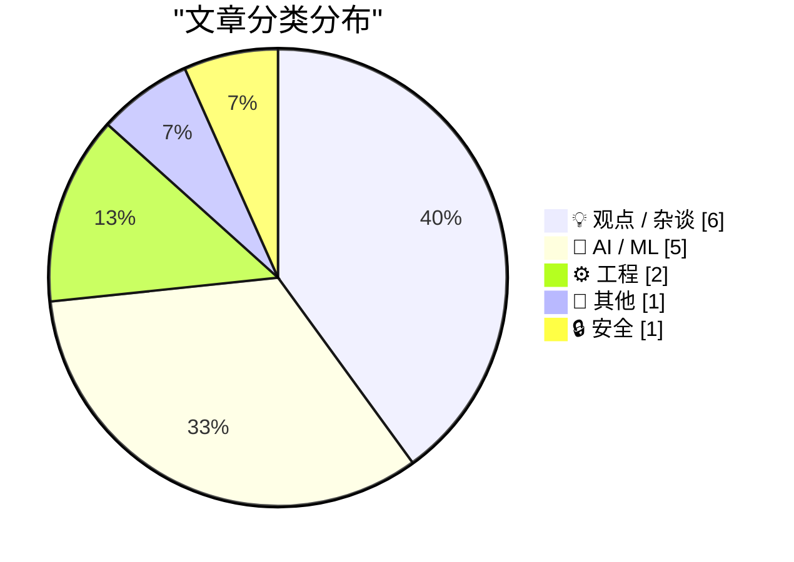
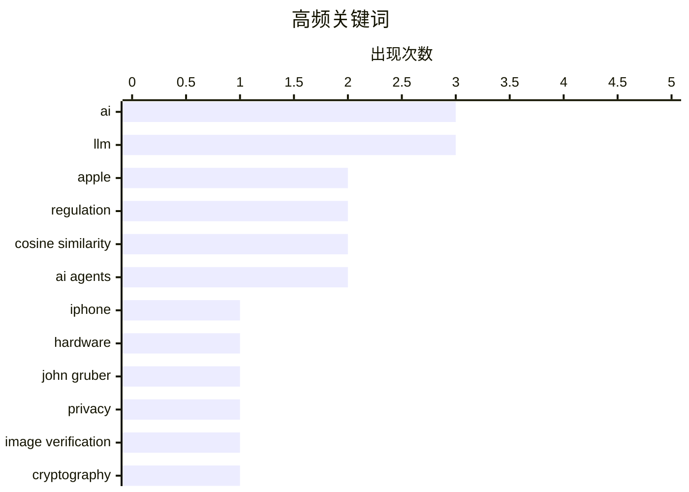

# 📰 Sep 16, 2026

> 来自 Karpathy 推荐的 92 个顶级技术博客，AI 精选 Top 15

## 📝 今日看点

今日技术圈呈现出硬件演进与底层逻辑重构的双重趋势。苹果通过新一代产品愿景与图像验证技术，正式开启了后库克时代的数字信任布局。AI 领域则陷入深度反思，舆论从虚无的末日论转向对巨头垄断与企业剥削的现实批判。同时，随着语音原生模型与高维数学原理的深入探讨，AI 交互正从机械的指令执行向理解深层意图与追求极致工程效率的方向加速演进。

---

## 🏆 今日必读

🥇 **苹果“惊喜与闪耀”发布会观察：iPhone 18 Pro、iPhone Duo 与 John Ternus 时代的开启**

[★ Thoughts and Observations on Apple’s ‘Surprise and Shine’ Event; the Announcements of the iPhones 18 Pro, AirPods 5, Apple Watches Series 12 and Ultra 4, and the iPhone Duo; and the Dawn of the Ternus, John Ternus Era at Apple](https://daringfireball.net/2026/09/thoughts_and_observations_on_apples_surprise_and_shine_event) — daringfireball.net · 17 小时前 · 📝 其他

> 苹果 2026 年“Surprise and Shine”发布会标志着 John Ternus 时代的正式开启，推出了包括 iPhone 18 Pro、AirPods 5 以及 Apple Watch Series 12 在内的多款新品。最引人注目的突破是折叠屏设备 iPhone Duo 的首次亮相，展示了苹果对新型形态硬件的成熟思考。文章深入分析了硬件迭代背后的设计逻辑，特别是 iPhone 18 Pro 在影像系统和 A 系列芯片性能上的持续演进。作者观察到，在 Ternus 的领导下，苹果的产品演示风格变得更加务实且聚焦于工程细节。结论认为，这次发布会不仅是产品的更新，更是苹果领导层风格转型的里程碑。

💡 **为什么值得读**: 深度解析苹果硬件更新及后库克时代领导层风格转变的必读之作。

🏷️ Apple, iPhone, hardware, John Gruber

🥈 **Apple Reference Image：一种经验证摄影的新方法**

[‘Apple Reference Image: A New Approach for Verified Photography’](https://security.apple.com/blog/apple-reference-image/) — daringfireball.net · 8 小时前 · 🔒 安全

> 苹果安全研究团队发布了关于 Apple Reference Image 技术的白皮书，旨在解决数字图像的真实性验证难题。该方案的核心优势在于保护摄影师隐私，无需像现有行业标准（如 C2PA）那样绑定个人凭证即可证明照片未被篡改。这对于在冲突地区工作的战地记者尤为重要，确保了他们在不暴露身份的前提下提供可信的视觉证据。技术上，它通过一种去中心化且注重隐私的元数据校验机制来实现图像溯源。苹果认为，证明图像真实性不应以牺牲匿名性为代价。

💡 **为什么值得读**: 了解苹果如何在保护隐私的前提下利用密码学技术对抗 AI 伪造图像。

🏷️ Apple, privacy, image verification, cryptography

🥉 **AI 暂停令如何拯救 AI 巨头：消除竞争的手段**

[Pluralistic: How an AI moratorium can save AI bosses (16 Sep 2026)](https://pluralistic.net/2026/09/16/beggar-thy-neighbor/) — pluralistic.net · 3 小时前 · 💡 观点 / 杂谈

> 文章探讨了近期关于暂停 AI 开发（Moratorium）倡议背后的权力博弈，认为这本质上是科技巨头巩固垄断的手段。作者 Cory Doctorow 指出，当企业无法通过技术手段提高用户切换成本时，就会试图通过监管手段消除潜在的小型竞争对手。这种“拉起梯子”的行为利用了公众对 AI 风险的恐惧，实则是为了维持现有的市场支配地位。文章列举了版权破坏、地理审查等现象作为技术垄断的佐证。结论认为，真正的 AI 治理应关注反垄断和用户权利，而非盲目限制开源或竞争性开发。

💡 **为什么值得读**: 批判性地揭示了 AI 安全倡议背后可能隐藏的市场垄断动机。

🏷️ AI, regulation, monopoly, tech policy

---

## 📊 数据概览

| 扫描源 | 抓取文章 | 时间范围 | 精选 |
|:---:|:---:|:---:|:---:|
| 82/92 | 2500 篇 → 29 篇 | 48h | **15 篇** |

### 分类分布



### 高频关键词



<details>
<summary>📈 纯文本关键词图（终端友好）</summary>

```
ai                │ ████████████████████ 3
llm               │ ████████████████████ 3
apple             │ █████████████░░░░░░░ 2
regulation        │ █████████████░░░░░░░ 2
cosine similarity │ █████████████░░░░░░░ 2
ai agents         │ █████████████░░░░░░░ 2
iphone            │ ███████░░░░░░░░░░░░░ 1
hardware          │ ███████░░░░░░░░░░░░░ 1
john gruber       │ ███████░░░░░░░░░░░░░ 1
privacy           │ ███████░░░░░░░░░░░░░ 1
```

</details>

### 🏷️ 话题标签

**ai**(3) · **llm**(3) · **apple**(2) · regulation(2) · cosine similarity(2) · ai agents(2) · iphone(1) · hardware(1) · john gruber(1) · privacy(1) · image verification(1) · cryptography(1) · monopoly(1) · tech policy(1) · machine learning(1) · embeddings(1) · nlp(1) · ethics(1) · tech industry(1) · gemini(1)

---

## 💡 观点 / 杂谈

### 1. AI 暂停令如何拯救 AI 巨头：消除竞争的手段

[Pluralistic: How an AI moratorium can save AI bosses (16 Sep 2026)](https://pluralistic.net/2026/09/16/beggar-thy-neighbor/) — **pluralistic.net** · 3 小时前 · ⭐ 26/30

> 文章探讨了近期关于暂停 AI 开发（Moratorium）倡议背后的权力博弈，认为这本质上是科技巨头巩固垄断的手段。作者 Cory Doctorow 指出，当企业无法通过技术手段提高用户切换成本时，就会试图通过监管手段消除潜在的小型竞争对手。这种“拉起梯子”的行为利用了公众对 AI 风险的恐惧，实则是为了维持现有的市场支配地位。文章列举了版权破坏、地理审查等现象作为技术垄断的佐证。结论认为，真正的 AI 治理应关注反垄断和用户权利，而非盲目限制开源或竞争性开发。

🏷️ AI, regulation, monopoly, tech policy

---

### 2. AI 已落入危险之手

[AI Is Already In Dangerous Hands](https://www.wheresyoured.at/ai-is-already-in-dangerous-hands/) — **wheresyoured.at** · 1 天前 · ⭐ 26/30

> 文章警示 AI 的真正威胁并非来自未来可能觉醒的通用人工智能（AGI），而是当前已被掌握在“危险人物”手中的现状。这些危险人物指的是利用 AI 进行大规模裁员、降低服务质量并榨取剩余价值的企业高管。作者 Ed Zitron 认为，AI 正在成为一种加速社会不平等和破坏劳动力市场的工具，而非真正提升生产力的利器。核心观点强调，我们应关注 AI 在现实权力结构中被滥用以压榨员工的现状，而非被科幻式的末日预言分散注意力。这种技术异化正在对社会契约造成不可逆的伤害。

🏷️ AI, ethics, tech industry, regulation

---

### 3. 恐惧的传染：审视 AI 末日论

[The contagion of fear](https://simonwillison.net/2026/Sep/14/the-contagion-of-fear/) — **simonwillison.net** · 1 天前 · ⭐ 23/30

> 针对 Anthropic 前员工关于“AI 可能在十年内毁灭人类”的言论，资深工程师 Bryan Cantrill 发表了名为《恐惧的传染》的回应。Cantrill 结合自身职业生涯中因技术误判引发恐慌的经历，批评了当前 AI 圈内盛行的末日论调。他认为这种恐慌往往源于对复杂系统的过度简化以及技术精英的救世主心态。文章呼吁回归理性的工程思维，警惕那种缺乏实证支持的集体性焦虑对技术发展的负面影响。结论指出，过度担忧虚无缥缈的末日会让我们忽视现实中更紧迫的技术挑战。

🏷️ AI safety, Anthropic, Bryan Cantrill, culture

---

### 4. 政府如何重新夺回 IT 主导权？

[Hoe wordt de overheid weer 'van de IT'?](https://berthub.eu/articles/posts/hoe-word-je-weer-van-de-it/) — **berthub.eu** · 1 天前 · ⭐ 23/30

> 荷兰政府目前在 IT 决策上过度依赖由 Big Tech 主导的生态系统，导致其核心基础设施几乎全部运行在受美国法律管辖的第三方平台上。这种依赖不仅带来了隐私和监控风险，还迫使政府在违背意愿的情况下接受集成的 AI 服务。要实现数字主权和自主权，政府必须摆脱对美国大型科技公司的路径依赖，建立独立的 IT 评估和执行能力。文章强调，重新掌握 IT 并非简单的技术更替，而是需要从采购流程到技术架构的全面变革。

🏷️ government IT, sovereignty, Big Tech, policy

---

### 5. 我们现在都是产品工程师了

[Quoting Laurie Voss](https://simonwillison.net/2026/Sep/14/laurie-voss/) — **simonwillison.net** · 1 天前 · ⭐ 21/30

> 随着 AI 工具的普及，编写代码的成本正在急剧下降，而代码审查、修复和运维的成本也将随之降低。在软件开发链条中，真正的核心价值正从“如何实现”转向“实现什么”，即精准定义用户需求并提供卓越的用户体验。由于市场对软件的需求几乎没有上限，软件总量将趋于无穷大，这使得跨领域的通用开发能力变得不再稀缺。未来的工程师必须转型为“产品工程师”，将精力集中在解决实际业务问题和优化交互细节上。

🏷️ product engineering, software development, AI, productivity

---

### 6. 每个人都要撒尿：企业荒诞行为大观

[Pluralistic: Everybody pees (15 Sep 2026)](https://pluralistic.net/2026/09/15/bitter-lemon-energy-drink/) — **pluralistic.net** · 1 天前 · ⭐ 21/30

> 本文汇集了多项关于企业垄断和数字权利的批判性观察，包括杰夫·贝佐斯的行为争议以及微软 Zune 播放器无法播放自家加密文件的讽刺现象。文中特别提到了某大学将图书管理员的巨额遗产违背初衷地用于购买足球场计分板，反映了机构治理的失效。通过一系列技术与社会事件的链接，作者揭示了现代科技生态中“一切都在损坏”的现状。文章旨在提醒读者关注大型机构在追求利润和效率时对个人权利及公共利益的侵蚀。

🏷️ Amazon, labor, tech culture, Jeff Bezos

---

## 🤖 AI / ML

### 7. 多大的余弦相似度才算“大”？

[What counts as a large cosine similarity?](https://www.johndcook.com/blog/2026/09/15/cosine-similarity/) — **johndcook.com** · 19 小时前 · ⭐ 26/30

> 机器学习中常用余弦相似度衡量向量间的关联，但在高维空间中，数值的直观感受往往具有欺骗性。由于高维空间中随机向量趋于正交，即使是 50° 这样看似较大的夹角，实际上也代表了极高的相似性。文章通过数学推导解释了维度灾难如何影响相似度分布，并指出在处理词向量时，不能简单套用低维空间的几何直觉。理解这一特性对于优化向量数据库搜索和聚类分析的阈值设定至关重要。作者强调，维度的增加会使“相似”的定义变得极其严苛。

🏷️ machine learning, embeddings, cosine similarity, NLP

---

### 8. Gemini Live 语音模型发布

[Gemini Live audio](https://simonwillison.net/2026/Sep/15/gemini-live/) — **simonwillison.net** · 12 小时前 · ⭐ 25/30

> Google 发布了 Gemini 3.8 Live 和 3.8 Live Extended Thinking 两款原生语音到语音（speech-to-speech）模型。这些模型在架构上类似于 OpenAI 的 GPT-Live 系列，旨在提供极低延迟的实时交互体验。Simon Willison 通过工具测试了其在复杂对话和逻辑推理中的表现，特别关注了 Extended Thinking 版本在处理长序列任务时的优势。该发布标志着多模态实时交互已成为大模型竞争的新战场。开发者现在可以通过 API 接入这些具备实时思考能力的语音模型。

🏷️ Gemini, LLM, Google, audio

---

### 9. Jev 模型让结构化输出重新变得有趣

[Jev means structured output is interesting again](https://seangoedecke.com/jev-means-structured-output-is-interesting-again/) — **seangoedecke.com** · 11 小时前 · ⭐ 25/30

> Jev 是一款专注于结构化输出的新型“系统一”（System One）AI 模型，旨在解决大模型在生成 JSON 等格式时的速度和稳定性痛点。与追求复杂推理的“系统二”模型不同，Jev 优化了快速模式识别能力，使其在数据提取和格式转换任务中表现卓越。作者认为，这种功能单一化、极致优化的模型路径，比通用大模型更适合集成到生产环境的自动化流水线中。通过减少不必要的推理步骤，Jev 实现了极高的吞吐量和格式遵从率。该模型的出现预示着 AI 模型正走向专业化分工的新阶段。

🏷️ structured output, LLM, Jev, AI agents

---

### 10. 告诉 Agent“为什么”，而不仅仅是“怎么做”

[Tell agents the why, not just the how](https://seangoedecke.com/tell-agents-the-why/) — **seangoedecke.com** · 1 天前 · ⭐ 23/30

> 随着 AI Agent 能力的提升，传统的指令式交互（告诉它具体步骤）已不再高效，甚至会导致错误。现代前沿模型在执行任务时会产生自主假设，如果开发者不明确告知任务背后的“意图”（Why），Agent 往往会基于错误的假设做出决策。文章建议在提示词中加入上下文和最终目标，赋予 Agent 更多的决策自由度，从而减少微观管理带来的偏差。通过对比发现，明确意图的 Agent 在处理边缘情况时表现出更强的鲁棒性。未来的 Agent 编程将更接近于管理人类员工，即明确目标而非死磕步骤。

🏷️ AI agents, prompting, LLM, workflow

---

### 11. 球冠面积的简单近似公式

[Simple approximation for spherical cap area](https://www.johndcook.com/blog/2026/09/15/simple-approximation-for-spherical-cap-area/) — **johndcook.com** · 13 小时前 · ⭐ 23/30

> 本文提供了球冠（Spherical Cap）面积的简单近似公式，作为理解高维空间余弦相似度的数学补充。在机器学习中，词向量相似度的分布本质上对应于单位球面上球冠的面积占比。文章通过数学推导展示了随着维度增加，球冠面积如何呈指数级缩小，这解释了为何高维空间中随机向量几乎总是正交的。该近似方法为评估向量检索的召回率和精度提供了直观的理论支撑。作者通过简洁的公式，将复杂的几何概率问题转化为易于计算的工程参考。

🏷️ mathematics, geometry, cosine similarity, vectors

---

## ⚙️ 工程

### 12. 为什么 ReadDirectoryChangesW 没有提供关联重命名操作前后文件名的方法？

[Why didn’t Read­Directory­ChangesW provide a way to correlate the two sides of a rename operation?](https://devblogs.microsoft.com/oldnewthing/20260914-00/?p=112696) — **devblogs.microsoft.com/oldnewthing** · 1 天前 · ⭐ 22/30

> Windows API 中的 ReadDirectoryChangesW 在处理文件重命名时，会分别触发 OLD_NAME 和 NEW_NAME 两个独立事件，但缺乏直接的关联标识。开发者通常需要通过时间戳或序列邻近性来猜测这两个事件是否属于同一次重命名，这在并发环境下极易出错。作者指出，这种设计缺陷可能源于最初设计时未预见到复杂的文件监控需求，或者为了保持 API 的简洁性而牺牲了关联逻辑。目前，开发者只能依赖文件系统过滤器驱动程序或复杂的启发式算法来解决这一同步难题。

🏷️ Windows API, Win32, file system, architecture

---

### 13. 屏蔽标准库：利用 PYTHONSAFEPATH 提升安全性

[Shadowing the Standard Library](https://nesbitt.io/2026/09/15/shadowing-the-standard-library.html) — **nesbitt.io** · 1 天前 · ⭐ 21/30

> Python 默认会将当前工作目录添加到 sys.path 的首位，这导致本地同名脚本极易意外覆盖（Shadowing）标准库模块，从而引发难以排查的 Bug 或安全漏洞。通过设置环境变量 PYTHONSAFEPATH=1，可以强制 Python 不将脚本所在目录自动加入搜索路径。这一特性在 Python 3.11 中被正式引入，旨在解决长期存在的路径注入风险。对于构建生产级应用或安全敏感型工具的开发者来说，启用此配置是防止恶意代码利用路径优先级进行攻击的关键步骤。

🏷️ Python, security, standard library, configuration

---

## 📝 其他

### 14. 苹果“惊喜与闪耀”发布会观察：iPhone 18 Pro、iPhone Duo 与 John Ternus 时代的开启

[★ Thoughts and Observations on Apple’s ‘Surprise and Shine’ Event; the Announcements of the iPhones 18 Pro, AirPods 5, Apple Watches Series 12 and Ultra 4, and the iPhone Duo; and the Dawn of the Ternus, John Ternus Era at Apple](https://daringfireball.net/2026/09/thoughts_and_observations_on_apples_surprise_and_shine_event) — **daringfireball.net** · 17 小时前 · ⭐ 27/30

> 苹果 2026 年“Surprise and Shine”发布会标志着 John Ternus 时代的正式开启，推出了包括 iPhone 18 Pro、AirPods 5 以及 Apple Watch Series 12 在内的多款新品。最引人注目的突破是折叠屏设备 iPhone Duo 的首次亮相，展示了苹果对新型形态硬件的成熟思考。文章深入分析了硬件迭代背后的设计逻辑，特别是 iPhone 18 Pro 在影像系统和 A 系列芯片性能上的持续演进。作者观察到，在 Ternus 的领导下，苹果的产品演示风格变得更加务实且聚焦于工程细节。结论认为，这次发布会不仅是产品的更新，更是苹果领导层风格转型的里程碑。

🏷️ Apple, iPhone, hardware, John Gruber

---

## 🔒 安全

### 15. Apple Reference Image：一种经验证摄影的新方法

[‘Apple Reference Image: A New Approach for Verified Photography’](https://security.apple.com/blog/apple-reference-image/) — **daringfireball.net** · 8 小时前 · ⭐ 26/30

> 苹果安全研究团队发布了关于 Apple Reference Image 技术的白皮书，旨在解决数字图像的真实性验证难题。该方案的核心优势在于保护摄影师隐私，无需像现有行业标准（如 C2PA）那样绑定个人凭证即可证明照片未被篡改。这对于在冲突地区工作的战地记者尤为重要，确保了他们在不暴露身份的前提下提供可信的视觉证据。技术上，它通过一种去中心化且注重隐私的元数据校验机制来实现图像溯源。苹果认为，证明图像真实性不应以牺牲匿名性为代价。

🏷️ Apple, privacy, image verification, cryptography

---

*生成于 2026-09-16 11:18 | 扫描 82 源 → 获取 2500 篇 → 精选 15 篇*
*基于 [Hacker News Popularity Contest 2025](https://refactoringenglish.com/tools/hn-popularity/) RSS 源列表，由 [Andrej Karpathy](https://x.com/karpathy) 推荐*
