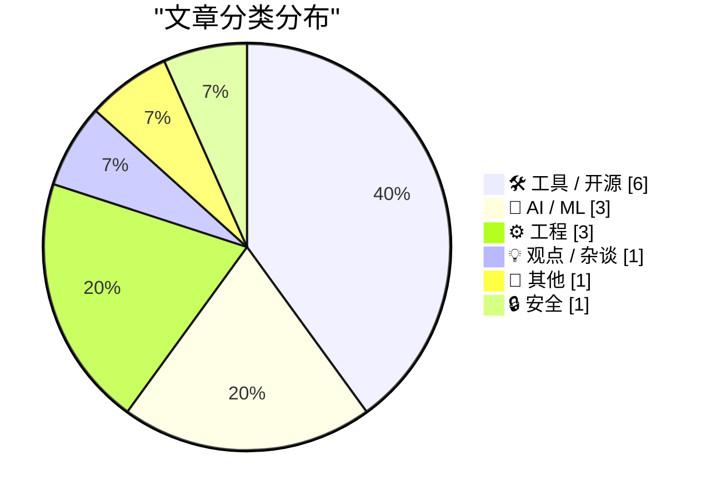
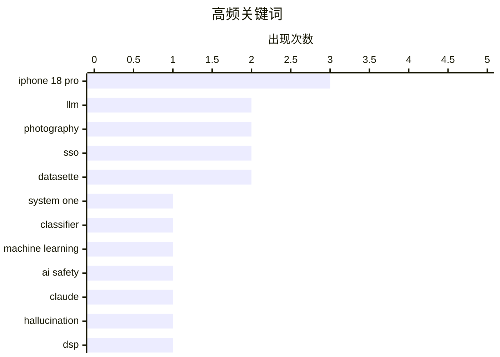

# 📰 Sep 21, 2026

> 来自 Karpathy 推荐的 92 个顶级技术博客，AI 精选 Top 15

## 📝 今日看点

今日技术圈呈现出AI应用反思与硬件稳步迭代交织的态势。一方面，新型通用分类器模型正在挑战传统范式，但开发者群体开始集体反思AI驱动开发带来的“掌控感缺失”与认知幻觉；另一方面，iPhone 18 Pro 凭借专业级影像系统的微调占据了硬件话题中心。此外，通用汽车回归 CarPlay 的决策，再次印证了在车载系统博弈中用户习惯对企业策略的强力反哺。

---

## 🏆 今日必读

🥇 **像 Jev 这样的“系统 1”模型可以训练自己的替代者**

[System One models like Jev can train their own replacements](https://seangoedecke.com/system-one-models-can-train-their-own-replacements/) — seangoedecke.com · 1 天前 · 🤖 AI / ML

> Jev 是一类被称为“系统 1”的快速通用分类器模型，打破了传统分类器需针对特定任务单独训练的局限。它具备类似大语言模型（LLM）的提示能力，可处理从情感分析到垃圾邮件识别的多种任务。核心技术路径在于利用 Jev 生成高质量的合成数据，进而训练出更小、更高效的专用替代模型。这种模式实现了从通用智能到专用工具的自动化迁移，显著降低了特定领域模型的开发门槛。这种“模型训练模型”的闭环为结构化输出的工程化应用开辟了新路径。

💡 **为什么值得读**: 探讨了通用分类器如何通过合成数据生成实现自我迭代，是理解模型蒸馏与自动化训练新趋势的佳作。

🏷️ System One, classifier, machine learning

🥈 **克劳德幻觉：或许产生幻觉的是我们自己**

[Pluralistic: The Claude Delusion (21 Sep 2026)](https://pluralistic.net/2026/09/21/sunsetting/) — pluralistic.net · 1 小时前 · 🤖 AI / ML

> 探讨了当前 AI 热潮中的“克劳德幻觉（Claude Delusion）”，即人类误以为大语言模型具备超越其实际能力的可靠性。文章列举了从 HP 打印机固件限制到 CIA 酷刑幸存者证词等一系列技术与社会案例，揭示了技术异化对现实世界的冲击。作者指出，AI 的“幻觉”问题本质上是用户对概率预测工具的过度信任。核心观点认为，我们正处于一种集体幻觉中，忽视了这些工具在处理复杂逻辑和客观事实时的根本缺陷。这种认知偏差可能导致我们在高风险决策中过度依赖不成熟的技术。

💡 **为什么值得读**: 著名科技评论家 Cory Doctorow 对 AI 泡沫的深度批判，提醒读者警惕技术崇拜背后的认知偏差。

🏷️ LLM, AI safety, Claude, hallucination

🥉 **离散时间傅里叶级数与变换笔记**

[Notes on discrete-time Fourier series and transform](https://eli.thegreenplace.net/2026/notes-on-discrete-time-fourier-series-and-transform/) — eli.thegreenplace.net · 1 天前 · ⚙️ 工程

> 深入探讨了离散时间傅里叶级数（DTFS）与离散时间傅里叶变换（DTFT）的数学基础。这些理论构成了计算机处理数字信号的核心支撑，是理解离散傅里叶变换（DFT）的必经之路。文中详细推导了离散信号在频域中的表现形式，并解释了周期性与采样频率之间的关系。通过对比连续与离散情况下的变换差异，为后续的数字信号处理实践奠定了理论框架。这对于从事音频处理、图像识别等领域的开发者具有重要的参考价值。

💡 **为什么值得读**: 深入浅出的数字信号处理理论笔记，适合想要夯实 DSP 数学基础的技术开发者。

🏷️ DSP, Fourier transform, signal processing, mathematics

---

## 📊 数据概览

| 扫描源 | 抓取文章 | 时间范围 | 精选 |
|:---:|:---:|:---:|:---:|
| 83/92 | 2527 篇 → 21 篇 | 48h | **15 篇** |

### 分类分布



### 高频关键词



<details>
<summary>📈 纯文本关键词图（终端友好）</summary>

```
iphone 18 pro    │ ████████████████████ 3
llm              │ █████████████░░░░░░░ 2
photography      │ █████████████░░░░░░░ 2
sso              │ █████████████░░░░░░░ 2
datasette        │ █████████████░░░░░░░ 2
system one       │ ███████░░░░░░░░░░░░░ 1
classifier       │ ███████░░░░░░░░░░░░░ 1
machine learning │ ███████░░░░░░░░░░░░░ 1
ai safety        │ ███████░░░░░░░░░░░░░ 1
claude           │ ███████░░░░░░░░░░░░░ 1
```

</details>

### 🏷️ 话题标签

**iphone 18 pro**(3) · **llm**(2) · **photography**(2) · sso(2) · datasette(2) · system one(1) · classifier(1) · machine learning(1) · ai safety(1) · claude(1) · hallucination(1) · dsp(1) · fourier transform(1) · signal processing(1) · mathematics(1) · claude code(1) · ai agents(1) · software development(1) · shipping(1) · productivity(1)

---

## 🛠 工具 / 开源

### 1. Marques Brownlee 的 iPhone 18 Pro 评测

[Marques Brownlee’s iPhone 18 Pro Review](https://www.youtube.com/watch?v=ohqxP8EEumo) — **daringfireball.net** · 20 小时前 · ⭐ 22/30

> 评述了知名科技博主 MKBHD 对 iPhone 18 Pro 的测评视频。文章认同该机型属于典型的“S 年代”小幅升级，但强调了一个关键的技术指标突破：根据苹果官方规格，标准版 iPhone 18 Pro 的续航时间已超越前代的 iPhone 17 Pro Max。作者指出，这种跨级别的续航提升是用户最能直观感受到的改进。此外，测评还探讨了苹果在产品命名和定位上的持续策略。整体而言，iPhone 18 Pro 在保持设计延续性的同时，通过能效优化实现了实用性的跃升。

🏷️ iPhone 18 Pro, MKBHD, battery life, hardware

---

### 2. Austin Mann 的 iPhone 18 Pro 相机评测：科罗拉多州实测

[Austin Mann’s iPhone 18 Pro Camera Review, From Dunton, Colorado](https://www.austinmann.com/trek/iphone-18-pro-camera-review-dunton) — **daringfireball.net** · 1 天前 · ⭐ 21/30

> 专业摄影师 Austin Mann 在科罗拉多州对 iPhone 18 Pro 的相机系统进行了深度实测。重点评估了新增的可变光圈（Variable Aperture）和专业控制功能，以及具备胶片质感与颗粒控制的“摄影风格 3”。此外，实测还涵盖了 4K 延时摄影和焦点追踪等视频新特性。文章通过大量样片回答了核心问题：这些硬件与算法的升级如何转化为最终影像质量的提升。对于追求极致手机摄影体验的用户来说，这些改进提供了更广阔的创作空间。

🏷️ iPhone 18 Pro, photography, variable aperture, mobile imaging

---

### 3. llm-keys-ui 0.1 版本发布

[llm-keys-ui 0.1](https://simonwillison.net/2026/Sep/20/llm-keys-ui/) — **simonwillison.net** · 17 小时前 · ⭐ 20/30

> 发布了 llm-keys-ui 0.1 版本，这是一个专门解决远程 LLM 插件配置问题的工具。该插件主要针对使用手机远程控制 Codex Remote 编码代理的场景，解决了在移动端操作时难以安全配置 API 密钥的痛点。通过提供专门的 UI 界面，用户无需在终端或日志中粘贴敏感密钥即可完成授权。这为在不同机器上频繁切换 LLM 项目的开发者提供了更安全的密钥管理方案。该工具虽然小众，但精准解决了跨设备开发中的安全与便利性平衡问题。

🏷️ LLM, API keys, plugin

---

### 4. Tyler Stalman 的 iPhone 18 Pro 相机评测

[Tyler Stalman’s iPhone 18 Pro Camera Review](https://www.youtube.com/watch?v=m6cDErtCKAc) — **daringfireball.net** · 1 天前 · ⭐ 20/30

> 推荐了 Tyler Stalman 制作的 iPhone 18 Pro 相机评测视频。该评测的亮点在于将 iPhone 的拍摄效果与使用 Kodak Portra 400 胶片的单反相机进行同场对比。重点考察了苹果全新的“摄影风格”在模拟胶片质感、色彩科学和影调还原方面的表现。通过这种跨媒介的对比，直观展示了计算摄影在追求传统胶片美学方面所达到的新高度。视频不仅关注技术参数，更深入探讨了数字影像如何通过算法模拟化学胶片的视觉灵魂。

🏷️ iPhone 18 Pro, photography, camera, film-look

---

### 5. datasette-explain 0.2.2 发布

[datasette-explain 0.2.2](https://simonwillison.net/2026/Sep/20/datasette-explain/) — **simonwillison.net** · 1 天前 · ⭐ 17/30

> Datasette 插件 datasette-explain 发布 0.2.2 版本，主要改进是支持在只读的存储查询页面（stored-query pages）上查看 SQL 执行计划。该版本是针对 Datasette 1.0a40 核心版本的升级而进行的适配优化。通过此插件，用户可以直接在 Web 界面分析 SQLite 查询的性能表现，无需切换至命令行工具。这为基于 Datasette 构建的数据展示应用提供了更强的透明度和调试能力，方便开发者优化复杂 SQL 的执行效率。

🏷️ Datasette, SQL, database

---

### 6. datasette-auth-github 1.0 发布

[datasette-auth-github 1.0](https://simonwillison.net/2026/Sep/19/datasette-auth-github/) — **simonwillison.net** · 1 天前 · ⭐ 17/30

> datasette-auth-github 正式发布 1.0 版本，重点修复了认证会话持久性不足的关键问题。原版本由于未在 Cookie 中设置 Max-Age 参数，导致登录状态在浏览器关闭（尤其是 Mobile Safari）后立即失效。新版本通过优化 Cookie 配置，确保了用户在演示站点上的登录体验更加稳定。这是该插件迈向稳定版的重要里程碑，解决了长期困扰移动端用户的频繁登录问题。对于依赖 GitHub 进行身份验证的 Datasette 用户来说，这是一个必须升级的版本。

🏷️ Datasette, GitHub Auth, SSO

---

## 🤖 AI / ML

### 7. 像 Jev 这样的“系统 1”模型可以训练自己的替代者

[System One models like Jev can train their own replacements](https://seangoedecke.com/system-one-models-can-train-their-own-replacements/) — **seangoedecke.com** · 1 天前 · ⭐ 26/30

> Jev 是一类被称为“系统 1”的快速通用分类器模型，打破了传统分类器需针对特定任务单独训练的局限。它具备类似大语言模型（LLM）的提示能力，可处理从情感分析到垃圾邮件识别的多种任务。核心技术路径在于利用 Jev 生成高质量的合成数据，进而训练出更小、更高效的专用替代模型。这种模式实现了从通用智能到专用工具的自动化迁移，显著降低了特定领域模型的开发门槛。这种“模型训练模型”的闭环为结构化输出的工程化应用开辟了新路径。

🏷️ System One, classifier, machine learning

---

### 8. 克劳德幻觉：或许产生幻觉的是我们自己

[Pluralistic: The Claude Delusion (21 Sep 2026)](https://pluralistic.net/2026/09/21/sunsetting/) — **pluralistic.net** · 1 小时前 · ⭐ 26/30

> 探讨了当前 AI 热潮中的“克劳德幻觉（Claude Delusion）”，即人类误以为大语言模型具备超越其实际能力的可靠性。文章列举了从 HP 打印机固件限制到 CIA 酷刑幸存者证词等一系列技术与社会案例，揭示了技术异化对现实世界的冲击。作者指出，AI 的“幻觉”问题本质上是用户对概率预测工具的过度信任。核心观点认为，我们正处于一种集体幻觉中，忽视了这些工具在处理复杂逻辑和客观事实时的根本缺陷。这种认知偏差可能导致我们在高风险决策中过度依赖不成熟的技术。

🏷️ LLM, AI safety, Claude, hallucination

---

### 9. 引用 voxium：AI 驱动开发的困境

[Quoting voxium](https://simonwillison.net/2026/Sep/20/voxium/) — **simonwillison.net** · 15 小时前 · ⭐ 22/30

> 引用了开发者 voxium 对大公司过度依赖 AI 编程工具的控诉。在其实践环境中，从规格说明书（PRD）、代码到测试用例全部由 Claude Code 生成，导致团队成员对系统失去掌控感。管理层盲目追求交付数量，认为代码产出不再是瓶颈，却忽视了开发效率下降和团队士气低落的现状。这种“AI 驱动型开发”模式正在制造一种“没人真正了解系统”的技术债危机。作者借此警示，过度自动化可能导致工程团队丧失核心竞争力。

🏷️ Claude Code, AI agents, software development

---

## ⚙️ 工程

### 10. 离散时间傅里叶级数与变换笔记

[Notes on discrete-time Fourier series and transform](https://eli.thegreenplace.net/2026/notes-on-discrete-time-fourier-series-and-transform/) — **eli.thegreenplace.net** · 1 天前 · ⭐ 23/30

> 深入探讨了离散时间傅里叶级数（DTFS）与离散时间傅里叶变换（DTFT）的数学基础。这些理论构成了计算机处理数字信号的核心支撑，是理解离散傅里叶变换（DFT）的必经之路。文中详细推导了离散信号在频域中的表现形式，并解释了周期性与采样频率之间的关系。通过对比连续与离散情况下的变换差异，为后续的数字信号处理实践奠定了理论框架。这对于从事音频处理、图像识别等领域的开发者具有重要的参考价值。

🏷️ DSP, Fourier transform, signal processing, mathematics

---

### 11. 新世界的机场及其行李往事

[a new world airport and its baggage](https://computer.rip/2026-09-20-denver-baggage.html) — **computer.rip** · 1 天前 · ⭐ 19/30

> 丹佛航空业的崛起最初并非源于客运，而是由美国邮政署的航空邮件合同驱动。20世纪30年代，丹佛市机场从简陋的邮件停靠站起步，随着大陆航空（Continental Airlines）总部的迁入，逐步转型为繁忙的交通枢纽。邮政合同不仅构建了全美的核心航线网络，也直接促成了丹佛等内陆城市大型机场的诞生。这一历史进程揭示了物流需求如何塑造现代航空基础设施的雏形。文章通过丹佛的案例，探讨了早期航空基础设施与邮政业务之间不可分割的联系。

🏷️ systems engineering, automation, failure analysis

---

### 12. NEC V20 CPU：为 XT 电脑注入活力

[NEC V20 CPU: A bit of pep for an XT](https://dfarq.homeip.net/nec-v20-cpu-a-bit-of-pep-for-an-xt/?utm_source=rss&#038;utm_medium=rss&#038;utm_campaign=nec-v20-cpu-a-bit-of-pep-for-an-xt) — **dfarq.homeip.net** · 1 小时前 · ⭐ 16/30

> NEC V20 是一款在 20 世纪 80 和 90 年代备受推崇的 Intel 8088 兼容处理器，被视为 IBM PC XT 及其兼容机的廉价升级利器。它通过优化内部微代码逻辑，在保持引脚兼容的同时，比原版 8088 提供了约 5% 到 30% 的性能提升。对于当时无法承担更换主板高昂成本的资深用户，这款芯片是提升系统响应能力的最佳选择。文章回顾了这一小众硬件如何凭借性能优势在早期个人电脑市场赢得一席之地，并成为极客玩家的经典回忆。

🏷️ CPU, retro-computing, Intel 8088, hardware upgrade

---

## 💡 观点 / 杂谈

### 13. 咬紧牙关，完成交付

[Grit your teeth and ship it](https://seangoedecke.com/grit-your-teeth-and-ship-it/) — **seangoedecke.com** · 1 天前 · ⭐ 22/30

> 剖析了“构建能力”与“交付能力”之间的本质区别，认为两者在短期内往往是互斥的。拥有良好审美和技术追求的开发者常因“眼高手低”的差距（The Gap）而陷入交付困境。文章引用 Ira Glass 的观点，强调在职业初期必须忍受作品的不完美，通过持续交付来弥补品味与技能之间的鸿沟。核心建议是开发者需要“咬紧牙关”完成发布，因为只有通过真实的交付反馈才能实现技术进阶。交付不是终点，而是缩小能力差距的唯一路径。

🏷️ shipping, productivity, career

---

## 📝 其他

### 14. 通用汽车在 2027 款卡车中恢复 CarPlay 功能

[GM Revives CarPlay for 2027 Trucks](https://www.autoweek.com/news/a73761352/gm-revives-apple-carplay-for-2027-chevy-silverado-gmc-sierra/) — **daringfireball.net** · 19 小时前 · ⭐ 21/30

> 通用汽车（GM）宣布在 2027 款雪佛兰 Silverado 和 GMC Sierra 皮卡中重新引入 Apple CarPlay。此前通用曾因强推原生车载系统、移除手机映射功能而遭到广泛批评，此次举措标志着其产品策略的重大转向。新系统采用了重新设计的界面，允许智能手机应用与车辆原生控制功能在同一屏幕上融合显示。这一转变反映了汽车制造商在软件自主权与用户体验习惯之间的妥协与平衡。对于消费者而言，这标志着在车载信息娱乐系统选择权上的胜利。

🏷️ CarPlay, GM, infotainment, automotive

---

## 🔒 安全

### 15. WorkOS：SSO 工作原理及最快集成方式

[WorkOS: How SSO Works and the Fastest Way to Add It](https://workos.com/guide/the-developers-guide-to-sso?utm_source=daringfireball&amp;utm_medium=newsletter&amp;utm_campaign=q32026) — **daringfireball.net** · 18 小时前 · ⭐ 18/30

> 单点登录（SSO）是企业级软件交易的必备功能，但自主开发涉及编写 SAML 控制器、解析 XML 断言以及处理不同身份提供商（IdP）的兼容性难题。开发者需要权衡“自建”与“购买”在安全性、路由和用户体验方面的成本。WorkOS 提供的开发者指南详细介绍了 SAML 工作流的最佳实践，并展示了如何通过其平台快速集成 SSO。对于追求交付速度的团队，使用成熟的第三方服务是规避底层协议复杂性的有效途径。这对于希望快速进入企业市场的 SaaS 开发者具有重要参考价值。

🏷️ SSO, SAML, authentication

---

*生成于 2026-09-21 12:34 | 扫描 83 源 → 获取 2527 篇 → 精选 15 篇*
*基于 [Hacker News Popularity Contest 2025](https://refactoringenglish.com/tools/hn-popularity/) RSS 源列表，由 [Andrej Karpathy](https://x.com/karpathy) 推荐*
