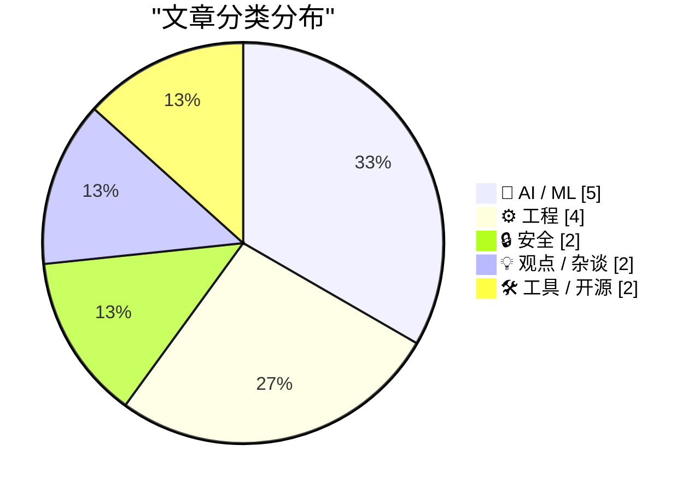
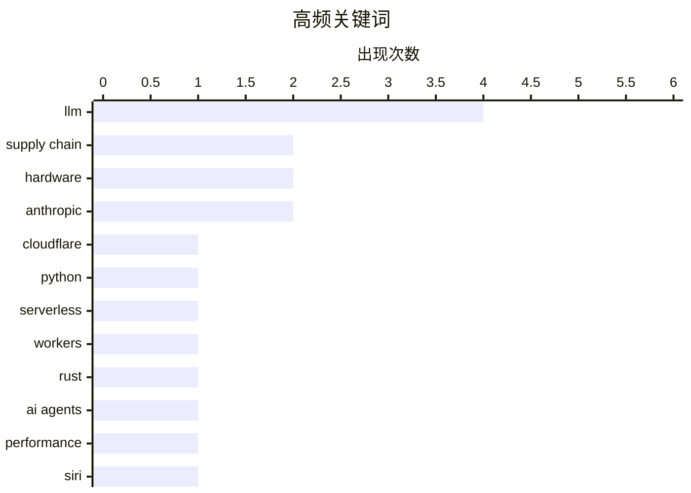

# 📰 Sep 22, 2026

> 来自 Karpathy 推荐的 92 个顶级技术博客，AI 精选 Top 15

## 📝 今日看点

今日技术圈见证了 AI 从文本生成向决策与工程优化的深度转型，Cloudflare Python Workers 的正式商用与 AI Agent 自动优化 Rust 代码标志着开发范式的进一步跃迁。与此同时，围绕 AI 幻觉、法律合规及 MCP 协议的争论，反映出业界在追求技术爆发的同时，正面临严峻的治理挑战与信任危机。此外，包管理器安全漏洞与硬件固件限制的曝光，再次引发了开发者对技术生态透明度与安全底线的集体反思。

---

## 🏆 今日必读

🥇 **Cloudflare Python Workers 正式商用 (GA)**

[Cloudflare Python Workers are now generally available](https://simonwillison.net/2026/Sep/21/cloudflare-python-worker/) — simonwillison.net · 12 小时前 · ⚙️ 工程

> Cloudflare 宣布其服务器端 Workers 平台对 Python 的支持在经过两年预览后正式进入稳定版（GA）。该方案通过 Pyodide 将 Python 编译为 WebAssembly (Wasm)，并在基于 V8 的运行时中执行，使 Python 成为 Cloudflare 开发者平台的原生支持语言。开发者现在可以直接编写 Python 代码处理边缘计算任务，无需复杂的构建流程。这一更新标志着 Python 在边缘函数领域从实验性功能转变为生产就绪的一等公民。

💡 **为什么值得读**: 了解 Python 如何通过 Wasm 技术在边缘计算领域实现高性能运行及生产级落地。

🏷️ Cloudflare, Python, Serverless, Workers

🥈 **通过 AI Agent 迭代优化出超越 SOTA 库性能的 Rust 代码**

[Writing Rust code that's faster than state-of-the-art libraries by asking agents to make the code faster](https://minimaxir.com/2026/09/agentic-iteration/) — minimaxir.com · 18 小时前 · ⚙️ 工程

> 本文探索了利用 AI Agent 进行代码性能优化的新范式，通过不断的反馈循环让 Agent 改进 Rust 实现。作者展示了如何通过多轮“Agentic Iteration”识别性能瓶颈，并生成比目前最先进（SOTA）库更快的代码。这种方法不仅依赖于大模型的初始输出，更强调通过实际运行结果指导 AI 进行针对性重构。实验证明，即使在 Rust 这种高性能语言中，AI 辅助的微观优化也能挖掘出人类开发者可能忽略的性能潜力。

💡 **为什么值得读**: 展示了 AI Agent 在底层性能调优领域的实战潜力，为追求极致性能的开发者提供了新思路。

🏷️ Rust, AI agents, performance

🥉 **David Pogue：对全新 AI 版 Siri 的 125 项测试**

[David Pogue: ‘125 Tests of the New AI Siri’](https://pogueman.substack.com/p/125-tests-of-the-new-ai-siri) — daringfireball.net · 18 小时前 · 🤖 AI / ML

> 资深科技评论员 David Pogue 对集成 Apple Intelligence 的新版 Siri 进行了 125 项深度测试，旨在验证其在实际场景中的可靠性。测试涵盖了苹果官方宣称的功能以及用户自发的复杂指令，观察 Siri 在处理上下文理解和跨应用操作时的表现。作者指出，使用新 Siri 的核心挑战在于打破“手动打开 App”的旧习惯，转而信任 AI 的自动化处理。尽管仍存在 AI 幻觉的风险，但最终版本在节省操作时间和减少繁琐步骤方面表现出色。

💡 **为什么值得读**: 通过大量实测案例，直观展现了苹果 AI 战略落地后 Siri 的真实进化程度与实用边界。

🏷️ Siri, Apple Intelligence, AI, iOS

---

## 📊 数据概览

| 扫描源 | 抓取文章 | 时间范围 | 精选 |
|:---:|:---:|:---:|:---:|
| 82/92 | 2507 篇 → 36 篇 | 48h | **15 篇** |

### 分类分布



### 高频关键词



<details>
<summary>📈 纯文本关键词图（终端友好）</summary>

```
llm          │ ████████████████████ 4
supply chain │ ██████████░░░░░░░░░░ 2
hardware     │ ██████████░░░░░░░░░░ 2
anthropic    │ ██████████░░░░░░░░░░ 2
cloudflare   │ █████░░░░░░░░░░░░░░░ 1
python       │ █████░░░░░░░░░░░░░░░ 1
serverless   │ █████░░░░░░░░░░░░░░░ 1
workers      │ █████░░░░░░░░░░░░░░░ 1
rust         │ █████░░░░░░░░░░░░░░░ 1
ai agents    │ █████░░░░░░░░░░░░░░░ 1
```

</details>

### 🏷️ 话题标签

**llm**(4) · **supply chain**(2) · **hardware**(2) · anthropic(2) · cloudflare(1) · python(1) · serverless(1) · workers(1) · rust(1) · ai agents(1) · performance(1) · siri(1) · apple intelligence(1) · ai(1) · ios(1) · claude(1) · hallucination(1) · package manager(1) · vulnerability(1) · raspberry pi(1)

---

## 🤖 AI / ML

### 1. David Pogue：对全新 AI 版 Siri 的 125 项测试

[David Pogue: ‘125 Tests of the New AI Siri’](https://pogueman.substack.com/p/125-tests-of-the-new-ai-siri) — **daringfireball.net** · 18 小时前 · ⭐ 25/30

> 资深科技评论员 David Pogue 对集成 Apple Intelligence 的新版 Siri 进行了 125 项深度测试，旨在验证其在实际场景中的可靠性。测试涵盖了苹果官方宣称的功能以及用户自发的复杂指令，观察 Siri 在处理上下文理解和跨应用操作时的表现。作者指出，使用新 Siri 的核心挑战在于打破“手动打开 App”的旧习惯，转而信任 AI 的自动化处理。尽管仍存在 AI 幻觉的风险，但最终版本在节省操作时间和减少繁琐步骤方面表现出色。

🏷️ Siri, Apple Intelligence, AI, iOS

---

### 2. Pluralistic：Claude 幻觉与技术“夕阳化”

[Pluralistic: The Claude Delusion (21 Sep 2026)](https://pluralistic.net/2026/09/21/sunsetting/) — **pluralistic.net** · 23 小时前 · ⭐ 25/30

> Cory Doctorow 在本文中探讨了所谓的“Claude 幻觉”，反思究竟是 AI 在产生幻觉，还是人类对 AI 的能力产生了集体误判。文章将 AI 的兴起与互联网服务的“夕阳化”（Sunsetting）联系起来，批评了科技巨头如何利用 AI 叙事来掩盖产品质量下降和对用户控制的加强。作者列举了从 9/11 记忆到 CIA 酷刑幸存者等一系列社会议题，探讨信息永久性与技术操纵之间的矛盾。核心观点认为，我们应当警惕 AI 带来的技术决定论，关注其背后的权力和法律合规问题。

🏷️ Claude, hallucination, LLM

---

### 3. Jev 推出新型 LLM：System One（决策模型）

[Jev introduces a new shape of LLM - System One, aka Decision Models](https://simonwillison.net/2026/Sep/21/jev/) — **simonwillison.net** · 12 小时前 · ⭐ 23/30

> TypeSafe AI 发布了名为 Jev 的新型模型，并将其定义为“System One”或“决策模型”。与传统 LLM 侧重于生成文本不同，Jev 的设计目标是直接输出决策和行动指令，更接近人类直觉式的快速反应系统。该模型虽然仍接收文本输入，但其内部架构优化了逻辑判断和确定性输出的效率。这种分类方法借鉴了认知心理学，旨在区分用于创作的生成式模型和用于控制与决策的专用模型。

🏷️ LLM, Decision Models, System One

---

### 4. MCP 从一开始就是个坏主意吗？

[MCP was always a bad idea?](https://simonwillison.net/2026/Sep/20/hn-49779718/) — **simonwillison.net** · 1 天前 · ⭐ 23/30

> Simon Willison 针对 Hacker News 上对模型上下文协议（MCP）的质疑进行了反驳，探讨了该协议在 AI 生态中的真实价值。批评者认为对于拥有全权限的终端 Agent 来说 MCP 毫无意义，但作者指出 MCP 的核心优势在于处理受限环境和本地私有数据。通过 MCP，开发者可以为 LLM 提供标准化的接口来访问本地数据库或特定 API，而无需授予 Agent 完整的系统访问权限。这种协议化方案在安全性与灵活性之间找到了平衡，是构建可控 AI 工具的关键基础设施。

🏷️ MCP, LLM, Anthropic, Interoperability

---

### 5. 一个捕捉 2026 年在线生活本质的好故事

[A Great Story Capturing the Essence of Being Online in 2026](https://blog.jim-nielsen.com/2026/online-in-2026/) — **blog.jim-nielsen.com** · 16 小时前 · ⭐ 21/30

> 文章通过 Bryan Cantrill 的视角，探讨了 2026 年互联网环境中弥漫的 AI 恐惧论。核心案例是一位前 Anthropic 员工声称 AI 在未来十年内毁灭人类的概率超过 10%，引发了广泛的社会焦虑。这种“恐惧传染”反映了当前技术叙事的极端化，人们在海量 AI 生成内容和末日预言中挣扎。文章试图通过 Oxide and Friends 播客中的轶事，勾勒出技术进步与人类心理承受力之间的紧张关系。

🏷️ AI safety, Anthropic, p(doom)

---

## ⚙️ 工程

### 6. Cloudflare Python Workers 正式商用 (GA)

[Cloudflare Python Workers are now generally available](https://simonwillison.net/2026/Sep/21/cloudflare-python-worker/) — **simonwillison.net** · 12 小时前 · ⭐ 26/30

> Cloudflare 宣布其服务器端 Workers 平台对 Python 的支持在经过两年预览后正式进入稳定版（GA）。该方案通过 Pyodide 将 Python 编译为 WebAssembly (Wasm)，并在基于 V8 的运行时中执行，使 Python 成为 Cloudflare 开发者平台的原生支持语言。开发者现在可以直接编写 Python 代码处理边缘计算任务，无需复杂的构建流程。这一更新标志着 Python 在边缘函数领域从实验性功能转变为生产就绪的一等公民。

🏷️ Cloudflare, Python, Serverless, Workers

---

### 7. 通过 AI Agent 迭代优化出超越 SOTA 库性能的 Rust 代码

[Writing Rust code that's faster than state-of-the-art libraries by asking agents to make the code faster](https://minimaxir.com/2026/09/agentic-iteration/) — **minimaxir.com** · 18 小时前 · ⭐ 26/30

> 本文探索了利用 AI Agent 进行代码性能优化的新范式，通过不断的反馈循环让 Agent 改进 Rust 实现。作者展示了如何通过多轮“Agentic Iteration”识别性能瓶颈，并生成比目前最先进（SOTA）库更快的代码。这种方法不仅依赖于大模型的初始输出，更强调通过实际运行结果指导 AI 进行针对性重构。实验证明，即使在 Rust 这种高性能语言中，AI 辅助的微观优化也能挖掘出人类开发者可能忽略的性能潜力。

🏷️ Rust, AI agents, performance

---

### 8. 树莓派通过固件限制 Pi 5 的内存升级

[Raspberry Pi locks down Pi 5 RAM upgrades in firmware](https://www.jeffgeerling.com/blog/2026/raspberry-pi-ram-lockdown/) — **jeffgeerling.com** · 18 小时前 · ⭐ 24/30

> 树莓派官方在固件更新中引入了一项新特性，限制用户自行更换或升级 Raspberry Pi 5 的 RAM 颗粒。知名博主 Jeff Geerling 发现，即使是更换来自其他树莓派主板的同容量 LPDDR4x 内存芯片，固件也会阻止系统正常启动。这一变动引发了社区对“维修权”和硬件开放性的激烈讨论，因为这实际上在底层锁定了硬件配置。目前该限制主要通过 EEPROM 固件实现，使得非官方的内存维修或扩容变得极其困难。

🏷️ Raspberry Pi, Firmware, Hardware, RAM

---

### 9. 什么是合法的最大 FILETIME？使用它安全吗？

[What’s the highest legal FILETIME? Is it safe to use?](https://devblogs.microsoft.com/oldnewthing/20260921-00/?p=112711/) — **devblogs.microsoft.com/oldnewthing** · 21 小时前 · ⭐ 22/30

> Windows 系统中的 FILETIME 是一个 64 位值，表示自 1601 年以来的 100 纳秒间隔。虽然理论最大值可以达到 0xFFFFFFFF'FFFFFFFF，但在实际编程中直接使用它极度危险。许多 Windows API 在将 FILETIME 转换为 SYSTEMTIME 或其他格式时会发生溢出，导致程序崩溃或逻辑错误。作者建议开发者应使用 0x7FFFFFFF'FFFFFFFF 作为安全上限，或者采用特定的哨兵值来避免兼容性陷阱。

🏷️ Windows, API, FILETIME

---

## 🔒 安全

### 10. 重新审视包管理器威胁模型

[Package Manager Threat Model, Revisited](https://nesbitt.io/2026/09/22/package-manager-threat-model-revisited.html) — **nesbitt.io** · 2 小时前 · ⭐ 25/30

> 该研究对主流包管理器的安全性进行了重新审计，发现通过清单文件（Manifest）字段触发的路径遍历漏洞（Path Traversal）是一个普遍存在的严重威胁。在审计的 10 个包管理器中，有 8 个存在此类漏洞，且在短短四个月内相关安全公告就出现了 33 次。攻击者可以利用这些漏洞在安装包时向系统任意位置写入恶意文件，从而绕过传统的沙箱限制。这表明即使是成熟的开发工具，在处理不受信任的元数据时仍面临严峻的安全挑战。

🏷️ package manager, vulnerability, supply chain

---

### 11. 软件包安全中尚未完成的工作

[Unfinished Work in Package Security](https://nesbitt.io/2026/09/22/unfinished-work-in-package-security.html) — **nesbitt.io** · 2 小时前 · ⭐ 23/30

> 软件供应链安全虽然已成为行业焦点，但目前的防护体系仍处于“半成品”状态。现有的工具如 SBOM（软件物料清单）和签名机制虽然提供了基础，但在实际落地中缺乏自动化集成，往往需要大量的人工干预。开发者在处理依赖关系时，依然面临着恶意包注入和过时组件带来的巨大风险。构建一个真正安全的生态系统，需要从包管理器底层逻辑到分发渠道进行深层次的重构，而非仅仅依赖外挂的扫描工具。

🏷️ security, supply chain, package management

---

## 💡 观点 / 杂谈

### 12. Matthew Butterick：大型 AI 公司对人类的法律漠视

[Matthew Butterick: ‘Big AI to Humanity: Drop Dead’](https://matthewbutterick.com/chron/drop-dead.html) — **daringfireball.net** · 18 小时前 · ⭐ 23/30

> 法律专家 Matthew Butterick 撰文呼吁停止对 AI 长期政策的空泛讨论，转而关注具体的法律执行问题。他指出，大型 AI 公司目前并未遵守现行法律，却在游说政府制定更有利于其扩张的新规则。作者认为，解决 AI 乱象的最有效手段是让这些公司面临与普通人相同的起诉和处罚，而不是将其视为法律之外的特殊存在。文章强调，在弄清楚复杂的 AI 伦理之前，首先应确保现有法律框架对科技巨头依然有效。

🏷️ AI policy, regulation, ethics

---

### 13. 不只是真，它也是假

[It's Not Just True, It's False](https://idiallo.com/byte-size/its-not-just-true-its-false) — **idiallo.com** · 9 小时前 · ⭐ 22/30

> 职场中过度依赖 LLM（大语言模型）进行邮件、Slack 沟通和文档编写正成为常态。虽然 AI 在会议纪要转录和行动项提取等“偷懒”任务上表现卓越，但其生成的文本中往往隐藏着难以察觉的错误。如果用户因为信任 AI 而放弃细致的校对，这些“隐形错误”将随着文档的传播而固化。AI 节省的时间本质上是以牺牲准确性和批判性思维为代价的，这种虚假的效率提升值得警惕。

🏷️ LLM, productivity, AI writing

---

## 🛠 工具 / 开源

### 14. 通用汽车将在 2027 款卡车上恢复 CarPlay 支持

[GM Revives CarPlay for 2027 Trucks](https://www.autoweek.com/news/a73761352/gm-revives-apple-carplay-for-2027-chevy-silverado-gmc-sierra/) — **daringfireball.net** · 1 天前 · ⭐ 23/30

> 通用汽车（GM）在遭遇广泛批评后决定改变策略，宣布将在 2027 款雪佛兰 Silverado 和 GMC Sierra 皮卡上重新引入 Apple CarPlay。此前通用曾试图用自研系统完全取代手机映射功能，但市场反馈表明用户对 CarPlay 和 Android Auto 有着极高的依赖度。新系统将采用重新设计的车载界面，允许智能手机应用与车辆的原生控制功能在同一屏幕上融合运行。这一转变标志着传统车企在与科技巨头的车载系统博弈中，最终向用户习惯做出了妥协。

🏷️ CarPlay, GM, infotainment, automotive

---

### 15. Marques Brownlee 的 iPhone 18 Pro 评测

[Marques Brownlee’s iPhone 18 Pro Review](https://www.youtube.com/watch?v=ohqxP8EEumo) — **daringfireball.net** · 1 天前 · ⭐ 22/30

> iPhone 18 Pro 被视为典型的“S 年代”升级，即外观变化微小但内部规格有显著提升。评测重点指出，根据苹果官方规格，标准版 iPhone 18 Pro 的续航时间已经超越了上一代的 iPhone 17 Pro Max。这一跨代跨型号的续航逆袭，是今年最核心且对用户最有价值的硬件改进。尽管苹果在某些设计决策上依然固执，但电池效率的飞跃使得这一代 Pro 机型在实用性上达到了新高度。

🏷️ iPhone 18 Pro, MKBHD, hardware, review

---

*生成于 2026-09-22 11:22 | 扫描 82 源 → 获取 2507 篇 → 精选 15 篇*
*基于 [Hacker News Popularity Contest 2025](https://refactoringenglish.com/tools/hn-popularity/) RSS 源列表，由 [Andrej Karpathy](https://x.com/karpathy) 推荐*
