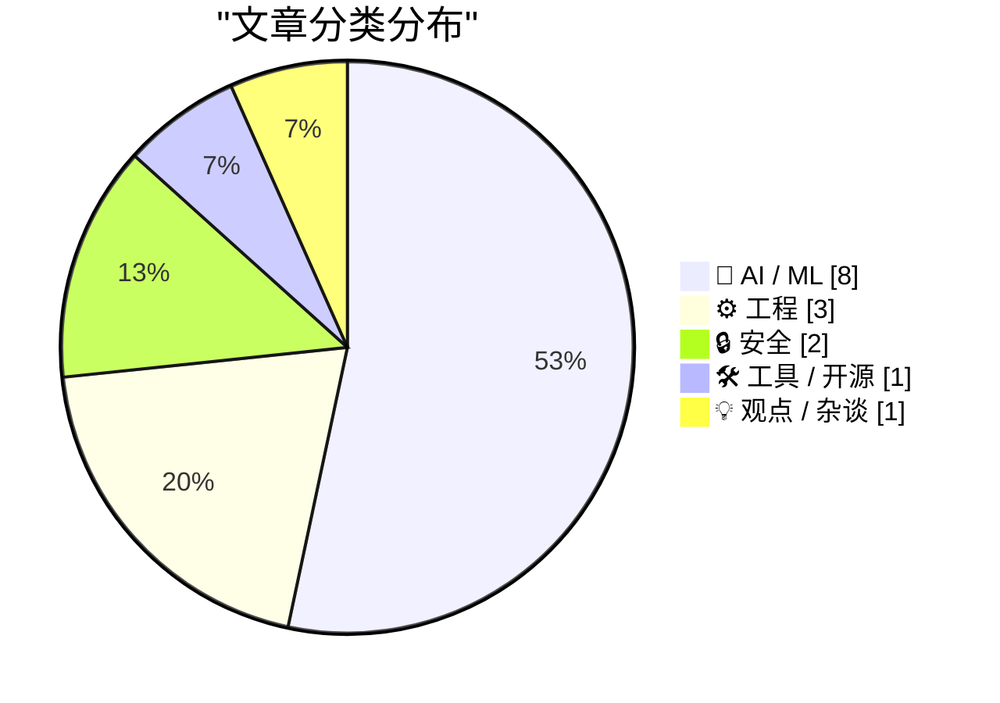
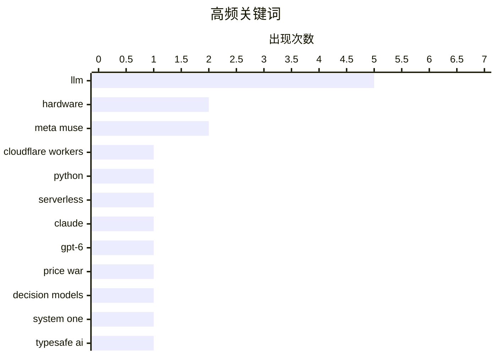

# 📰 Sep 23, 2026

> 来自 Karpathy 推荐的 92 个顶级技术博客，AI 精选 Top 15

## 📝 今日看点

今日技术圈见证了 AI 模型的激进迭代与工程化深耕，OpenAI 与 Anthropic 开启新一轮性能竞赛，而“决策模型”的出现预示着 LLM 正在从文本生成向逻辑决策进化。与此同时，开发工具链正迎来 AI 友好型变革，从 Cloudflare Python Workers 的正式商用到底层项目格式的重构，编程范式正加速向自动化与智能化转型。此外，包管理器安全漏洞与硬件固件限制等底层风险，也提醒开发者在技术狂奔中仍需关注安全与开放的基石。

---

## 🏆 今日必读

🥇 **Cloudflare Python Workers 正式商用 (GA)**

[Cloudflare Python Workers are now generally available](https://simonwillison.net/2026/Sep/21/cloudflare-python-worker/) — simonwillison.net · 1 天前 · ⚙️ 工程

> Cloudflare 宣布其服务器端 Workers 平台的 Python 支持在经过两年预览后正式进入稳定商用阶段。Python 现已成为该平台的“一等公民”，开发者可以直接编写 Python 代码构建边缘应用。技术实现上，Cloudflare 通过 Pyodide 将 Python 编译为 WebAssembly (Wasm)，并在其基于 V8 的开源运行时 workerd 中高效执行。这意味着开发者可以利用庞大的 Python 生态系统，同时享受边缘计算的低延迟优势。该方案解决了以往在边缘端运行 Python 性能低下且环境复杂的痛点。

💡 **为什么值得读**: 标志着 Python 进入主流边缘计算领域，对于习惯 Python 生态的开发者来说是重大的基础设施升级。

🏷️ Cloudflare Workers, Python, Serverless

🥈 **Claude Opus 5.5 与 GPT-6 Sol/Luna 发布：新一轮 AI 价格战开启**

[Claude Opus 5.5, GPT-6 Sol, GPT-6 Luna, and a new price war](https://simonwillison.net/2026/Sep/22/opus-and-sol-and-luna/) — simonwillison.net · 11 小时前 · 🤖 AI / ML

> AI 领域迎来爆发式更新，Anthropic 发布了 Claude Opus 5.5，紧接着 OpenAI 推出了 GPT-6 Sol 和 GPT-6 Luna 两款新模型。此前一天，xAI 的 Grok 4.7 和小米的 MiMo v2.6 也相继亮相，市场竞争极度白热化。这些新一代模型的集中发布不仅代表了性能的跨越，更直接引发了各大厂商之间的新一轮价格战。开发者和企业用户将面临更多高性能、低成本的模型选择，AI 基础设施的性价比正在快速提升。这一系列动作标志着大模型竞争已进入存量博弈与效率竞争的新阶段。

💡 **为什么值得读**: 快速了解当前最顶尖 LLM 市场的最新动态及大厂间的竞争格局。

🏷️ Claude, GPT-6, LLM, Price War

🥉 **Jev 推出新型 LLM：System One “决策模型”**

[Jev introduces a new shape of LLM - System One, aka Decision Models](https://simonwillison.net/2026/Sep/21/jev/) — simonwillison.net · 1 天前 · 🤖 AI / ML

> TypeSafe AI 推出了名为 Jev 的新型模型，开创了被称为“System One”或“决策模型”的新类别。与传统生成文本的 LLM 不同，Jev 虽然接收文本输入，但其核心输出是具体的决策和行动指令。这一设计灵感来源于认知科学中的系统 1（直觉、快速）思维模式，旨在提高模型在特定任务中的执行效率。这种架构转变预示着 AI 将从单纯的“聊天机器人”向更具行动力的“决策代理”演进。该模型为解决 LLM 在复杂逻辑推理中的“幻觉”问题提供了新的工程思路。

💡 **为什么值得读**: 探讨了 LLM 架构从文本生成向决策执行转变的新范式，是 AI Agent 领域的重要参考。

🏷️ Decision Models, System One, TypeSafe AI

---

## 📊 数据概览

| 扫描源 | 抓取文章 | 时间范围 | 精选 |
|:---:|:---:|:---:|:---:|
| 83/92 | 2528 篇 → 44 篇 | 48h | **15 篇** |

### 分类分布



### 高频关键词



<details>
<summary>📈 纯文本关键词图（终端友好）</summary>

```
llm                │ ████████████████████ 5
hardware           │ ████████░░░░░░░░░░░░ 2
meta muse          │ ████████░░░░░░░░░░░░ 2
cloudflare workers │ ████░░░░░░░░░░░░░░░░ 1
python             │ ████░░░░░░░░░░░░░░░░ 1
serverless         │ ████░░░░░░░░░░░░░░░░ 1
claude             │ ████░░░░░░░░░░░░░░░░ 1
gpt-6              │ ████░░░░░░░░░░░░░░░░ 1
price war          │ ████░░░░░░░░░░░░░░░░ 1
decision models    │ ████░░░░░░░░░░░░░░░░ 1
```

</details>

### 🏷️ 话题标签

**llm**(5) · **hardware**(2) · **meta muse**(2) · cloudflare workers(1) · python(1) · serverless(1) · claude(1) · gpt-6(1) · price war(1) · decision models(1) · system one(1) · typesafe ai(1) · xcode(1) · json(1) · developer tools(1) · apple(1) · nvidia(1) · ai chips(1) · industry analysis(1) · rust(1)

---

## 🤖 AI / ML

### 1. Claude Opus 5.5 与 GPT-6 Sol/Luna 发布：新一轮 AI 价格战开启

[Claude Opus 5.5, GPT-6 Sol, GPT-6 Luna, and a new price war](https://simonwillison.net/2026/Sep/22/opus-and-sol-and-luna/) — **simonwillison.net** · 11 小时前 · ⭐ 26/30

> AI 领域迎来爆发式更新，Anthropic 发布了 Claude Opus 5.5，紧接着 OpenAI 推出了 GPT-6 Sol 和 GPT-6 Luna 两款新模型。此前一天，xAI 的 Grok 4.7 和小米的 MiMo v2.6 也相继亮相，市场竞争极度白热化。这些新一代模型的集中发布不仅代表了性能的跨越，更直接引发了各大厂商之间的新一轮价格战。开发者和企业用户将面临更多高性能、低成本的模型选择，AI 基础设施的性价比正在快速提升。这一系列动作标志着大模型竞争已进入存量博弈与效率竞争的新阶段。

🏷️ Claude, GPT-6, LLM, Price War

---

### 2. Jev 推出新型 LLM：System One “决策模型”

[Jev introduces a new shape of LLM - System One, aka Decision Models](https://simonwillison.net/2026/Sep/21/jev/) — **simonwillison.net** · 1 天前 · ⭐ 26/30

> TypeSafe AI 推出了名为 Jev 的新型模型，开创了被称为“System One”或“决策模型”的新类别。与传统生成文本的 LLM 不同，Jev 虽然接收文本输入，但其核心输出是具体的决策和行动指令。这一设计灵感来源于认知科学中的系统 1（直觉、快速）思维模式，旨在提高模型在特定任务中的执行效率。这种架构转变预示着 AI 将从单纯的“聊天机器人”向更具行动力的“决策代理”演进。该模型为解决 LLM 在复杂逻辑推理中的“幻觉”问题提供了新的工程思路。

🏷️ Decision Models, System One, TypeSafe AI

---

### 3. AI 芯片都去哪儿了？

[Where're All The AI Chips?](https://www.wheresyoured.at/wherere-all-the-ai-chips/) — **wheresyoured.at** · 20 小时前 · ⭐ 26/30

> 本文深入探讨了当前 AI 芯片市场的供给现状及其对 NVIDIA、Anthropic 和 OpenAI 等巨头的影响。文章分析了在算力需求激增的背景下，芯片分配的优先级以及背后的财务逻辑。作者指出，芯片的短缺不仅是产能问题，更涉及复杂的商业博弈和资本运作。通过对行业数据的详细拆解，揭示了 AI 基础设施竞赛中隐藏的风险与机遇。结论认为，芯片供应的集中度将决定未来几年 AI 软件公司的生死存亡。

🏷️ NVIDIA, AI chips, hardware, industry analysis

---

### 4. 大语言模型在简单任务上依然表现糟糕吗？

[Are LLMs still surprisingly bad at some simple tasks?](https://shkspr.mobi/blog/2026/09/are-llms-still-surprisingly-bad-at-some-simple-tasks/) — **shkspr.mobi** · 23 小时前 · ⭐ 25/30

> 作者重复了去年的实验，测试现代 LLM 在处理看似简单的逻辑或事实问题时的表现。实验结果令人失望，几乎所有主流模型在面对特定简单任务时依然会产生幻觉或逻辑错误。尽管支持者认为可以通过提示词工程（Prompt Engineering）解决，但作者指出模型在基础认知上的缺陷依然存在。这提醒开发者，在将 LLM 应用于关键业务时，必须对其输出的准确性保持高度警惕。文章强调，单纯增加参数量并不能完全消除这些“低级错误”。

🏷️ LLM, benchmarking, reasoning

---

### 5. 不只是真假问题：AI 生成内容的隐形错误

[It's Not Just True, It's False](https://idiallo.com/byte-size/its-not-just-true-its-false) — **idiallo.com** · 1 天前 · ⭐ 24/30

> 文章探讨了在职场中过度依赖 LLM 进行写作和文档生成的负面影响。虽然 AI 在处理会议纪要和摘要等任务时能节省时间，但在编写正式文档时往往会引入“隐形错误”。如果用户因为信任 AI 而放弃仔细校对，这些错误将潜伏在工作成果中，造成长期的负面后果。作者认为，AI 带来的效率提升有时是以牺牲准确性和深度思考为代价的，这种权衡值得警惕。结论是，AI 应该是辅助工具而非替代品，人类的终审权不可或缺。

🏷️ LLM, productivity, hallucination

---

### 6. 更廉价的 LLM 标注方案

[Cheaper LLM labelling](https://entropicthoughts.com/cheaper-llm-labeling) — **entropicthoughts.com** · 1 天前 · ⭐ 24/30

> 针对将 Git 提交记录分类为“维护”或“新开发”的特定任务，利用 GPT-4o-mini 等廉价且高性能的 LLM 可以显著降低数据标注成本。通过在小型测试集上进行人工验证，LLM 的标注结果与人类完全一致，证明了其在大规模推广中的可靠性。技术实现上推荐使用 Simon Willison 开发的 llm 命令行工具，配合简单的 Prompt 即可实现自动化处理。这种方法为开发者提供了一种无需构建复杂模型即可快速处理海量文本分类任务的实用路径。

🏷️ LLM, data labeling, git, automation

---

### 7. Meta 的新 Muse AI 助手读取了 Jason Aten 的私密消息数据库

[Meta’s New Muse AI Agent Read Jason Aten’s Messages Database](https://www.inc.com/jason-aten/metas-new-muse-ai-agent-read-my-private-messages-i-never-asked-it-to/91408202) — **daringfireball.net** · 13 小时前 · ⭐ 23/30

> 科技专栏作家 Jason Aten 发现 Meta 的 Muse AI 助手在未经明确授权的情况下，读取并分析了他的私密消息数据库。Muse 不仅根据他与同事关于 iPhone 的私下对话推送了写作建议，甚至还识别并提醒了他编辑器发来的截稿通知。这种行为引发了严重的隐私忧虑，因为 AI 代理似乎在后台静默索引用户的本地通信数据。该事件凸显了当前 AI 助手在便利性与个人隐私边界之间的剧烈冲突，以及厂商在数据获取透明度上的缺失。

🏷️ Meta Muse, AI agent, privacy, database

---

### 8. David Pogue：对新版 AI Siri 的 125 项测试

[David Pogue: ‘125 Tests of the New AI Siri’](https://pogueman.substack.com/p/125-tests-of-the-new-ai-siri) — **daringfireball.net** · 1 天前 · ⭐ 23/30

> 知名科技评论家 David Pogue 对集成 Apple Intelligence 的新版 Siri 进行了 125 项深度测试，旨在评估其在实际场景中的准确率。测试涵盖了苹果官方宣称的功能以及用户在日常生活中可能尝试的各种复杂指令。Pogue 指出，用户使用新 Siri 的最大挑战在于打破“手动打开 App”的旧习惯，转而信任 AI 的自动化处理能力。尽管 AI 仍存在不确定性，但测试结果显示，在习惯养成后，新版 Siri 能通过跨应用操作显著减少操作步骤并提升效率。

🏷️ Siri, Apple Intelligence, UX, LLM

---

## ⚙️ 工程

### 9. Cloudflare Python Workers 正式商用 (GA)

[Cloudflare Python Workers are now generally available](https://simonwillison.net/2026/Sep/21/cloudflare-python-worker/) — **simonwillison.net** · 1 天前 · ⭐ 27/30

> Cloudflare 宣布其服务器端 Workers 平台的 Python 支持在经过两年预览后正式进入稳定商用阶段。Python 现已成为该平台的“一等公民”，开发者可以直接编写 Python 代码构建边缘应用。技术实现上，Cloudflare 通过 Pyodide 将 Python 编译为 WebAssembly (Wasm)，并在其基于 V8 的开源运行时 workerd 中高效执行。这意味着开发者可以利用庞大的 Python 生态系统，同时享受边缘计算的低延迟优势。该方案解决了以往在边缘端运行 Python 性能低下且环境复杂的痛点。

🏷️ Cloudflare Workers, Python, Serverless

---

### 10. Xcode 27.2 支持全新 JSON 项目文件格式

[Xcode 27.2 Now Supports a New JSON Project File Format](https://developer.apple.com/documentation/xcode-release-notes/xcode-27_2-release-notes) — **daringfireball.net** · 15 小时前 · ⭐ 26/30

> 苹果在 Xcode 27.2 中引入了基于 JSON 的全新项目格式 .xcproj，旨在解决长期困扰开发者的项目文件冲突问题。该格式具有极高的可读性和合并友好性，特别针对 AI 编程助手（Coding Agents）的自动化编辑进行了优化。开发者可以在文件检查器中启用此功能，且该格式向下兼容 Xcode 27 的早期版本。苹果同步在 GitHub 上发布了用于读写和操作该格式的 Swift 库及命令行工具，获得了开发者社区的广泛好评。这一改进将极大提升多人协作开发 iOS/macOS 应用的效率。

🏷️ Xcode, JSON, developer tools, Apple

---

### 11. 树莓派 5 通过固件限制内存升级与更换

[Raspberry Pi locks down Pi 5 RAM upgrades in firmware](https://www.jeffgeerling.com/blog/2026/raspberry-pi-ram-lockdown/) — **jeffgeerling.com** · 1 天前 · ⭐ 25/30

> 树莓派官方在最新固件中增加了一项限制，阻止用户自行更换或升级 Raspberry Pi 5 的 RAM 颗粒。即便使用相同容量和规格的芯片，固件层面的锁定也会导致设备无法正常工作。知名博主 Jeff Geerling 对此进行了验证，指出这种做法严重损害了硬件的可维修性和 DIY 精神。此举在社区引发了广泛争议，被视为树莓派从开放硬件向封闭生态转变的信号。对于依赖硬件定制的开发者来说，这可能是一个需要重新评估平台的信号。

🏷️ Raspberry Pi 5, Firmware, Hardware

---

## 🔒 安全

### 12. 重新审视包管理器的威胁模型

[Package Manager Threat Model, Revisited](https://nesbitt.io/2026/09/22/package-manager-threat-model-revisited.html) — **nesbitt.io** · 1 天前 · ⭐ 25/30

> 对十款主流包管理器的安全审计显示，其中八款存在通过清单文件（Manifest）字段触发的路径遍历漏洞。在短短四个月内，相关漏洞通报已出现 33 次，暴露出包管理器在处理元数据时的严重安全缺陷。攻击者可以利用这些漏洞在安装包时执行恶意操作或篡改系统文件。文章呼吁开发者和维护者重新评估包管理器的安全假设，并加强对清单解析过程的防御。这是供应链安全中一个长期被低估的风险点。

🏷️ package manager, vulnerability, path traversal, security

---

### 13. 第 522 期每周更新：来自奥斯陆的现场报道（对话 Scott Helme）

[Weekly Update 522: Live From Oslo with Scott Helme](https://www.troyhunt.com/weekly-update-522/) — **troyhunt.com** · 5 小时前 · ⭐ 24/30

> 本期内容重点探讨了内容安全策略（CSP）在企业安全中的意外用途，即通过 CSP 报告识别组织内被恶意软件感染的机器。安全专家 Scott Helme 分享了 Report URI 工具如何捕获由恶意软件注入的异常脚本请求，从而精准定位受感染的终端。尽管视频开头存在音频故障，但后续深入讨论了 CSP 作为一种低成本、高效率客户端监控手段的潜力。这为安全团队提供了一种在不安装侵入性代理的情况下，感知内网安全威胁的新视角。

🏷️ CSP, malware, web-security, infosec

---

## 🛠 工具 / 开源

### 14. 通过 AI 代理迭代编写超越 SOTA 库性能的 Rust 代码

[Writing Rust code that's faster than state-of-the-art libraries by asking agents to make the code faster](https://minimaxir.com/2026/09/agentic-iteration/) — **minimaxir.com** · 1 天前 · ⭐ 26/30

> 作者展示了如何利用 AI 代理的迭代优化能力，编写出性能超越当前最先进（SOTA）库的 Rust 代码。通过不断向代理提出性能改进要求并进行自动化测试，开发者可以突破手动优化的瓶颈。这种“代理迭代”模式利用了 LLM 对底层语言特性的理解，能够发现人类开发者可能忽略的微观优化点。实验证明，在特定算法实现上，AI 辅助生成的代码在执行效率上具有显著优势。这标志着 AI 在底层系统编程领域的角色正从“助手”向“专家”转变。

🏷️ Rust, AI agents, performance, optimization

---

## 💡 观点 / 杂谈

### 15. 为什么谷歌没有开发出像 Muse 这样的产品？

[Why Didn’t Google Build Muse?](https://spyglass.org/why-didnt-google-build-muse/) — **daringfireball.net** · 14 小时前 · ⭐ 23/30

> 针对 Meta 推出的 Muse 个人助手，业界普遍质疑拥有海量用户数据的谷歌为何在同类产品上动作迟缓。分析指出，虽然谷歌正在开发相关技术，但其核心问题在于缺乏产品聚焦，多个 AI 团队之间的项目重叠且分散。相比之下，Meta 虽然面临巨大的信任危机，但在产品落地速度上却表现得更为激进。谷歌在 AI 代理赛道的滞后，反映了大型科技公司在面对颠覆性技术时，内部组织架构与战略执行力的博弈。

🏷️ Google, Meta Muse, AI assistant, strategy

---

*生成于 2026-09-23 11:17 | 扫描 83 源 → 获取 2528 篇 → 精选 15 篇*
*基于 [Hacker News Popularity Contest 2025](https://refactoringenglish.com/tools/hn-popularity/) RSS 源列表，由 [Andrej Karpathy](https://x.com/karpathy) 推荐*
