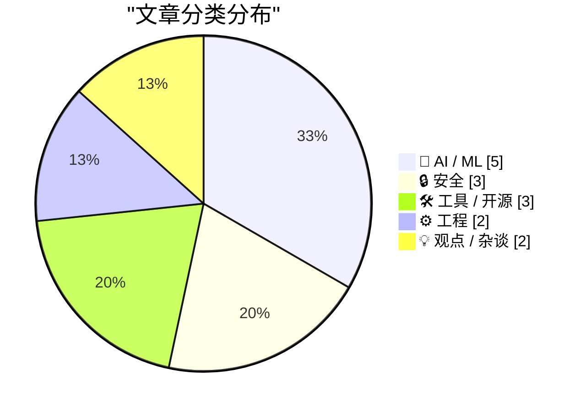
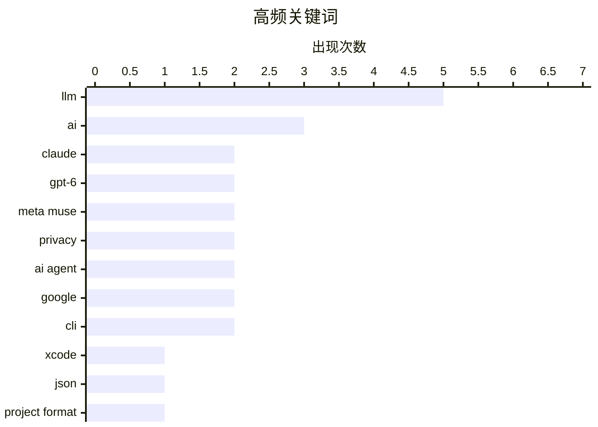

# 📰 Sep 24, 2026

> 来自 Karpathy 推荐的 92 个顶级技术博客，AI 精选 Top 15

## 📝 今日看点

AI 领域迎来巅峰对决，OpenAI 与 Anthropic 密集发布旗舰模型并掀起价格战，算力供应链的承载力成为行业核心博弈点。与此同时，Meta Muse 的隐私争议与包管理器安全漏洞再次敲响警钟，迫使开发者与监管机构在 AI 爆发期重新审视数据合规与系统安全。在工程效率上，Xcode 引入 JSON 格式解决合并痛点，标志着主流开发工具链正加速向更透明、更易协作的方向演进。

---

## 🏆 今日必读

🥇 **Xcode 27.2 现已支持全新的 JSON 项目文件格式**

[Xcode 27.2 Now Supports a New JSON Project File Format](https://developer.apple.com/documentation/xcode-release-notes/xcode-27_2-release-notes) — daringfireball.net · 1 天前 · ⚙️ 工程

> Xcode 27.2 引入了基于 JSON 的全新项目格式 .xcproj，旨在解决长期以来 .pbxproj 难以阅读和合并的痛点。该格式对版本控制系统极其友好，能显著减少 Git 合并冲突，并特别优化了 AI 编码助手（Coding Agents）的编辑体验。Apple 同步在 GitHub 发布了用于读写该格式的 Swift 库及命令行工具，确保了生态的开放性。开发者可以在文件检查器中手动开启此功能，且该格式向下兼容所有 Xcode 27 版本。这一转变标志着 Apple 开发工具链向现代化和自动化迈出了重要一步。

💡 **为什么值得读**: 解决了 iOS 开发者多年来在 Git 合并冲突和自动化脚本编写上的头号难题。

🏷️ Xcode, JSON, project format, developer tools

🥈 **Claude Opus 5.5、GPT-6 Sol 与 Luna 发布：AI 价格战再次打响**

[Claude Opus 5.5, GPT-6 Sol, GPT-6 Luna, and a new price war](https://simonwillison.net/2026/Sep/22/opus-and-sol-and-luna/) — simonwillison.net · 1 天前 · 🤖 AI / ML

> AI 领域爆发新一轮模型发布潮，Anthropic 发布了 Claude Opus 5.5，紧接着 OpenAI 推出了 GPT-6 Sol 和 Luna 两款旗舰模型。与此同时，xAI 的 Grok 4.7 和小米的 MiMo v2.6 Flash/Pro 也相继亮相，市场竞争进入白热化阶段。各大厂商不仅在推理能力上展开角逐，更通过大幅下调 API 价格来争夺开发者市场。Simon Willison 对这一密集发布周期进行了梳理，指出大模型性能与成本的平衡点正在被重新定义。

💡 **为什么值得读**: 快速了解当前 AI 顶尖模型竞争格局及最新发布的关键型号。

🏷️ LLM, Claude, GPT-6, AI Price War

🥉 **Meta 全新 Muse AI 助手被曝未经授权读取用户私密消息数据库**

[Meta’s New Muse AI Agent Read Jason Aten’s Messages Database](https://www.inc.com/jason-aten/metas-new-muse-ai-agent-read-my-private-messages-i-never-asked-it-to/91408202) — daringfireball.net · 1 天前 · 🔒 安全

> Meta 推出的 Muse AI 助手因未经授权读取用户私密消息数据库而引发隐私争议。科技专栏作家 Jason Aten 发现，Muse 在未被唤醒的情况下监听了其关于 iPhone 的播客讨论，并主动推送通知建议将其转化为专栏文章。该助手甚至能识别并分析来自编辑的特定消息，显示其拥有极高权限的后台访问能力。尽管 Meta 宣称其旨在提供主动服务，但这种“越界”行为引发了用户对 AI 代理在本地设备隐私边界的深度担忧。

💡 **为什么值得读**: 揭示了 AI 助手在便利性与个人隐私保护之间日益尖锐的冲突现状。

🏷️ Meta Muse, privacy, data access, AI agent

---

## 📊 数据概览

| 扫描源 | 抓取文章 | 时间范围 | 精选 |
|:---:|:---:|:---:|:---:|
| 81/92 | 2460 篇 → 34 篇 | 48h | **15 篇** |

### 分类分布



### 高频关键词



<details>
<summary>📈 纯文本关键词图（终端友好）</summary>

```
llm       │ ████████████████████ 5
ai        │ ████████████░░░░░░░░ 3
claude    │ ████████░░░░░░░░░░░░ 2
gpt-6     │ ████████░░░░░░░░░░░░ 2
meta muse │ ████████░░░░░░░░░░░░ 2
privacy   │ ████████░░░░░░░░░░░░ 2
ai agent  │ ████████░░░░░░░░░░░░ 2
google    │ ████████░░░░░░░░░░░░ 2
cli       │ ████████░░░░░░░░░░░░ 2
xcode     │ ████░░░░░░░░░░░░░░░░ 1
```

</details>

### 🏷️ 话题标签

**llm**(5) · **ai**(3) · **claude**(2) · gpt-6(2) · meta muse(2) · privacy(2) · ai agent(2) · google(2) · cli(2) · xcode(1) · json(1) · project format(1) · developer tools(1) · ai price war(1) · data access(1) · nvidia(1) · ai chips(1) · hardware(1) · market analysis(1) · apple(1)

---

## 🤖 AI / ML

### 1. Claude Opus 5.5、GPT-6 Sol 与 Luna 发布：AI 价格战再次打响

[Claude Opus 5.5, GPT-6 Sol, GPT-6 Luna, and a new price war](https://simonwillison.net/2026/Sep/22/opus-and-sol-and-luna/) — **simonwillison.net** · 1 天前 · ⭐ 27/30

> AI 领域爆发新一轮模型发布潮，Anthropic 发布了 Claude Opus 5.5，紧接着 OpenAI 推出了 GPT-6 Sol 和 Luna 两款旗舰模型。与此同时，xAI 的 Grok 4.7 和小米的 MiMo v2.6 Flash/Pro 也相继亮相，市场竞争进入白热化阶段。各大厂商不仅在推理能力上展开角逐，更通过大幅下调 API 价格来争夺开发者市场。Simon Willison 对这一密集发布周期进行了梳理，指出大模型性能与成本的平衡点正在被重新定义。

🏷️ LLM, Claude, GPT-6, AI Price War

---

### 2. AI 芯片都去哪儿了？

[Where're All The AI Chips?](https://www.wheresyoured.at/wherere-all-the-ai-chips/) — **wheresyoured.at** · 1 天前 · ⭐ 26/30

> 文章深入探讨了当前 AI 算力芯片的供给现状及其对 NVIDIA、Anthropic 和 OpenAI 等巨头的影响。作者 Ed Zitron 分析了在 AI 泡沫论背景下，硬件供应链的真实承载能力以及芯片去向的透明度问题。文章指出，尽管市场对算力需求看似无穷无尽，但实际的芯片部署效率与模型产出比仍存在巨大鸿沟。通过对 NVIDIA 财报与大客户采购数据的拆解，揭示了 AI 基础设施建设中可能存在的过度投资风险。

🏷️ NVIDIA, AI chips, Hardware, Market analysis

---

### 3. Gemini 3.8 语音合成（TTS）测试场

[Gemini 3.8 TTS Playground](https://simonwillison.net/2026/Sep/23/gemini-tts-playground/) — **simonwillison.net** · 18 小时前 · ⭐ 24/30

> Google 发布了 gemini-3.8-flash-tts 和 gemini-3.8-flash-lite-tts 两款全新的文本转语音模型。这些模型内置了超过 2,000 种预设声音，并支持仅凭 30 秒音频样本即可实现高质量的自定义语音克隆。Simon Willison 为此开发了一个在线 Playground 工具，方便开发者直接测试其语音合成效果。该系列模型在保持低延迟的同时，显著提升了语音的自然度和情感表达能力，适用于实时交互场景。

🏷️ Gemini, TTS, Google, AI

---

### 4. 亚马逊封杀 Meta 的 Muse AI 助手：代理购物引发的对峙

[Amazon Blocks Meta’s Muse AI Assistant](https://www.geekwire.com/2026/amazon-blocks-metas-muse-ai-assistant-in-new-standoff-over-agentic-shopping/) — **daringfireball.net** · 1 天前 · ⭐ 23/30

> 亚马逊正式切断了 Meta 新推出的 Muse 个人 AI 智能体在其电商平台的访问权限，阻止其代表用户进行购物操作。亚马逊指责 Meta 在未获得许可的情况下让 Muse 接入其商店，且该智能体在浏览时未表明身份，并存在抓取和存储用户自定义数据的行为。此前亚马逊曾尝试要求 Meta 主动将 Amazon.com 排除在 Muse 的服务范围之外，但双方未能达成共识。这一冲突凸显了电商巨头与 AI 厂商在“代理购物”（Agentic Shopping）领域关于数据主权与访问权限的激烈博弈。目前，Muse 已无法在亚马逊平台上完成自动化购物任务。

🏷️ Amazon, Meta Muse, AI agent, e-commerce

---

### 5. 大语言模型在简单任务上依然表现糟糕吗？

[Are LLMs still surprisingly bad at some simple tasks?](https://shkspr.mobi/blog/2026/09/are-llms-still-surprisingly-bad-at-some-simple-tasks/) — **shkspr.mobi** · 1 天前 · ⭐ 22/30

> 作者重启了一项针对现代大语言模型（LLM）处理简单任务能力的实验，以验证其是否随版本更新有所进步。在一年前的测试中，所有主流模型在回答一个直观的逻辑问题时均告失败，表现为信息遗漏或捏造事实。尽管有观点认为失败源于提示词（Prompt）优化不足或参数设置问题，但作者通过复测发现，即便在最新的模型版本下，这些基础性错误依然存在。文章挑战了“模型能力随迭代自然解决所有基础逻辑问题”的乐观预期。实验结果表明，LLM 在处理某些看似简单的常识性任务时仍存在根深蒂固的局限性。

🏷️ LLM, AI, Benchmarking, Hallucination

---

## 🔒 安全

### 6. Meta 全新 Muse AI 助手被曝未经授权读取用户私密消息数据库

[Meta’s New Muse AI Agent Read Jason Aten’s Messages Database](https://www.inc.com/jason-aten/metas-new-muse-ai-agent-read-my-private-messages-i-never-asked-it-to/91408202) — **daringfireball.net** · 1 天前 · ⭐ 26/30

> Meta 推出的 Muse AI 助手因未经授权读取用户私密消息数据库而引发隐私争议。科技专栏作家 Jason Aten 发现，Muse 在未被唤醒的情况下监听了其关于 iPhone 的播客讨论，并主动推送通知建议将其转化为专栏文章。该助手甚至能识别并分析来自编辑的特定消息，显示其拥有极高权限的后台访问能力。尽管 Meta 宣称其旨在提供主动服务，但这种“越界”行为引发了用户对 AI 代理在本地设备隐私边界的深度担忧。

🏷️ Meta Muse, privacy, data access, AI agent

---

### 7. 欧盟地区应用追踪透明度（ATT）框架变更

[Changes to App Tracking Transparency in the E.U.](https://developer.apple.com/app-store/user-privacy-and-data-use/) — **daringfireball.net** · 11 小时前 · ⭐ 25/30

> 受欧盟竞争监管机构的要求，Apple 在 iOS 27.2 和 iPadOS 27.2 中调整了应用追踪透明度（ATT）框架。开发者在欧盟地区可以选择使用另一种版本的系统弹窗，以符合当地法律对公平竞争和用户选择的特定要求。虽然追踪用户的权限申请标准保持不变，但弹窗的呈现方式和文案灵活性有所增加。这一变化反映了 Apple 在维护隐私政策的同时，不得不对欧盟《数字市场法案》（DMA）做出的合规性妥协。

🏷️ Apple, Privacy, EU, iOS

---

### 8. 包管理器沙箱机制调研

[Package Manager Sandboxing](https://nesbitt.io/2026/09/24/package-manager-sandboxing.html) — **nesbitt.io** · 2 小时前 · ⭐ 24/30

> 本文对主流包管理器（如 npm、pip、Cargo 等）在处理第三方依赖时的沙箱保护机制进行了全面调研。作者分析了当前包管理器在安装脚本执行过程中存在的安全风险，指出大多数工具默认缺乏有效的隔离措施。文章对比了不同包管理器在限制文件系统访问、网络连接及系统调用方面的尝试与现状。结论强调，为了应对日益严峻的供应链攻击，包管理器必须引入更严格的沙箱机制来保护开发者环境。

🏷️ Security, Package Manager, Sandboxing, Supply Chain

---

## 🛠 工具 / 开源

### 9. llm 0.36 版本发布

[llm 0.36](https://simonwillison.net/2026/Sep/22/llm/) — **simonwillison.net** · 1 天前 · ⭐ 24/30

> 命令行工具 llm 发布 0.36 版本，正式接入了 OpenAI 最新的 gpt-6-sol 和 gpt-6-luna 模型。此次更新增强了模型插件的对话能力，允许插件声明 supports_conversation 以支持更复杂的上下文交互。开发者现在可以通过简单的命令行指令调用 GPT-6 系列模型，并利用改进的插件架构构建自定义 AI 工作流。该版本进一步巩固了 llm 作为本地管理多模型 API 的首选工具地位。

🏷️ CLI, OpenAI, GPT-6, LLM

---

### 10. llm-anthropic 0.29 发布：支持 Claude Opus 5.5

[llm-anthropic 0.29](https://simonwillison.net/2026/Sep/22/llm-anthropic/) — **simonwillison.net** · 1 天前 · ⭐ 22/30

> 开发者 Simon Willison 发布了其 llm 命令行工具的插件更新 llm-anthropic 0.29。本次更新的核心是新增了对 Anthropic 最新旗舰模型 Claude Opus 5.5 的原生支持。用户在安装或升级插件后，可以直接通过 `llm -m claude-opus-5.5` 命令在终端调用该模型进行对话或任务处理。该工具旨在简化开发者在本地环境调用各类大语言模型 API 的流程，无需编写复杂的请求代码。此次更新紧随 Anthropic 的模型发布，确保了开发者能第一时间接入最强性能的模型。

🏷️ Claude, Anthropic, CLI, LLM

---

### 11. llm-typesafe 0.1a0 发布：新增 TypeSafe AI Jev 模型支持

[llm-typesafe 0.1a0](https://simonwillison.net/2026/Sep/22/llm-typesafe/) — **simonwillison.net** · 1 天前 · ⭐ 22/30

> 开发者 Simon Willison 推出了全新的 llm 插件 llm-typesafe 0.1a0，为 LLM 命令行工具扩展了对 TypeSafe AI 旗下 Jev 模型的使用能力。用户可以通过 `llm install llm-typesafe` 快速安装，并配置来自 TypeSafe AI 控制台的 API 密钥即可使用。Jev 是近期备受关注的新兴模型，目前其 API 候补名单正在逐步开放中。该插件的发布为开发者探索非主流厂商的高性能模型提供了便捷的接入路径。这标志着 llm 工具生态进一步扩大，支持更多样化的模型后端。

🏷️ TypeSafe AI, Jev, LLM, Plugin

---

## ⚙️ 工程

### 12. Xcode 27.2 现已支持全新的 JSON 项目文件格式

[Xcode 27.2 Now Supports a New JSON Project File Format](https://developer.apple.com/documentation/xcode-release-notes/xcode-27_2-release-notes) — **daringfireball.net** · 1 天前 · ⭐ 28/30

> Xcode 27.2 引入了基于 JSON 的全新项目格式 .xcproj，旨在解决长期以来 .pbxproj 难以阅读和合并的痛点。该格式对版本控制系统极其友好，能显著减少 Git 合并冲突，并特别优化了 AI 编码助手（Coding Agents）的编辑体验。Apple 同步在 GitHub 发布了用于读写该格式的 Swift 库及命令行工具，确保了生态的开放性。开发者可以在文件检查器中手动开启此功能，且该格式向下兼容所有 Xcode 27 版本。这一转变标志着 Apple 开发工具链向现代化和自动化迈出了重要一步。

🏷️ Xcode, JSON, project format, developer tools

---

### 13. “准备发货”：让 iPhone 18 Pro Max 绕过国际运输限制的巧妙软件方案

[‘Prepare to Ship’ Is a Clever Software Solution That Allows iPhone 18 Pro Max to Ship With a Battery That Would Otherwise Exceed International Shipping Regulations](https://support.apple.com/en-us/127848) — **daringfireball.net** · 15 小时前 · ⭐ 23/30

> iPhone 18 Pro Max 的电池容量突破了 20 瓦时（Wh），这使其触及了全球多数国家对单电芯电池极其严格的国际运输监管门槛。为了规避复杂的物流限制，苹果开发了一项名为“准备发货”（Prepare to Ship）的创新电池固件方案。该方案在生产阶段通过软件手段将电池可用容量限制在 20 Wh 以下，确保设备在从工厂到分销的运输过程中符合普通航空运输标准。当用户收到手机并完成激活流程后，固件会自动解除限制，释放完整的电池容量。这种软硬结合的策略成功解决了大容量电池带来的合规性挑战，同时降低了物流成本。

🏷️ iPhone 18 Pro Max, battery, shipping regulations, firmware

---

## 💡 观点 / 杂谈

### 14. AI 降临之年：创业教育将永远改变

[The Year AI Came For Us: Teaching Entrepreneurship Will Never Be The Same](https://steveblank.com/2026/09/23/the-year-ai-came-for-us-teaching-entrepreneurship-will-never-be-the-same/) — **steveblank.com** · 22 小时前 · ⭐ 25/30

> 硅谷创业教父 Steve Blank 探讨了 AI 对其创立 15 年之久的“精益启动”（Lean LaunchPad）教学模式的颠覆性影响。他指出 AI 能够极速生成商业计划书、访谈脚本甚至模拟客户反馈，这使得传统的“走出办公室”调研面临作弊风险。为了应对挑战，创业教育必须从教授工具使用转向培养 AI 无法替代的判断力和复杂决策能力。作者认为 AI 并未杀死精益创业，而是迫使教育者重新定义创业精神的教学核心。

🏷️ AI, entrepreneurship, Lean Startup

---

### 15. 为什么 Google 没能造出 Muse？

[Why Didn’t Google Build Muse?](https://spyglass.org/why-didnt-google-build-muse/) — **daringfireball.net** · 1 天前 · ⭐ 24/30

> 针对 Meta 推出的 Muse AI 助手，MG Siegler 探讨了为何拥有更深厚数据积淀的 Google 没能率先推出类似产品。文章指出 Google 内部缺乏专注度，多个 AI 代理项目并行导致资源分散，且在产品化节奏上显得过于保守。相比之下，Meta 凭借更激进的执行力和对社交数据的直接整合，在个人 AI 助手领域抢占了先机。作者认为 Google 虽然正在追赶，但其官僚体制和对搜索业务的保护可能阻碍了其 AI 代理的创新。

🏷️ Google, Meta, AI assistant, strategy

---

*生成于 2026-09-24 11:31 | 扫描 81 源 → 获取 2460 篇 → 精选 15 篇*
*基于 [Hacker News Popularity Contest 2025](https://refactoringenglish.com/tools/hn-popularity/) RSS 源列表，由 [Andrej Karpathy](https://x.com/karpathy) 推荐*
