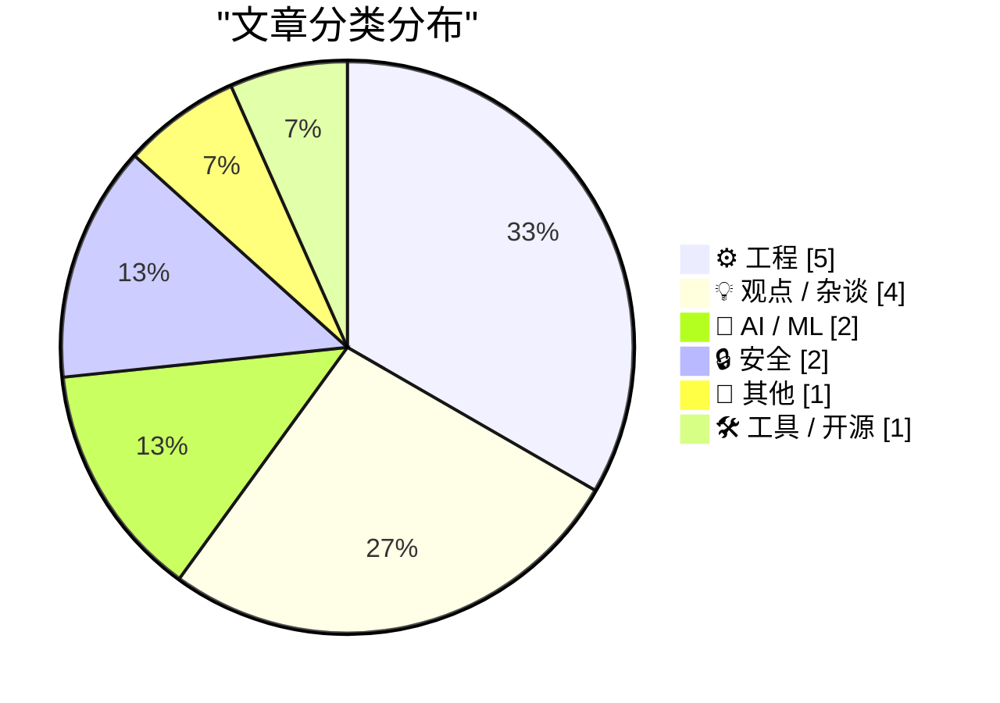
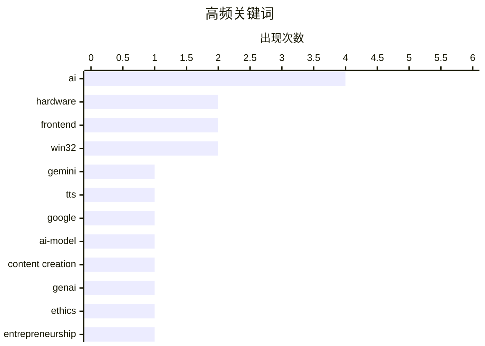

# 📰 Sep 25, 2026

> 来自 Karpathy 推荐的 92 个顶级技术博客，AI 精选 Top 15

## 📝 今日看点

今日技术圈呈现出 AI 深度重塑行业生态与硬件巨头突破物理边界的两大趋势。从 Google 升级语音合成模型到 AI 对创业教育的冲击，生成式技术正从工具层向价值判断与教育底层渗透。与此同时，Meta 智能眼镜的迭代与苹果应对物流限制的软件方案，折射出科技巨头在合规与物理限制下的创新博弈。此外，Web 预览标准的提议与底层编程规范的重申，显示出开发者社区对工程标准化与沟通效率的持续关注。

---

## 🏆 今日必读

🥇 **Gemini 3.8 TTS 体验场**

[Gemini 3.8 TTS Playground](https://simonwillison.net/2026/Sep/23/gemini-tts-playground/) — simonwillison.net · 1 天前 · 🤖 AI / ML

> Google 发布了 gemini-3.8-flash-tts 和 gemini-3.8-flash-lite-tts 两款新型文本转语音模型。这些模型内置超过 2,000 种语音库，并支持通过仅 30 秒的音频样本创建高质量的自定义语音。Simon Willison 为此开发了一个在线 Playground 工具，方便用户直接通过 API 密钥测试模型效果。该工具展示了 Gemini 在语音合成领域的高效率与个性化能力，尤其是在低延迟场景下的表现。用户可以实时调整参数并对比不同语音模型的音质差异。

💡 **为什么值得读**: 快速了解并上手体验 Google 最新的高效率、低延迟语音合成模型及其强大的自定义语音克隆功能。

🏷️ Gemini, TTS, Google, AI-model

🥈 **没错，这确实是 AI 写的**

[So yeah it was written using AI](https://berthub.eu/articles/posts/so-yeah-it-is-written-using-ai/) — berthub.eu · 19 小时前 · 💡 观点 / 杂谈

> 针对近期读者因 Pangram 等检测工具显示文章由 AI 生成而直接否定内容的现象，作者表达了深思。尽管作者本人极度反感生成式 AI 对专业领域的冲击，但他认为不应仅因创作工具而忽视文章本身的观点价值。文章探讨了在 AI 泛滥的时代，读者应如何平衡对内容质量的判断与对 AI 创作的抵触情绪。核心观点是，虽然读者有权选择不参与 AI 内容的互动，但全盘否定可能导致错失有价值的思想。作者呼吁回归对内容逻辑和深度的关注，而非仅仅纠结于生产方式。

💡 **为什么值得读**: 探讨在 AI 辅助创作普及的当下，我们应如何理性看待内容价值与创作工具之间的复杂关系。

🏷️ AI, content creation, GenAI, ethics

🥉 **AI 降临之年：创业教育将永远改变**

[The Year AI Came For Us: Teaching Entrepreneurship Will Never Be The Same](https://steveblank.com/2026/09/23/the-year-ai-came-for-us-teaching-entrepreneurship-will-never-be-the-same/) — steveblank.com · 1 天前 · 🤖 AI / ML

> 硅谷创业教育奠基人 Steve Blank 反思了 AI 对其推行 15 年之久的“精益创业实战”（Lean LaunchPad）课程的冲击。该课程目前在全球数百所大学教授并助力了数千家初创企业，但 AI 的出现正在重塑创业的底层逻辑。作者探讨了 AI 是否正在“杀死”传统的创业教学模式，以及教育者应如何调整以适应 AI 驱动的开发和市场验证节奏。结论指出，创业教学必须进化，利用 AI 增强而非取代人的判断，否则将在新时代失去意义。文章强调了在 AI 辅助下，快速原型设计和客户发现过程发生的质变。

💡 **为什么值得读**: 硅谷创业教父对 AI 如何重塑创业方法论的深度反思，是教育者和创业者的必读指南。

🏷️ AI, entrepreneurship, education, startups

---

## 📊 数据概览

| 扫描源 | 抓取文章 | 时间范围 | 精选 |
|:---:|:---:|:---:|:---:|
| 83/92 | 2546 篇 → 29 篇 | 48h | **15 篇** |

### 分类分布



### 高频关键词



<details>
<summary>📈 纯文本关键词图（终端友好）</summary>

```
ai               │ ████████████████████ 4
hardware         │ ██████████░░░░░░░░░░ 2
frontend         │ ██████████░░░░░░░░░░ 2
win32            │ ██████████░░░░░░░░░░ 2
gemini           │ █████░░░░░░░░░░░░░░░ 1
tts              │ █████░░░░░░░░░░░░░░░ 1
google           │ █████░░░░░░░░░░░░░░░ 1
ai-model         │ █████░░░░░░░░░░░░░░░ 1
content creation │ █████░░░░░░░░░░░░░░░ 1
genai            │ █████░░░░░░░░░░░░░░░ 1
```

</details>

### 🏷️ 话题标签

**ai**(4) · **hardware**(2) · **frontend**(2) · win32(2) · gemini(1) · tts(1) · google(1) · ai-model(1) · content creation(1) · genai(1) · ethics(1) · entrepreneurship(1) · education(1) · startups(1) · meta-connect(1) · keynote(1) · ar(1) · html(1) · web standards(1) · browser(1)

---

## ⚙️ 工程

### 1. 关于 HTML 提议的 previewsrc 属性的一些思考

[Some thoughts on HTML's proposed previewsrc attribute](https://shkspr.mobi/blog/2026/09/some-thoughts-on-htmls-proposed-previewsrc-attribute/) — **shkspr.mobi** · 1 天前 · ⭐ 23/30

> 微软提出了一项新的 HTML 提案，建议增加 previewsrc 属性以标准化网页内容的预览功能。目前开发者实现视频或链接预览的方法多种多样且缺乏统一标准，该提案旨在通过原生属性简化这一流程。文章分析了该属性的技术实现逻辑，以及它如何帮助浏览器在不加载完整资源的情况下显示预览内容。作者认为，这种将社区常用做法标准化的努力是 HTML 持续进化的关键体现，能有效提升页面加载性能。同时，文章也探讨了该属性在不同媒体类型中的适用性及潜在的兼容性挑战。

🏷️ HTML, web standards, frontend, browser

---

### 2. “准备发货”：巧妙解决 iPhone 18 Pro Max 电池运输限制的软件方案

[‘Prepare to Ship’ Is a Clever Software Solution That Allows iPhone 18 Pro Max to Ship With a Battery That Would Otherwise Exceed International Shipping Regulations](https://support.apple.com/en-us/127848) — **daringfireball.net** · 1 天前 · ⭐ 22/30

> iPhone 18 Pro Max 的电池容量超过了 20 瓦时（Wh），这触发了许多国家针对单电池设备严苛的国际运输安全限制。为了绕过这一物流难题，苹果开发了一套名为“准备发货”（Prepare to Ship）的创新固件方案。该方案在设备出厂运输期间通过固件将电池可用容量限制在 20 Wh 以下，从而符合运输标准。一旦用户收到并激活设备，系统会自动解锁全部电池容量，恢复超长续航表现。这种软件定义硬件的策略，巧妙地解决了高性能硬件设计与全球物流法规之间的冲突。

🏷️ iPhone, battery, regulations, hardware

---

### 3. 说真的，你需要将所有未处理的消息传递给 DefWindowProc（第二部分）

[No, really, you need to pass all unhandled messages to DefWindowProc, part 2](https://devblogs.microsoft.com/oldnewthing/20260924-00/?p=112728/) — **devblogs.microsoft.com/oldnewthing** · 21 小时前 · ⭐ 22/30

> 微软资深工程师 Raymond Chen 在其系列博客中再次强调了 Windows 窗口编程中的核心原则：必须将所有未处理的消息传递给 DefWindowProc。文章通过具体的代码示例展示了如果开发者自行拦截并丢弃某些看似无关的消息，会导致系统默认行为（如窗口拖拽、非客户区绘制）失效。这是该主题的第二部分，进一步补充了容易被开发者忽视的边缘案例和常见的错误实践。作者重申，遵循系统约定的消息处理流程是保证 Windows 应用程序稳定性和兼容性的基石。忽视这一原则往往是导致难以调试的 UI 问题的根源。

🏷️ Windows, Win32, API, programming

---

### 4. 处理 Win32 FILETIME 时，别忘了现在已有 std::chrono

[When working with Win32 FILETIME, don’t forget that you have std::chrono now](https://devblogs.microsoft.com/oldnewthing/20260923-00/?p=112726/) — **devblogs.microsoft.com/oldnewthing** · 1 天前 · ⭐ 21/30

> 在处理 Win32 API 中的 FILETIME 结构时，开发者不再需要手动编写复杂的数学公式来处理 100 纳秒间隔的转换。现代 C++ 的 std::chrono 库已内置对系统时间的良好支持，能够直接与 FILETIME 进行互操作。通过使用 std::chrono::file_clock，代码可以从繁琐的位运算和常量乘法中解脱出来，显著提升可读性并减少溢出风险。作者建议 Windows 开发者全面拥抱标准库以简化遗留 API 的时间处理逻辑。

🏷️ C++, Win32, std::chrono, FILETIME

---

### 5. 通过交互式示例深度理解 Shadow Root

[Shadow roots, explained with live examples](https://simonwillison.net/2026/Sep/23/shadow-roots/) — **simonwillison.net** · 1 天前 · ⭐ 20/30

> Simon Willison 利用 AI 工具 Fable 5.1 构建了一个交互式演示页面，旨在直观解释 CSS 中的 Shadow Root 概念。该工具通过实时代码示例展示了 Shadow DOM 如何实现样式隔离，防止外部 CSS 污染组件内部元素。用户可以动态观察“开放”与“封闭”模式的区别，以及宿主元素与影子树之间的交互逻辑。这不仅是一个前端技术教程，也是利用 AI 快速生成高质量技术教学原型的实践案例。

🏷️ shadow-dom, CSS, frontend, web-components

---

## 💡 观点 / 杂谈

### 6. 没错，这确实是 AI 写的

[So yeah it was written using AI](https://berthub.eu/articles/posts/so-yeah-it-is-written-using-ai/) — **berthub.eu** · 19 小时前 · ⭐ 24/30

> 针对近期读者因 Pangram 等检测工具显示文章由 AI 生成而直接否定内容的现象，作者表达了深思。尽管作者本人极度反感生成式 AI 对专业领域的冲击，但他认为不应仅因创作工具而忽视文章本身的观点价值。文章探讨了在 AI 泛滥的时代，读者应如何平衡对内容质量的判断与对 AI 创作的抵触情绪。核心观点是，虽然读者有权选择不参与 AI 内容的互动，但全盘否定可能导致错失有价值的思想。作者呼吁回归对内容逻辑和深度的关注，而非仅仅纠结于生产方式。

🏷️ AI, content creation, GenAI, ethics

---

### 7. 你们都应该多提问

[You should all be asking way more questions](https://seangoedecke.com/you-should-all-be-asking-way-more-questions/) — **seangoedecke.com** · 11 小时前 · ⭐ 22/30

> 作者分享了在沟通中通过高频提问来提升理解效率的经验，建议在听取解释时平均每 30 秒提问一次。这种做法虽然可能让对方感到压力，但能有效防止理解偏差并确保双方信息实时同步。文章探讨了提问作为一种主动学习策略的心理机制，指出这能强迫大脑不断处理和重构新信息。核心观点是，通过不断提问来挑战自己的理解，是掌握复杂技术概念最快的方式。作者鼓励读者克服社交尴尬，将提问视为一种职业技能来磨练。

🏷️ communication, learning, career-development, soft-skills

---

### 8. Ed Zitron 的 AI 预测记录复盘

[Ed Zitron’s AI Prediction Track Record](https://danluu.com/zitron/) — **daringfireball.net** · 18 小时前 · ⭐ 22/30

> 知名博主 Dan Luu 对评论家 Ed Zitron 关于 AI 发展的预测记录进行了详尽的证据复盘。文章列举了 Zitron 多次失准的言论，例如他在 2024 年 12 月声称生成式 AI 产品已停滞一年，以及 2026 年 1 月称模型与一年前基本无异。通过大量事实和模型迭代数据对比，Dan Luu 指出这些预测不仅在当时是错误的，而且在逻辑上存在严重的误导性。这篇“打脸文”旨在提醒读者在面对激进的 AI 怀疑论时应保持批判性思考，不要被情绪化的言论所左右。文章强调了基于客观指标而非主观感受来评价技术进步的重要性。

🏷️ AI, predictions, industry-analysis, critique

---

### 9. Joanna Stern 专访马克·扎克伯格：从元宇宙到 AI 的转型

[Joanna Stern Interviews Mark Zuckerberg](https://thenewthings.com/p/exclusive-mark-zuckerberg-interview) — **daringfireball.net** · 14 小时前 · ⭐ 21/30

> 扎克伯格在采访中回应了关于 AI 威胁论、Meta 智能眼镜隐私争议以及公司战略重心转移的核心问题。他将 Meta 从“元宇宙”向 AI 的转型类比为苹果先研发平板技术后推出 iPhone 的过程，强调两者在底层技术上具有高度一致性。针对智能眼镜被质疑为“偷窥工具”，他讨论了社交规范与硬件设计的平衡。访谈揭示了 Meta 如何通过开源 Llama 模型和集成硬件生态来构建其在 AI 时代的核心竞争力。

🏷️ Meta, Zuckerberg, AI, AR-glasses

---

## 🤖 AI / ML

### 10. Gemini 3.8 TTS 体验场

[Gemini 3.8 TTS Playground](https://simonwillison.net/2026/Sep/23/gemini-tts-playground/) — **simonwillison.net** · 1 天前 · ⭐ 24/30

> Google 发布了 gemini-3.8-flash-tts 和 gemini-3.8-flash-lite-tts 两款新型文本转语音模型。这些模型内置超过 2,000 种语音库，并支持通过仅 30 秒的音频样本创建高质量的自定义语音。Simon Willison 为此开发了一个在线 Playground 工具，方便用户直接通过 API 密钥测试模型效果。该工具展示了 Gemini 在语音合成领域的高效率与个性化能力，尤其是在低延迟场景下的表现。用户可以实时调整参数并对比不同语音模型的音质差异。

🏷️ Gemini, TTS, Google, AI-model

---

### 11. AI 降临之年：创业教育将永远改变

[The Year AI Came For Us: Teaching Entrepreneurship Will Never Be The Same](https://steveblank.com/2026/09/23/the-year-ai-came-for-us-teaching-entrepreneurship-will-never-be-the-same/) — **steveblank.com** · 1 天前 · ⭐ 24/30

> 硅谷创业教育奠基人 Steve Blank 反思了 AI 对其推行 15 年之久的“精益创业实战”（Lean LaunchPad）课程的冲击。该课程目前在全球数百所大学教授并助力了数千家初创企业，但 AI 的出现正在重塑创业的底层逻辑。作者探讨了 AI 是否正在“杀死”传统的创业教学模式，以及教育者应如何调整以适应 AI 驱动的开发和市场验证节奏。结论指出，创业教学必须进化，利用 AI 增强而非取代人的判断，否则将在新时代失去意义。文章强调了在 AI 辅助下，快速原型设计和客户发现过程发生的质变。

🏷️ AI, entrepreneurship, education, startups

---

## 🔒 安全

### 12. 欧盟地区应用追踪透明度（ATT）的变更

[Changes to App Tracking Transparency in the E.U.](https://developer.apple.com/app-store/user-privacy-and-data-use/) — **daringfireball.net** · 1 天前 · ⭐ 22/30

> 为了遵守欧盟竞争监管机构的要求，苹果在 iOS 27.2 和 iPadOS 27.2 中调整了应用追踪透明度（ATT）框架。开发者在欧盟地区现在可以选择使用另一种形式的系统提示框，以符合当地的法律合规要求。尽管提示框的形式有所变化，但获取用户追踪许可的底层技术要求和隐私准则保持不变。这一变化反映了苹果在维持其全球隐私政策与应对特定地区反垄断监管之间的复杂平衡。文章详细说明了开发者在适配新系统版本时需要注意的合规细节和技术实现差异。

🏷️ Apple, EU, privacy, ATT

---

### 13. 包管理器沙盒化现状调研

[Package Manager Sandboxing](https://nesbitt.io/2026/09/24/package-manager-sandboxing.html) — **nesbitt.io** · 1 天前 · ⭐ 22/30

> 现代包管理器在安装依赖时通常会执行任意脚本，这为供应链攻击留下了巨大隐患。文章调研了 npm、pip、Cargo 和 Go 等主流包管理器客户端的沙盒化支持情况，评估其对文件系统、网络和进程的隔离能力。目前大多数工具默认并不启用沙盒，开发者往往需要依赖 bubblewrap 或 gVisor 等外部工具进行手动加固。作者指出，包管理器急需内置更细粒度的权限控制机制，以应对日益严峻的恶意包威胁。

🏷️ package manager, sandboxing, security, supply chain

---

## 📝 其他

### 14. Meta Connect 2026 主旨演讲回顾

[Meta Connect Keynote 2026](https://www.youtube.com/watch?v=SdKFDIAGF24) — **daringfireball.net** · 15 小时前 · ⭐ 23/30

> Meta 举办了 2026 年度 Connect 主旨演讲，在 55 分钟的活动中重点发布了多款消费级硬件产品。其中包括配备摄像头的第三代 Meta 智能眼镜，以及全新的 Ray-Ban Meta Audio 音频眼镜。新款音频眼镜去掉了摄像头，仅保留麦克风和扬声器，主打更低的价格、更轻的重量和更长的续航。扎克伯格强调了这些设备在日常佩戴场景下的实用性，旨在通过细分产品线覆盖更多用户。此外，演讲还展示了 Meta 在增强现实与 AI 集成方面的最新进展。

🏷️ Meta-Connect, keynote, AR, hardware

---

## 🛠 工具 / 开源

### 15. Datasette 1.0a41 发布：引入 OpenTelemetry 与 Web 组件重构

[datasette 1.0a41](https://simonwillison.net/2026/Sep/24/datasette/) — **simonwillison.net** · 16 小时前 · ⭐ 20/30

> 数据分析工具 Datasette 发布了 1.0a41 预览版，重点引入了对 OpenTelemetry 的支持，显著增强了系统的可观测性。该版本对前端架构进行了重要优化，将所有模态对话框重构为统一的 Web Component，并同步更新了插件开发文档。开发者现在可以通过标准化的方式在 JavaScript 插件中调用模态框，提升了 UI 开发的连贯性。此外，内部遥测功能的加入为大规模部署下的性能调优提供了关键数据支持。

🏷️ datasette, opentelemetry, database, observability

---

*生成于 2026-09-25 11:37 | 扫描 83 源 → 获取 2546 篇 → 精选 15 篇*
*基于 [Hacker News Popularity Contest 2025](https://refactoringenglish.com/tools/hn-popularity/) RSS 源列表，由 [Andrej Karpathy](https://x.com/karpathy) 推荐*
