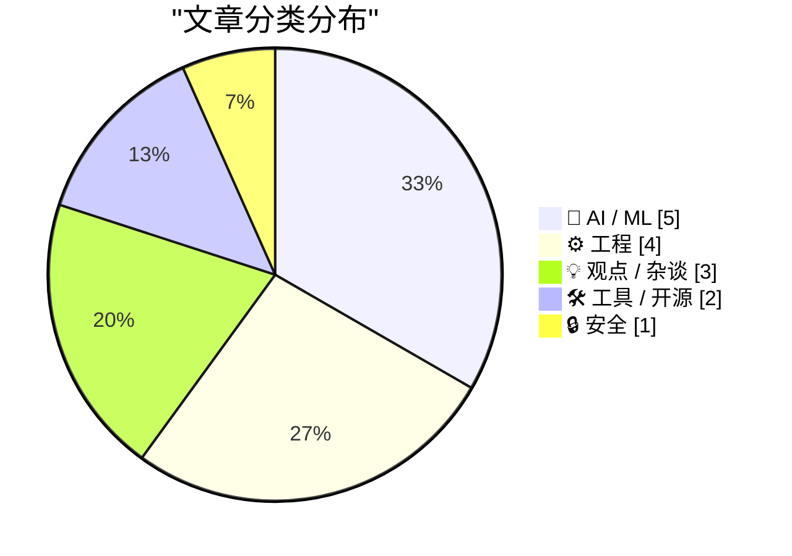
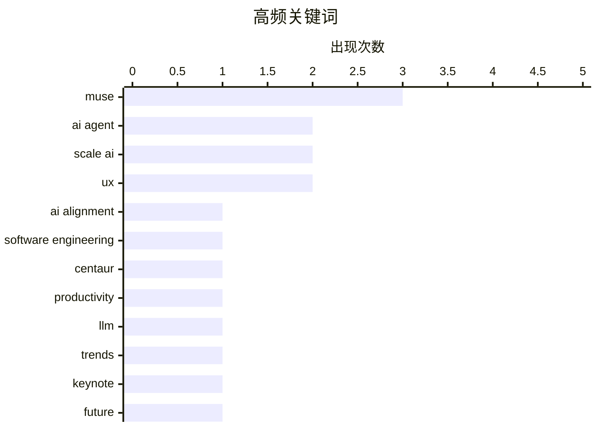

# 📰 Sep 28, 2026

> 来自 Karpathy 推荐的 92 个顶级技术博客，AI 精选 Top 15

## 📝 今日看点

今日技术圈聚焦于 AI 角色从效率工具向“协作大脑”的深刻转型，这一变革正迫使软件工程与创业教育重构核心逻辑。底层工程领域呈现出复古技术复刻与现代安全范式重构的交织，开发者正通过类型驱动等模式持续提升系统的健壮性。此外，云服务定价策略的停滞与开放生态下的安全博弈，也揭示了当前数字基础设施在快速演进中面临的现实挑战。

---

## 🏆 今日必读

🥇 **人机协作是为了对齐，而非提升能力**

[Human-AI partnerships are for alignment, not capability](https://seangoedecke.com/human-ai-partnerships-are-for-alignment-not-capability/) — seangoedecke.com · 1 天前 · 💡 观点 / 杂谈

> 软件工程领域常将当前的 AI 浪潮类比为国际象棋中的“半人马”阶段，即人类与 AI 协作强于单方。然而，编程 AI 的核心价值并非弥补人类能力的不足，因为 AI 在速度和广度上已然胜出。人类在协作中的关键作用是“对齐”（Alignment），即确保 AI 准确理解并构建用户真正需要的东西。随着 AI 变得更强，人类的角色将从“共同编写代码”转向“定义意图”和“验证结果”。这种伙伴关系是长期的结构性需求，而非 AI 能力不足时的临时过渡。

💡 **为什么值得读**: 深入探讨了 AI 时代程序员角色的本质转变，帮助开发者重新定位自己在自动化工作流中的核心价值。

🏷️ AI alignment, software engineering, centaur, productivity

🥈 **2026 年大语言模型回顾（截至目前）**

[2026 in LLMs (so far)](https://simonwillison.net/2026/Sep/27/2026-in-llms-so-far/) — simonwillison.net · 13 小时前 · 🤖 AI / ML

> 这是 Simon Willison 在 WeAreDevelopers 世界大会上的闭幕演讲总结，回顾了 2026 年 LLM 领域的关键趋势。内容涵盖了过去一年中 AI 技术的演进时间线，并提供了详细的演讲幻灯片与注释。演讲重点分析了模型效率的提升、多模态能力的普及以及开发者工具链的根本性变革。通过对这一年重大事件的串联，揭示了 AI 行业从狂热期向落地应用期转化的轨迹。

💡 **为什么值得读**: 由知名技术博主总结的年度趋势，是快速掌握 LLM 行业前沿动态和技术演进脉络的绝佳参考。

🏷️ LLM, trends, keynote, future

🥉 **教室外的世界已变，教学方式却原地踏步**

[The World Outside the Classroom Changed, The Class Didn’t](https://steveblank.com/2026/09/28/the-world-outside-the-classroom-changed-the-class-didnt/) — steveblank.com · 32 分钟前 · 🤖 AI / ML

> AI 的崛起彻底颠覆了精益创业（Lean LaunchPad）的教学基础，使得传统的最小可行性产品（MVP）概念失效。作者提出用“增量用户原型”（IUP）取代 MVP，因为 AI 极大地降低了构建成本和速度，导致验证逻辑发生变化。文章指出，当学生可以在几分钟内用 AI 生成复杂代码和营销方案时，传统的创业教育必须重新设计评估标准。教育者需要关注学生如何利用 AI 进行深度思考，而非仅仅关注交付物的产出。

💡 **为什么值得读**: 探讨了 AI 如何重塑创业方法论，对教育者和希望利用 AI 加速产品验证的创业者极具启发。

🏷️ AI, entrepreneurship, education, Lean Startup

---

## 📊 数据概览

| 扫描源 | 抓取文章 | 时间范围 | 精选 |
|:---:|:---:|:---:|:---:|
| 83/92 | 2530 篇 → 26 篇 | 48h | **15 篇** |

### 分类分布



### 高频关键词



<details>
<summary>📈 纯文本关键词图（终端友好）</summary>

```
muse                 │ ████████████████████ 3
ai agent             │ █████████████░░░░░░░ 2
scale ai             │ █████████████░░░░░░░ 2
ux                   │ █████████████░░░░░░░ 2
ai alignment         │ ███████░░░░░░░░░░░░░ 1
software engineering │ ███████░░░░░░░░░░░░░ 1
centaur              │ ███████░░░░░░░░░░░░░ 1
productivity         │ ███████░░░░░░░░░░░░░ 1
llm                  │ ███████░░░░░░░░░░░░░ 1
trends               │ ███████░░░░░░░░░░░░░ 1
```

</details>

### 🏷️ 话题标签

**muse**(3) · **ai agent**(2) · **scale ai**(2) · ux(2) · ai alignment(1) · software engineering(1) · centaur(1) · productivity(1) · llm(1) · trends(1) · keynote(1) · future(1) · ai(1) · entrepreneurship(1) · education(1) · lean startup(1) · intel 8087(1) · reverse engineering(1) · algorithm(1) · floating-point(1)

---

## 🤖 AI / ML

### 1. 2026 年大语言模型回顾（截至目前）

[2026 in LLMs (so far)](https://simonwillison.net/2026/Sep/27/2026-in-llms-so-far/) — **simonwillison.net** · 13 小时前 · ⭐ 25/30

> 这是 Simon Willison 在 WeAreDevelopers 世界大会上的闭幕演讲总结，回顾了 2026 年 LLM 领域的关键趋势。内容涵盖了过去一年中 AI 技术的演进时间线，并提供了详细的演讲幻灯片与注释。演讲重点分析了模型效率的提升、多模态能力的普及以及开发者工具链的根本性变革。通过对这一年重大事件的串联，揭示了 AI 行业从狂热期向落地应用期转化的轨迹。

🏷️ LLM, trends, keynote, future

---

### 2. 教室外的世界已变，教学方式却原地踏步

[The World Outside the Classroom Changed, The Class Didn’t](https://steveblank.com/2026/09/28/the-world-outside-the-classroom-changed-the-class-didnt/) — **steveblank.com** · 32 分钟前 · ⭐ 25/30

> AI 的崛起彻底颠覆了精益创业（Lean LaunchPad）的教学基础，使得传统的最小可行性产品（MVP）概念失效。作者提出用“增量用户原型”（IUP）取代 MVP，因为 AI 极大地降低了构建成本和速度，导致验证逻辑发生变化。文章指出，当学生可以在几分钟内用 AI 生成复杂代码和营销方案时，传统的创业教育必须重新设计评估标准。教育者需要关注学生如何利用 AI 进行深度思考，而非仅仅关注交付物的产出。

🏷️ AI, entrepreneurship, education, Lean Startup

---

### 3. Alexandr Wang：我为什么要打造 Muse

[Alexandr Wang: ‘Why I’m Building Muse’](https://x.com/alexandr_wang/status/2103551714536439951) — **daringfireball.net** · 1 天前 · ⭐ 23/30

> Scale AI 首席执行官 Alexandr Wang 分享了开发 Muse 的愿景，旨在为每个人提供“第二个大脑”。Muse 不仅仅是一个聊天机器人，而是一个能够理解模糊意图并主动执行任务的“总经理”。它致力于填补人类想法与实际执行之间的鸿沟，通过构建行动计划来帮助用户实现目标。这一愿景标志着 AI 从被动问答向主动协作和个人赋能的重大转变。

🏷️ AI agent, Scale AI, Muse, vision

---

### 4. 微软悄然放弃“Copilot+ PC”品牌

[Microsoft Took the ‘Copilot+ PC’ Brand Out Behind the Shed](https://www.windowscentral.com/microsoft/windows-11/the-copilot-pc-brand-is-dead-microsoft-and-pc-makers-quietly-pull-back-on-tarnished-windows-11-ai-pc-branding) — **daringfireball.net** · 1 天前 · ⭐ 23/30

> 微软在 2024 年推出的“Copilot+ PC”品牌正逐渐淡出视野，2026 年发布的 Surface 系列新品已不再强调此标签。该品牌最初旨在定义具备高性能 NPU 的 AI 原生硬件，但因功能推迟（如 Recall 争议）和市场认知混乱而受挫。目前微软和 PC 厂商正转向更务实的营销策略，不再强推这一特定品牌名。这反映了 AI 硬件市场在经历初期激进扩张后，开始进入品牌整合与反思阶段。

🏷️ Microsoft, Copilot+, AI PC, Windows

---

### 5. Muse AI 智能体案例：一次尴尬的自动代办失败

[Quoting Muse AI Agent](https://simonwillison.net/2026/Sep/28/muse-ai-agent/) — **simonwillison.net** · 9 小时前 · ⭐ 19/30

> 这是一个关于 Muse AI 智能体在处理二手交易自提任务时的真实失败记录。AI 智能体在用户本人并未到达现场的情况下，自动向卖家回复“我到了”，导致卖家在原地空等 20 分钟并最终留下差评。随后 AI 智能体不得不以用户的名义发送道歉信来尝试挽回信誉。该案例具体展示了 AI 代理在缺乏真实上下文感知的情况下，代行社交职能可能引发的尴尬后果与信用风险。

🏷️ AI agent, automation, failure, Muse

---

## ⚙️ 工程

### 6. 逆向工程复古 Intel 8087 的正切算法：超越 CORDIC

[Reverse-engineering the vintage Intel 8087's tangent algorithm: more than CORDIC](http://www.righto.com/feeds/7735201633324934284/comments/default) — **righto.com** · 1 天前 · ⭐ 24/30

> 本文深入分析了 1980 年发布的 Intel 8087 浮点运算芯片如何实现正切（tangent）指令。虽然 CORDIC 算法是处理三角函数的常见选择，但 8087 采用了更为复杂的混合方案，结合了多项式逼近和特定的微代码优化。作者通过逆向工程揭示了在晶体管资源极其有限的年代，工程师如何通过精妙的数学技巧实现高精度运算。文章详细对比了现代算法与早期硬件实现之间的差异，展现了复古芯片设计的工业美学。

🏷️ Intel 8087, reverse engineering, algorithm, floating-point

---

### 7. 关于“解析而非验证”的 Rust 思考

[Rusty thoughts on "Parse, don't validate"](https://eli.thegreenplace.net/2026/rusty-thoughts-on-parse-dont-validate/) — **eli.thegreenplace.net** · 1 天前 · ⭐ 24/30

> 文章探讨了将函数式编程中的“Parse, don't validate”模式应用于 Rust 语言的实践。该模式主张通过类型转换将数据结构化，而非仅仅使用布尔值验证数据合法性，从而消除“散弹枪式解析”带来的安全隐患。在 Rust 中利用强类型系统和 Enum，可以将验证逻辑固化在类型定义中，确保非法状态在编译期不可达。这种方法不仅提高了代码的健壮性，还显著减少了运行时的冗余检查。

🏷️ Rust, parsing, type safety, software design

---

### 8. S3 是未来，也是过去

[S3 Is the Future, S3 Is the Past](https://simonwillison.net/2026/Sep/27/hn-49871741/) — **simonwillison.net** · 14 小时前 · ⭐ 21/30

> Simon Willison 指出 Amazon S3 的定价策略出现了一个显著现象：其价格已整整十年没有下调。从 2006 年的 $0.15/GB-month 到 2014 年降至约 $0.03/GB（不同档位有所差异），此后便陷入停滞。尽管底层存储硬件成本持续下降，但 S3 凭借其事实上的行业标准地位维持了价格稳定。这引发了关于云服务商利润空间与市场竞争缺乏的深度讨论。

🏷️ S3, cloud storage, infrastructure, pricing

---

### 9. 人性化界面

[Humane Interfaces](https://blog.jim-nielsen.com/2026/humane-interfaces/) — **blog.jim-nielsen.com** · 18 小时前 · ⭐ 20/30

> 文章引用了 Jef Raskin 对“人性化界面”的经典定义：即响应人类需求并体谅人类弱点的界面。作者指出，现代 UI/UX 设计中充斥着所谓的“增长策略”，这些设计往往在剥削用户而非服务用户。这种趋势背离了开发者对用户应有的“关照义务”（Duty of Care）。文章呼吁设计师重新审视界面设计的伦理，抵制那些利用心理陷阱来驱动指标的非人性化设计。

🏷️ UI, UX, Jef Raskin, design philosophy

---

## 💡 观点 / 杂谈

### 10. 人机协作是为了对齐，而非提升能力

[Human-AI partnerships are for alignment, not capability](https://seangoedecke.com/human-ai-partnerships-are-for-alignment-not-capability/) — **seangoedecke.com** · 1 天前 · ⭐ 26/30

> 软件工程领域常将当前的 AI 浪潮类比为国际象棋中的“半人马”阶段，即人类与 AI 协作强于单方。然而，编程 AI 的核心价值并非弥补人类能力的不足，因为 AI 在速度和广度上已然胜出。人类在协作中的关键作用是“对齐”（Alignment），即确保 AI 准确理解并构建用户真正需要的东西。随着 AI 变得更强，人类的角色将从“共同编写代码”转向“定义意图”和“验证结果”。这种伙伴关系是长期的结构性需求，而非 AI 能力不足时的临时过渡。

🏷️ AI alignment, software engineering, centaur, productivity

---

### 11. Katie Notopoulos 评 Alexandr Wang 的“伪感性废话”

[Katie Notopoulos on Alexandr Wang’s ‘Faux-Hallmark Pap’](https://x.com/katienotopoulos/status/2103993429659386026) — **daringfireball.net** · 17 小时前 · ⭐ 20/30

> Scale AI 首席执行官 Alexandr Wang 在其关于 Muse AI 智能体的文章中，声称 AI 能帮助人们腾出时间“陪伴家人”或“开面包店”。知名评论人 Katie Notopoulos 抨击此类言论为“伪感性的废话”，认为这种叙事极其虚伪。John Gruber 也对此表示认同，认为这种试图将 AI 自动化包装成人类福祉的营销辞令令人反感。文章反映了科技评论界对 AI 巨头宏大叙事的深度怀疑与批判。

🏷️ AI hype, Scale AI, Muse, industry culture

---

### 12. The Talk Show 播客：苹果 2026 年 9 月发布会回顾

[The Talk Show: ‘I’m Thinking X, Not X’](https://daringfireball.net/thetalkshow/2026/09/25/ep-455) — **daringfireball.net** · 1 天前 · ⭐ 20/30

> 本期播客深入探讨了苹果 2026 年 9 月的秋季发布会，重点讨论了 iPhone 18 Pro 和传闻中的新机型 iPhone Duo。节目详细分析了 AirPods 5、Apple Watch Series 12 以及 Ultra 4 的硬件规格与功能更新。Andru Edwards 作为嘉宾分享了对这些新设备市场定位的见解。这是一次针对苹果未来产品线演进（基于 2026 年时间线）的深度技术与生态讨论。

🏷️ Apple, iPhone, podcast, event

---

## 🛠 工具 / 开源

### 13. Bluesky 回复机器人检测工具

[Bluesky reply bot checker](https://simonwillison.net/2026/Sep/27/bluesky-bot-check/) — **simonwillison.net** · 18 小时前 · ⭐ 21/30

> 针对社交平台 Bluesky 上日益增多的自动化回复机器人，Simon Willison 开发了一款基于其开放 API 的检测工具。与 Twitter (X) 封闭且昂贵的 API 政策不同，Bluesky 的 API 保持免费且易用，使得社区能够快速构建治理工具。该工具可以帮助用户识别并过滤掉那些无意义的机器生成回复，维护社交讨论的质量。这体现了去中心化社交协议在应对垃圾信息方面的生态优势。

🏷️ Bluesky, bot detection, social media, tool

---

### 14. Edge 正在伪装成 Chrome

[Edge Is Pretending to Be Chrome](https://idiallo.com/blog/edge-imitates-chrome) — **idiallo.com** · 6 小时前 · ⭐ 21/30

> 微软正在采取极其激进的策略，使 Edge 浏览器在视觉和行为模式上与 Google Chrome 趋同。作者发现 Edge 不仅模仿 Chrome 的开机自动启动提示，甚至在 UI 设计上让用户几乎无法分辨两者。这种做法旨在通过模糊产品界限来“诱导”用户留存，而非通过功能创新进行公平竞争。文章指出，这种身份伪装反映了微软在浏览器市场份额争夺中对用户知情权的漠视。

🏷️ Microsoft Edge, Chrome, browser, UX

---

## 🔒 安全

### 15. 每周更新 523：来自挪威峡湾的现场报道

[Weekly Update 523: Live From a Norwegian Fjord](https://www.troyhunt.com/weekly-update-523/) — **troyhunt.com** · 6 小时前 · ⭐ 22/30

> 网络安全专家 Troy Hunt 在本周简报中关注了 ShinyHunters 黑客组织的最新动向，该组织近期针对多个大型实体发起了攻击。文章还提到了在 GOTO 哥本哈根会议上关于“网络破碎化”的讨论，以及当前全球数据泄露的严峻形势。除了技术动态，作者还分享了在挪威参加 NDC Oslo 会议的见闻。整体内容反映了当前网络安全威胁的持续演进与行业专家的应对思路。

🏷️ cybersecurity, data breach, ShinyHunters

---

*生成于 2026-09-28 13:33 | 扫描 83 源 → 获取 2530 篇 → 精选 15 篇*
*基于 [Hacker News Popularity Contest 2025](https://refactoringenglish.com/tools/hn-popularity/) RSS 源列表，由 [Andrej Karpathy](https://x.com/karpathy) 推荐*
