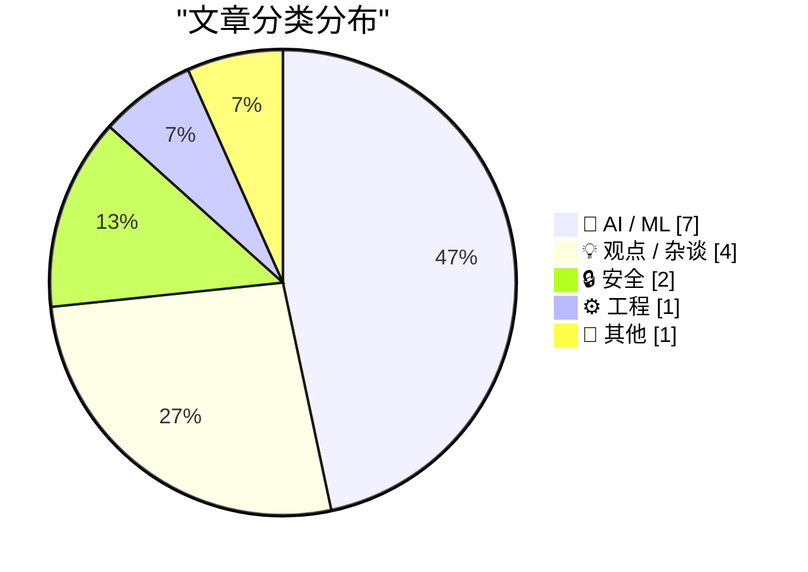
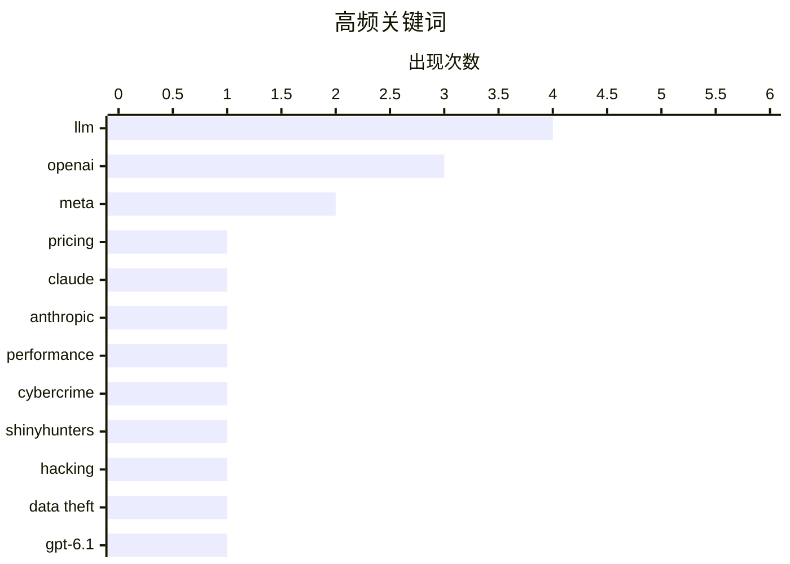

# 📰 Sep 30, 2026

> 来自 Karpathy 推荐的 92 个顶级技术博客，AI 精选 Top 15

## 📝 今日看点

生成式 AI 市场正陷入激烈的价格战，OpenAI 与 Anthropic 纷纷通过大幅降价与提升效能比来争夺市场，标志着行业重心正从纯技术竞赛转向商业效率的极致对决。与此同时，AI 巨头面临的财务困局与算力成本矛盾日益凸显，引发了市场对行业泡沫与可持续性的深度反思。此外，AI 在网络安全攻防中的双刃剑效应以及对传统教育与创业模式的颠覆性冲击，也成为今日技术圈关注的焦点。

---

## 🏆 今日必读

🥇 **AI 利润崩塌正在加速**

[The AI margin collapse is gathering pace](https://martinalderson.com/posts/ai-margin-collapse-gathering-pace/?utm_source=rss&amp;utm_medium=rss&amp;utm_campaign=feed) — martinalderson.com · 1 天前 · 🤖 AI / ML

> 生成式 AI 市场正陷入激烈的价格战，各大厂商利润空间迅速收窄。OpenAI 在两个月内将 Luna 模型价格下调了 90%，Anthropic 也开始降低其旗舰模型 Opus 的售价。DeepSeek 凭借缓存输入（cached input）技术在成本控制上依然保持领先地位。这种趋势迫使前沿实验室必须在模型性能与运营效率之间寻找新的平衡点。这标志着 AI 行业已从单纯的技术竞赛转向残酷的商业生存战。

💡 **为什么值得读**: 揭示了 AI 行业从技术竞争转向价格战的现状，对理解大模型商业模式的演变至关重要。

🏷️ LLM, pricing, OpenAI

🥈 **Anthropic 发布 Claude Sonnet 5.5：速度提升 30% 且价格更低**

[Claude Sonnet 5.5](https://simonwillison.net/2026/Sep/28/claude-sonnet-5-5/) — simonwillison.net · 1 天前 · 🤖 AI / ML

> Anthropic 正式推出了 Claude Sonnet 5.5 模型，旨在全面超越前代产品。该模型在保持与 Sonnet 5 相同定价的基础上，运行速度提升了 30% 以上，且在大多数任务中成本降低了约 30%。基准测试显示，Sonnet 5.5 在各项指标上均优于前代，提供了更高的性价比。开发者现在可以以更低的延迟和支出获得更强大的推理能力。这一更新进一步加剧了中端性能模型市场的竞争。

💡 **为什么值得读**: 关注 Claude 系列演进的开发者必读，了解目前性价比最高的生产力模型更新。

🏷️ Claude, Anthropic, LLM, performance

🥉 **荷兰警方在 ShinyHunters 调查中逮捕一名“改过自新”的黑客**

[Dutch Police Arrest ‘Reformed’ Hacker in Shiny Hunters Investigation](https://krebsonsecurity.com/2026/09/dutch-police-arrest-reformed-hacker-in-shiny-hunters-investigation/) — krebsonsecurity.com · 1 天前 · 🔒 安全

> 荷兰当局逮捕了一名 23 岁的已定罪网络罪犯，指控其协助臭名昭著的 ShinyHunters 黑客组织进行数据窃取和勒索。在该嫌疑人被捕后的几天内，ShinyHunters 成员反而变本加厉地发起了攻击。该组织窃取了 FBI 的高度敏感数据，并对俄罗斯勒索软件组织 Cl0p 实施了反向勒索。这起案件揭示了网络犯罪团伙在核心成员受挫后表现出的极强报复性。执法行动与黑客反击的交织使得该案件成为网络安全领域的焦点。

💡 **为什么值得读**: 深入了解顶级黑客组织与执法部门之间的博弈，以及网络犯罪圈内部的“黑吃黑”现象。

🏷️ cybercrime, ShinyHunters, hacking, data theft

---

## 📊 数据概览

| 扫描源 | 抓取文章 | 时间范围 | 精选 |
|:---:|:---:|:---:|:---:|
| 82/92 | 2313 篇 → 35 篇 | 48h | **15 篇** |

### 分类分布



### 高频关键词



<details>
<summary>📈 纯文本关键词图（终端友好）</summary>

```
llm          │ ████████████████████ 4
openai       │ ███████████████░░░░░ 3
meta         │ ██████████░░░░░░░░░░ 2
pricing      │ █████░░░░░░░░░░░░░░░ 1
claude       │ █████░░░░░░░░░░░░░░░ 1
anthropic    │ █████░░░░░░░░░░░░░░░ 1
performance  │ █████░░░░░░░░░░░░░░░ 1
cybercrime   │ █████░░░░░░░░░░░░░░░ 1
shinyhunters │ █████░░░░░░░░░░░░░░░ 1
hacking      │ █████░░░░░░░░░░░░░░░ 1
```

</details>

### 🏷️ 话题标签

**llm**(4) · **openai**(3) · **meta**(2) · pricing(1) · claude(1) · anthropic(1) · performance(1) · cybercrime(1) · shinyhunters(1) · hacking(1) · data theft(1) · gpt-6.1(1) · benchmark(1) · ai economy(1) · nvidia(1) · tech bubble(1) · venture capital(1) · ai safety(1) · red teaming(1) · cybersecurity(1)

---

## 🤖 AI / ML

### 1. AI 利润崩塌正在加速

[The AI margin collapse is gathering pace](https://martinalderson.com/posts/ai-margin-collapse-gathering-pace/?utm_source=rss&amp;utm_medium=rss&amp;utm_campaign=feed) — **martinalderson.com** · 1 天前 · ⭐ 27/30

> 生成式 AI 市场正陷入激烈的价格战，各大厂商利润空间迅速收窄。OpenAI 在两个月内将 Luna 模型价格下调了 90%，Anthropic 也开始降低其旗舰模型 Opus 的售价。DeepSeek 凭借缓存输入（cached input）技术在成本控制上依然保持领先地位。这种趋势迫使前沿实验室必须在模型性能与运营效率之间寻找新的平衡点。这标志着 AI 行业已从单纯的技术竞赛转向残酷的商业生存战。

🏷️ LLM, pricing, OpenAI

---

### 2. Anthropic 发布 Claude Sonnet 5.5：速度提升 30% 且价格更低

[Claude Sonnet 5.5](https://simonwillison.net/2026/Sep/28/claude-sonnet-5-5/) — **simonwillison.net** · 1 天前 · ⭐ 26/30

> Anthropic 正式推出了 Claude Sonnet 5.5 模型，旨在全面超越前代产品。该模型在保持与 Sonnet 5 相同定价的基础上，运行速度提升了 30% 以上，且在大多数任务中成本降低了约 30%。基准测试显示，Sonnet 5.5 在各项指标上均优于前代，提供了更高的性价比。开发者现在可以以更低的延迟和支出获得更强大的推理能力。这一更新进一步加剧了中端性能模型市场的竞争。

🏷️ Claude, Anthropic, LLM, performance

---

### 3. GPT 6.1 Sol 发布：以五分之一的价格提供接近 Astra 的智能

[GPT 6.1 Sol: Near-Astra intelligence for a fifth of the price](https://simonwillison.net/2026/Sep/29/hn-49898129/) — **simonwillison.net** · 17 小时前 · ⭐ 25/30

> OpenAI 在 2026 年开发者大会上发布了 GPT 6.1 Sol 模型，主打极致的效能比。该模型在智能水平上接近顶级的 Astra 模型，但使用成本仅为后者的 20%。Simon Willison 通过现场博客记录了这一发布过程，并展示了该模型在处理复杂任务（如 SVG 渲染）时的表现。这一举措标志着 OpenAI 正在通过模型蒸馏和优化，将顶级智能推向大规模平价应用。开发者现在可以利用该模型在预算有限的情况下实现复杂的 AI 功能。

🏷️ GPT-6.1, LLM, benchmark, OpenAI

---

### 4. Anthropic 红队报告：GLM-5.3 与高级网络攻击能力的扩散

[Quoting Anthropic Frontier Red Team](https://simonwillison.net/2026/Sep/29/anthropic-frontier-red-team/) — **simonwillison.net** · 14 小时前 · ⭐ 24/30

> Anthropic 红队对多个模型在二进制漏洞利用（Binary Exploitation）基准测试中的表现进行了评估。测试发现，GLM-5.3 在 4% 的试验中成功实现了完整的控制流劫持，而 Claude Mythos Preview 的成功率为 6%。相比之下，早期的 Claude Opus 4.6 和 GLM-5.2 均未能完成此类任务。这表明 AI 模型在网络安全攻防能力上已经跨越了一个关键门槛，具备了实际的漏洞利用潜力。报告呼吁业界必须警惕高级网络攻击能力的平民化风险。

🏷️ AI safety, red teaming, cybersecurity, LLM

---

### 5. OpenAI 2026 开发者大会现场实录

[OpenAI DevDay 2026 live blog](https://simonwillison.net/2026/Sep/29/openai-devday-2026-live-blog/) — **simonwillison.net** · 20 小时前 · ⭐ 24/30

> Simon Willison 在旧金山现场直播了 OpenAI 2026 年开发者大会的主题演讲。文章实时记录了 OpenAI 发布的一系列新工具、模型更新以及针对开发者的 API 改进。作为受邀的“创作者”，作者提供了第一手的现场观察和技术细节解读。这是了解 OpenAI 年度战略走向和技术路线图的最直接渠道。文章还包含了对新发布功能在实际开发场景中应用前景的初步评估。

🏷️ OpenAI, DevDay, live blog, AI ecosystem

---

### 6. 教室外的世界已变，教学模式却固步自封

[The World Outside the Classroom Changed, The Class Didn’t](https://steveblank.com/2026/09/28/the-world-outside-the-classroom-changed-the-class-didnt/) — **steveblank.com** · 1 天前 · ⭐ 24/30

> 硅谷创业教父 Steve Blank 探讨了 AI 对其经典的 Lean LaunchPad 课程带来的冲击。他指出 AI 已经彻底改变了创业流程，甚至宣告了传统最小可行性产品（MVP）的终结，取而代之的是“智能可用产品”（IUP）。文章反思了教育体系在面对技术剧变时的滞后性，并提出了如何调整教学以适应 AI 驱动的创业环境。这不仅是对教育者的警示，也是对现代创业方法论的重构。作者强调，教学必须跟上工具进化的步伐。

🏷️ AI, entrepreneurship, education

---

### 7. 使用视觉语言模型（VLM）增强图标库元数据

[VLM Enhanced Metadata For My Icon Galleries](https://blog.jim-nielsen.com/2026/icon-galleries-vlm/) — **blog.jim-nielsen.com** · 17 小时前 · ⭐ 23/30

> 为图标库实现“作品级搜索”面临手动标记工作量巨大的难题，作者尝试利用视觉语言模型（VLM）自动化这一过程。通过调用 Llama 3.2 Vision 等模型，系统能够自动识别图标中的颜色、形状、具体物体（如咖啡豆、蒸汽）以及艺术风格。这种方案将非结构化的图像信息转化为详尽的文本描述，极大地提升了搜索的召回率，使用户能通过“coffee”等关键词精准定位图标。实验证明，本地运行的 VLM 是处理长尾图像元数据标注的高效工具。视觉模型正从单纯的聊天工具转向实用的自动化数据处理流水线。

🏷️ VLM, metadata, image search, AI application

---

## 💡 观点 / 杂谈

### 8. 沉没的资金：AI 巨头的财务困局

[Dead Money](https://www.wheresyoured.at/dead-money/) — **wheresyoured.at** · 20 小时前 · ⭐ 25/30

> 本文深入分析了 NVIDIA、Anthropic 和 OpenAI 等 AI 巨头面临的财务挑战与市场泡沫风险。作者探讨了在巨额资本投入下，AI 公司如何应对收入增长与高昂算力成本之间的矛盾。文章指出，尽管技术在进步，但商业模式的不可持续性可能导致大量“死钱”滞留在该领域。这为投资者和行业观察者提供了一个审视 AI 热潮背后财务真相的冷峻视角。作者认为，当前的投入产出比正面临严峻考验。

🏷️ AI economy, NVIDIA, tech bubble, venture capital

---

### 9. 谷歌搜索什么时候变得这么离谱了？

[‘When Did Google Get So F-Ing Weird?’](https://sancho.bearblog.dev/google-weird/) — **daringfireball.net** · 1 天前 · ⭐ 23/30

> 本文探讨了谷歌搜索质量日益下降以及用户体验变得“诡异”的现象。作者分享了一个简单的搜索请求却得到荒谬结果的经历，并将其与付费搜索引擎 Kagi 的精准表现进行了对比。文章反映了用户对主流搜索引擎充斥广告和低质量 AI 生成内容的普遍不满。这种趋势正在促使核心用户群体转向更纯粹、以结果为导向的替代方案。搜索巨头的地位正因为产品核心价值的流失而受到动摇。

🏷️ Google Search, Kagi, search quality, SEO

---

### 10. Jeremy Stern 为 Colossus 撰写的马克·扎克伯格人物特写

[Jeremy Stern’s Profile of Mark Zuckerberg for Colossus](https://colossus.com/article/mark-zuckerberg-profile/) — **daringfireball.net** · 1 天前 · ⭐ 22/30

> 这篇深度特写探讨了马克·扎克伯格在 Meta 转型期的领导风格与战略意图。文章对比了竞争对手和投资者眼中 Meta 内部的“混乱”与扎克伯格本人对 AI 及硬件（Reality Labs）的坚定投入。扎克伯格正试图摆脱社交媒体时代的负面遗产，通过掌控下一代计算平台来重塑个人声誉。文中揭示了 Meta 内部动力正从早期的使命驱动转向更具雇佣兵色彩的利益驱动，同时记录了扎克伯格在硅谷权力版图中的角色演变。最终，作者呈现了一个在质疑声中试图通过技术霸权实现自我救赎的 CEO 形象。

🏷️ Mark Zuckerberg, Meta, leadership

---

### 11. 脸书的欺骗套路

[The Facebook Fake-out](https://anildash.com/2026/09/29/facebook-fake-out/) — **anildash.com** · 1 天前 · ⭐ 22/30

> Meta（原 Facebook）多年来在应对监管、政策和舆论时遵循着一套高度可预测的欺骗模式。该模式通常以忽视问题开始，在被曝光后进行道歉，随后承诺通过技术手段修复，最后通过转向新概念（如元宇宙或 AI）来转移公众注意力并重置监管时钟。作者指出，这种策略在缅甸罗兴亚人事件等重大社会危机中被反复使用，旨在通过战术性延迟规避真正的问责。文章警告政策制定者和记者不要再被 Meta 的公关辞令所迷惑。核心观点认为，Meta 的所有改变都是为了维持现状，而非承担社会责任。

🏷️ Meta, big tech, regulation

---

## 🔒 安全

### 12. 荷兰警方在 ShinyHunters 调查中逮捕一名“改过自新”的黑客

[Dutch Police Arrest ‘Reformed’ Hacker in Shiny Hunters Investigation](https://krebsonsecurity.com/2026/09/dutch-police-arrest-reformed-hacker-in-shiny-hunters-investigation/) — **krebsonsecurity.com** · 1 天前 · ⭐ 26/30

> 荷兰当局逮捕了一名 23 岁的已定罪网络罪犯，指控其协助臭名昭著的 ShinyHunters 黑客组织进行数据窃取和勒索。在该嫌疑人被捕后的几天内，ShinyHunters 成员反而变本加厉地发起了攻击。该组织窃取了 FBI 的高度敏感数据，并对俄罗斯勒索软件组织 Cl0p 实施了反向勒索。这起案件揭示了网络犯罪团伙在核心成员受挫后表现出的极强报复性。执法行动与黑客反击的交织使得该案件成为网络安全领域的焦点。

🏷️ cybercrime, ShinyHunters, hacking, data theft

---

### 13. 为什么“失窃设备保护”让密码更安全

[Why Stolen Device Protection Makes Passwords Safer](https://sixcolors.com/post/2026/09/stolen-device-protection-passwords-glenn/) — **daringfireball.net** · 1 天前 · ⭐ 21/30

> iOS 的“失窃设备保护”功能通过引入“安全延迟”机制，显著提升了用户数字资产的安全性。当设备处于非熟悉地点时，修改 Apple 账户密码或 Face ID 等敏感操作需要等待一小时并进行二次生物识别验证。这一机制有效防止了窃贼在窥探到锁屏密码后，立即修改账户权限并将原主人彻底锁死在系统之外。虽然这在某些场景下会带来一小时的等待不便，但它为用户找回设备或远程锁定账户争取了关键的缓冲时间。作者强调，这种微小的便利牺牲是保护个人隐私和财产的必要代价。开启此功能是目前 iPhone 用户防范“肩膀窥视”攻击最有效的手段。

🏷️ iOS, security, authentication

---

## ⚙️ 工程

### 14. Deser：重新思考 Rust 的序列化机制

[Deser: Rethinking Rust Serialization](https://lucumr.pocoo.org/2026/9/29/deser/) — **lucumr.pocoo.org** · 1 天前 · ⭐ 24/30

> Deser 是一个为 Rust 语言设计的实验性序列化库，旨在解决现有 Serde 框架在某些复杂场景下的局限性。它引入了一种新的模型，允许更灵活地处理非结构化数据，例如将“数字”视为“映射”的特殊情况。该项目探索了如何通过不同的抽象层来提高序列化的可扩展性和类型安全性。对于需要处理极端复杂数据格式或对性能有特殊要求的 Rust 开发者来说，这是一个极具启发性的尝试。作者通过重新思考底层逻辑，试图打破现有序列化范式的束缚。

🏷️ Rust, serialization, Deser, API design

---

## 📝 其他

### 15. 关于苹果十月发布会预测的后续跟进

[Follow-Up on my Spitballed Predictions for Apple’s October](https://daringfireball.net/2026/09/spitballing_predictions_for_apples_october) — **daringfireball.net** · 21 小时前 · ⭐ 21/30

> 针对苹果即将到来的十月新品发布季，资深观察家 John Gruber 探讨了不同硬件产品的发布形式。对于传闻中的 M4 芯片 MacBook Pro，由于涉及核心架构升级，预计将通过正式发布会或高规格视频展示。而对于 Apple TV 等规格微调产品，苹果更有可能直接通过 Newsroom 新闻稿形式发布。文章还分析了 iPad mini 更新的可能性，认为其发布节奏将取决于库存积压情况和供应链准备程度。作者认为苹果正在平衡高调的芯片转型宣传与低调的常规硬件迭代。这种分层发布策略旨在最大化市场关注度并优化营销资源分配。

🏷️ Apple, hardware, Mac, iPad

---

*生成于 2026-09-30 12:20 | 扫描 82 源 → 获取 2313 篇 → 精选 15 篇*
*基于 [Hacker News Popularity Contest 2025](https://refactoringenglish.com/tools/hn-popularity/) RSS 源列表，由 [Andrej Karpathy](https://x.com/karpathy) 推荐*
