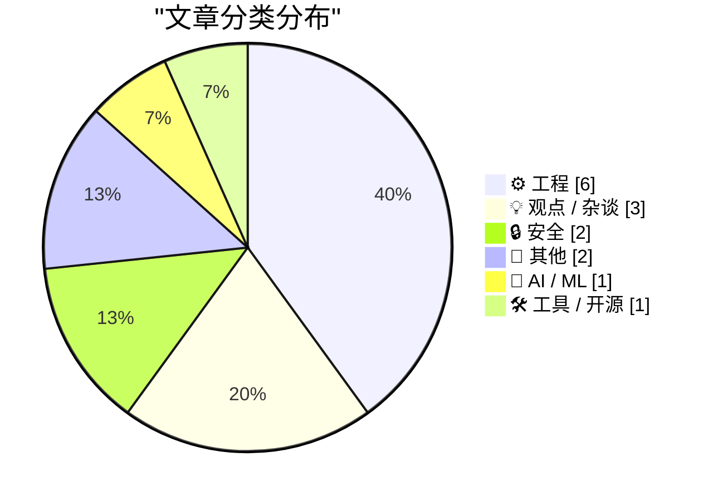
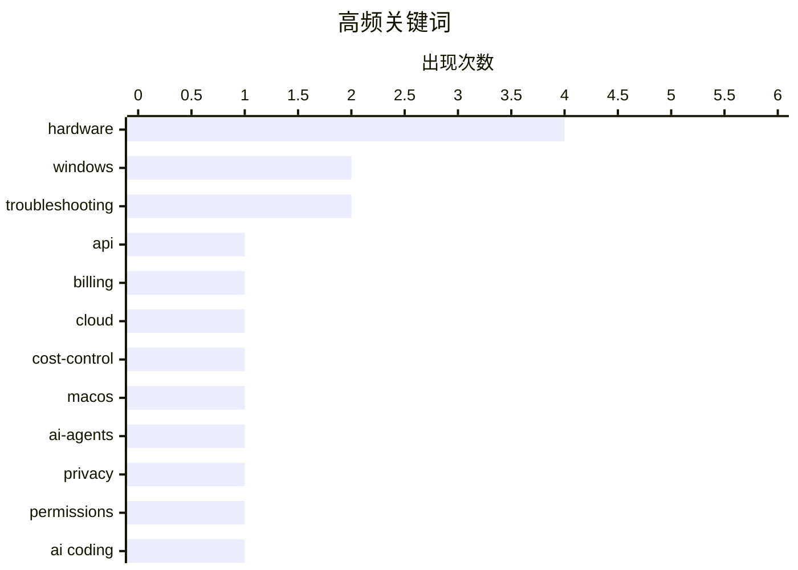

# 📰 Oct 4, 2026

> 来自 Karpathy 推荐的 92 个顶级技术博客，AI 精选 Top 15

## 📝 今日看点

今日技术圈的核心在于 AI 代理从效率工具向生产力闭环的演进，开发者正通过结构化工作流与硬性预算机制平衡 AI 的产出与成本。与此同时，AI 爆发带来的隐私风险与物理资源消耗引发了行业深思，苹果等巨头正通过收紧系统权限来应对失控的智能代理。此外，底层基础设施的安全性与硬件架构的局限性依然是不可忽视的挑战，从包管理投毒到跨架构热补丁技术，技术稳健性仍是创新的基石。

---

## 🏆 今日必读

🥇 **我们几乎对所有事物都需要默认的硬性预算上限**

[We're going to need default hard budget caps on pretty much everything](https://simonwillison.net/2026/Oct/3/default-hard-budget-caps/) — simonwillison.net · 12 小时前 · ⚙️ 工程

> 随着按需付费 API 和 AI 代理（Coding Agents）的普及，防止意外高额账单已成为开发者的核心诉求。文章主张所有按量计费服务必须提供“硬性预算上限”（Hard Budget Caps），即达到设定金额后立即切断服务并返回错误，而非仅发送邮件提醒的“软上限”。AI 代理在循环中可能因逻辑错误或失控在短时间内消耗数千美元，这使得默认开启的硬性限制成为安全底线。开发者不应再依赖用户的谨慎，而应由平台方将预算控制作为核心产品功能来构建。这种机制能有效防止因代码漏洞或黑客攻击导致的财务灾难。

💡 **为什么值得读**: 在 AI 代理可能导致“一夜破产”的时代，理解并倡导硬性预算控制是每个开发者和架构师的必修课。

🏷️ API, billing, cloud, cost-control

🥈 **苹果将进一步收紧 macOS 全磁盘访问权限，以应对失控的智能代理应用**

[★ Apple Is Going to Further Tighten the Screws on Full Disk Access on MacOS, in Response to Agentic AI Apps Running Amok](https://daringfireball.net/2026/10/apple_full_disk_access) — daringfireball.net · 1 天前 · 🔒 安全

> 针对日益增多的 Agentic AI（智能代理）应用可能带来的隐私风险，苹果计划在 macOS 中进一步限制“全磁盘访问”权限。这一举措旨在防止 AI 应用在未经明确许可的情况下扫描、索引或篡改用户敏感文件。虽然此举提升了安全性，但引发了对高级用户（Power Users）操作便利性的担忧，因为更严苛的权限弹窗可能阻碍合法的自动化流程。作者担心苹果在追求极致安全的过程中，可能会削弱 macOS 作为开放平台的灵活性。这种变化反映了操作系统在 AI 时代对“自主权”与“安全性”权衡的重新思考。

💡 **为什么值得读**: 了解 macOS 权限系统的最新演进方向，以及 AI 浪潮如何迫使操作系统重构安全边界。

🏷️ macOS, AI-agents, privacy, permissions

🥉 **大脑三明治：一种实用的 AI 编程工作流**

[The Brain Sandwich](https://terriblesoftware.org/2026/10/02/the-brain-sandwich/) — terriblesoftware.org · 1 天前 · 🤖 AI / ML

> “大脑三明治”提出了一种将人类智慧与 AI 能力结合的结构化编程模式。该流程分为三个阶段：首先由人类深度理解问题并制定策略，中间层由 AI 代理执行具体的代码编写，最后再由人类进行严格的代码验证和逻辑解释。这种方法强调人类必须作为流程的“面包片”包裹住 AI，以确保生成的代码不仅能运行，而且是可维护且被理解的。通过这种方式，开发者可以利用 AI 的速度，同时避免因盲目信任 AI 而引入的技术债。这种工作流将 AI 定位为执行者而非决策者，确保了最终交付物的质量。

💡 **为什么值得读**: 提供了一套可落地的 AI 辅助编程方法论，帮助开发者在提升效率的同时保持对代码的掌控力。

🏷️ AI coding, workflow, LLM, productivity

---

## 📊 数据概览

| 扫描源 | 抓取文章 | 时间范围 | 精选 |
|:---:|:---:|:---:|:---:|
| 81/92 | 2284 篇 → 20 篇 | 48h | **15 篇** |

### 分类分布



### 高频关键词



<details>
<summary>📈 纯文本关键词图（终端友好）</summary>

```
hardware        │ ████████████████████ 4
windows         │ ██████████░░░░░░░░░░ 2
troubleshooting │ ██████████░░░░░░░░░░ 2
api             │ █████░░░░░░░░░░░░░░░ 1
billing         │ █████░░░░░░░░░░░░░░░ 1
cloud           │ █████░░░░░░░░░░░░░░░ 1
cost-control    │ █████░░░░░░░░░░░░░░░ 1
macos           │ █████░░░░░░░░░░░░░░░ 1
ai-agents       │ █████░░░░░░░░░░░░░░░ 1
privacy         │ █████░░░░░░░░░░░░░░░ 1
```

</details>

### 🏷️ 话题标签

**hardware**(4) · **windows**(2) · **troubleshooting**(2) · api(1) · billing(1) · cloud(1) · cost-control(1) · macos(1) · ai-agents(1) · privacy(1) · permissions(1) · ai coding(1) · workflow(1) · llm(1) · productivity(1) · cybersecurity(1) · data breach(1) · law enforcement(1) · ai(1) · economy(1)

---

## ⚙️ 工程

### 1. 我们几乎对所有事物都需要默认的硬性预算上限

[We're going to need default hard budget caps on pretty much everything](https://simonwillison.net/2026/Oct/3/default-hard-budget-caps/) — **simonwillison.net** · 12 小时前 · ⭐ 26/30

> 随着按需付费 API 和 AI 代理（Coding Agents）的普及，防止意外高额账单已成为开发者的核心诉求。文章主张所有按量计费服务必须提供“硬性预算上限”（Hard Budget Caps），即达到设定金额后立即切断服务并返回错误，而非仅发送邮件提醒的“软上限”。AI 代理在循环中可能因逻辑错误或失控在短时间内消耗数千美元，这使得默认开启的硬性限制成为安全底线。开发者不应再依赖用户的谨慎，而应由平台方将预算控制作为核心产品功能来构建。这种机制能有效防止因代码漏洞或黑客攻击导致的财务灾难。

🏷️ API, billing, cloud, cost-control

---

### 2. 为什么 Windows 的热补丁支持不涵盖 32 位 ARM 和 MIPS 等架构？

[Why is there no Windows hot-patching support for other architectures like 32-bit ARM and MIPS?](https://devblogs.microsoft.com/oldnewthing/20261002-00/?p=112753/) — **devblogs.microsoft.com/oldnewthing** · 1 天前 · ⭐ 23/30

> 微软开发者解释了 Windows 热补丁（Hot-patching）技术在不同处理器架构上的支持差异。热补丁要求在函数开头预留特定的指令空间（如 x86 上的 2 字节短跳转空间），以便在不重启的情况下重定向执行流。32 位 ARM 和 MIPS 等架构要么在热补丁技术成熟前就已逐渐退出主流 Windows 支持，要么其指令集特性使得实现此类无缝跳转的成本过高。最终，微软选择将资源集中在需求最旺盛的 x64 和现代架构上，而放弃了对老旧或非主流架构的复杂改造。这揭示了操作系统功能实现与底层硬件架构之间的深层绑定关系。

🏷️ Windows, kernel, hot-patching, architecture

---

### 3. 包管理周报：2026 年 10 月 3 日

[This Week in Package Management: 3 October 2026](https://nesbitt.io/2026/10/03/this-week-in-package-management.html) — **nesbitt.io** · 1 天前 · ⭐ 21/30

> 本周包管理领域聚焦于多个主流生态系统的安全更新和版本发布。报告涵盖了 npm、PyPI 和 RubyGems 等平台的最新安全公告，重点提醒开发者注意近期发现的恶意包投毒事件。此外，文中还介绍了包管理工具在依赖解析算法上的性能优化，以及针对供应链安全的新型审计工具。对于维护大型项目的开发者来说，这些更新提供了关键的漏洞预警和工具链改进信息。保持对这些底层基础设施的关注是保障项目安全的前提。

🏷️ package management, dependencies, devops

---

### 4. Altera Quartus Linux jtagd 错误修复指南

[Altera Quartus Linux jtagd bug fixes](https://www.downtowndougbrown.com/2026/10/altera-quartus-linux-jtagd-bug-fixes/) — **downtowndougbrown.com** · 1 天前 · ⭐ 20/30

> 针对在 Linux 环境下使用 Altera Quartus 时 jtagd 守护进程出现的间歇性连接失败和崩溃问题，作者进行了深入的逆向分析与修复。文章重点解决了 USB Blaster 仿制版驱动的不稳定性，以及 Quartus Programmer 18.1 版本中特定的段错误（Segmentation Fault）。通过打补丁和调整 udev 规则，作者成功消除了 JTAG 链识别过程中的超时和资源竞争。最终提供了一套针对旧版 Quartus 工具链在现代 Linux 发行版上的兼容性优化方案。

🏷️ FPGA, Linux, JTAG, debugging

---

### 5. 为什么我的华硕笔记本睡眠后会自动重启以及如何修复

[Why My Asus Laptop Kept Rebooting After Sleep and How to Fix it](https://idiallo.com/blog/asus-laptop-keeps-rebooting-after-sleep) — **idiallo.com** · 9 小时前 · ⭐ 16/30

> 华硕 Zenbook Pro 17 笔记本在合盖睡眠后频繁发生自动重启，导致未保存的工作进度丢失。问题的核心在于 Windows 的“现代待机”（Modern Standby/S0）模式与硬件驱动之间的冲突，而非传统的 S3 睡眠模式。作者通过分析系统日志发现，网络唤醒或电源管理错误触发了内核崩溃。最终通过修改注册表强制启用 S3 睡眠或调整 BIOS 电源设置，成功解决了这一困扰三年的稳定性问题。

🏷️ hardware, troubleshooting, Windows, laptop

---

### 6. 在 Arch Linux 上连接索尼 WH-1000XM3 耳机与绿联蓝牙适配器的踩坑记录

[Connect Sony WH-1000XM3 on Arch Linux and a buggy UGREEN Bluetooth adapter](https://jayd.ml/2026/10/03/sony-headphones-action-bluetooth-adapter.html) — **jayd.ml** · 1 天前 · ⭐ 16/30

> 在 Arch Linux KDE 环境下使用绿联（UGREEN）蓝牙适配器连接索尼 WH-1000XM3 耳机时，常会出现“设置失败”的报错。问题的根源在于该适配器所使用的 Realtek 芯片在 Linux 内核中的固件加载不完整，以及协议握手冲突。作者通过安装特定的 rtl8761b 固件包并调整蓝牙控制器的 ControllerMode 为 bredr 模式，解决了连接不稳的问题。这为在 Linux 下使用高保真蓝牙耳机的用户提供了具体的配置参考。

🏷️ Arch Linux, Bluetooth, troubleshooting, hardware

---

## 💡 观点 / 杂谈

### 7. AI 如何改变了经济？

[Premium: How Has AI Changed The Economy?](https://www.wheresyoured.at/premium-how-has-ai-changed-the-economy/) — **wheresyoured.at** · 1 天前 · ⭐ 24/30

> 文章对《华尔街日报》关于 AI 对 GDP 贡献的预测模型提出了质疑，认为其数据存在严重的误导性。该预测涵盖了 2025 年至 2032 年，其中大部分时间跨度属于尚未发生的未来，却被用来论证 AI 已经改变了经济。作者指出，目前 AI 在实际生产力提升上的表现远未达到宣传的规模，且高昂的算力成本与实际产出之间存在巨大鸿沟。结论认为，当前的 AI 经济更多是基于投机和未来预期，而非已经实现的产业变革。这种批判性视角提醒读者警惕 AI 领域的“叙事泡沫”。

🏷️ AI, economy, GDP, analysis

---

### 8. 繁荣多元：给孙辈们的经济可能性

[Pluralistic: Economic probabilities for our grandchildren (03 Oct 2026)](https://pluralistic.net/2026/10/03/full-employment/) — **pluralistic.net** · 1 天前 · ⭐ 22/30

> Cory Doctorow 探讨了数据中心扩张对全球资源（尤其是铜矿）的巨大需求及其对未来经济的影响。文章指出，AI 和云计算的爆发式增长正在消耗不成比例的物理资源，可能导致传统基础设施建设面临材料短缺。作者借用凯恩斯的观点，反思了技术进步是否真的能带来普惠的闲暇，还是仅仅加剧了资源掠夺和数字垄断。此外，文中还穿插了对版权法、RIAA 诉讼以及数字劳工等社会技术问题的深度评论。这种宏大叙事将技术进步置于物质资源和阶级斗争的背景下进行审视。

🏷️ economics, data-center, copyright

---

### 9. 戴森 CameraJet 牙刷评测

[Dyson CameraJet](https://geohot.github.io//blog/jekyll/update/2026/10/03/dyson-camerajet.html) — **geohot.github.io** · 1 天前 · ⭐ 20/30

> 著名黑客 George Hotz 分享了他对戴森售价 500 美元高端牙刷的独特见解。他从极客视角审视了这款产品的工业设计和技术溢价，探讨了为什么这类昂贵的电子消费品会吸引特定的人群。文中不仅讨论了牙刷本身的清洁功能，还延伸到了现代产品营销如何精准捕捉“有钱但对普通商品不感兴趣”的消费者心理。作者以其一贯的犀利风格，评价了这款产品在技术创新与奢侈品属性之间的平衡。这不仅是一篇产品评测，更是一次关于消费主义和工程设计的杂谈。

🏷️ hardware, consumer electronics, geohot

---

## 🔒 安全

### 10. 苹果将进一步收紧 macOS 全磁盘访问权限，以应对失控的智能代理应用

[★ Apple Is Going to Further Tighten the Screws on Full Disk Access on MacOS, in Response to Agentic AI Apps Running Amok](https://daringfireball.net/2026/10/apple_full_disk_access) — **daringfireball.net** · 1 天前 · ⭐ 25/30

> 针对日益增多的 Agentic AI（智能代理）应用可能带来的隐私风险，苹果计划在 macOS 中进一步限制“全磁盘访问”权限。这一举措旨在防止 AI 应用在未经明确许可的情况下扫描、索引或篡改用户敏感文件。虽然此举提升了安全性，但引发了对高级用户（Power Users）操作便利性的担忧，因为更严苛的权限弹窗可能阻碍合法的自动化流程。作者担心苹果在追求极致安全的过程中，可能会削弱 macOS 作为开放平台的灵活性。这种变化反映了操作系统在 AI 时代对“自主权”与“安全性”权衡的重新思考。

🏷️ macOS, AI-agents, privacy, permissions

---

### 11. 每周更新 524：来自哥本哈根的现场报道

[Weekly Update 524: Live From Copenhagen](https://www.troyhunt.com/weekly-update-524/) — **troyhunt.com** · 17 分钟前 · ⭐ 25/30

> 网络安全专家 Troy Hunt 在哥本哈根 GOTO 大会结束后分享了行业最新动态。核心新闻涉及臭名昭著的黑客组织 ShinyHunters 的两名成员分别在荷兰和美国被捕，该组织曾策划多起大规模数据泄露事件。此外，作者还讨论了近期在网络安全会议上的见闻以及数据泄露库 Have I Been Pwned 的维护进展。文章还包含了一些关于旅行和技术社区互动的个人见闻分享。通过这些一手信息，读者可以了解到当前网络犯罪打击的最新成果和安全社区的关注焦点。

🏷️ cybersecurity, data breach, law enforcement

---

## 📝 其他

### 12. 苹果确认 iPhone 18 Pro Max 在 AT&T 网络下的蜂窝网络问题

[Apple Confirms iPhone 18 Pro Max AT&T Cellular Issues, Affected Devices Require Hardware Replacement](https://9to5mac.com/2026/10/02/apple-confirms-iphone-18-pro-max-att-cellular-issues-affected-devices-require-hardware-replacement/) — **daringfireball.net** · 17 小时前 · ⭐ 21/30

> 苹果官方确认部分 iPhone 18 Pro Max 用户在 AT&T 网络下会出现信号丢失且无法通话的故障。虽然苹果紧急发布了 iOS 27.0.1 和运营商设置更新尝试修复，但已明确表示部分受影响严重的设备必须通过硬件更换才能彻底解决。该问题被定位为特定网络环境下的硬件兼容性缺陷，而非单纯的软件漏洞。苹果建议所有相关用户立即更新系统，并联系售后检查设备序列号是否在更换范围内。这一事件凸显了顶级旗舰设备在复杂网络环境下的稳定性挑战。

🏷️ iPhone, Apple, hardware, cellular

---

### 13. 建筑物理阅读清单：2026年10月3日

[Reading List 2026-10-03](https://www.construction-physics.com/p/reading-list-2026-10-03) — **construction-physics.com** · 22 小时前 · ⭐ 16/30

> 本期阅读清单聚焦于大型基础设施与前沿交通技术的交叉领域。内容涵盖了美国参议院关于能源项目许可制度的改革法案，以及特斯拉 Cybercab 在自动驾驶出租车市场的潜在商业影响。同时，文章深入探讨了美国海军耗资 2000 亿美元的造船厂现代化改造计划，并提及了让 SR-71 黑鸟侦察机重新服役的技术讨论。通过这些跨行业的案例，作者分析了政策、资金与技术迭代如何共同塑造未来的工业景观。

🏷️ infrastructure, technology, policy

---

## 🤖 AI / ML

### 14. 大脑三明治：一种实用的 AI 编程工作流

[The Brain Sandwich](https://terriblesoftware.org/2026/10/02/the-brain-sandwich/) — **terriblesoftware.org** · 1 天前 · ⭐ 25/30

> “大脑三明治”提出了一种将人类智慧与 AI 能力结合的结构化编程模式。该流程分为三个阶段：首先由人类深度理解问题并制定策略，中间层由 AI 代理执行具体的代码编写，最后再由人类进行严格的代码验证和逻辑解释。这种方法强调人类必须作为流程的“面包片”包裹住 AI，以确保生成的代码不仅能运行，而且是可维护且被理解的。通过这种方式，开发者可以利用 AI 的速度，同时避免因盲目信任 AI 而引入的技术债。这种工作流将 AI 定位为执行者而非决策者，确保了最终交付物的质量。

🏷️ AI coding, workflow, LLM, productivity

---

## 🛠 工具 / 开源

### 15. 开发者单点登录 (SSO) 指南

[WorkOS](https://workos.com/guide/the-developers-guide-to-sso?utm_source=daringfireball&amp;utm_medium=newsletter&amp;utm_campaign=q32026) — **daringfireball.net** · 14 小时前 · ⭐ 15/30

> 针对企业级应用开发中必不可少的单点登录（SSO）功能，本文详细探讨了自研与集成第三方服务的权衡。核心挑战在于处理复杂的 SAML 控制器、解析 XML 断言以及适配不同身份提供商（IdP）的特殊行为。文章对比了手动构建 SSO 系统的安全风险与维护成本，并介绍了 WorkOS 如何通过标准化 API 简化这些流程。开发者可以从中学习到关于安全路由、用户体验最佳实践以及如何快速达到企业级客户的合规要求。

🏷️ SSO, SAML, authentication

---

*生成于 2026-10-04 12:10 | 扫描 81 源 → 获取 2284 篇 → 精选 15 篇*
*基于 [Hacker News Popularity Contest 2025](https://refactoringenglish.com/tools/hn-popularity/) RSS 源列表，由 [Andrej Karpathy](https://x.com/karpathy) 推荐*
