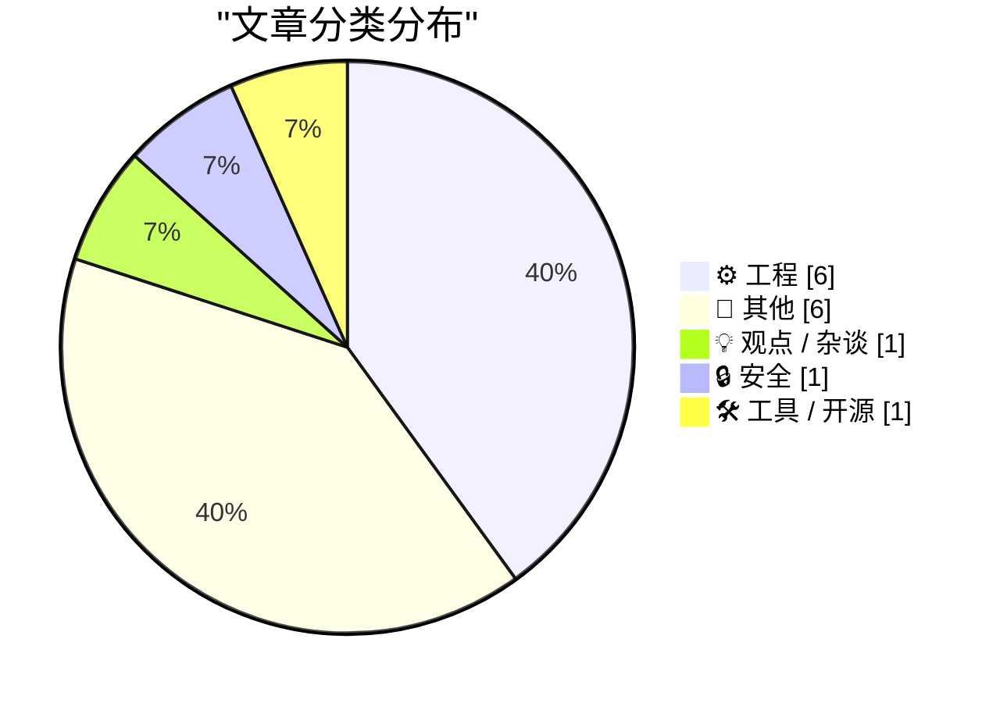
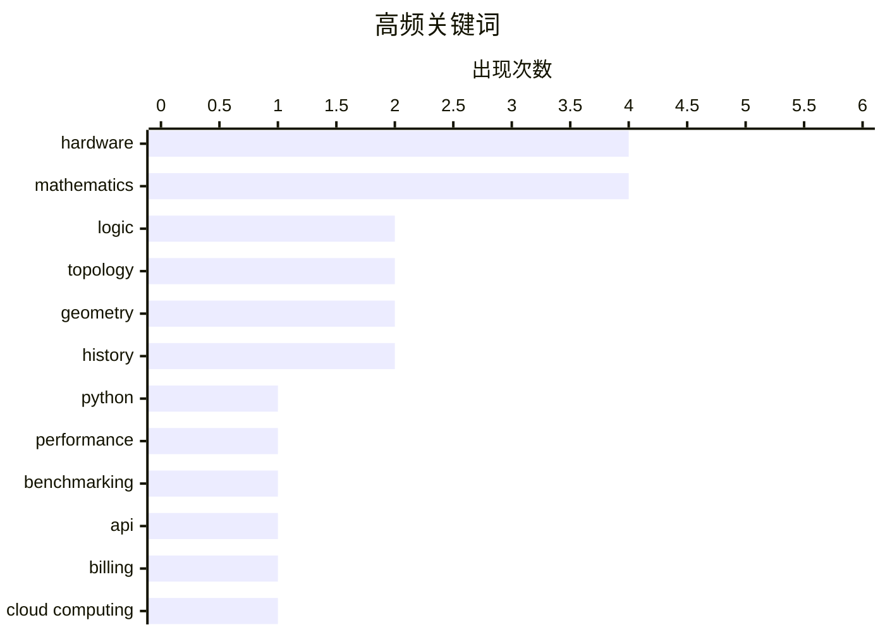

# 📰 Oct 5, 2026

> 来自 Karpathy 推荐的 92 个顶级技术博客，AI 精选 Top 15

## 📝 今日看点

今日技术动态聚焦于 AI 浪潮下的工程治理与性能演进，开发者正迫切呼吁引入“硬预算上限”以应对 AI 代理可能带来的失控成本，同时 Python 3.15 的最新基准测试揭示了核心工具链的迭代趋势。在追求效率的同时，行业也开始深度反思数字生活的过度复杂化以及硬件可靠性退步等基础体验问题。此外，网络安全领域的跨境执法进展与数学逻辑的跨学科应用，展现了技术生态在安全治理与理论研究层面的多维发展。

---

## 🏆 今日必读

🥇 **Python 3.15 到底有多快？性能基准测试报告**

[How fast is Python 3.15?](https://blog.miguelgrinberg.com/post/how-fast-is-python-3-15) — miguelgrinberg.com · 4 小时前 · ⚙️ 工程

> 评估 Python 3.15 预览版的性能表现，并将其与 3.10 至 3.14 等旧版本进行横向对比。作者通过年度非正式基准测试，分析了新版本在执行效率上的变化趋势。测试涵盖了多个关键计算指标，旨在展示 Python 核心团队在性能优化方面的最新进展。结果显示了 3.15 相较于前代版本的具体提速比例或性能波动。对于关注 Python 性能演进的开发者来说，这是了解新版本特性的重要参考。

💡 **为什么值得读**: 每年一度的 Python 性能“体检”，直观展示 3.15 版本在速度上的真实竞争力。

🏷️ Python, performance, benchmarking

🥈 **我们几乎在所有服务中都需要默认的“硬预算上限”**

[We're going to need default hard budget caps on pretty much everything](https://simonwillison.net/2026/Oct/3/default-hard-budget-caps/) — simonwillison.net · 1 天前 · ⚙️ 工程

> 探讨在按需付费服务和 API 领域引入“硬预算上限”的紧迫性。文章指出，随着编码智能体和个人 AI 代理的普及，自动化的调用可能在短时间内产生巨额费用，仅靠邮件提醒的“软上限”已无法规避风险。作者主张服务商应默认提供达到设定金额即切断服务并报错的功能。这种机制是保护用户免受失控 AI 逻辑导致财务损失的最后防线。

💡 **为什么值得读**: 随着 AI 代理自动消费能力的增强，硬预算上限将成为防止“钱包被掏空”的必备安全特性。

🏷️ API, billing, cloud computing, LLM

🥉 **“我为科技行业感到羞愧”：反思数字生活的复杂性**

[“I’m Embarrassed on Behalf of the Tech Industry”](https://blog.jim-nielsen.com/2026/embarrassed-by-tech/) — blog.jim-nielsen.com · 19 小时前 · 💡 观点 / 杂谈

> 反思现代科技产品在易用性方面的退步，特别是对于非技术背景的普通用户。作者引用 Ben Thompson 帮助母亲处理数字生活时的挫败感，指出当前的技术生态过于复杂且令人困惑。文章通过具体的生活案例，揭示了科技行业在追求功能堆砌时忽略了最基本的用户体验。这种复杂性不仅增加了使用门槛，也让从业者对行业现状感到尴尬。

💡 **为什么值得读**: 深刻反思技术复杂性对普通用户造成的困扰，提醒开发者回归以人为本的设计初衷。

🏷️ UX, tech industry, accessibility

---

## 📊 数据概览

| 扫描源 | 抓取文章 | 时间范围 | 精选 |
|:---:|:---:|:---:|:---:|
| 82/92 | 2314 篇 → 18 篇 | 48h | **15 篇** |

### 分类分布



### 高频关键词



<details>
<summary>📈 纯文本关键词图（终端友好）</summary>

```
hardware     │ ████████████████████ 4
mathematics  │ ████████████████████ 4
logic        │ ██████████░░░░░░░░░░ 2
topology     │ ██████████░░░░░░░░░░ 2
geometry     │ ██████████░░░░░░░░░░ 2
history      │ ██████████░░░░░░░░░░ 2
python       │ █████░░░░░░░░░░░░░░░ 1
performance  │ █████░░░░░░░░░░░░░░░ 1
benchmarking │ █████░░░░░░░░░░░░░░░ 1
api          │ █████░░░░░░░░░░░░░░░ 1
```

</details>

### 🏷️ 话题标签

**hardware**(4) · **mathematics**(4) · **logic**(2) · topology(2) · geometry(2) · history(2) · python(1) · performance(1) · benchmarking(1) · api(1) · billing(1) · cloud computing(1) · llm(1) · ux(1) · tech industry(1) · accessibility(1) · apple(1) · iphone(1) · bug(1) · cybersecurity(1)

---

## ⚙️ 工程

### 1. Python 3.15 到底有多快？性能基准测试报告

[How fast is Python 3.15?](https://blog.miguelgrinberg.com/post/how-fast-is-python-3-15) — **miguelgrinberg.com** · 4 小时前 · ⭐ 27/30

> 评估 Python 3.15 预览版的性能表现，并将其与 3.10 至 3.14 等旧版本进行横向对比。作者通过年度非正式基准测试，分析了新版本在执行效率上的变化趋势。测试涵盖了多个关键计算指标，旨在展示 Python 核心团队在性能优化方面的最新进展。结果显示了 3.15 相较于前代版本的具体提速比例或性能波动。对于关注 Python 性能演进的开发者来说，这是了解新版本特性的重要参考。

🏷️ Python, performance, benchmarking

---

### 2. 我们几乎在所有服务中都需要默认的“硬预算上限”

[We're going to need default hard budget caps on pretty much everything](https://simonwillison.net/2026/Oct/3/default-hard-budget-caps/) — **simonwillison.net** · 1 天前 · ⭐ 26/30

> 探讨在按需付费服务和 API 领域引入“硬预算上限”的紧迫性。文章指出，随着编码智能体和个人 AI 代理的普及，自动化的调用可能在短时间内产生巨额费用，仅靠邮件提醒的“软上限”已无法规避风险。作者主张服务商应默认提供达到设定金额即切断服务并报错的功能。这种机制是保护用户免受失控 AI 逻辑导致财务损失的最后防线。

🏷️ API, billing, cloud computing, LLM

---

### 3. RSS 与 Atom 订阅源的变更说明

[[RSS Club] Changes to the RSS and Atom feeds](https://shkspr.mobi/blog/2026/10/rss-club-changes-to-the-rss-and-atom-feeds/) — **shkspr.mobi** · 2 小时前 · ⭐ 19/30

> 针对 RSS 和 Atom 订阅源中 HTML 转义问题的技术修复说明。作者此前尝试使用 CDATA 块来包含原始 HTML，但发现部分订阅阅读器会错误地对已转义的文本进行二次反转义，导致显示异常。为了提高兼容性，作者决定调整订阅源的生成方式。此变更旨在确保内容在各类阅读器中都能正确渲染。

🏷️ RSS, Atom, XML, web development

---

### 4. 模态逻辑的拓扑模型

[Topological models of modal logic](https://www.johndcook.com/blog/2026/10/04/topological-models-of-modal-logic/) — **johndcook.com** · 1 天前 · ⭐ 18/30

> 探讨模态逻辑与拓扑学之间深层的数学联系，重点介绍 McKinsey 和 Tarski 的研究成果。文章从拓扑空间 X 出发，将命题 p 定义为集合，并利用开集和闭集的概念来解释逻辑中的必然性与可能性。这种模型将抽象的逻辑公理转化为具体的几何性质，如正则性和正规性。通过这种映射，复杂的逻辑推理可以借用拓扑学的工具进行分析。

🏷️ logic, topology, mathematics, computer science

---

### 5. 为什么我的华硕笔记本休眠后总是重启以及如何修复它

[Why My Asus Laptop Kept Rebooting After Sleep and How to Fix it](https://idiallo.com/blog/asus-laptop-keeps-rebooting-after-sleep) — **idiallo.com** · 1 天前 · ⭐ 16/30

> 针对华硕 Zenbook Pro 17 笔记本在合盖休眠后频繁自动重启的问题进行深度排查。作者分析了 Windows “现代待机”（Modern Standby/S0）模式与传统 S3 睡眠模式的冲突，这往往是导致硬件无法正常唤醒的主因。通过调整 BIOS 设置、更新特定驱动程序以及修改注册表项，作者成功解决了这一困扰已久的稳定性问题。文章提供了详细的排查步骤，适用于遇到类似休眠故障的 Windows 用户。

🏷️ hardware, troubleshooting, drivers, laptop

---

### 6. 模态逻辑与拓扑学

[Modal logic and topology](https://www.johndcook.com/blog/2026/10/04/modal-topology/) — **johndcook.com** · 1 天前 · ⭐ 15/30

> 模态逻辑与点集拓扑在研究方法上具有高度相似性，都需要通过特定的公理系统来界定研究范围。S4 模态逻辑与拓扑空间之间存在深刻的对等关系，其中模态算子 □（必然性）对应于拓扑中的内部算子（interior operator）。McKinsey-Tarski 定理证明了 S4 公理系统恰好刻画了拓扑空间的代数性质。这种跨学科的联系为理解逻辑命题的结构提供了几何视角，使得抽象的逻辑推演可以通过空间邻域的概念进行直观解释。

🏷️ logic, topology, mathematics

---

## 📝 其他

### 7. 苹果确认 iPhone 18 Pro Max 在 AT&T 网络下的蜂窝网络问题，受影响设备需更换硬件

[Apple Confirms iPhone 18 Pro Max AT&T Cellular Issues, Affected Devices Require Hardware Replacement](https://9to5mac.com/2026/10/02/apple-confirms-iphone-18-pro-max-att-cellular-issues-affected-devices-require-hardware-replacement/) — **daringfireball.net** · 1 天前 · ⭐ 22/30

> 苹果公司正式承认部分使用 AT&T 网络的 iPhone 18 Pro Max 用户存在信号丢失及无法通话的问题。官方已发布 iOS 27.0.1 和运营商设置更新以尝试缓解该现象。然而，对于已经受到影响的特定设备，软件更新可能无法根治，最终需要进行硬件更换。这一故障主要集中在特定批次和特定运营商的组合上。

🏷️ Apple, iPhone, hardware, bug

---

### 8. 米克尔五边形定理

[Miquel’s pentagon theorem](https://www.johndcook.com/blog/2026/10/04/miquels-pentagon-theorem/) — **johndcook.com** · 1 天前 · ⭐ 17/30

> 介绍 19 世纪数学家 Auguste Miquel 发现的一个优雅的平面几何定理。该定理指出，对于任意一个凸五边形，延伸其各边形成星形，并在相邻顶点处画出五个圆。这五个圆在星形的“角”部相交，而这些交点又会落在第六个圆上。文章展示了这一几何构造的对称美与数学严谨性。

🏷️ geometry, mathematics, theorem

---

### 9. IBM ThinkPad 的 1992 年初次亮相

[The IBM Thinkpad’s 1992 debut](https://dfarq.homeip.net/the-ibm-thinkpads-1992-debut/?utm_source=rss&#038;utm_medium=rss&#038;utm_campaign=the-ibm-thinkpads-1992-debut) — **dfarq.homeip.net** · 3 小时前 · ⭐ 14/30

> 1992 年 10 月 5 日，IBM 发布了首批三款 ThinkPad 型号（700、700C 和 700T），彻底改变了移动计算市场。相比此前笨重的 Portable PC 和失败的 PC Convertible，ThinkPad 引入了标志性的 TrackPoint（小红点）指点杆和精湛的工业设计。其中 700C 配备了当时领先的 10.4 英寸彩色主动矩阵显示屏，确立了高端商务笔记本的标准。这一系列的成功不仅挽救了 IBM 在个人电脑领域的颓势，更开启了长达三十余年的经典设计传承。

🏷️ hardware, history, IBM

---

### 10. Zenith Data Systems 往事（第一部分）

[Zenith Data Systems, Part I](https://www.abortretry.fail/p/zenith-data-systems-part-i) — **abortretry.fail** · 16 小时前 · ⭐ 14/30

> Zenith Data Systems (ZDS) 作为从电视巨头 Zenith Radio Corporation 剥离的子公司，曾是 20 世纪 80 年代早期 PC 市场的重要参与者。公司秉承“质量先行”的口口号，凭借 Z-89 和 Z-100 等早期机型在政府和教育市场建立了深厚根基。ZDS 在当时以其卓越的工程质量和对 Heathkit 的收购而闻名，这为其提供了强大的技术开发能力。本系列第一部分重点梳理了公司从家电巨头向计算机先驱转型的早期历程及其独特的技术基因。

🏷️ hardware, history, computing

---

### 11. 如何攻略：阿卡狄亚登天斗技场 M1（零式）

[How to Solve: AAC Heavyweight M1 (Savage)](https://xeiaso.net/blog/2026/m9s/) — **xeiaso.net** · 1 天前 · ⭐ 12/30

> 针对《最终幻想14》最新高难副本中的 M1 关卡，本攻略以通俗易懂的语言解析了核心战斗机制。重点讲解了 Boss 的位移规律、分摊伤害的判定逻辑以及关键的场地变化应对方案。通过简化复杂的技能描述，帮助玩家快速掌握处理“四连击”或特定转场机制的节奏。文章避开了晦涩的专业术语，旨在为开荒团队提供一套高效、容错率高的执行方案。

🏷️ gaming, FFXIV, guide

---

### 12. 米克尔枢轴定理

[Miquel’s pivot theorem](https://www.johndcook.com/blog/2026/10/03/miquels-pivot-theorem/) — **johndcook.com** · 1 天前 · ⭐ 11/30

> 米克尔枢轴定理（Miquel's pivot theorem）是欧几里得几何中一个相对现代的发现，证明了平面几何仍有未被挖掘的奥秘。该定理指出，若在三角形的三条边上各取一点，经过每个顶点及其相邻边上的两点作三个圆，这三个圆必交于一点（即米克尔点）。这一结论在 1838 年才被提出，展示了简单几何构型中隐藏的深刻对称性。文章通过直观的几何描述，探讨了这一定理在数学美学和证明逻辑上的独特价值。

🏷️ geometry, mathematics

---

## 💡 观点 / 杂谈

### 13. “我为科技行业感到羞愧”：反思数字生活的复杂性

[“I’m Embarrassed on Behalf of the Tech Industry”](https://blog.jim-nielsen.com/2026/embarrassed-by-tech/) — **blog.jim-nielsen.com** · 19 小时前 · ⭐ 23/30

> 反思现代科技产品在易用性方面的退步，特别是对于非技术背景的普通用户。作者引用 Ben Thompson 帮助母亲处理数字生活时的挫败感，指出当前的技术生态过于复杂且令人困惑。文章通过具体的生活案例，揭示了科技行业在追求功能堆砌时忽略了最基本的用户体验。这种复杂性不仅增加了使用门槛，也让从业者对行业现状感到尴尬。

🏷️ UX, tech industry, accessibility

---

## 🔒 安全

### 14. 每周更新 524：来自哥本哈根的现场报道

[Weekly Update 524: Live From Copenhagen](https://www.troyhunt.com/weekly-update-524/) — **troyhunt.com** · 1 天前 · ⭐ 22/30

> 网络安全专家 Troy Hunt 在哥本哈根 GOTO 大会结束后分享的每周动态。本期重点关注了黑客组织 ShinyHunters 的两名成员在荷兰和法国被捕的最新进展。此外，作者还回顾了在丹麦参与的技术活动以及即将回国的行程。内容涵盖了网络犯罪打击的最新成果与行业会议的见闻。

🏷️ cybersecurity, data breach, ShinyHunters

---

## 🛠 工具 / 开源

### 15. WorkOS：开发者单点登录 (SSO) 指南

[WorkOS](https://workos.com/guide/the-developers-guide-to-sso?utm_source=daringfireball&amp;utm_medium=newsletter&amp;utm_campaign=q32026) — **daringfireball.net** · 1 天前 · ⭐ 16/30

> 探讨企业级应用中单点登录 (SSO) 的实现挑战，包括 SAML 控制器编写、XML 断言解析以及不同身份提供商 (IdP) 的兼容性适配。文章对比了自主构建 SSO 系统与使用第三方服务（如 WorkOS）的成本与风险。重点介绍了 SSO 的工作流、安全路由的最佳实践以及用户体验的优化方案。对于需要处理企业级订单的开发者来说，SSO 是不可或缺的技术门槛。

🏷️ SSO, SAML, authentication, enterprise

---

*生成于 2026-10-05 14:16 | 扫描 82 源 → 获取 2314 篇 → 精选 15 篇*
*基于 [Hacker News Popularity Contest 2025](https://refactoringenglish.com/tools/hn-popularity/) RSS 源列表，由 [Andrej Karpathy](https://x.com/karpathy) 推荐*
