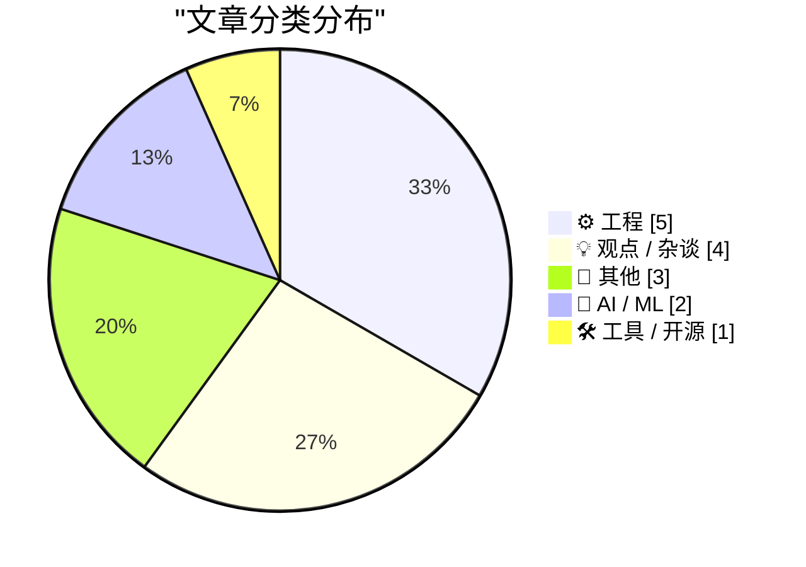
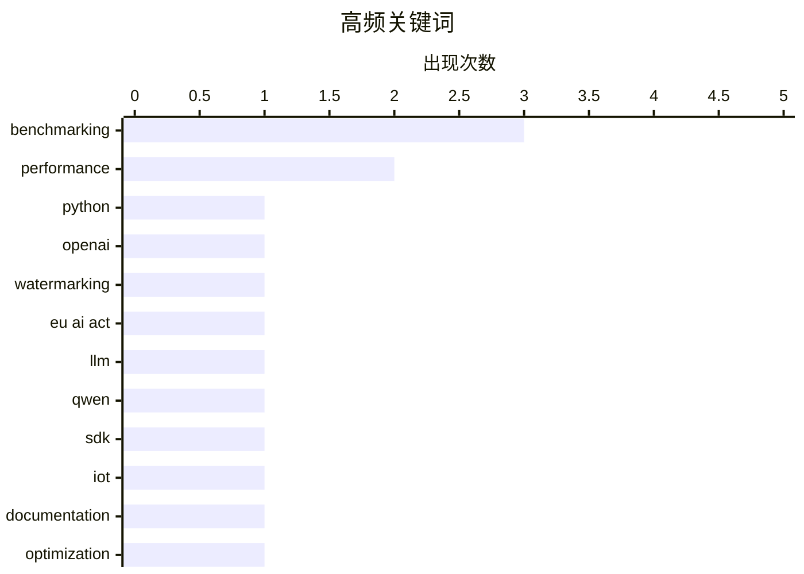

# 📰 Oct 6, 2026

> 来自 Karpathy 推荐的 92 个顶级技术博客，AI 精选 Top 15

## 📝 今日看点

今日技术圈呈现出性能优化与人文反思并行的态势。工程领域持续追求极致效率，Python 3.15 的性能飞跃与微基准测试标准的明确，标志着底层工具链的进一步迭代。AI 领域则在能力边界探索与合规治理间寻找平衡，OpenAI 文本水印计划的推进反映了监管压力下的技术应对。与此同时，行业正掀起一场关于算法语言、技术复杂性及数字监控的深度反思，呼吁科技在高速演进中回归以人为本的初衷。

---

## 🏆 今日必读

🥇 **Python 3.15 有多快？**

[How fast is Python 3.15?](https://blog.miguelgrinberg.com/post/how-fast-is-python-3-15) — miguelgrinberg.com · 1 天前 · ⚙️ 工程

> Python 3.15 (目前为 RC3 版本) 的非正式性能基准测试结果现已发布，涵盖了从 3.10 到 3.15 的多个版本对比。测试延续了作者每年的惯例，旨在评估“更快地实现 CPython”项目在最新版本中的进展。初步数据显示，3.15 版本在计算密集型任务中相较于 3.14 有小幅但持续的性能提升。该基准测试通过一系列脚本模拟真实开发场景，反映了解释器在字节码优化和内存管理方面的改进。作者认为 Python 3.15 保持了自 3.11 以来开启的性能增长势头。

💡 **为什么值得读**: 对于关注 Python 性能演进及考虑是否升级生产环境的开发者来说，这是最直观的参考数据。

🏷️ Python, performance, benchmarking

🥈 **OpenAI 公布文本水印计划**

[OpenAI Announces Their Text Watermarking Plans](https://openai.com/index/eu-text-provenance/) — daringfireball.net · 14 小时前 · 🤖 AI / ML

> OpenAI 宣布将采取分阶段的方法来实现生成式文本的水印和检测技术，以响应《欧盟人工智能法案》对机器可读标识的要求。目前文本水印技术仍处于早期阶段，面临鲁棒性不足和易被规避等显著技术局限。OpenAI 强调透明度的重要性，明确告知用户水印能识别什么以及无法识别什么。该计划旨在平衡监管合规性与用户体验，同时持续探索更可靠的内容溯源方案。最终目标是在保护创作者权益的同时，防止 AI 生成内容被滥用于欺诈或误导。

💡 **为什么值得读**: 深入了解 AI 巨头如何应对欧盟监管压力，以及当前 AI 内容溯源技术的真实边界。

🏷️ OpenAI, watermarking, EU AI Act

🥉 **Qwen3.8 27B 模型以文字形式进行加法运算的测试**

[Qwen3.8 27B addition in words](https://simonwillison.net/2026/Oct/4/qwen38-addition-in-words/) — simonwillison.net · 1 天前 · 🤖 AI / ML

> 研究者对 Qwen3.8 27B 模型进行了一项有趣的实验，测试其能否在执行加法运算后以纯文字形式（如“一百加二等于一百零二”）输出结果。该实验复刻了两年前针对 GPT-4o 的测试，旨在观察大语言模型在处理大数值加法时的逻辑一致性。测试结果通过图表展示了模型在数值增大时准确率的下降趋势，揭示了 LLM 在符号推理与自然语言约束结合时的短板。实验发现，尽管模型规模在扩大，但在特定格式的算术任务中依然存在明显的“幻觉”或计算错误。这反映了当前开源模型在处理复杂指令微调任务时的真实水平。

💡 **为什么值得读**: 通过具体的算术实验揭示了大模型在逻辑推理方面的局限性，是评估模型能力的硬核参考。

🏷️ LLM, Qwen, benchmarking

---

## 📊 数据概览

| 扫描源 | 抓取文章 | 时间范围 | 精选 |
|:---:|:---:|:---:|:---:|
| 82/92 | 2314 篇 → 20 篇 | 48h | **15 篇** |

### 分类分布



### 高频关键词



<details>
<summary>📈 纯文本关键词图（终端友好）</summary>

```
benchmarking │ ████████████████████ 3
performance  │ █████████████░░░░░░░ 2
python       │ ███████░░░░░░░░░░░░░ 1
openai       │ ███████░░░░░░░░░░░░░ 1
watermarking │ ███████░░░░░░░░░░░░░ 1
eu ai act    │ ███████░░░░░░░░░░░░░ 1
llm          │ ███████░░░░░░░░░░░░░ 1
qwen         │ ███████░░░░░░░░░░░░░ 1
sdk          │ ███████░░░░░░░░░░░░░ 1
iot          │ ███████░░░░░░░░░░░░░ 1
```

</details>

### 🏷️ 话题标签

**benchmarking**(3) · **performance**(2) · **python**(1) · openai(1) · watermarking(1) · eu ai act(1) · llm(1) · qwen(1) · sdk(1) · iot(1) · documentation(1) · optimization(1) · ux(1) · accessibility(1) · tech culture(1) · internet culture(1) · linguistics(1) · algorithms(1) · ai architecture(1) · vm(1)

---

## ⚙️ 工程

### 1. Python 3.15 有多快？

[How fast is Python 3.15?](https://blog.miguelgrinberg.com/post/how-fast-is-python-3-15) — **miguelgrinberg.com** · 1 天前 · ⭐ 27/30

> Python 3.15 (目前为 RC3 版本) 的非正式性能基准测试结果现已发布，涵盖了从 3.10 到 3.15 的多个版本对比。测试延续了作者每年的惯例，旨在评估“更快地实现 CPython”项目在最新版本中的进展。初步数据显示，3.15 版本在计算密集型任务中相较于 3.14 有小幅但持续的性能提升。该基准测试通过一系列脚本模拟真实开发场景，反映了解释器在字节码优化和内存管理方面的改进。作者认为 Python 3.15 保持了自 3.11 以来开启的性能增长势头。

🏷️ Python, performance, benchmarking

---

### 2. 微基准测试应持续多久？以毫秒为单位的准则

[Benchmark In Milliseconds](https://matklad.github.io/2026/10/05/benchmark-milliseconds.html) — **matklad.github.io** · 1 天前 · ⭐ 21/30

> 在进行微基准测试（Micro-benchmark）时，作者建议通过调整输入规模将运行时间控制在 300 毫秒左右。这个时长足以抵消系统启动开销和测量噪声，同时又短到足以支持开发过程中的快速迭代。文章指出，运行数秒甚至数分钟的测试往往不会提供更多有效数据，反而会降低开发效率。通过保持测试在毫秒级别，开发者可以更频繁地运行测试以验证微小的代码改动。这一经验法则平衡了统计学上的显著性与工程实践的灵活性。

🏷️ benchmarking, performance, optimization

---

### 3. 引用 Felix Rieseberg：关于 Cowork 虚拟机架构的演进

[Quoting Felix Rieseberg](https://simonwillison.net/2026/Oct/5/felix-rieseberg/) — **simonwillison.net** · 13 小时前 · ⭐ 20/30

> Cowork 早期版本采用在云端运行模型推理、在本地虚拟机（VM）中执行工具调用的架构，以确保安全性和数据隔离。然而，用户反馈显示本地运行 VM 带来了巨大的磁盘占用、电池消耗和性能开销。为了提升用户体验，开发团队开始重新评估这种架构的必要性，试图在安全沙箱与资源消耗之间寻找新平衡。这一转变反映了 AI 应用在本地部署时面临的硬件资源瓶颈。文章探讨了在保护用户隐私的同时，如何优化 AI 驱动工具的运行效率。

🏷️ AI architecture, VM, security

---

### 4. 如果有人尝试对已经打过热补丁的函数再次打补丁，如何避免冲突？

[If somebody tries to hot-patch an already-hot-patched function, how do they avoid conflicts?](https://devblogs.microsoft.com/oldnewthing/20261005-00/?p=112755/) — **devblogs.microsoft.com/oldnewthing** · 23 小时前 · ⭐ 20/30

> Windows 热补丁（Hot-patching）机制通过在函数开头预留 5 字节空间并修改前 2 字节为短跳转指令来实现代码替换。当多个组件尝试对同一函数进行热补丁时，后来的补丁会直接覆盖先前的跳转指令，导致旧补丁失效甚至引发系统崩溃。微软明确指出该功能是为操作系统内部更新设计的，并未向第三方开发者提供多方协作的冲突解决协议。开发者应避免在应用层手动实施热补丁，因为这本质上是在与操作系统“抢夺”控制权，极易破坏系统稳定性。对于需要修改系统行为的需求，应优先使用官方支持的扩展机制而非底层的指令覆盖。

🏷️ Windows, hot-patching, internals

---

### 5. RSS 与 Atom 订阅源的变更说明

[[RSS Club] Changes to the RSS and Atom feeds](https://shkspr.mobi/blog/2026/10/rss-club-changes-to-the-rss-and-atom-feeds/) — **shkspr.mobi** · 1 天前 · ⭐ 16/30

> 作者近期在 RSS 和 Atom 订阅源中使用了 `<![CDATA[ ... ]]>` 块来包含原始 HTML，却导致部分阅读器解析异常。由于某些阅读器会错误地对已转义的文本进行二次处理，造成内容显示混乱或链接失效。为了提升跨平台的兼容性，作者决定移除 CDATA 块并回归到标准的 HTML 实体转义方式。此次调整旨在确保所有订阅客户端都能准确还原文章格式，不再受限于特定解析器的实现差异。对于维护个人博客订阅源的开发者来说，这是一个关于 Web 标准实现碎片化的典型实战案例。

🏷️ RSS, XML, web development

---

## 💡 观点 / 杂谈

### 6. “我为科技行业感到羞愧”

[“I’m Embarrassed on Behalf of the Tech Industry”](https://blog.jim-nielsen.com/2026/embarrassed-by-tech/) — **blog.jim-nielsen.com** · 1 天前 · ⭐ 21/30

> 本文探讨了现代科技产品日益增长的复杂性如何让普通用户（尤其是老年人）感到无所适从。作者引用 Ben Thompson 的观点，指出即便对于专业人士，帮助家人处理数字化生活中的琐事也变得异常困难。文章通过具体的家庭案例，批评了科技行业在追求“创新”时忽视了最基本的易用性和用户尊严。这种“过度设计”导致了严重的数字鸿沟，使得技术不再是赋能工具，反而成了负担。作者呼吁行业回归简洁，关注真实世界中普通人的使用体验。

🏷️ UX, accessibility, tech culture

---

### 7. 我们将终结 “Unalive” 这个词

[We are going to kill “unalive”](https://anildash.com/2026/10/06/kill-unalive/) — **anildash.com** · 13 小时前 · ⭐ 21/30

> “Unalive” 是 21 世纪互联网文化的产物，最初是年轻人为了规避社交媒体算法对“死亡”或“自杀”等词汇的审查而创造的替代词。这种“算法语言”（Algospeak）的流行反映了平台审核机制对自然语言的深刻改变。作者分析了这种语言现象背后的社会心理，并预测随着平台政策的演变或文化反弹，这种委婉语最终会被更直接的表达方式取代。文章批评了过度依赖 AI 过滤器的做法，认为这导致了语言的贫瘠和沟通的扭曲。核心观点是，人类的表达不应被算法的黑盒所左右。

🏷️ internet culture, linguistics, algorithms

---

### 8. Pluralistic：金钱与专业知识的交换

[Pluralistic: Swapping money for expertise (06 Oct 2026)](https://pluralistic.net/2026/10/06/nonfungible/) — **pluralistic.net** · 12 分钟前 · ⭐ 20/30

> Cory Doctorow 在本期专栏中探讨了金钱无法替代专业知识的观点，并串联了多个社会与技术议题。内容涵盖了 Yahoo 对酷刑辩论视频的审查、苏格兰的洗钱问题以及针对美国国税局（IRS）的拒绝服务攻击等乱象。作者批评了那些试图通过资本手段规避责任或简化复杂社会问题的行为。文章强调了在数字化时代，保护非同质化的专业技能和公共机构透明度的重要性。通过对这些看似孤立事件的分析，揭示了现代经济体系中信任的侵蚀。

🏷️ economics, expertise, censorship

---

### 9. Pluralistic：被审视的社会

[Pluralistic: Scrutinized (05 Oct 2026)](https://pluralistic.net/2026/10/05/pervert-glasses/) — **pluralistic.net** · 18 小时前 · ⭐ 20/30

> 本篇文章聚焦于数字监控与版权管理（DRM）对个人自由的侵害。作者讨论了“变态眼镜”（监控设备）如何破坏真实的自我表达，并列举了意大利维基百科关闭和苹果公司的“非法之恶”等案例。文中详细分析了温哥华房产投机税的成效，以及 DRM 如何在英国等地剥夺用户的数字所有权。通过这些案例，作者警告说企业和政府的过度审查正在将互联网变成一个受控的封闭空间。文章呼吁公众关注数字权利，抵制技术巨头的霸权行为。

🏷️ DRM, privacy, digital rights

---

## 📝 其他

### 10. 预测和平：如何量化战争的终结

[Predicting Peace](https://entropicthoughts.com/forecasting-peace) — **entropicthoughts.com** · 15 小时前 · ⭐ 15/30

> 针对 ACX 2026 预测竞赛中关于乌克兰和苏丹能否在 2026 年达成停火的问题，作者探讨了数学模型在战争预测中的应用。预测核心采用了拉普拉斯演替定律（Laplace's rule of succession），即 $P = (k+1)/(n+2)$，仅根据冲突已持续的时间来推算未来结束的概率。这种统计学方法为复杂的地缘政治冲突提供了一个不依赖主观判断的基准概率（Baseline）。虽然纯数学模型无法捕捉外交斡旋等动态因素，但它在处理缺乏先验信息的长期预测时具有独特的参考价值。文章展示了在极端不确定环境下，如何利用简单的概率工具构建逻辑严密的预测框架。

🏷️ forecasting, geopolitics, prediction

---

### 11. 2010 年，史蒂夫·乔布斯穿行在 Apple Park 的模型中

[Steve Jobs, Walking Through a Mockup for Apple Park in 2010](https://book.stevejobsarchive.com/#photo-37) — **daringfireball.net** · 10 小时前 · ⭐ 14/30

> 史蒂夫·乔布斯档案库公开了一张 2010 年的珍贵照片，记录了乔布斯在 Apple Park 实体模型中视察的瞬间。这张照片捕捉到了他在生命最后阶段，对苹果新总部“飞船”建筑设计的深度参与和愿景投射。作为《Make Something Wonderful》纪念集的一部分，该影像不仅是历史的记录，更是乔布斯对细节极致追求的缩影。照片中巨大的环形模型展示了苹果公司对未来办公环境的宏大构想。对于关注苹果企业文化和乔布斯个人遗产的读者，这是一个极具情感价值的视觉片段。

🏷️ Apple, Steve Jobs, history

---

### 12. Lotus：1983 年全球第二大软件出版商

[Lotus: Second largest software publisher in the world (in 1983)](https://dfarq.homeip.net/lotus-second-largest-software-publisher-in-the-world-in-1983/?utm_source=rss&#038;utm_medium=rss&#038;utm_campaign=lotus-second-largest-software-publisher-in-the-world-in-1983) — **dfarq.homeip.net** · 2 小时前 · ⭐ 14/30

> 1983 年 10 月 6 日，Lotus Development 以 55 亿美元的估值成功 IPO，创下了当时软件行业的纪录。凭借旗舰产品 Lotus 1-2-3 电子表格软件，该公司在成立仅一年后就成为仅次于微软的全球第二大软件发行商。Lotus 1-2-3 充分利用了 IBM PC 的硬件性能，迅速取代 VisiCalc 成为商业计算的事实标准。这次 IPO 的成功标志着个人电脑软件市场从车库创业进入了资本驱动的爆发期。这段历史回顾了早期软件巨头如何通过单一爆款产品定义整个行业格局并实现商业神话。

🏷️ Lotus 1-2-3, software history, IPO

---

## 🤖 AI / ML

### 13. OpenAI 公布文本水印计划

[OpenAI Announces Their Text Watermarking Plans](https://openai.com/index/eu-text-provenance/) — **daringfireball.net** · 14 小时前 · ⭐ 25/30

> OpenAI 宣布将采取分阶段的方法来实现生成式文本的水印和检测技术，以响应《欧盟人工智能法案》对机器可读标识的要求。目前文本水印技术仍处于早期阶段，面临鲁棒性不足和易被规避等显著技术局限。OpenAI 强调透明度的重要性，明确告知用户水印能识别什么以及无法识别什么。该计划旨在平衡监管合规性与用户体验，同时持续探索更可靠的内容溯源方案。最终目标是在保护创作者权益的同时，防止 AI 生成内容被滥用于欺诈或误导。

🏷️ OpenAI, watermarking, EU AI Act

---

### 14. Qwen3.8 27B 模型以文字形式进行加法运算的测试

[Qwen3.8 27B addition in words](https://simonwillison.net/2026/Oct/4/qwen38-addition-in-words/) — **simonwillison.net** · 1 天前 · ⭐ 24/30

> 研究者对 Qwen3.8 27B 模型进行了一项有趣的实验，测试其能否在执行加法运算后以纯文字形式（如“一百加二等于一百零二”）输出结果。该实验复刻了两年前针对 GPT-4o 的测试，旨在观察大语言模型在处理大数值加法时的逻辑一致性。测试结果通过图表展示了模型在数值增大时准确率的下降趋势，揭示了 LLM 在符号推理与自然语言约束结合时的短板。实验发现，尽管模型规模在扩大，但在特定格式的算术任务中依然存在明显的“幻觉”或计算错误。这反映了当前开源模型在处理复杂指令微调任务时的真实水平。

🏷️ LLM, Qwen, benchmarking

---

## 🛠 工具 / 开源

### 15. Una Watch SDK 及首个应用编写指南

[Una Watch - SDK and Writing Your First App](https://shkspr.mobi/blog/2026/10/una-watch-sdk-and-writing-your-first-app/) — **shkspr.mobi** · 1 小时前 · ⭐ 21/30

> 针对 Una Watch 官方文档零散、难以复现的问题，本文提供了一份在 Debian/Ubuntu/Pop OS Linux 环境下从零开始的开发指南。文章详细列出了环境配置所需的依赖项，并解决了官方 Readme 文件中未提及的坑点。读者可以跟随步骤完成首个“Hello, World!” Glance 应用程序的编写与部署。作者强调了硬件厂商测试 Readme 文档的重要性，并提供了经过验证的简化工作流。这为想要进入 Una Watch 生态的开发者扫清了入门障碍。

🏷️ SDK, IoT, documentation

---

*生成于 2026-10-06 13:10 | 扫描 82 源 → 获取 2314 篇 → 精选 15 篇*
*基于 [Hacker News Popularity Contest 2025](https://refactoringenglish.com/tools/hn-popularity/) RSS 源列表，由 [Andrej Karpathy](https://x.com/karpathy) 推荐*
