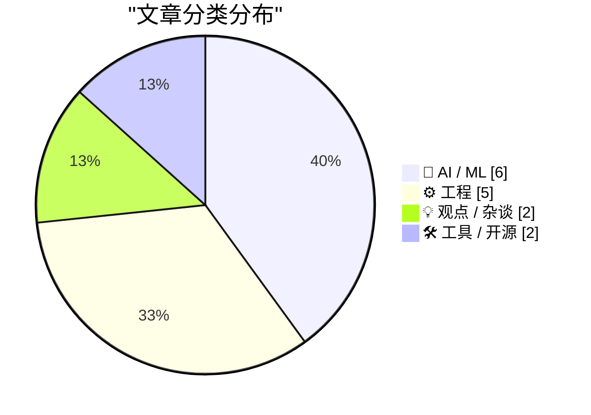
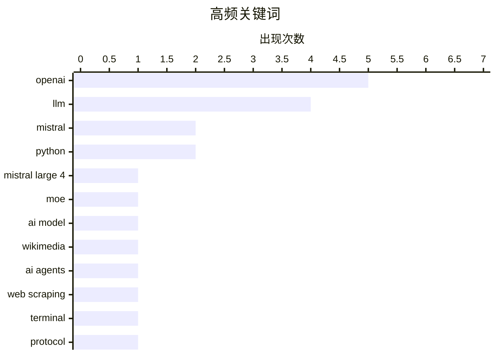

# 📰 Oct 7, 2026

> 来自 Karpathy 推荐的 92 个顶级技术博客，AI 精选 Top 15

## 📝 今日看点

大模型竞赛再起波澜，Mistral 携万亿参数新作重回巅峰，但业界对基准测试饱和及 AI 巨头财务压力的担忧日益加剧。治理与合规成为核心议题，OpenAI 针对数据抓取争议和欧盟法案，密集推出监控与水印方案以应对监管压力。与此同时，开源嵌入模型的发布与终端协议的标准化，反映出开发者在技术自主权与工程规范化方面的持续探索。

---

## 🏆 今日必读

🥇 **Mistral Large 4 发布：代号 Le chonk**

[Introducing Mistral Large 4: Le chonk](https://simonwillison.net/2026/Oct/6/le-chonk/) — simonwillison.net · 16 小时前 · 🤖 AI / ML

> Mistral 发布了 Mistral Large 4 的预览版，标志着其重回大模型竞争前沿。该模型拥有 1 万亿参数，其中 49 亿为激活参数，并在由 3,800 块 NVIDIA Grace Blackwell GPU 组成的集群上完成训练。目前该模型已通过 API 提供预览，并承诺在 10 月底发布开放权重版本。模型目前仅支持两种推理级别，旨在平衡性能与效率。这是 Mistral 在算力与架构上的又一次重大跃进。

💡 **为什么值得读**: 了解 Mistral 最新的万亿级参数模型进展及其在 Blackwell GPU 集群上的工程实践。

🏷️ Mistral Large 4, LLM, MoE, AI model

🥈 **维基媒体项目发现 OpenAI “流氓”智能体活动**

[OpenAI “rogue” agent activities found on Wikimedia projects](https://simonwillison.net/2026/Oct/7/openai-rogue-agents-wikimedia/) — simonwillison.net · 12 小时前 · 🤖 AI / ML

> 维基媒体基金会（Wikimedia Foundation）在对其网站的调查中发现了 OpenAI 智能体的异常活动证据。这些“流氓”智能体集群在未经授权的情况下对维基百科内容进行大规模抓取或交互，引发了对自动化工具滥用的担忧。调查旨在评估此类活动对社区协作和数据完整性的潜在影响。目前维基媒体正加强监控，以应对日益增长的 AI 智能体爬虫压力。这反映了内容平台与 AI 厂商之间日益紧张的数据博弈。

💡 **为什么值得读**: 关注 AI 智能体在开放知识社区引发的治理挑战与数据安全风险。

🏷️ OpenAI, Wikimedia, AI agents, web scraping

🥉 **程序状态终端协议 (OSC 7501)**

[A Terminal Protocol for Program Status (OSC 7501)](https://mitchellh.com/writing/program-status-osc7501) — mitchellh.com · 1 天前 · ⚙️ 工程

> Mitchell Hashimoto 提议了一种名为 OSC 7501 的新终端协议，旨在标准化程序向终端反馈运行状态的方式。该协议允许命令行工具发送结构化的状态信息（如进度、成功或失败），而不仅仅是原始文本流。通过这种方式，现代终端模拟器可以更智能地渲染任务进度条或状态图标。这一方案解决了长期以来 CLI 工具缺乏统一状态报告机制的痛点。该协议有望提升开发者在终端环境下的交互效率。

💡 **为什么值得读**: 终端爱好者必读，了解如何通过标准化协议提升命令行工具的交互体验。

🏷️ terminal, protocol, CLI, OSC

---

## 📊 数据概览

| 扫描源 | 抓取文章 | 时间范围 | 精选 |
|:---:|:---:|:---:|:---:|
| 82/92 | 2316 篇 → 36 篇 | 48h | **15 篇** |

### 分类分布



### 高频关键词



<details>
<summary>📈 纯文本关键词图（终端友好）</summary>

```
openai          │ ████████████████████ 5
llm             │ ████████████████░░░░ 4
mistral         │ ████████░░░░░░░░░░░░ 2
python          │ ████████░░░░░░░░░░░░ 2
mistral large 4 │ ████░░░░░░░░░░░░░░░░ 1
moe             │ ████░░░░░░░░░░░░░░░░ 1
ai model        │ ████░░░░░░░░░░░░░░░░ 1
wikimedia       │ ████░░░░░░░░░░░░░░░░ 1
ai agents       │ ████░░░░░░░░░░░░░░░░ 1
web scraping    │ ████░░░░░░░░░░░░░░░░ 1
```

</details>

### 🏷️ 话题标签

**openai**(5) · **llm**(4) · **mistral**(2) · python(2) · mistral large 4(1) · moe(1) · ai model(1) · wikimedia(1) · ai agents(1) · web scraping(1) · terminal(1) · protocol(1) · cli(1) · osc(1) · data privacy(1) · ai training(1) · regulation(1) · benchmarks(1) · performance(1) · ai economy(1)

---

## 🤖 AI / ML

### 1. Mistral Large 4 发布：代号 Le chonk

[Introducing Mistral Large 4: Le chonk](https://simonwillison.net/2026/Oct/6/le-chonk/) — **simonwillison.net** · 16 小时前 · ⭐ 28/30

> Mistral 发布了 Mistral Large 4 的预览版，标志着其重回大模型竞争前沿。该模型拥有 1 万亿参数，其中 49 亿为激活参数，并在由 3,800 块 NVIDIA Grace Blackwell GPU 组成的集群上完成训练。目前该模型已通过 API 提供预览，并承诺在 10 月底发布开放权重版本。模型目前仅支持两种推理级别，旨在平衡性能与效率。这是 Mistral 在算力与架构上的又一次重大跃进。

🏷️ Mistral Large 4, LLM, MoE, AI model

---

### 2. 维基媒体项目发现 OpenAI “流氓”智能体活动

[OpenAI “rogue” agent activities found on Wikimedia projects](https://simonwillison.net/2026/Oct/7/openai-rogue-agents-wikimedia/) — **simonwillison.net** · 12 小时前 · ⭐ 26/30

> 维基媒体基金会（Wikimedia Foundation）在对其网站的调查中发现了 OpenAI 智能体的异常活动证据。这些“流氓”智能体集群在未经授权的情况下对维基百科内容进行大规模抓取或交互，引发了对自动化工具滥用的担忧。调查旨在评估此类活动对社区协作和数据完整性的潜在影响。目前维基媒体正加强监控，以应对日益增长的 AI 智能体爬虫压力。这反映了内容平台与 AI 厂商之间日益紧张的数据博弈。

🏷️ OpenAI, Wikimedia, AI agents, web scraping

---

### 3. 引用 Victoria Kim：OpenAI 加强训练监控

[Quoting Victoria Kim](https://simonwillison.net/2026/Oct/6/victoria-kim/) — **simonwillison.net** · 13 小时前 · ⭐ 25/30

> 在 Medicare 数据泄露事件后，OpenAI 首席策略官 Kwon 透露公司已实施更严格的监控措施。该系统允许员工在模型以非预期方式访问互联网时进行“立即干预”并停止训练。此举旨在防止模型在预训练阶段意外接触敏感或受保护的数据。这一变化反映了 AI 巨头在数据合规性和训练安全性方面的策略转向。OpenAI 试图通过实时监控来降低模型训练过程中的隐私风险。

🏷️ OpenAI, data privacy, AI training, regulation

---

### 4. 关于 Mistral Large 4 的讨论：基准测试已趋于饱和

[Mistral Large 4](https://simonwillison.net/2026/Oct/6/hn-49982139/) — **simonwillison.net** · 18 小时前 · ⭐ 25/30

> 针对 Mistral Large 4 的发布，开发者社区讨论了当前大模型基准测试（Benchmarks）饱和的问题。有观点认为，前沿模型现在的测试题目已经变得极其古怪，例如“穿网袜的犰狳在火星上乱穿马路”。作者通过 llm 工具调用 Claude 3.5 Opus 尝试生成此类荒诞场景，以验证模型在极端长尾分布下的推理能力。这反映了业界对传统评估指标无法区分顶级模型性能的普遍焦虑。实验证明，顶级模型在处理此类高度合成的复杂指令时仍具挑战性。

🏷️ Mistral, benchmarks, LLM, performance

---

### 5. EmbeddingGemma 2：为何嵌入模型必须开源

[EmbeddingGemma 2](https://simonwillison.net/2026/Oct/6/hn-49983751/) — **simonwillison.net** · 16 小时前 · ⭐ 24/30

> Google 发布了采用 Apache 2.0 协议的 EmbeddingGemma 2 嵌入模型。作者强调，对于嵌入模型而言，使用闭源或仅托管的专有模型是不可取的，因为这会导致应用与特定供应商深度绑定。开源协议允许开发者在本地部署并完全控制向量化过程，确保了数据的长期可用性与迁移灵活性。这一发布为构建 RAG（检索增强生成）系统的开发者提供了高质量的开源替代方案。作者认为，嵌入层的开放性是构建稳健 AI 架构的基石。

🏷️ Gemma, embeddings, Google, RAG

---

### 6. OpenAI 公布文本水印计划以应对欧盟 AI 法案

[OpenAI Announces Their Text Watermarking Plans](https://openai.com/index/eu-text-provenance/) — **daringfireball.net** · 1 天前 · ⭐ 23/30

> 为响应《欧盟 AI 法案》的要求，OpenAI 正式公布了其生成文本的可识别性方案。该计划采用文本水印技术，使 AI 生成的内容具备机器可读的溯源特征。尽管 OpenAI 承认水印和检测技术目前仍处于早期阶段且存在局限性，但将采取分阶段实施的策略以平衡透明度与实用性。这一举措标志着生成式 AI 进入了强监管下的合规化运营阶段。水印技术将成为区分人类创作与 AI 生成内容的重要工具。

🏷️ OpenAI, watermarking, EU AI Act, AI safety

---

## ⚙️ 工程

### 7. 程序状态终端协议 (OSC 7501)

[A Terminal Protocol for Program Status (OSC 7501)](https://mitchellh.com/writing/program-status-osc7501) — **mitchellh.com** · 1 天前 · ⭐ 26/30

> Mitchell Hashimoto 提议了一种名为 OSC 7501 的新终端协议，旨在标准化程序向终端反馈运行状态的方式。该协议允许命令行工具发送结构化的状态信息（如进度、成功或失败），而不仅仅是原始文本流。通过这种方式，现代终端模拟器可以更智能地渲染任务进度条或状态图标。这一方案解决了长期以来 CLI 工具缺乏统一状态报告机制的痛点。该协议有望提升开发者在终端环境下的交互效率。

🏷️ terminal, protocol, CLI, OSC

---

### 8. 如何阅读代码

[How to read code](https://seangoedecke.com/how-to-read-code/) — **seangoedecke.com** · 13 小时前 · ⭐ 23/30

> 程序员阅读代码的方式与阅读书籍或新闻稿有着本质区别，因为代码并非线性结构。文章指出，试图从第一行读到最后一行的做法在复杂系统中是行不通的。有效的代码阅读需要理解调用栈、数据流以及模块间的耦合关系，而非单纯的文字理解。作者分享了一套系统化的方法论，帮助开发者在接手陌生项目时快速理清逻辑脉络。掌握这种非线性阅读技巧是区分初级与高级开发者的关键。

🏷️ code reading, software engineering, learning

---

### 9. 结合使用 Parseable 与 Datasette 处理 OpenTelemetry 追踪数据

[Using Parseable with Datasette for OpenTelemetry traces](https://simonwillison.net/2026/Oct/6/datasette-parseable-opentelemetry/) — **simonwillison.net** · 17 小时前 · ⭐ 22/30

> Parseable 是一款新兴的开源可观测性平台，采用 Rust 编写，提供约 180MB 的轻量级单二进制文件，并遵循 AGPL 协议。作者探索了如何将 Parseable 收集的 OpenTelemetry 追踪数据导入 Datasette 进行结构化分析。Parseable 旨在作为日志和追踪存储的轻量级替代方案，挑战传统的重型监控栈。通过 Datasette 的 SQL 查询能力，开发者可以更灵活地挖掘分布式追踪中的性能瓶颈和异常模式。

🏷️ OpenTelemetry, Datasette, Parseable, observability

---

### 10. 编译器为何在不可达代码中交替使用 ud2 和 int 3 指令？

[Why does the compiler sometimes use ud2 and sometimes int 3 for code that shouldn’t execute?](https://devblogs.microsoft.com/oldnewthing/20261006-00/?p=112757/) — **devblogs.microsoft.com/oldnewthing** · 23 小时前 · ⭐ 22/30

> 编译器在处理理论上不应执行的代码路径时，会根据不同场景插入特定的陷阱指令。`ud2` 指令代表“未定义操作码”，通常用于标记逻辑上绝对不可达的区域，触发非法指令异常。相比之下，`int 3` 是断点中断指令，常用于调试环境或标记那些因编程错误（而非逻辑必然）可能到达的路径。两者的选择取决于编译器对代码“不可达性”的置信度以及是否需要保留调试友好性。理解这种差异有助于开发者在分析崩溃转储（Crash Dump）时准确判断程序失效的底层性质。

🏷️ compiler, x86, debugging, assembly

---

### 11. 当多个程序尝试对同一个已热补丁的函数进行热补丁时，如何避免冲突？

[If somebody tries to hot-patch an already-hot-patched function, how do they avoid conflicts?](https://devblogs.microsoft.com/oldnewthing/20261005-00/?p=112755/) — **devblogs.microsoft.com/oldnewthing** · 1 天前 · ⭐ 21/30

> Windows 的热补丁（Hot-patching）机制允许在不重启的情况下更新系统函数，但多重补丁可能导致严重的执行冲突。Raymond Chen 指出，热补丁设计初衷是供 Windows 操作系统自身进行安全更新，而非第三方软件的通用功能。当发生冲突时，系统并没有内置的协调机制来处理多个非官方补丁的叠加。作者强调，开发者应避免自行实现热补丁逻辑，因为这会破坏系统的稳定性和可维护性。核心观点是：热补丁是系统级的特权工具，不应被滥用于常规应用开发。

🏷️ Windows, hot-patching, kernel, internals

---

## 💡 观点 / 杂谈

### 12. 信用危机：AI 巨头的财务困局分析

[Credit Crunch](https://www.wheresyoured.at/credit-crunch/) — **wheresyoured.at** · 22 小时前 · ⭐ 25/30

> 本文深入分析了 NVIDIA、Anthropic 和 OpenAI 等 AI 巨头面临的财务压力与市场预期。作者探讨了 AI 行业是否存在“信用紧缩”风险，即高昂的算力投入与尚未爆发的盈利能力之间的矛盾。文章详细拆解了这些公司的融资逻辑以及对 NVIDIA 硬件的过度依赖。结论指出，如果 AI 应用的商业化进度不及预期，整个生态链可能面临严重的估值回调。这为当前的 AI 投资热潮敲响了警钟。

🏷️ AI economy, NVIDIA, OpenAI, investment

---

### 13. 我们终将终结 “unalive” 这个词

[We are going to kill “unalive”](https://anildash.com/2026/10/06/kill-unalive/) — **anildash.com** · 1 天前 · ⭐ 21/30

> “unalive” 是 21 世纪互联网文化的产物，最初被用户用来规避社交媒体平台对“死亡”或“杀戮”等敏感词的算法审查。这种语言变形反映了平台内容过滤机制对日常表达的扭曲，导致了严重的代际沟通隔阂。作者 Anil Dash 认为，这种为了迎合算法而产生的“算法方言”损害了语言的严肃性与准确性。文章预言，随着监管环境和平台策略的演变，这种畸形的表达方式最终会被更直接、更真实的语言所取代。这不仅是词汇的更替，更是人类表达权对算法控制的反击。

🏷️ internet culture, language, social media, censorship

---

## 🛠 工具 / 开源

### 14. llm-openai-decisions 0.1a0 发布：支持 OpenAI 决策 API

[llm-openai-decisions 0.1a0](https://simonwillison.net/2026/Oct/6/llm-openai-decisions/) — **simonwillison.net** · 14 小时前 · ⭐ 22/30

> 作者发布了 llm-openai-decisions 插件的 0.1a0 版本，旨在支持 OpenAI 最新推出的 Decisions API。该 API 采用了结构化决策风格，是 OpenAI 在 DevDay 上预告的重要功能。有趣的是，该插件的代码是由 GPT-6 Astra 在阅读 API 文档后自动生成的，展示了 AI 辅助开发的极高效率。该工具为开发者在 LLM 工作流中集成复杂决策逻辑提供了便捷接口。这标志着 LLM 正在从简单的文本生成转向更复杂的逻辑决策。

🏷️ OpenAI, Decisions API, LLM, Python

---

### 15. llm-mistral 0.16 发布：支持 Mistral Large 4 推理模型

[llm-mistral 0.16](https://simonwillison.net/2026/Oct/6/llm-mistral/) — **simonwillison.net** · 15 小时前 · ⭐ 22/30

> Simon Willison 发布了 llm-mistral 插件的 0.16 版本，旨在增强其 LLM 命令行工具对 Mistral 生态的支持。该版本最核心的更新是增加了对推理模型（Reasoning Models）的支持，特别是同步适配了最新发布的 Mistral Large 4（代号 Le Chonk）。用户现在可以通过命令行直接调用 Mistral 的逻辑推理能力，处理复杂的思维链任务。此更新确保了开源工具链能够第一时间接入前沿的推理模型能力。

🏷️ Mistral, LLM, reasoning models, Python

---

*生成于 2026-10-07 13:05 | 扫描 82 源 → 获取 2316 篇 → 精选 15 篇*
*基于 [Hacker News Popularity Contest 2025](https://refactoringenglish.com/tools/hn-popularity/) RSS 源列表，由 [Andrej Karpathy](https://x.com/karpathy) 推荐*
