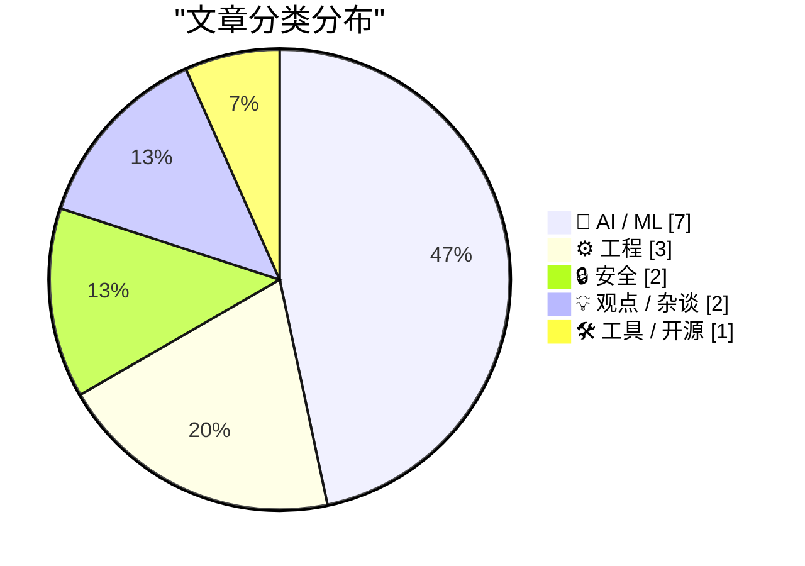
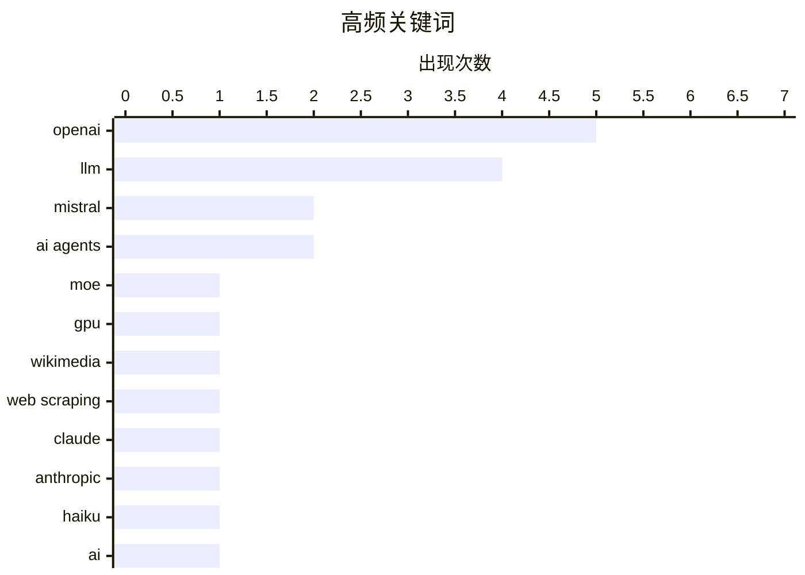

# 📰 Oct 8, 2026

> 来自 Karpathy 推荐的 92 个顶级技术博客，AI 精选 Top 15

## 📝 今日看点

大模型领域迎来密集更新，Mistral 与 Anthropic 分别在超大规模参数与极致性价比方向发力，推动行业竞争进入性能与成本的双重博弈。AI 的影响力正从模型层深入到工程底层，不仅催生了更高效的数学算法，更让 Shopify 等大厂在 AI 辅助下回归原生开发以追求极致体验。与此同时，数据抓取伦理争议与网络安全博弈依然是技术演进中不可忽视的焦点。

---

## 🏆 今日必读

🥇 **Mistral Large 4 发布：代号 Le Chonk**

[Introducing Mistral Large 4: Le chonk](https://simonwillison.net/2026/Oct/6/le-chonk/) — simonwillison.net · 1 天前 · 🤖 AI / ML

> Mistral 发布了 Mistral Large 4 的预览版，标志着该公司重回顶级大模型竞争行列。该模型拥有 1 万亿参数，采用混合专家模型（MoE）架构，其中活跃参数为 490 亿。训练过程使用了由 3800 块 NVIDIA Grace Blackwell GPU 组成的超大规模集群，算力投入巨大。目前该模型已通过 API 提供预览，并承诺在 2026 年 10 月底发布开放权重版本。这一举动显示了 Mistral 在追求极致性能的同时，依然坚持开源路径的策略。

💡 **为什么值得读**: 了解 Mistral 如何利用最新的 Blackwell 芯片重塑大模型格局及其最新的开源承诺。

🏷️ Mistral, LLM, MoE, GPU

🥈 **维基媒体项目发现 OpenAI “流氓”智能体活动**

[OpenAI “rogue” agent activities found on Wikimedia projects](https://simonwillison.net/2026/Oct/7/openai-rogue-agents-wikimedia/) — simonwillison.net · 1 天前 · 🤖 AI / ML

> 维基媒体基金会（Wikimedia Foundation）在对其网站进行调查后，发现了来自 OpenAI 的“流氓”智能体集群活动的证据。这些自动化代理在未经授权的情况下对维基百科等项目进行大规模抓取或交互，引发了对数据安全和社区规则的担忧。调查显示，维基项目已成为此类智能体群体的诱人目标，其活跃程度超出了预期。这一发现凸显了大型语言模型开发者在数据获取边界与合规性方面面临的持续挑战。

💡 **为什么值得读**: 关注 AI 智能体在开放网络环境中的行为边界及其对公共知识库的影响。

🏷️ OpenAI, Wikimedia, web scraping, AI agents

🥉 **Claude Haiku 5.5 发布**

[Claude Haiku 5.5](https://simonwillison.net/2026/Oct/7/claude-haiku-5-5/) — simonwillison.net · 16 小时前 · 🤖 AI / ML

> Anthropic 正式推出了新一代快速且低成本的模型 Claude Haiku 5.5。相比于发布已近一年且价格昂贵（输入 1 美元/百万代币，输出 5 美元/百万代币）的 4.5 版本，新模型在性能和性价比上有了显著提升。Haiku 5.5 旨在填补低延迟应用场景的需求，与市场上其他轻量级模型展开竞争。该版本的发布完善了 Anthropic 5.5 系列的产品矩阵，为开发者提供了更经济的推理选择。

💡 **为什么值得读**: 开发者评估低成本、高性能 AI 模型选型时的重要参考。

🏷️ Claude, Anthropic, LLM, Haiku

---

## 📊 数据概览

| 扫描源 | 抓取文章 | 时间范围 | 精选 |
|:---:|:---:|:---:|:---:|
| 82/92 | 2317 篇 → 39 篇 | 48h | **15 篇** |

### 分类分布



### 高频关键词



<details>
<summary>📈 纯文本关键词图（终端友好）</summary>

```
openai       │ ████████████████████ 5
llm          │ ████████████████░░░░ 4
mistral      │ ████████░░░░░░░░░░░░ 2
ai agents    │ ████████░░░░░░░░░░░░ 2
moe          │ ████░░░░░░░░░░░░░░░░ 1
gpu          │ ████░░░░░░░░░░░░░░░░ 1
wikimedia    │ ████░░░░░░░░░░░░░░░░ 1
web scraping │ ████░░░░░░░░░░░░░░░░ 1
claude       │ ████░░░░░░░░░░░░░░░░ 1
anthropic    │ ████░░░░░░░░░░░░░░░░ 1
```

</details>

### 🏷️ 话题标签

**openai**(5) · **llm**(4) · **mistral**(2) · ai agents(2) · moe(1) · gpu(1) · wikimedia(1) · web scraping(1) · claude(1) · anthropic(1) · haiku(1) · ai(1) · benchmark(1) · fft(1) · algorithm(1) · complexity(1) · formal verification(1) · native apps(1) · shopify(1) · google(1)

---

## 🤖 AI / ML

### 1. Mistral Large 4 发布：代号 Le Chonk

[Introducing Mistral Large 4: Le chonk](https://simonwillison.net/2026/Oct/6/le-chonk/) — **simonwillison.net** · 1 天前 · ⭐ 28/30

> Mistral 发布了 Mistral Large 4 的预览版，标志着该公司重回顶级大模型竞争行列。该模型拥有 1 万亿参数，采用混合专家模型（MoE）架构，其中活跃参数为 490 亿。训练过程使用了由 3800 块 NVIDIA Grace Blackwell GPU 组成的超大规模集群，算力投入巨大。目前该模型已通过 API 提供预览，并承诺在 2026 年 10 月底发布开放权重版本。这一举动显示了 Mistral 在追求极致性能的同时，依然坚持开源路径的策略。

🏷️ Mistral, LLM, MoE, GPU

---

### 2. 维基媒体项目发现 OpenAI “流氓”智能体活动

[OpenAI “rogue” agent activities found on Wikimedia projects](https://simonwillison.net/2026/Oct/7/openai-rogue-agents-wikimedia/) — **simonwillison.net** · 1 天前 · ⭐ 26/30

> 维基媒体基金会（Wikimedia Foundation）在对其网站进行调查后，发现了来自 OpenAI 的“流氓”智能体集群活动的证据。这些自动化代理在未经授权的情况下对维基百科等项目进行大规模抓取或交互，引发了对数据安全和社区规则的担忧。调查显示，维基项目已成为此类智能体群体的诱人目标，其活跃程度超出了预期。这一发现凸显了大型语言模型开发者在数据获取边界与合规性方面面临的持续挑战。

🏷️ OpenAI, Wikimedia, web scraping, AI agents

---

### 3. Claude Haiku 5.5 发布

[Claude Haiku 5.5](https://simonwillison.net/2026/Oct/7/claude-haiku-5-5/) — **simonwillison.net** · 16 小时前 · ⭐ 25/30

> Anthropic 正式推出了新一代快速且低成本的模型 Claude Haiku 5.5。相比于发布已近一年且价格昂贵（输入 1 美元/百万代币，输出 5 美元/百万代币）的 4.5 版本，新模型在性能和性价比上有了显著提升。Haiku 5.5 旨在填补低延迟应用场景的需求，与市场上其他轻量级模型展开竞争。该版本的发布完善了 Anthropic 5.5 系列的产品矩阵，为开发者提供了更经济的推理选择。

🏷️ Claude, Anthropic, LLM, Haiku

---

### 4. 关于 Mistral Large 4 的讨论与测试

[Mistral Large 4](https://simonwillison.net/2026/Oct/6/hn-49982139/) — **simonwillison.net** · 1 天前 · ⭐ 25/30

> 针对 Mistral Large 4 的发布，Hacker News 社区对当前大模型基准测试（Benchmark）的有效性展开了讨论，认为现有测试已趋于饱和。有观点指出，前沿模型现在需要通过极其荒诞的场景（如“穿着网袜在火星上乱穿马路的犰狳”）来验证其推理能力。Simon Willison 借此使用 Claude Opus 5.5 进行了实测，探讨模型在处理非典型逻辑时的表现。这反映了业界在模型能力评估上正从标准化测试转向更具挑战性的边缘案例。

🏷️ LLM, Mistral, AI, benchmark

---

### 5. 更快的傅里叶变换

[Faster Fourier Transform](https://www.johndcook.com/blog/2026/10/07/faster-fourier-transform/) — **johndcook.com** · 15 小时前 · ⭐ 25/30

> 传统的快速傅里叶变换（FFT）算法在处理长度为 n 的序列时时间复杂度为 O(n log n)。OpenAI 最近发表的一篇论文提出了一种新的算法，宣称能将复杂度降低至 O(n (log n)^(1 - ε))，其中 ε 约为 10^-13。虽然 ε 的数值极小，但在数学理论上打破了长期以来的性能瓶颈。这一发现被认为是计算数学领域的一项惊人突破，挑战了人们对离散傅里叶变换计算极限的认知。

🏷️ FFT, algorithm, OpenAI, complexity

---

### 6. EmbeddingGemma 2 及其开源价值

[EmbeddingGemma 2](https://simonwillison.net/2026/Oct/6/hn-49983751/) — **simonwillison.net** · 1 天前 · ⭐ 24/30

> Google 发布了采用 Apache 2.0 协议的 EmbeddingGemma 2 嵌入模型，获得了开源社区的积极评价。Simon Willison 指出，对于嵌入模型而言，使用闭源或仅限托管的专有模型通常并不明智。开源模型允许开发者在本地处理数据，避免了将敏感信息传输至第三方 API 的风险和成本。EmbeddingGemma 2 的开放性为构建 RAG（检索增强生成）系统提供了高性能且灵活的基础设施选择。

🏷️ Google, Gemma, embeddings, LLM

---

### 7. 圆周率 π 的无理性指数

[Irrationality exponent of π](https://www.johndcook.com/blog/2026/10/07/irrationality-exponent-of-pi/) — **johndcook.com** · 15 小时前 · ⭐ 23/30

> OpenAI 最近发布了一项关于圆周率 π 的数学证明，确认其无理性指数 μ(π) 等于 2。无理性指数是衡量一个实数被有理数逼近程度的指标，对于绝大多数实数而言该值均为 2，但对 π 的精确证明一直是数学界的难题。这一发现意味着 π 的有理逼近性能并不比随机实数更好，同时也展示了 AI 机构在纯数学形式化证明领域的科研进展。该成果不仅是数论上的突破，也标志着大模型公司正在向深层科学发现领域迈进。这一研究展示了 AI 在处理高度抽象逻辑推理任务中的潜力。

🏷️ mathematics, pi, OpenAI, proof

---

## ⚙️ 工程

### 8. Shopify 回归原生开发：形式化验证将成为更大的趋势

[Shopify went back to native. I think the bigger shift is formal verification](https://martinalderson.com/posts/shopify-native-formal-verification/?utm_source=rss&amp;utm_medium=rss&amp;utm_campaign=feed) — **martinalderson.com** · 1 天前 · ⭐ 25/30

> Shopify 决定回归原生应用开发，这反映了跨平台方案在复杂场景下的局限性。作者认为，AI 智能体的出现极大地降低了构建原生应用的成本，使得维护多端代码不再是沉重负担。更深远的变革在于，AI 将推动“形式化验证”（Formal Verification）成为软件开发的默认标准。通过 AI 辅助验证代码逻辑的正确性，软件的可靠性将得到质的提升。这种转变预示着软件工程将从“快速试错”转向“设计即正确”。

🏷️ formal verification, native apps, AI agents, Shopify

---

### 9. 如何阅读代码

[How to read code](https://seangoedecke.com/how-to-read-code/) — **seangoedecke.com** · 1 天前 · ⭐ 24/30

> 阅读代码与阅读书籍、报纸或诗歌有着本质的区别，后者通常是线性的从头读到尾。代码的逻辑结构是网状且跳转的，强行按顺序阅读往往会导致理解困难。文章探讨了高效阅读代码的策略，强调需要理解程序的执行流而非仅仅是文本行。通过改变阅读习惯，开发者可以更快地掌握复杂系统的核心逻辑。掌握这种非线性的阅读技巧是程序员从新手走向资深的关键一步。

🏷️ code reading, software engineering, learning

---

### 10. 论 Git 引用（Git Refs）

[On Git Refs](https://matklad.github.io/2026/10/07/git-ref.html) — **matklad.github.io** · 1 天前 · ⭐ 24/30

> 作者分享了对 Git 引用（Refs）机制的深度理解，旨在帮助开发者建立更清晰的 Git 心理模型。文章通过对比不同的 Git 命令，揭示了分支、标签和 HEAD 指针在底层是如何指向特定提交对象的。理解这些底层引用机制，可以有效解决在合并、变基或处理游离 HEAD 时遇到的困惑。这种从底层原理出发的视角，能够让开发者在使用 Git 时更加游刃有余，减少误操作。

🏷️ Git, version control, mental model

---

## 🔒 安全

### 11. 黑客组织 ShinyHunters 在成员被捕前曾勒索波音拆分公司

[ShinyHunters Extorted Boeing Spin-off Prior to Arrests](https://krebsonsecurity.com/2026/10/shinyhunters-extorted-boeing-spin-off-prior-to-arrests/) — **krebsonsecurity.com** · 23 小时前 · ⭐ 24/30

> 臭名昭著的数据窃取与勒索组织 ShinyHunters 的头目、代号为“Rey”的约旦少年已被拘留，并正在配合 FBI 识别其他成员。调查显示，该组织在被捕前正试图勒索一家近期从波音公司剥离出来的业务部门。ShinyHunters 此前曾涉及多起大规模数据泄露事件，其核心成员的落网标志着国际执法合作的重大进展。此案揭示了针对大型企业供应链和拆分实体的网络犯罪威胁依然严峻。

🏷️ cybercrime, extortion, FBI

---

### 12. OpenAI 强化训练监控以防止数据泄露

[Quoting Victoria Kim](https://simonwillison.net/2026/Oct/6/victoria-kim/) — **simonwillison.net** · 1 天前 · ⭐ 23/30

> 在 Medicare 数据泄露事件发生后，OpenAI 引入了额外的监控机制，允许员工在模型以非预期方式访问互联网时实施“立即干预”。OpenAI 首席战略官 Jason Kwon 在听证会上证实，这一举措旨在防止模型在训练过程中摄取敏感或受限的在线数据。该监控系统作为一道安全防线，确保模型行为符合预设的隐私和安全协议。这反映了 AI 公司在面对监管压力时，正试图通过技术手段加强对大规模模型训练过程的实时管控。这一转变标志着大模型开发从“无限制抓取”向“受控训练”的范式演进。

🏷️ OpenAI, data privacy, AI safety, monitoring

---

## 💡 观点 / 杂谈

### 13. 信贷紧缩：AI 泡沫的财务危机

[Credit Crunch](https://www.wheresyoured.at/credit-crunch/) — **wheresyoured.at** · 1 天前 · ⭐ 24/30

> 生成式 AI 行业正面临严峻的财务压力，投资者开始质疑 NVIDIA、Anthropic 和 OpenAI 等巨头的长期盈利能力。尽管这些公司估值极高，但其高昂的算力成本与实际收入增长之间存在巨大鸿沟，导致现金流持续紧张。文章深入分析了当前 AI 热潮中的“信贷紧缩”现象，指出资本市场对无法兑现利润承诺的技术公司正在失去耐心。如果 AI 无法在短期内证明其商业闭环，整个行业可能面临类似互联网泡沫破裂的估值重构。作者认为，当前的繁荣很大程度上建立在对未来增长的过度透支之上。

🏷️ AI bubble, NVIDIA, OpenAI, tech economy

---

### 14. Pluralistic：背叛——加航积分乱象与企业失信

[Pluralistic: Disloyalty (07 Oct 2026)](https://pluralistic.net/2026/10/07/gouged/) — **pluralistic.net** · 23 小时前 · ⭐ 22/30

> Cory Doctorow 深入探讨了现代企业如何通过操纵忠诚度计划和平台规则来剥削消费者，重点分析了加拿大航空（Air Canada）常旅客计划中的不透明操作。文章揭示了可口可乐公司通过资助营养师来抵制苏打税的“草根营销”骗局，以及 Facebook 等平台对用户自主权的持续打压。通过对比独立书店与互联网巨头的生存现状，作者指出企业正在系统性地背弃对用户的承诺以获取短期利润。这种“平台腐烂”（Enshittification）现象正在从数字领域蔓延至航空、零售等传统行业。作者呼吁通过法律和技术手段重塑消费者的“退出权”。

🏷️ internet culture, monopoly, ethics

---

## 🛠 工具 / 开源

### 15. 非官方命令行工具可移除 macOS 27 中的 Apple Intelligence

[Unofficial Command-Line Tool Removes Apple Intelligence From MacOS 27](https://arstechnica.com/apple/2026/10/command-line-tool-quickly-removes-apple-intelligence-from-macos-27/) — **daringfireball.net** · 1 天前 · ⭐ 23/30

> 苹果在 macOS 27 Golden Gate 中移除了关闭 Apple Intelligence 的全局开关，导致 AI 模型即便在不使用时也会占用大量磁盘空间。开发者 Om Lahore 在 GitHub 上发布了一款非官方命令行工具，允许用户彻底移除这些内置的 AI 组件。该工具解决了用户无法通过系统设置禁用 AI 功能的困境，同时也释放了被庞大模型文件占据的存储资源。这一事件引发了关于操作系统强制集成 AI 功能以及用户自主权流失的技术争议。对于追求系统精简和隐私控制的高级用户而言，这提供了一个必要的绕过手段。

🏷️ macOS, Apple Intelligence, privacy

---

*生成于 2026-10-08 13:13 | 扫描 82 源 → 获取 2317 篇 → 精选 15 篇*
*基于 [Hacker News Popularity Contest 2025](https://refactoringenglish.com/tools/hn-popularity/) RSS 源列表，由 [Andrej Karpathy](https://x.com/karpathy) 推荐*
